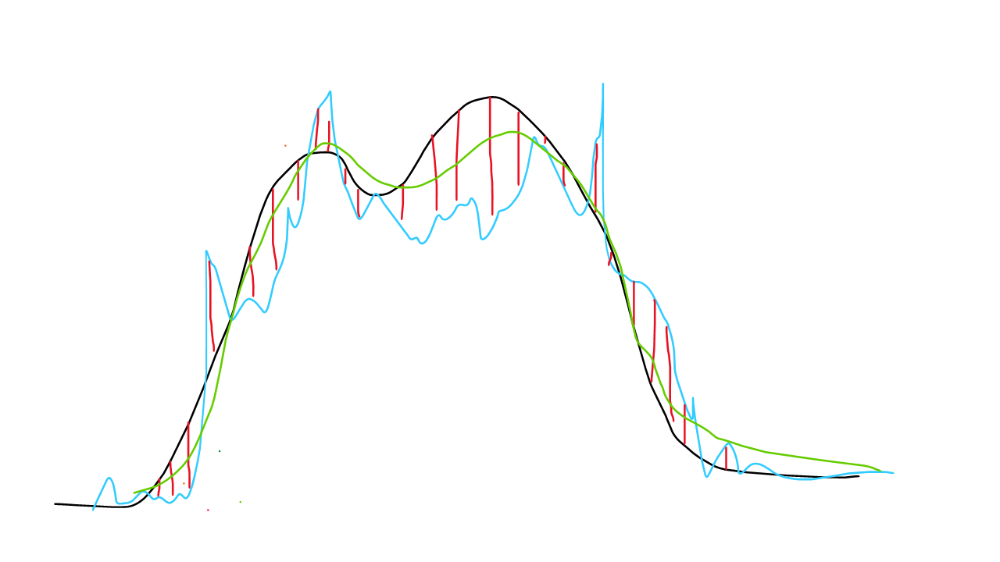

```{r setup, include=FALSE}
rm(list = ls())
```

# 1 - Introduction 

Here in this document I describe a full example of analytics and forecasting from my experience at Multivarejo - GPA

<!-- |Posição|Descrição|Jogadores| -->
<!-- |---|---|---| -->
<!-- |GK|Goleiro|1 -->
<!-- |Center-back|Zagueiro central|2 -->
<!-- |Outside-back|Zagueiro lateral|2 -->
<!-- |Center-mid|Meio de campo|2 -->
<!-- |Outside-mid|Lateral|2 -->
<!-- |Forward|Atacante|2 -->

## 1.1 Supermarket cashier demand estimation

The methodology used within this study comes from industry Operational Research applied to mapped functions inside a supermarket. the fundamentals are that you need to estimate how much time do people take to complete certain tasks, which are categorized on 3 types:

- Alpha: the ones with a scalar number that counts as repetitions of the same task. With this one you can resume in a formula to give the whole time estimate for the amount of movements:

T(t<sub>1</sub>,t<sub>2</sub>,n<sub>1</sub>,n<sub>2</sub>) = t<sub>1</sub>n<sub>1</sub> + t<sub>2</sub>n<sub>2</sub>

where t<sub>i</sub> and n<sub>i</sub> corresponds to the time estimate of the i'th activity and it's volume respectively.

Example: times that a worker needs to wrench a bolt.

{ width=30%}

- Beta: A activity which has a estimation of time to its single execution. Usually Beta activities become alpha when more information is gathered. Example: full time to gather leftovers and clean the balcony after slicing ham and cheese to wrap and put in trays for display. 

{ width=30%}


You could make somewhat proportional to the amount which the employee has produced, but you can estimate a gross total time just to understand how much time that person will be occupied.

- Delta chi (not gamma lol): They are activities which has its time inherent within the total estimation of employee that execute the entire pile of aplha and beta activities. Example: hit the clock at work.

{ width=30%}

At least in theory...

All of these gives an amount of time that each acitivity produces. We can translate to amount of <b>workers</b> when we divide this amount of time within a interval.

for example: if we define the activity of auditing an isle in a warehouse (which takes 5 minutes) and we have 6 isles, we need a total time of 30 minutes. But to complete this activity within 15 minutes, we need 2 employees working simoutaneously, hence the demand for this interval to complete this activity withing 15 minutes is: 30/15 = 2. 

This also works if we consider that the activity can be splitted to multiple workers.

First, we need to trace something to map. Select a sector to work on, and then trace all the major activities commited to the team in that sector. Here I brought the customer attendance task from the cashier departament (due its easy understanding and measurement method).

## 1.2 Explaining the data

The datasets used in this study are:  

- Sales volume per timestamp:  
Each row has a point of time (every 15 minutes) that has:
  - Total amount of items sold
  - Total amount of customers served

- Time estimates for activities
  - A Value for the calculated moving average of the scan time for each item
  - a value for the calculated moving average of the service for each client (besides scan time)

with this info, we can calculate the amount of time to attend all customers and scan all items in each 15 minute interval, and determine de demand of how much employees we need in every 15 minutes.

-----
# 2 - Analysing the data
First we download the data and fill non-existent data-poits for each day which the store hasn't opened, and insert 0 each time data-point.

After that, we calculate de demand with the time average for each month (calculated separately).

## 2.1 - Analisys setup
First we read the csv files from the web, and then we mutate our data-points hourly (due to its high granularity).
```{r message=FALSE, warning=FALSE}
#Lendo bases de dados descritas acima:
library(dplyr)
library(tidyverse)
library(lubridate)
library(forecast)
library(astsa)
library(forecast)
library(ggplot2)
library(slider)
library(knitr)

#reading data for folume of sales and time estimates
df_sales_o = read.csv("https://docs.google.com/uc?id=1QcoAKttfUfdCMT9SblqhEtHqNIY9iZMr&export=download") %>% 
  mutate(DATE_TIME = ymd_hms(DATE_TIME)) %>%
  as_tibble()


df_avg_time = read.csv("https://docs.google.com/uc?id=1soZNQYn05iDpgKxj1W3g8mcDISl35HUq&export=download")

# Filling non existent datapoints
date_time_empty_frame = tibble(DATE_TIME=seq(min(df_sales_o$DATE_TIME),max(df_sales_o$DATE_TIME),15*60))

df_avg_time = df_avg_time %>% 
  as_tibble() %>% 
  mutate(MONTH = ymd(MONTH))

df_demand = date_time_empty_frame %>% 
  left_join(df_sales_o %>% 
              mutate(DATE_TIME = ymd_hms(DATE_TIME)) %>%
              as_tibble()
            ,by="DATE_TIME") %>%
  arrange(DATE_TIME) %>% 
  mutate(QTY_ITEMS=coalesce(QTD_ITENS,0)
         ,QTY_CLIENTS=coalesce(QTD_CLIENTES,0)) %>% 
  select(-QTD_ITENS,-QTD_CLIENTES) %>%
  mutate(MONTH = DATE_TIME %>% as_date() %>% 
           `day<-`(1)) %>% 
  left_join(df_avg_time,by=c("MONTH")) %>% 
  mutate(DEMAND = ((QTY_ITEMS*AVG_TIME_ITEM)+(QTY_CLIENTS*AVG_TIME_CLIENT))/(15*60)) %>% 
  mutate(DATE_TIME_H = `minute<-`(DATE_TIME,0)) %>% 
  #aggregating to use every hour:
  group_by(DATE_TIME_H,MONTH) %>% 
  summarise(DEMAND = sum(DEMAND,na.rm = TRUE)/4
            ,QTY_ITEMS=sum(QTY_ITEMS)
            ,QTY_CLIENTS=sum(QTY_CLIENTS)
            ,.groups="drop") %>% 
  rename(DATE_TIME = DATE_TIME_H)
```

The first rows shows as follows:
```{r message=FALSE, warning=FALSE,parse=FALSE}
df_demand %>% filter(DATE_TIME>='2019-01-03 08:00:00',DATE_TIME<='2019-01-03 18:00:00') %>% head(n=10) %>% kable()
```

After that calulations made as exlpained above, we can plot november to see what it looks like:
```{r message=FALSE, warning=FALSE, echo=FALSE,fig.width=10,fig.height=8}
plott = df_demand %>% 
  #filtering the last month
  filter(MONTH=='2019-11-01') %>%
  select(DATE_TIME,QTY_ITEMS,QTY_CLIENTS,DEMAND) %>% 
  pivot_longer(c("QTY_ITEMS","QTY_CLIENTS","DEMAND")) %>% 
  ggplot(aes(x=DATE_TIME,y=value)) + 
  geom_line()+
  theme_bw()+
  facet_wrap(~ name,ncol=1,scales = 'free_y')

plotly::ggplotly(plott)
```
Graphically, it becomes a weighted average between clients and items by it's time to each activity.
This gives an estimate for how much employee are needed to operate cashiers in this supermarket.

## 2.2 - Descriptive analysys
This can be used to create some reports, like how needs to be distribuited the staff according monthly and for each hour (in average):
```{r message=FALSE, warning=FALSE, echo=FALSE,fig.width=10,fig.height=8}
df_demand %>%
  mutate(HOUR = as.factor(hour(DATE_TIME))
         ,MONTH = as.factor(MONTH)) %>% 
  group_by(MONTH,HOUR) %>% 
  summarise(AVG_DEMAND = mean(DEMAND),.groups="drop") %>% 
  #filtering the last month
  ggplot(aes(y=MONTH,x=HOUR,fill=AVG_DEMAND)) + 
  geom_tile()
```
This shows that this data is pretty much periodic daily (as expected).

# 3 - Model planning

Down below, there's a simplification of the model which I used.

The strategy used goes towards a more statistical solution, that uses time series combined with mathematical functions.

I've made a chart to explain how it works mostly:

{width=75%,height=90%}

1. First we calculate de Demand (as we made early). This is showed as a <span style="color:#39a7e3">light blue line</span> 
2. Then adjust the time series using fourier terms to get most of the series seasonality. This is represented as a black line in the drawing.
3. after that we retrieve the difference between the fourier series and the demand (residual error between them) illustrated as the red vertical stripes.
4. finally, we use the resuals as shown on those <span style="color:#d60e00">red stripes</span> to adjust how much we need to add or subtract from the blue seasonal wave to approach the demand. We use a multi-variate linear model for the average, which is shown as the <span style="color:#207311">green line</span>. 

## 3.1 - Building and training model

### 3.1.1 - Fourrier component
First we need to check how much we need to use to create the fourrier series. For that, I have tested multiple time periods and validation sets to find the best historical data length to use, and found that using the last 10 months did enough for that time being.

Assuming this, we create the arima model using fourier terms below to capture time series dependable variables (for short memory) and the fourrier covariates for long memory.

```{r message=FALSE, warning=FALSE, echo=TRUE}
ts_demand = ts(df_demand$DEMAND
               ,frequency = 24)

#length of  windows for training dataset
dat_min_tr = min(df_demand$DATE_TIME)
dat_max_tr = min(df_demand$DATE_TIME) %>% `month<-`(month(.)+10)

#validadtion period
dat_min_ts = dat_max_tr+(60*60)
dat_max_ts = dat_min_ts %>% `month<-`(month(.)+1)

qtd_treino = df_demand %>% 
  filter(dat_min_tr<=DATE_TIME,DATE_TIME<=dat_max_tr) %>% 
  nrow()

qtd_teste = df_demand %>% 
  filter(dat_min_ts<=DATE_TIME,DATE_TIME<=dat_max_ts) %>% 
  nrow()

# make a training set & test set
ts_demand[1:qtd_treino] -> cmort.train
ts_demand[(qtd_treino+1):(qtd_treino+qtd_teste)] -> cmort.test

# make predictors to test later
fourier(ts_demand, K=10) -> fourier.terms
fourier.terms.train <- fourier.terms[1:length(cmort.train),]
fourier.terms.test <- fourier.terms[(length(cmort.train)+1):length(ts_demand),]

# auto.arima testing with fourier terms and checking de MSE to see which oone is better suited this period:

#we always use fourier terms two by two due its mathematical definition

num_param = c(2,4,6,8,10,12)
agora = Sys.time()

modelos_def = lapply(num_param,function(x) auto.arima(cmort.train, xreg=fourier.terms.train[,1:x]
                  ,seasonal=F
                  ,d=1
                  ,stepwise=F
                  ,approximation=F)
       )

#verifying mse over training demand set:

sel_model = lapply(modelos_def,function(x) mean(residuals(x)^2)) %>% unlist() %>% as_tibble() %>% 
  bind_cols(tibble(modelos_arima = modelos_def)) %>%  
  bind_cols(tibble(num_param)) %>% 
  mutate(index_model = row_number()) %>% 
  filter(value==min(value))
  # filter(row_number()==5)
  
Sys.time()-agora  

df_sel_model = tibble(value_fitt1 = sel_model$modelos_arima[[1]]$fitted) %>% 
  mutate(type='train') %>% 
  #binding with the forecast
  bind_rows(tibble(value_fitt1 = forecast(sel_model$modelos_arima[[1]]
                                    ,h=length(cmort.test)
                                   , xreg=fourier.terms.test[,1:sel_model$num_param])$mean) %>% 
              mutate(type='forecast'))


```

After using the model selection by each pair of fourrier terms (each pair is a combination of sin and cossin waves), we can see the outcome graphically:

Down below there's the sumulation for our validation set on november:
```{r echo=FALSE, fig.height=6, fig.width=10, message=FALSE, warning=FALSE}
plott=df_demand %>% 
  bind_cols(df_sel_model) %>% 
  #filtering the last month
  filter(MONTH=="2019-11-01") %>% 
  select(DATE_TIME,DEMAND,value_fitt1) %>% 
  pivot_longer(c("DEMAND","value_fitt1")) %>% 
  ggplot(aes(x=DATE_TIME,y=value,colour=name)) + 
  geom_line()+
  theme_bw()

plotly::ggplotly(plott)
  
```

As we can notice, the first steps forward we have the tendency given by the arima model, and after that, we have the captured daily seasonality.

### 3.1.2 - Multivariable linear model

With this set, we can get the difference between the red line (`DEMAND`) and the blue line (fourrier forecast as `value_fitt1`). This will be our new response variable and we'll set it's name to `diff_fitt`:

we also create multiple time related variables to use in the linear model after.

```{r echo=FALSE, fig.height=6, fig.width=10, message=FALSE, warning=FALSE}
df_sel_model = tibble(value_fitt1 = sel_model$modelos_arima[[1]]$fitted) %>% 
  mutate(type='train') %>% 
  #binding with the forecast
  bind_rows(tibble(value_fitt1 = forecast(sel_model$modelos_arima[[1]]
                                    ,h=length(cmort.test)
                                   , xreg=fourier.terms.test[,1:sel_model$num_param])$mean) %>% 
              mutate(type='forecast')) %>% 
  mutate(value_fitt1 = value_fitt1)

#labeling the forecast and the training data intervals:

# slider::slide(1:10, ~.x, .after = -2,.before = 2,.complete=TRUE)

df_demand2 = df_demand %>% 
  bind_cols(df_sel_model) %>% 
  mutate(diff_fitt = DEMAND-value_fitt1) %>%
  #creating variables to use in the multiple linear model
  mutate( cumsum_1h =  slider::slide(diff_fitt, sum, .after = -1,.before = 1,.complete=TRUE) %>% lapply(function(x) ifelse(is.null(x),NA,x)) %>% unlist()
         # ,cumsum_6h = slider::slide(diff_fitt, sum, .after = -1,.before = 6,.complete=TRUE) %>% lapply(function(x) ifelse(is.null(x),NA,x)) %>% unlist()
         # ,cumsum_12h = slider::slide(diff_fitt, sum, .after = -1,.before = 12,.complete=TRUE) %>% lapply(function(x) ifelse(is.null(x),NA,x)) %>% unlist()
         ,cumsum_last2=slider::slide(diff_fitt, sum, .after = -(2),.before =  (2),.complete=TRUE) %>% lapply(function(x) ifelse(is.null(x),NA,x)) %>% unlist()
         ,cumsum_last3=slider::slide(diff_fitt, sum, .after = -(3),.before = (3),.complete=TRUE) %>% lapply(function(x) ifelse(is.null(x),NA,x)) %>% unlist()
         ,cumsum_last4=slider::slide(diff_fitt, sum, .after = -(4),.before = (4),.complete=TRUE) %>% lapply(function(x) ifelse(is.null(x),NA,x)) %>% unlist()
         ,cumsum_last5=slider::slide(diff_fitt, sum, .after = -(5),.before = (5),.complete=TRUE) %>% lapply(function(x) ifelse(is.null(x),NA,x)) %>% unlist()
         ,cumsum_last6=slider::slide(diff_fitt, sum, .after = -(6),.before = (6),.complete=TRUE) %>% lapply(function(x) ifelse(is.null(x),NA,x)) %>% unlist()
         ,cumsum_last7=slider::slide(diff_fitt, sum, .after = -(7),.before = (7),.complete=TRUE) %>% lapply(function(x) ifelse(is.null(x),NA,x)) %>% unlist()
         ,cumsum_last8=slider::slide(diff_fitt, sum, .after = -(8),.before = (8),.complete=TRUE) %>% lapply(function(x) ifelse(is.null(x),NA,x)) %>% unlist()
         ,cumsum_last9=slider::slide(diff_fitt, sum, .after = -(9),.before = (9),.complete=TRUE) %>% lapply(function(x) ifelse(is.null(x),NA,x)) %>% unlist()
         ,cumsum_last10=slider::slide(diff_fitt, sum, .after = -(10),.before = (10),.complete=TRUE) %>% lapply(function(x) ifelse(is.null(x),NA,x)) %>% unlist()
         ,cumsum_last11=slider::slide(diff_fitt, sum, .after = -(11),.before = (11),.complete=TRUE) %>% lapply(function(x) ifelse(is.null(x),NA,x)) %>% unlist()
         ,cumsum_last12=slider::slide(diff_fitt, sum, .after = -(12),.before = (12),.complete=TRUE) %>% lapply(function(x) ifelse(is.null(x),NA,x)) %>% unlist()
         ,cumsum_last13=slider::slide(diff_fitt, sum, .after = -(13),.before = (13),.complete=TRUE) %>% lapply(function(x) ifelse(is.null(x),NA,x)) %>% unlist()
         ,cumsum_last14=slider::slide(diff_fitt, sum, .after = -(14),.before = (14),.complete=TRUE) %>% lapply(function(x) ifelse(is.null(x),NA,x)) %>% unlist()
         ,cumsum_last15=slider::slide(diff_fitt, sum, .after = -(15),.before = (15),.complete=TRUE) %>% lapply(function(x) ifelse(is.null(x),NA,x)) %>% unlist()
         ,cumsum_last16=slider::slide(diff_fitt, sum, .after = -(16),.before = (16),.complete=TRUE) %>% lapply(function(x) ifelse(is.null(x),NA,x)) %>% unlist()
         ,cumsum_last17=slider::slide(diff_fitt, sum, .after = -(17),.before = (17),.complete=TRUE) %>% lapply(function(x) ifelse(is.null(x),NA,x)) %>% unlist()
         ,cumsum_last18=slider::slide(diff_fitt, sum, .after = -(18),.before = (18),.complete=TRUE) %>% lapply(function(x) ifelse(is.null(x),NA,x)) %>% unlist()
         ,cumsum_last19=slider::slide(diff_fitt, sum, .after = -(19),.before = (19),.complete=TRUE) %>% lapply(function(x) ifelse(is.null(x),NA,x)) %>% unlist()
         ,cumsum_last20=slider::slide(diff_fitt, sum, .after = -(20),.before = (20),.complete=TRUE) %>% lapply(function(x) ifelse(is.null(x),NA,x)) %>% unlist()
         ,cumsum_last21=slider::slide(diff_fitt, sum, .after = -(21),.before = (21),.complete=TRUE) %>% lapply(function(x) ifelse(is.null(x),NA,x)) %>% unlist()
         ,cumsum_last22=slider::slide(diff_fitt, sum, .after = -(22),.before = (22),.complete=TRUE) %>% lapply(function(x) ifelse(is.null(x),NA,x)) %>% unlist()
         ,cumsum_last23=slider::slide(diff_fitt, sum, .after = -(23),.before = (23),.complete=TRUE) %>% lapply(function(x) ifelse(is.null(x),NA,x)) %>% unlist()
         ,cumsum_last24=slider::slide(diff_fitt, sum, .after = -(24),.before = (24),.complete=TRUE) %>% lapply(function(x) ifelse(is.null(x),NA,x)) %>% unlist()
         ,cumsum_last_d_1=slider::slide(diff_fitt, sum, .after = -(24),.before = ((24*2)-1),.complete=TRUE) %>% lapply(function(x) ifelse(is.null(x),NA,x)) %>% unlist()
         ,cumsum_last_d_2=slider::slide(diff_fitt, sum, .after = -(24*2),.before = ((24*3)-1),.complete=TRUE)%>% lapply(function(x) ifelse(is.null(x),NA,x)) %>% unlist()
         ,cumsum_last_d_3=slider::slide(diff_fitt, sum, .after = -(24*3),.before = ((24*4)-1),.complete=TRUE)%>% lapply(function(x) ifelse(is.null(x),NA,x)) %>% unlist()
         ,cumsum_last_d_4=slider::slide(diff_fitt, sum, .after = -(24*4),.before = ((24*5)-1),.complete=TRUE)%>% lapply(function(x) ifelse(is.null(x),NA,x)) %>% unlist()
         ,cumsum_last_d_5=slider::slide(diff_fitt, sum, .after = -(24*5),.before = ((24*6)-1),.complete=TRUE)%>% lapply(function(x) ifelse(is.null(x),NA,x)) %>% unlist()
         ,cumsum_last_d_6=slider::slide(diff_fitt, sum, .after = -(24*6),.before = ((24*7)-1),.complete=TRUE)%>% lapply(function(x) ifelse(is.null(x),NA,x)) %>% unlist()
         ,cumsum_last_d_7=slider::slide(diff_fitt, sum, .after = -(24*7),.before = ((24*8)-1),.complete=TRUE)%>% lapply(function(x) ifelse(is.null(x),NA,x)) %>% unlist()
         ,weekday=factor(weekdays(DATE_TIME,abbreviate=TRUE),c("dom","seg","ter","qua","qui","sex","sáb"))
         ,month_week = as.factor(day(DATE_TIME)%/%7)
         ,weekday_num = as.numeric(weekday)
         ,faixa_hor_2 = as.factor(hour(DATE_TIME)%/%2)
         ) %>%
  group_by(MONTH) %>%
  mutate(weekday_num = as.factor(weekday_num)) %>%
  ungroup() %>% 
  filter(!is.na(cumsum_last_d_7)) %>% 
  mutate(index_row = row_number())

df_demand2$diff_fitt %>% density() %>% plot()

```

As we can see, this variable calculated over those curve differences has a normal distribuition, so we can assume that the average estimator using linear model will make a good fitting.

We can also assume thtat a linear model is well suited due to the variable behavior over time, that resambles a time series situation with only moving averages (that are also reproductible as linear models).

```{r echo=FALSE, fig.height=5, fig.width=10, message=FALSE, warning=FALSE}
par(mfrow=c(1,2))
df_demand2$diff_fitt %>% acf()
df_demand2$diff_fitt %>% pacf()

```

The time variables we created are:

- Cumulative sum of the response variable, which goes between windows that are 1 hour before to 24 hours (`cumsum_h1` and `cumsum_last2` that goes to `cumsum_last24`. 
- Cumulative sum from day -1 to day-7 (last 7 days cumulative sum of `diff_fitt`) as variables that goes from `cumsum_last_d_1` to `cumsum_last_d_7`  
- Day of the week as a numric factor as `week_num`
- Partition of which week of the month as `month_week`
- which hour interval of time we are (each 2 hours) as `faixa_hor_2`

Inside the lienar model, we also check for interactions between variables:

 - `weekday_num` and `month_week` that represents variations of demand estimation every week day depending on which week of the month the point happened.
 - `faixa_hor_2` and `weekday_num` that represents variations of demand estimation on every hour interval depending on which day of the week the point of estimation happened.
 
 We also use model selection with Stepwise with Aikaike criteria to find the best fit with a "thinner" model.
 
```{r message=FALSE, warning=FALSE}
#formula
variaveis = names(df_demand2)

lm_formula = paste("diff_fitt ~",paste(c("cumsum_1h"
                                      # ,"cumsum_6h","cumsum_12h"
                                      ,paste("cumsum_last",2:24,sep="")
                                      ,paste("cumsum_last_d_",1:7,sep="")
                                      ,"weekday_num","faixa_hor_2"
                                      ,"month_week"
                                      ,paste(paste("cumsum_last",2:24,sep=""),"*weekday_num",sep="")
                                      ,"weekday_num*month_week"
                                      ,"faixa_hor_2*weekday_num"),collapse=" + "))


lm_model = lm(
              formula = lm_formula
             ,data = df_demand2 %>% filter(type=="train") # %>% 
               # filter(row_number()>=(max(row_number())-96*30))
             ) %>% MASS::stepAIC(trace = FALSE)

```

Plotting the diagnostics, we can check that the residuals has a distribution close to the normal, and we don't see any big influence over ouliars on estimations using cooks distance on leverage plot.

```{r echo=FALSE, fig.height=6, fig.width=10, message=FALSE, warning=FALSE}
par(mfrow=c(2,2))
lm_model %>% plot()
```

## 3.2 - Forecasting

After that, we use this linear model to simulate each step forward on the time series prediction, on which every step is used afterwards to calculate the time-related variables explained above.

Down I've used a standard `for` loop to calculate every step, but we could have used a `map` function that could have performed better.

```{r echo=FALSE,message=FALSE, warning=FALSE}
first_row = df_demand2 %>% filter(type=="forecast") %>% filter(index_row==min(index_row)) %>% .$index_row
first_row = first_row-1
last_row = df_demand2 %>% filter(type=="forecast") %>% filter(index_row==max(index_row)) %>% .$index_row
i=first_row

vars_cov_selec = lm_formula %>% str_split(pattern = "(\\+)|(\\~)") %>% unlist() %>% str_trim() %>% 
  .[!str_detect(.,"(diff_fitt)|(\\*)|(\\-1)")] %>% .[str_length(.)>1]

df_demand2_build = df_demand2 %>% filter(type=="train") %>% 
  dplyr::select_at(c('DATE_TIME',"diff_fitt",vars_cov_selec,"type"))

#plotting the fourrier demand curve and training dataset

for(i in first_row:last_row){
  
  next_value_data = df_demand2_build[i,]
  
  next_value_covariates = next_value_data %>% select_at(vars_cov_selec)
  
  next_prediction = predict(lm_model,newdata = next_value_covariates) 
  
  df_demand2_build_new = bind_rows(df_demand2_build %>% 
                                 #only using the past needed to rebuild the variables
                                 filter(row_number()>=(max(row_number())-(24*8)))
                               , tibble(DATE_TIME=next_value_data$DATE_TIME+60*60
                                        ,diff_fitt = next_prediction)) %>%
    mutate(MONTH = DATE_TIME %>% as_date() %>% 
             `day<-`(1)) %>% 
    mutate( cumsum_1h =  slider::slide(diff_fitt, sum, .after = -1,.before = 1,.complete=TRUE) %>% lapply(function(x) ifelse(is.null(x),NA,x)) %>% unlist()
            # ,cumsum_6h = slider::slide(diff_fitt, sum, .after = -1,.before = 6,.complete=TRUE) %>% lapply(function(x) ifelse(is.null(x),NA,x)) %>% unlist()
            # ,cumsum_12h = slider::slide(diff_fitt, sum, .after = -1,.before = 12,.complete=TRUE) %>% lapply(function(x) ifelse(is.null(x),NA,x)) %>% unlist()
            ,cumsum_last2=slider::slide(diff_fitt, sum, .after = -(2),.before =  (2),.complete=TRUE) %>% lapply(function(x) ifelse(is.null(x),NA,x)) %>% unlist()
            ,cumsum_last3=slider::slide(diff_fitt, sum, .after = -(3),.before = (3),.complete=TRUE) %>% lapply(function(x) ifelse(is.null(x),NA,x)) %>% unlist()
            ,cumsum_last4=slider::slide(diff_fitt, sum, .after = -(4),.before = (4),.complete=TRUE) %>% lapply(function(x) ifelse(is.null(x),NA,x)) %>% unlist()
            ,cumsum_last5=slider::slide(diff_fitt, sum, .after = -(5),.before = (5),.complete=TRUE) %>% lapply(function(x) ifelse(is.null(x),NA,x)) %>% unlist()
            ,cumsum_last6=slider::slide(diff_fitt, sum, .after = -(6),.before = (6),.complete=TRUE) %>% lapply(function(x) ifelse(is.null(x),NA,x)) %>% unlist()
            ,cumsum_last7=slider::slide(diff_fitt, sum, .after = -(7),.before = (7),.complete=TRUE) %>% lapply(function(x) ifelse(is.null(x),NA,x)) %>% unlist()
            ,cumsum_last8=slider::slide(diff_fitt, sum, .after = -(8),.before = (8),.complete=TRUE) %>% lapply(function(x) ifelse(is.null(x),NA,x)) %>% unlist()
            ,cumsum_last9=slider::slide(diff_fitt, sum, .after = -(9),.before = (9),.complete=TRUE) %>% lapply(function(x) ifelse(is.null(x),NA,x)) %>% unlist()
            ,cumsum_last10=slider::slide(diff_fitt, sum, .after = -(10),.before = (10),.complete=TRUE) %>% lapply(function(x) ifelse(is.null(x),NA,x)) %>% unlist()
            ,cumsum_last11=slider::slide(diff_fitt, sum, .after = -(11),.before = (11),.complete=TRUE) %>% lapply(function(x) ifelse(is.null(x),NA,x)) %>% unlist()
            ,cumsum_last12=slider::slide(diff_fitt, sum, .after = -(12),.before = (12),.complete=TRUE) %>% lapply(function(x) ifelse(is.null(x),NA,x)) %>% unlist()
            ,cumsum_last13=slider::slide(diff_fitt, sum, .after = -(13),.before = (13),.complete=TRUE) %>% lapply(function(x) ifelse(is.null(x),NA,x)) %>% unlist()
            ,cumsum_last14=slider::slide(diff_fitt, sum, .after = -(14),.before = (14),.complete=TRUE) %>% lapply(function(x) ifelse(is.null(x),NA,x)) %>% unlist()
            ,cumsum_last15=slider::slide(diff_fitt, sum, .after = -(15),.before = (15),.complete=TRUE) %>% lapply(function(x) ifelse(is.null(x),NA,x)) %>% unlist()
            ,cumsum_last16=slider::slide(diff_fitt, sum, .after = -(16),.before = (16),.complete=TRUE) %>% lapply(function(x) ifelse(is.null(x),NA,x)) %>% unlist()
            ,cumsum_last17=slider::slide(diff_fitt, sum, .after = -(17),.before = (17),.complete=TRUE) %>% lapply(function(x) ifelse(is.null(x),NA,x)) %>% unlist()
            ,cumsum_last18=slider::slide(diff_fitt, sum, .after = -(18),.before = (18),.complete=TRUE) %>% lapply(function(x) ifelse(is.null(x),NA,x)) %>% unlist()
            ,cumsum_last19=slider::slide(diff_fitt, sum, .after = -(19),.before = (19),.complete=TRUE) %>% lapply(function(x) ifelse(is.null(x),NA,x)) %>% unlist()
            ,cumsum_last20=slider::slide(diff_fitt, sum, .after = -(20),.before = (20),.complete=TRUE) %>% lapply(function(x) ifelse(is.null(x),NA,x)) %>% unlist()
            ,cumsum_last21=slider::slide(diff_fitt, sum, .after = -(21),.before = (21),.complete=TRUE) %>% lapply(function(x) ifelse(is.null(x),NA,x)) %>% unlist()
            ,cumsum_last22=slider::slide(diff_fitt, sum, .after = -(22),.before = (22),.complete=TRUE) %>% lapply(function(x) ifelse(is.null(x),NA,x)) %>% unlist()
            ,cumsum_last23=slider::slide(diff_fitt, sum, .after = -(23),.before = (23),.complete=TRUE) %>% lapply(function(x) ifelse(is.null(x),NA,x)) %>% unlist()
            ,cumsum_last24=slider::slide(diff_fitt, sum, .after = -(24),.before = (24),.complete=TRUE) %>% lapply(function(x) ifelse(is.null(x),NA,x)) %>% unlist()
            ,cumsum_last24=slider::slide(diff_fitt, sum, .after = -(24),.before = ((24*2)-1),.complete=TRUE) %>% lapply(function(x) ifelse(is.null(x),NA,x)) %>% unlist()
            ,cumsum_last_d_1=slider::slide(diff_fitt, sum, .after = -(24),.before = ((24*2)-1),.complete=TRUE) %>% lapply(function(x) ifelse(is.null(x),NA,x)) %>% unlist()
            ,cumsum_last_d_2=slider::slide(diff_fitt, sum, .after = -(24*2),.before = ((24*3)-1),.complete=TRUE)%>% lapply(function(x) ifelse(is.null(x),NA,x)) %>% unlist()
            ,cumsum_last_d_3=slider::slide(diff_fitt, sum, .after = -(24*3),.before = ((24*4)-1),.complete=TRUE)%>% lapply(function(x) ifelse(is.null(x),NA,x)) %>% unlist()
            ,cumsum_last_d_4=slider::slide(diff_fitt, sum, .after = -(24*4),.before = ((24*5)-1),.complete=TRUE)%>% lapply(function(x) ifelse(is.null(x),NA,x)) %>% unlist()
            ,cumsum_last_d_5=slider::slide(diff_fitt, sum, .after = -(24*5),.before = ((24*6)-1),.complete=TRUE)%>% lapply(function(x) ifelse(is.null(x),NA,x)) %>% unlist()
            ,cumsum_last_d_6=slider::slide(diff_fitt, sum, .after = -(24*6),.before = ((24*7)-1),.complete=TRUE)%>% lapply(function(x) ifelse(is.null(x),NA,x)) %>% unlist()
            ,cumsum_last_d_7=slider::slide(diff_fitt, sum, .after = -(24*7),.before = ((24*8)-1),.complete=TRUE)%>% lapply(function(x) ifelse(is.null(x),NA,x)) %>% unlist()
            ,weekday=factor(weekdays(DATE_TIME,abbreviate=TRUE),c("dom","seg","ter","qua","qui","sex","sáb"))
            ,month_week = as.factor(day(DATE_TIME)%/%7)
            ,weekday_num = as.factor(as.numeric(weekday))
            ,faixa_hor_2 = as.factor(hour(DATE_TIME)%/%2)
    ) %>%
    group_by(MONTH) %>%
    ungroup() %>% 
    tail(n=1) %>% 
    mutate(type="prediction")
  
  # cat("\n",round(((i-first_row)/(last_row-first_row))*100,2),"%"," done | ",next_prediction,sep="")
  
  #building next dataset row:
  df_demand2_build = bind_rows(df_demand2_build,df_demand2_build_new)
}

```

After that, we can simulate the final prediction adding `value_fitt1` (the time series with fourrier components) and `diff_fitt` (linear model of residuals from first model). This one gives the green line on the chart below:

```{r echo=FALSE,fig.height=5, fig.width=10, message=FALSE, warning=FALSE}
df_demand3 = df_demand2 %>% 
  dplyr::select(-diff_fitt) %>% 
  left_join(df_demand2_build %>% dplyr::select(DATE_TIME,diff_fitt),by=c("DATE_TIME")) %>% 
  mutate(prediction = value_fitt1+diff_fitt)

#now we plot both real data and predicted one:
plotteh = df_demand3 %>% 
  filter(type=="forecast",MONTH==ymd('2019-11-01')) %>% 
  dplyr::select(DATE_TIME,DEMAND,prediction) %>% 
  pivot_longer(c("prediction","DEMAND"),names_to="type_curve") %>%
  ggplot(aes(x=DATE_TIME,y=value,colour=as.factor(type_curve))) + 
  geom_line()+
  theme_bw()
  
plotly::ggplotly(plotteh)

```

Notice that this model couldn't find important events like the black friday that happened on november 29th. But if we has used more than a year over this model and checked for some holiday flags if could have captured those effects. 

# 3 - Conclusions
We can measure it's root of mean squared error (mse) and also the % error over demand estimation every hour:

```{r}
df_demand3 %>% 
  filter(MONTH==ymd('2019-11-01')) %>% 
  summarise(MSE = sqrt((sum((DEMAND-prediction)^2)/n()))
            ,perc_error = sum(abs(DEMAND-prediction))/sum(DEMAND))
```
This tells us that we missed on exact demand estimation (without any intervals) about 15%, so the accuracy over the test period (november) is 84%.We miss about 3.27 on average around the demand estimation (it can be upper or lower error).

This model might not be on top of the newest known Deep Learning models for time series, but it has a relatively low time cost to estimate, and also has a high forecast horizon, which helps to plan demand over long periods. Of course the estimation loses precision over pore steps foward horizon, but given this situation, with a very periodic series, this solved the necessity at its time on 2019.   
