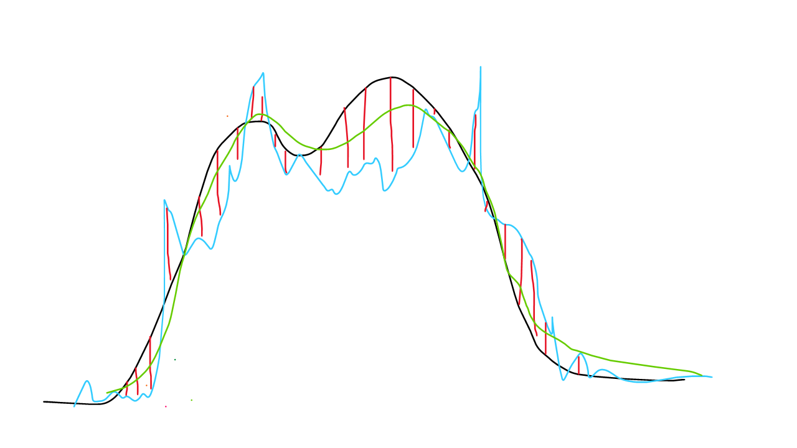

Some Data Science Demonstrations Rubens
================
true

# 1 - Introduction

Here in this document I describe a full example of analytics and
forecasting from my experience at Multivarejo - GPA

<!-- |Posição|Descrição|Jogadores| -->
<!-- |---|---|---| -->
<!-- |GK|Goleiro|1 -->
<!-- |Center-back|Zagueiro central|2 -->
<!-- |Outside-back|Zagueiro lateral|2 -->
<!-- |Center-mid|Meio de campo|2 -->
<!-- |Outside-mid|Lateral|2 -->
<!-- |Forward|Atacante|2 -->

## 1.1 Supermarket cashier demand estimation

The methodology used within this study comes from industry Operational
Research applied to mapped functions inside a supermarket. the
fundamentals are that you need to estimate how much time do people take
to complete certain tasks, which are categorized on 3 types:

- Alpha: the ones with a scalar number that counts as repetitions of the
  same task. With this one you can resume in a formula to give the whole
  time estimate for the amount of movements:

T(t<sub>1</sub>,t<sub>2</sub>,n<sub>1</sub>,n<sub>2</sub>) =
t<sub>1</sub>n<sub>1</sub> + t<sub>2</sub>n<sub>2</sub>

where t<sub>i</sub> and n<sub>i</sub> corresponds to the time estimate
of the i’th activity and it’s volume respectively.

Example: times that a worker needs to wrench a bolt.


- Beta: A activity which has a estimation of time to its single
  execution. Usually Beta activities become alpha when more information
  is gathered. Example: full time to gather leftovers and clean the
  balcony after slicing ham and cheese to wrap and put in trays for
  display.


You could make somewhat proportional to the amount which the employee
has produced, but you can estimate a gross total time just to understand
how much time that person will be occupied.

- Delta chi (not gamma lol): They are activities which has its time
  inherent within the total estimation of employee that execute the
  entire pile of aplha and beta activities. Example: hit the clock at
  work.


At least in theory…

All of these gives an amount of time that each acitivity produces. We
can translate to amount of <b>workers</b> when we divide this amount of
time within a interval.

for example: if we define the activity of auditing an isle in a
warehouse (which takes 5 minutes) and we have 6 isles, we need a total
time of 30 minutes. But to complete this activity within 15 minutes, we
need 2 employees working simoutaneously, hence the demand for this
interval to complete this activity withing 15 minutes is: 30/15 = 2.

This also works if we consider that the activity can be splitted to
multiple workers.

First, we need to trace something to map. Select a sector to work on,
and then trace all the major activities commited to the team in that
sector. Here I brought the customer attendance task from the cashier
departament (due its easy understanding and measurement method).

## 1.2 Explaining the data

The datasets used in this study are:

- Sales volume per timestamp:  
  Each row has a point of time (every 15 minutes) that has:
  - Total amount of items sold
  - Total amount of customers served
- Time estimates for activities
  - A Value for the calculated moving average of the scan time for each
    item
  - a value for the calculated moving average of the service for each
    client (besides scan time)

with this info, we can calculate the amount of time to attend all
customers and scan all items in each 15 minute interval, and determine
de demand of how much employees we need in every 15 minutes.

------------------------------------------------------------------------

# 2 - Analysing the data

First we download the data and fill non-existent data-poits for each day
which the store hasn’t opened, and insert 0 each time data-point.

After that, we calculate de demand with the time average for each month
(calculated separately).

## 2.1 - Analisys setup

First we read the csv files from the web, and then we mutate our
data-points hourly (due to its high granularity).

``` r
#Lendo bases de dados descritas acima:
library(dplyr)
library(tidyverse)
library(lubridate)
library(forecast)
library(astsa)
library(forecast)
library(ggplot2)
library(slider)
library(knitr)

#reading data for folume of sales and time estimates
df_sales_o = read.csv("https://docs.google.com/uc?id=1QcoAKttfUfdCMT9SblqhEtHqNIY9iZMr&export=download") %>% 
  mutate(DATE_TIME = ymd_hms(DATE_TIME)) %>%
  as_tibble()


df_avg_time = read.csv("https://docs.google.com/uc?id=1soZNQYn05iDpgKxj1W3g8mcDISl35HUq&export=download")

# Filling non existent datapoints
date_time_empty_frame = tibble(DATE_TIME=seq(min(df_sales_o$DATE_TIME),max(df_sales_o$DATE_TIME),15*60))

df_avg_time = df_avg_time %>% 
  as_tibble() %>% 
  mutate(MONTH = ymd(MONTH))

df_demand = date_time_empty_frame %>% 
  left_join(df_sales_o %>% 
              mutate(DATE_TIME = ymd_hms(DATE_TIME)) %>%
              as_tibble()
            ,by="DATE_TIME") %>%
  arrange(DATE_TIME) %>% 
  mutate(QTY_ITEMS=coalesce(QTD_ITENS,0)
         ,QTY_CLIENTS=coalesce(QTD_CLIENTES,0)) %>% 
  select(-QTD_ITENS,-QTD_CLIENTES) %>%
  mutate(MONTH = DATE_TIME %>% as_date() %>% 
           `day<-`(1)) %>% 
  left_join(df_avg_time,by=c("MONTH")) %>% 
  mutate(DEMAND = ((QTY_ITEMS*AVG_TIME_ITEM)+(QTY_CLIENTS*AVG_TIME_CLIENT))/(15*60)) %>% 
  mutate(DATE_TIME_H = `minute<-`(DATE_TIME,0)) %>% 
  #aggregating to use every hour:
  group_by(DATE_TIME_H,MONTH) %>% 
  summarise(DEMAND = sum(DEMAND,na.rm = TRUE)/4
            ,QTY_ITEMS=sum(QTY_ITEMS)
            ,QTY_CLIENTS=sum(QTY_CLIENTS)
            ,.groups="drop") %>% 
  rename(DATE_TIME = DATE_TIME_H)
```

The first rows shows as follows:

``` r
df_demand %>% filter(DATE_TIME>='2019-01-03 08:00:00',DATE_TIME<='2019-01-03 18:00:00') %>% head(n=10) %>% kable()
```

| DATE_TIME           | MONTH      |   DEMAND | QTY_ITEMS | QTY_CLIENTS |
|:--------------------|:-----------|---------:|----------:|------------:|
| 2019-01-03 10:00:00 | 2019-01-01 | 16.10000 |      2610 |         369 |
| 2019-01-03 11:00:00 | 2019-01-01 | 18.02383 |      2758 |         420 |
| 2019-01-03 12:00:00 | 2019-01-01 | 23.90406 |      3516 |         563 |
| 2019-01-03 13:00:00 | 2019-01-01 | 27.54922 |      3242 |         683 |
| 2019-01-03 14:00:00 | 2019-01-01 | 21.26042 |      2765 |         516 |
| 2019-01-03 15:00:00 | 2019-01-01 | 19.39983 |      2804 |         459 |
| 2019-01-03 16:00:00 | 2019-01-01 | 19.99625 |      3225 |         459 |
| 2019-01-03 17:00:00 | 2019-01-01 | 21.35939 |      3428 |         491 |
| 2019-01-03 18:00:00 | 2019-01-01 | 20.98336 |      3471 |         478 |
| 2019-01-03 19:00:00 | 2019-01-01 | 18.80697 |      3121 |         428 |

After that calulations made as exlpained above, we can plot november to
see what it looks like:

<div class="plotly html-widget html-fill-item-overflow-hidden html-fill-item" id="htmlwidget-a5de132f9b25ec465ed2" style="width:960px;height:768px;"></div>
<script type="application/json" data-for="htmlwidget-a5de132f9b25ec465ed2">{"x":{"data":[{"x":[1572566400,1572570000,1572573600,1572577200,1572580800,1572584400,1572588000,1572591600,1572595200,1572598800,1572602400,1572606000,1572609600,1572613200,1572616800,1572620400,1572624000,1572627600,1572631200,1572634800,1572638400,1572642000,1572645600,1572649200,1572652800,1572656400,1572660000,1572663600,1572667200,1572670800,1572674400,1572678000,1572681600,1572685200,1572688800,1572692400,1572696000,1572699600,1572703200,1572706800,1572710400,1572714000,1572717600,1572721200,1572724800,1572728400,1572732000,1572735600,1572739200,1572742800,1572746400,1572750000,1572753600,1572757200,1572760800,1572764400,1572768000,1572771600,1572775200,1572778800,1572782400,1572786000,1572789600,1572793200,1572796800,1572800400,1572804000,1572807600,1572811200,1572814800,1572818400,1572822000,1572825600,1572829200,1572832800,1572836400,1572840000,1572843600,1572847200,1572850800,1572854400,1572858000,1572861600,1572865200,1572868800,1572872400,1572876000,1572879600,1572883200,1572886800,1572890400,1572894000,1572897600,1572901200,1572904800,1572908400,1572912000,1572915600,1572919200,1572922800,1572926400,1572930000,1572933600,1572937200,1572940800,1572944400,1572948000,1572951600,1572955200,1572958800,1572962400,1572966000,1572969600,1572973200,1572976800,1572980400,1572984000,1572987600,1572991200,1572994800,1572998400,1573002000,1573005600,1573009200,1573012800,1573016400,1573020000,1573023600,1573027200,1573030800,1573034400,1573038000,1573041600,1573045200,1573048800,1573052400,1573056000,1573059600,1573063200,1573066800,1573070400,1573074000,1573077600,1573081200,1573084800,1573088400,1573092000,1573095600,1573099200,1573102800,1573106400,1573110000,1573113600,1573117200,1573120800,1573124400,1573128000,1573131600,1573135200,1573138800,1573142400,1573146000,1573149600,1573153200,1573156800,1573160400,1573164000,1573167600,1573171200,1573174800,1573178400,1573182000,1573185600,1573189200,1573192800,1573196400,1573200000,1573203600,1573207200,1573210800,1573214400,1573218000,1573221600,1573225200,1573228800,1573232400,1573236000,1573239600,1573243200,1573246800,1573250400,1573254000,1573257600,1573261200,1573264800,1573268400,1573272000,1573275600,1573279200,1573282800,1573286400,1573290000,1573293600,1573297200,1573300800,1573304400,1573308000,1573311600,1573315200,1573318800,1573322400,1573326000,1573329600,1573333200,1573336800,1573340400,1573344000,1573347600,1573351200,1573354800,1573358400,1573362000,1573365600,1573369200,1573372800,1573376400,1573380000,1573383600,1573387200,1573390800,1573394400,1573398000,1573401600,1573405200,1573408800,1573412400,1573416000,1573419600,1573423200,1573426800,1573430400,1573434000,1573437600,1573441200,1573444800,1573448400,1573452000,1573455600,1573459200,1573462800,1573466400,1573470000,1573473600,1573477200,1573480800,1573484400,1573488000,1573491600,1573495200,1573498800,1573502400,1573506000,1573509600,1573513200,1573516800,1573520400,1573524000,1573527600,1573531200,1573534800,1573538400,1573542000,1573545600,1573549200,1573552800,1573556400,1573560000,1573563600,1573567200,1573570800,1573574400,1573578000,1573581600,1573585200,1573588800,1573592400,1573596000,1573599600,1573603200,1573606800,1573610400,1573614000,1573617600,1573621200,1573624800,1573628400,1573632000,1573635600,1573639200,1573642800,1573646400,1573650000,1573653600,1573657200,1573660800,1573664400,1573668000,1573671600,1573675200,1573678800,1573682400,1573686000,1573689600,1573693200,1573696800,1573700400,1573704000,1573707600,1573711200,1573714800,1573718400,1573722000,1573725600,1573729200,1573732800,1573736400,1573740000,1573743600,1573747200,1573750800,1573754400,1573758000,1573761600,1573765200,1573768800,1573772400,1573776000,1573779600,1573783200,1573786800,1573790400,1573794000,1573797600,1573801200,1573804800,1573808400,1573812000,1573815600,1573819200,1573822800,1573826400,1573830000,1573833600,1573837200,1573840800,1573844400,1573848000,1573851600,1573855200,1573858800,1573862400,1573866000,1573869600,1573873200,1573876800,1573880400,1573884000,1573887600,1573891200,1573894800,1573898400,1573902000,1573905600,1573909200,1573912800,1573916400,1573920000,1573923600,1573927200,1573930800,1573934400,1573938000,1573941600,1573945200,1573948800,1573952400,1573956000,1573959600,1573963200,1573966800,1573970400,1573974000,1573977600,1573981200,1573984800,1573988400,1573992000,1573995600,1573999200,1574002800,1574006400,1574010000,1574013600,1574017200,1574020800,1574024400,1574028000,1574031600,1574035200,1574038800,1574042400,1574046000,1574049600,1574053200,1574056800,1574060400,1574064000,1574067600,1574071200,1574074800,1574078400,1574082000,1574085600,1574089200,1574092800,1574096400,1574100000,1574103600,1574107200,1574110800,1574114400,1574118000,1574121600,1574125200,1574128800,1574132400,1574136000,1574139600,1574143200,1574146800,1574150400,1574154000,1574157600,1574161200,1574164800,1574168400,1574172000,1574175600,1574179200,1574182800,1574186400,1574190000,1574193600,1574197200,1574200800,1574204400,1574208000,1574211600,1574215200,1574218800,1574222400,1574226000,1574229600,1574233200,1574236800,1574240400,1574244000,1574247600,1574251200,1574254800,1574258400,1574262000,1574265600,1574269200,1574272800,1574276400,1574280000,1574283600,1574287200,1574290800,1574294400,1574298000,1574301600,1574305200,1574308800,1574312400,1574316000,1574319600,1574323200,1574326800,1574330400,1574334000,1574337600,1574341200,1574344800,1574348400,1574352000,1574355600,1574359200,1574362800,1574366400,1574370000,1574373600,1574377200,1574380800,1574384400,1574388000,1574391600,1574395200,1574398800,1574402400,1574406000,1574409600,1574413200,1574416800,1574420400,1574424000,1574427600,1574431200,1574434800,1574438400,1574442000,1574445600,1574449200,1574452800,1574456400,1574460000,1574463600,1574467200,1574470800,1574474400,1574478000,1574481600,1574485200,1574488800,1574492400,1574496000,1574499600,1574503200,1574506800,1574510400,1574514000,1574517600,1574521200,1574524800,1574528400,1574532000,1574535600,1574539200,1574542800,1574546400,1574550000,1574553600,1574557200,1574560800,1574564400,1574568000,1574571600,1574575200,1574578800,1574582400,1574586000,1574589600,1574593200,1574596800,1574600400,1574604000,1574607600,1574611200,1574614800,1574618400,1574622000,1574625600,1574629200,1574632800,1574636400,1574640000,1574643600,1574647200,1574650800,1574654400,1574658000,1574661600,1574665200,1574668800,1574672400,1574676000,1574679600,1574683200,1574686800,1574690400,1574694000,1574697600,1574701200,1574704800,1574708400,1574712000,1574715600,1574719200,1574722800,1574726400,1574730000,1574733600,1574737200,1574740800,1574744400,1574748000,1574751600,1574755200,1574758800,1574762400,1574766000,1574769600,1574773200,1574776800,1574780400,1574784000,1574787600,1574791200,1574794800,1574798400,1574802000,1574805600,1574809200,1574812800,1574816400,1574820000,1574823600,1574827200,1574830800,1574834400,1574838000,1574841600,1574845200,1574848800,1574852400,1574856000,1574859600,1574863200,1574866800,1574870400,1574874000,1574877600,1574881200,1574884800,1574888400,1574892000,1574895600,1574899200,1574902800,1574906400,1574910000,1574913600,1574917200,1574920800,1574924400,1574928000,1574931600,1574935200,1574938800,1574942400,1574946000,1574949600,1574953200,1574956800,1574960400,1574964000,1574967600,1574971200,1574974800,1574978400,1574982000,1574985600,1574989200,1574992800,1574996400,1575000000,1575003600,1575007200,1575010800,1575014400,1575018000,1575021600,1575025200,1575028800,1575032400,1575036000,1575039600,1575043200,1575046800,1575050400,1575054000,1575057600,1575061200,1575064800,1575068400,1575072000,1575075600,1575079200,1575082800,1575086400,1575090000,1575093600,1575097200,1575100800,1575104400,1575108000,1575111600,1575115200,1575118800,1575122400,1575126000,1575129600,1575133200,1575136800,1575140400,1575144000,1575147600,1575151200,1575154800],"y":[7.01033333333333,3.86287222222222,2.38187777777778,1.62356111111111,0.902761111111111,3.14564444444444,6.22336111111111,9.78051666666667,10.1661777777778,14.3004111111111,16.2844444444444,19.1727055555556,22.7245777777778,24.7583722222222,21.3848055555556,19.4715888888889,20.1506,21.3892833333333,23.7295166666667,21.0383722222222,19.2129222222222,15.6710055555556,14.1090555555556,12.6234555555556,7.04563888888889,5.11010555555556,3.89491666666667,2.27899444444444,1.42975,3.06832222222222,5.39945,7.91113333333333,10.3672555555556,17.1766722222222,21.3229,23.8802555555556,25.3731444444444,24.63725,22.2179,21.6616555555556,23.5711111111111,25.4018444444444,26.7529888888889,23.6947444444444,20.4062444444444,18.0867833333333,13.29425,13.0930888888889,0.843855555555556,5.26867222222222,3.16005555555556,1.56182777777778,1.64344444444444,2.34605555555556,3.99889444444444,5.39616666666667,9.10125555555556,12.8590555555556,16.4766444444444,17.7387,23.1405444444444,20.0494722222222,15.2659166666667,16.0268333333333,17.4729777777778,17.5205277777778,20.2306055555556,18.7772555555556,16.8891888888889,16.7604555555556,10.6769166666667,6.37011666666667,5.42112777777778,1.85422777777778,1.56641111111111,0.473988888888889,0.621716666666667,2.20233333333333,4.38406111111111,7.17505555555556,9.37868888888889,10.9960333333333,12.8838333333333,14.9466555555556,21.1324222222222,23.2721555555556,17.03725,16.8862166666667,17.8469944444444,19.5551055555556,20.3857888888889,20.2500333333333,18.8639722222222,17.0192611111111,12.6244888888889,10.1153222222222,5.5141,3.1219,1.85575555555556,0.70705,0.897516666666667,2.52487777777778,5.47466666666667,9.84844444444444,12.3316555555556,14.7780111111111,17.5020055555556,20.9436,25.7664277777778,28.2266,22.7575277777778,20.1668888888889,20.5010777777778,21.3364888888889,15.9929722222222,14.1001777777778,12.9416222222222,12.1586111111111,10.8103555555556,8.14656666666667,6.21210555555556,4.23732222222222,2.31196666666667,1.23804444444444,0.933338888888889,3.05754444444444,6.08079444444444,10.3262111111111,12.0153444444444,17.9700666666667,21.9702,25.4254222222222,28.4115111111111,29.6497833333333,25.5421,24.1930777777778,25.5069777777778,25.6204944444444,22.8414555555556,24.0566222222222,19.4582888888889,16.1175333333333,14.4813166666667,9.15163333333333,6.715,3.41663333333333,1.48865555555556,1.03927777777778,1.00898888888889,3.09737222222222,6.28365,8.408,9.3267,12.2586055555556,14.0125111111111,16.4576722222222,23.3886611111111,21.4881666666667,17.2644888888889,17.1636888888889,18.61485,19.5803555555556,19.7399555555556,18.83385,15.5395888888889,13.2845666666667,12.1334666666667,8.67401111111111,7.61136111111111,3.69133888888889,2.36286111111111,1.33225555555556,1.19697777777778,3.51922777777778,5.42100555555556,9.64195555555555,11.7915555555556,14.1119055555556,14.6337944444444,18.6134444444444,24.2219666666667,25.2263111111111,22.6038555555556,20.9321444444444,23.1339388888889,22.0269611111111,20.5462333333333,16.8708333333333,15.3481722222222,14.7446055555556,12.7684166666667,11.7019888888889,6.94603888888889,4.6573,3.63877222222222,1.91881111111111,1.80304444444444,2.31962777777778,4.97016111111111,7.64057777777778,10.0247666666667,13.2883444444444,17.1886888888889,23.6324944444444,22.4115888888889,24.4787666666667,22.9478277777778,20.6709388888889,21.7512,22.7492666666667,19.15245,18.9263444444444,19.2807666666667,16.0833833333333,12.3356388888889,10.8776444444444,7.15791666666667,4.62868333333333,3.67110555555556,1.95878333333333,2.06224444444444,2.74563333333333,3.92448333333333,5.24457777777778,8.41532777777778,11.3152111111111,15.2841666666667,17.1305055555556,20.7781777777778,19.9974388888889,16.7255833333333,15.2187388888889,17.5319833333333,18.7748611111111,18.2040388888889,17.0982777777778,18.3414833333333,15.6450944444444,11.5061944444444,8.60527777777778,3.06117777777778,2.65148333333333,1.15380555555556,0.835844444444444,0.697511111111111,1.99351111111111,4.23247222222222,7.02084444444444,7.78343333333333,9.20612222222222,11.5748666666667,13.4328944444444,19.3579722222222,24.3015,17.4221666666667,15.4743888888889,17.27035,20.0726166666667,19.4295111111111,16.2467833333333,17.1003222222222,16.0678777777778,11.0303277777778,5.85324444444444,0.865844444444444,0,0,0,0,0.0413555555555556,0.604972222222222,12.1777555555556,12.8336611111111,17.7189,19.53555,20.2517055555556,28.7669277777778,29.15195,23.5419,20.5340111111111,22.6302388888889,24.8190277777778,21.1681777777778,21.5885666666667,15.7018111111111,15.1217166666667,12.2935611111111,9.25154444444444,5.43991666666667,3.32190555555556,1.67030555555556,1.99809444444444,0.774688888888889,3.14659444444444,6.76913888888889,12.1060277777778,11.7908333333333,15.4050333333333,18.6392111111111,24.5967222222222,29.5001555555556,28.5705166666667,24.4016333333333,23.5783833333333,23.7255722222222,24.2589,23.6636333333333,19.38225,19.8942277777778,17.50855,12.3812277777778,10.2247722222222,6.43579444444444,3.5407,2.19781111111111,1.23614444444444,0.765005555555555,2.23,5.78424444444444,8.04744444444444,9.85447222222222,11.5758166666667,12.7546666666667,18.5726666666667,20.7786166666667,23.0814388888889,18.6015555555556,18.1644611111111,19.4092555555556,21.4696833333333,22.6461388888889,19.6703555555556,15.1474444444444,16.5319777777778,12.4972833333333,12.5593055555556,8.92220555555556,4.76381666666667,4.03506666666667,1.88218333333333,1.84301666666667,2.10898888888889,3.33072222222222,6.53112222222222,8.54668333333333,9.30985,11.6788222222222,16.55155,18.23065,21.4076388888889,18.0228833333333,19.6918888888889,20.8922722222222,23.2145833333333,22.0008,22.0766555555556,18.6620666666667,15.2046777777778,12.9347277777778,12.4813444444444,6.75528333333333,4.15149444444444,2.20691666666667,1.25311666666667,1.71203333333333,2.54882777777778,4.07993333333333,5.95352777777778,9.74366111111111,11.4783222222222,13.5107722222222,21.3584555555556,20.71085,20.2687611111111,17.8282055555556,19.6939333333333,22.5812444444444,21.4819055555556,21.5909,20.3642722222222,17.4316,14.2150555555556,10.7517611111111,10.8239222222222,5.42288333333333,4.77641111111111,3.08368333333333,1.66987222222222,1.84855,2.41617222222222,3.30786666666667,4.28795,7.57556111111111,10.3544333333333,14.5001888888889,17.0023944444444,18.5575333333333,17.31565,14.2650222222222,15.9278333333333,17.9471333333333,17.4756833333333,20.4581555555556,16.9943222222222,13.2801277777778,14.4069055555556,9.85825,6.93206111111111,3.74223333333333,2.49807777777778,1.89463333333333,1.00898888888889,0.923655555555556,2.12930555555556,4.05875,6.98479444444444,7.36506666666667,9.74533333333333,10.3329,15.2651333333333,21.1148722222222,23.8616611111111,17.3353277777778,14.7739055555556,17.9509722222222,18.4569222222222,18.6238111111111,16.5135611111111,15.86455,14.9857388888889,11.9675277777778,8.03301111111111,7.14938888888889,3.25833333333333,1.74261111111111,1.20236666666667,0.759327777777778,2.32363333333333,5.19806111111111,11.3943944444444,14.1461166666667,15.9653888888889,20.1743,23.7565222222222,27.4976222222222,24.1490222222222,23.2350055555556,23.6894,22.8940444444444,23.7838388888889,22.2229611111111,20.4083333333333,20.4503277777778,17.3147611111111,13.2063777777778,10.1140222222222,8.35037222222222,3.96742777777778,2.97861111111111,1.58672777777778,1.68465555555556,2.90566666666667,5.54259444444444,8.51071666666667,13.2096388888889,17.0241555555556,19.5182888888889,23.6660444444444,27.8906277777778,24.8540833333333,22.7483166666667,23.5756333333333,25.9332722222222,25.2849,24.3657666666667,23.4161777777778,19.2941888888889,15.9251055555556,11.1905055555556,8.15961666666667,4.35317222222222,2.72895,1.66528888888889,0.978555555555556,0.817283333333333,2.14022777777778,3.79321111111111,8.5293,9.68942222222222,11.0566944444444,12.53705,16.3323666666667,21.7505666666667,21.3220222222222,16.6673833333333,15.7203333333333,16.7066111111111,17.5469555555556,17.3142666666667,17.8873388888889,17.0983,15.6799666666667,11.4580888888889,8.09045,6.32112222222222,3.14913333333333,2.45257222222222,1.28202222222222,0.992244444444444,3.01466111111111,5.12059444444444,9.43569444444444,11.0452777777778,13.97285,16.3680222222222,17.9094722222222,20.7896833333333,23.2756833333333,20.1204777777778,18.5643888888889,18.2039777777778,19.3489055555556,20.1533666666667,18.7496111111111,19.5903277777778,15.8019277777778,11.7903777777778,9.9237,8.31993888888889,4.05160555555556,3.64096111111111,1.81454444444444,1.32061111111111,2.8614,4.54692222222222,7.65761111111111,10.9608111111111,12.9685666666667,16.9906055555556,20.74665,23.5862277777778,21.4319611111111,20.3813888888889,18.7717222222222,23.1833666666667,21.1580388888889,18.8829888888889,16.9644055555556,16.8202277777778,14.7381833333333,12.1132944444444,8.53763888888889,7.17786111111111,3.83696111111111,2.85506111111111,1.9689,1.07342777777778,2.09086111111111,3.99765555555556,5.83972222222222,8.39786111111111,10.2287777777778,14.8825666666667,18.3133222222222,20.5128277777778,19.8435,18.34035,16.1115888888889,17.5213944444444,18.9078277777778,21.1943166666667,17.5491222222222,18.7921833333333,14.3186,11.0869611111111,7.02220555555556,4.36132777777778,3.19783888888889,1.92477777777778,0.820483333333333,0.738866666666667,2.50150555555556,4.53273888888889,7.54616111111111,8.88613888888889,10.3337055555556,11.6482666666667,15.1799444444444,22.2289944444444,21.9159277777778,18.9488555555556,16.5344166666667,17.6775888888889,16.9995277777778,18.1729888888889,17.5992944444444,19.5962722222222,15.2110166666667,12.5523277777778,8.62763888888889,5.07521111111111,3.27377777777778,1.88342222222222,0.791288888888889,0.974033333333333,2.95379444444444,5.86317777777778,11.5481722222222,13.0217333333333,17.9321611111111,22.3371777777778,23.2839166666667,29.3129111111111,28.6822555555556,20.6424277777778,23.4568555555556,22.6894555555556,23.2559833333333,22.1547444444444,20.8294666666667,20.3735833333333,19.6643444444444,12.8222222222222,9.70127222222222,5.20656666666667,3.19230555555556,1.6567,0.932244444444444,0.835844444444445,3.38962777777778,8.95588333333333,12.9656166666667,14.0149055555556,18.4436444444444,23.6030944444444,25.7956,29.5437,29.6609555555556,25.0421166666667,23.6319,22.3323055555556,23.4504333333333,18.5369277777778,17.0811222222222,17.9213833333333,17.8153833333333,11.8789111111111,9.48714444444444,12.2825333333333,3.56588888888889,2.04731666666667,0.828494444444444,1.18132777777778,2.69721666666667,5.40826666666667,9.32793888888889,9.81348888888889,10.1382833333333,13.5145722222222,16.4083055555556,20.2920333333333,23.1381555555556,20.8191277777778,19.0882611111111,20.5202,19.6818777777778,22.7089666666667,20.3024166666667,23.0255833333333,28.5928666666667,28.5864222222222,23.5642944444444,21.0156166666667,17.4703722222222,12.0160444444444,7.07803333333333,3.83563888888889,6.58833333333333,10.1056611111111,24.0237944444444,24.6273833333333,25.8056333333333,27.16345,28.6857166666667,32.4677166666667,35.5085777777778,32.1131111111111,31.2214555555556,34.0704666666667,37.5930166666667,35.7401944444444,37.6835722222222,34.85145,34.6296388888889,30.2880111111111,26.7771666666667,4.86442777777778,8.75680555555556,4.36737777777778,3.12766111111111,1.50554444444444,3.19515555555556,5.72767222222222,8.66973888888889,11.5699944444444,13.9868055555556,19.7727833333333,25.0824388888889,24.9077055555556,27.2881388888889,22.9528055555556,24.7620833333333,25.9630055555556,27.3871388888889,26.2779722222222,23.4526,21.7456666666667,19.1871555555556,15.3998111111111,10.8734944444444],"text":["DATE_TIME: 2019-11-01 00:00:00<br />value: 7.010333e+00","DATE_TIME: 2019-11-01 01:00:00<br />value: 3.862872e+00","DATE_TIME: 2019-11-01 02:00:00<br />value: 2.381878e+00","DATE_TIME: 2019-11-01 03:00:00<br />value: 1.623561e+00","DATE_TIME: 2019-11-01 04:00:00<br />value: 9.027611e-01","DATE_TIME: 2019-11-01 05:00:00<br />value: 3.145644e+00","DATE_TIME: 2019-11-01 06:00:00<br />value: 6.223361e+00","DATE_TIME: 2019-11-01 07:00:00<br />value: 9.780517e+00","DATE_TIME: 2019-11-01 08:00:00<br />value: 1.016618e+01","DATE_TIME: 2019-11-01 09:00:00<br />value: 1.430041e+01","DATE_TIME: 2019-11-01 10:00:00<br />value: 1.628444e+01","DATE_TIME: 2019-11-01 11:00:00<br />value: 1.917271e+01","DATE_TIME: 2019-11-01 12:00:00<br />value: 2.272458e+01","DATE_TIME: 2019-11-01 13:00:00<br />value: 2.475837e+01","DATE_TIME: 2019-11-01 14:00:00<br />value: 2.138481e+01","DATE_TIME: 2019-11-01 15:00:00<br />value: 1.947159e+01","DATE_TIME: 2019-11-01 16:00:00<br />value: 2.015060e+01","DATE_TIME: 2019-11-01 17:00:00<br />value: 2.138928e+01","DATE_TIME: 2019-11-01 18:00:00<br />value: 2.372952e+01","DATE_TIME: 2019-11-01 19:00:00<br />value: 2.103837e+01","DATE_TIME: 2019-11-01 20:00:00<br />value: 1.921292e+01","DATE_TIME: 2019-11-01 21:00:00<br />value: 1.567101e+01","DATE_TIME: 2019-11-01 22:00:00<br />value: 1.410906e+01","DATE_TIME: 2019-11-01 23:00:00<br />value: 1.262346e+01","DATE_TIME: 2019-11-02 00:00:00<br />value: 7.045639e+00","DATE_TIME: 2019-11-02 01:00:00<br />value: 5.110106e+00","DATE_TIME: 2019-11-02 02:00:00<br />value: 3.894917e+00","DATE_TIME: 2019-11-02 03:00:00<br />value: 2.278994e+00","DATE_TIME: 2019-11-02 04:00:00<br />value: 1.429750e+00","DATE_TIME: 2019-11-02 05:00:00<br />value: 3.068322e+00","DATE_TIME: 2019-11-02 06:00:00<br />value: 5.399450e+00","DATE_TIME: 2019-11-02 07:00:00<br />value: 7.911133e+00","DATE_TIME: 2019-11-02 08:00:00<br />value: 1.036726e+01","DATE_TIME: 2019-11-02 09:00:00<br />value: 1.717667e+01","DATE_TIME: 2019-11-02 10:00:00<br />value: 2.132290e+01","DATE_TIME: 2019-11-02 11:00:00<br />value: 2.388026e+01","DATE_TIME: 2019-11-02 12:00:00<br />value: 2.537314e+01","DATE_TIME: 2019-11-02 13:00:00<br />value: 2.463725e+01","DATE_TIME: 2019-11-02 14:00:00<br />value: 2.221790e+01","DATE_TIME: 2019-11-02 15:00:00<br />value: 2.166166e+01","DATE_TIME: 2019-11-02 16:00:00<br />value: 2.357111e+01","DATE_TIME: 2019-11-02 17:00:00<br />value: 2.540184e+01","DATE_TIME: 2019-11-02 18:00:00<br />value: 2.675299e+01","DATE_TIME: 2019-11-02 19:00:00<br />value: 2.369474e+01","DATE_TIME: 2019-11-02 20:00:00<br />value: 2.040624e+01","DATE_TIME: 2019-11-02 21:00:00<br />value: 1.808678e+01","DATE_TIME: 2019-11-02 22:00:00<br />value: 1.329425e+01","DATE_TIME: 2019-11-02 23:00:00<br />value: 1.309309e+01","DATE_TIME: 2019-11-03 00:00:00<br />value: 8.438556e-01","DATE_TIME: 2019-11-03 01:00:00<br />value: 5.268672e+00","DATE_TIME: 2019-11-03 02:00:00<br />value: 3.160056e+00","DATE_TIME: 2019-11-03 03:00:00<br />value: 1.561828e+00","DATE_TIME: 2019-11-03 04:00:00<br />value: 1.643444e+00","DATE_TIME: 2019-11-03 05:00:00<br />value: 2.346056e+00","DATE_TIME: 2019-11-03 06:00:00<br />value: 3.998894e+00","DATE_TIME: 2019-11-03 07:00:00<br />value: 5.396167e+00","DATE_TIME: 2019-11-03 08:00:00<br />value: 9.101256e+00","DATE_TIME: 2019-11-03 09:00:00<br />value: 1.285906e+01","DATE_TIME: 2019-11-03 10:00:00<br />value: 1.647664e+01","DATE_TIME: 2019-11-03 11:00:00<br />value: 1.773870e+01","DATE_TIME: 2019-11-03 12:00:00<br />value: 2.314054e+01","DATE_TIME: 2019-11-03 13:00:00<br />value: 2.004947e+01","DATE_TIME: 2019-11-03 14:00:00<br />value: 1.526592e+01","DATE_TIME: 2019-11-03 15:00:00<br />value: 1.602683e+01","DATE_TIME: 2019-11-03 16:00:00<br />value: 1.747298e+01","DATE_TIME: 2019-11-03 17:00:00<br />value: 1.752053e+01","DATE_TIME: 2019-11-03 18:00:00<br />value: 2.023061e+01","DATE_TIME: 2019-11-03 19:00:00<br />value: 1.877726e+01","DATE_TIME: 2019-11-03 20:00:00<br />value: 1.688919e+01","DATE_TIME: 2019-11-03 21:00:00<br />value: 1.676046e+01","DATE_TIME: 2019-11-03 22:00:00<br />value: 1.067692e+01","DATE_TIME: 2019-11-03 23:00:00<br />value: 6.370117e+00","DATE_TIME: 2019-11-04 00:00:00<br />value: 5.421128e+00","DATE_TIME: 2019-11-04 01:00:00<br />value: 1.854228e+00","DATE_TIME: 2019-11-04 02:00:00<br />value: 1.566411e+00","DATE_TIME: 2019-11-04 03:00:00<br />value: 4.739889e-01","DATE_TIME: 2019-11-04 04:00:00<br />value: 6.217167e-01","DATE_TIME: 2019-11-04 05:00:00<br />value: 2.202333e+00","DATE_TIME: 2019-11-04 06:00:00<br />value: 4.384061e+00","DATE_TIME: 2019-11-04 07:00:00<br />value: 7.175056e+00","DATE_TIME: 2019-11-04 08:00:00<br />value: 9.378689e+00","DATE_TIME: 2019-11-04 09:00:00<br />value: 1.099603e+01","DATE_TIME: 2019-11-04 10:00:00<br />value: 1.288383e+01","DATE_TIME: 2019-11-04 11:00:00<br />value: 1.494666e+01","DATE_TIME: 2019-11-04 12:00:00<br />value: 2.113242e+01","DATE_TIME: 2019-11-04 13:00:00<br />value: 2.327216e+01","DATE_TIME: 2019-11-04 14:00:00<br />value: 1.703725e+01","DATE_TIME: 2019-11-04 15:00:00<br />value: 1.688622e+01","DATE_TIME: 2019-11-04 16:00:00<br />value: 1.784699e+01","DATE_TIME: 2019-11-04 17:00:00<br />value: 1.955511e+01","DATE_TIME: 2019-11-04 18:00:00<br />value: 2.038579e+01","DATE_TIME: 2019-11-04 19:00:00<br />value: 2.025003e+01","DATE_TIME: 2019-11-04 20:00:00<br />value: 1.886397e+01","DATE_TIME: 2019-11-04 21:00:00<br />value: 1.701926e+01","DATE_TIME: 2019-11-04 22:00:00<br />value: 1.262449e+01","DATE_TIME: 2019-11-04 23:00:00<br />value: 1.011532e+01","DATE_TIME: 2019-11-05 00:00:00<br />value: 5.514100e+00","DATE_TIME: 2019-11-05 01:00:00<br />value: 3.121900e+00","DATE_TIME: 2019-11-05 02:00:00<br />value: 1.855756e+00","DATE_TIME: 2019-11-05 03:00:00<br />value: 7.070500e-01","DATE_TIME: 2019-11-05 04:00:00<br />value: 8.975167e-01","DATE_TIME: 2019-11-05 05:00:00<br />value: 2.524878e+00","DATE_TIME: 2019-11-05 06:00:00<br />value: 5.474667e+00","DATE_TIME: 2019-11-05 07:00:00<br />value: 9.848444e+00","DATE_TIME: 2019-11-05 08:00:00<br />value: 1.233166e+01","DATE_TIME: 2019-11-05 09:00:00<br />value: 1.477801e+01","DATE_TIME: 2019-11-05 10:00:00<br />value: 1.750201e+01","DATE_TIME: 2019-11-05 11:00:00<br />value: 2.094360e+01","DATE_TIME: 2019-11-05 12:00:00<br />value: 2.576643e+01","DATE_TIME: 2019-11-05 13:00:00<br />value: 2.822660e+01","DATE_TIME: 2019-11-05 14:00:00<br />value: 2.275753e+01","DATE_TIME: 2019-11-05 15:00:00<br />value: 2.016689e+01","DATE_TIME: 2019-11-05 16:00:00<br />value: 2.050108e+01","DATE_TIME: 2019-11-05 17:00:00<br />value: 2.133649e+01","DATE_TIME: 2019-11-05 18:00:00<br />value: 1.599297e+01","DATE_TIME: 2019-11-05 19:00:00<br />value: 1.410018e+01","DATE_TIME: 2019-11-05 20:00:00<br />value: 1.294162e+01","DATE_TIME: 2019-11-05 21:00:00<br />value: 1.215861e+01","DATE_TIME: 2019-11-05 22:00:00<br />value: 1.081036e+01","DATE_TIME: 2019-11-05 23:00:00<br />value: 8.146567e+00","DATE_TIME: 2019-11-06 00:00:00<br />value: 6.212106e+00","DATE_TIME: 2019-11-06 01:00:00<br />value: 4.237322e+00","DATE_TIME: 2019-11-06 02:00:00<br />value: 2.311967e+00","DATE_TIME: 2019-11-06 03:00:00<br />value: 1.238044e+00","DATE_TIME: 2019-11-06 04:00:00<br />value: 9.333389e-01","DATE_TIME: 2019-11-06 05:00:00<br />value: 3.057544e+00","DATE_TIME: 2019-11-06 06:00:00<br />value: 6.080794e+00","DATE_TIME: 2019-11-06 07:00:00<br />value: 1.032621e+01","DATE_TIME: 2019-11-06 08:00:00<br />value: 1.201534e+01","DATE_TIME: 2019-11-06 09:00:00<br />value: 1.797007e+01","DATE_TIME: 2019-11-06 10:00:00<br />value: 2.197020e+01","DATE_TIME: 2019-11-06 11:00:00<br />value: 2.542542e+01","DATE_TIME: 2019-11-06 12:00:00<br />value: 2.841151e+01","DATE_TIME: 2019-11-06 13:00:00<br />value: 2.964978e+01","DATE_TIME: 2019-11-06 14:00:00<br />value: 2.554210e+01","DATE_TIME: 2019-11-06 15:00:00<br />value: 2.419308e+01","DATE_TIME: 2019-11-06 16:00:00<br />value: 2.550698e+01","DATE_TIME: 2019-11-06 17:00:00<br />value: 2.562049e+01","DATE_TIME: 2019-11-06 18:00:00<br />value: 2.284146e+01","DATE_TIME: 2019-11-06 19:00:00<br />value: 2.405662e+01","DATE_TIME: 2019-11-06 20:00:00<br />value: 1.945829e+01","DATE_TIME: 2019-11-06 21:00:00<br />value: 1.611753e+01","DATE_TIME: 2019-11-06 22:00:00<br />value: 1.448132e+01","DATE_TIME: 2019-11-06 23:00:00<br />value: 9.151633e+00","DATE_TIME: 2019-11-07 00:00:00<br />value: 6.715000e+00","DATE_TIME: 2019-11-07 01:00:00<br />value: 3.416633e+00","DATE_TIME: 2019-11-07 02:00:00<br />value: 1.488656e+00","DATE_TIME: 2019-11-07 03:00:00<br />value: 1.039278e+00","DATE_TIME: 2019-11-07 04:00:00<br />value: 1.008989e+00","DATE_TIME: 2019-11-07 05:00:00<br />value: 3.097372e+00","DATE_TIME: 2019-11-07 06:00:00<br />value: 6.283650e+00","DATE_TIME: 2019-11-07 07:00:00<br />value: 8.408000e+00","DATE_TIME: 2019-11-07 08:00:00<br />value: 9.326700e+00","DATE_TIME: 2019-11-07 09:00:00<br />value: 1.225861e+01","DATE_TIME: 2019-11-07 10:00:00<br />value: 1.401251e+01","DATE_TIME: 2019-11-07 11:00:00<br />value: 1.645767e+01","DATE_TIME: 2019-11-07 12:00:00<br />value: 2.338866e+01","DATE_TIME: 2019-11-07 13:00:00<br />value: 2.148817e+01","DATE_TIME: 2019-11-07 14:00:00<br />value: 1.726449e+01","DATE_TIME: 2019-11-07 15:00:00<br />value: 1.716369e+01","DATE_TIME: 2019-11-07 16:00:00<br />value: 1.861485e+01","DATE_TIME: 2019-11-07 17:00:00<br />value: 1.958036e+01","DATE_TIME: 2019-11-07 18:00:00<br />value: 1.973996e+01","DATE_TIME: 2019-11-07 19:00:00<br />value: 1.883385e+01","DATE_TIME: 2019-11-07 20:00:00<br />value: 1.553959e+01","DATE_TIME: 2019-11-07 21:00:00<br />value: 1.328457e+01","DATE_TIME: 2019-11-07 22:00:00<br />value: 1.213347e+01","DATE_TIME: 2019-11-07 23:00:00<br />value: 8.674011e+00","DATE_TIME: 2019-11-08 00:00:00<br />value: 7.611361e+00","DATE_TIME: 2019-11-08 01:00:00<br />value: 3.691339e+00","DATE_TIME: 2019-11-08 02:00:00<br />value: 2.362861e+00","DATE_TIME: 2019-11-08 03:00:00<br />value: 1.332256e+00","DATE_TIME: 2019-11-08 04:00:00<br />value: 1.196978e+00","DATE_TIME: 2019-11-08 05:00:00<br />value: 3.519228e+00","DATE_TIME: 2019-11-08 06:00:00<br />value: 5.421006e+00","DATE_TIME: 2019-11-08 07:00:00<br />value: 9.641956e+00","DATE_TIME: 2019-11-08 08:00:00<br />value: 1.179156e+01","DATE_TIME: 2019-11-08 09:00:00<br />value: 1.411191e+01","DATE_TIME: 2019-11-08 10:00:00<br />value: 1.463379e+01","DATE_TIME: 2019-11-08 11:00:00<br />value: 1.861344e+01","DATE_TIME: 2019-11-08 12:00:00<br />value: 2.422197e+01","DATE_TIME: 2019-11-08 13:00:00<br />value: 2.522631e+01","DATE_TIME: 2019-11-08 14:00:00<br />value: 2.260386e+01","DATE_TIME: 2019-11-08 15:00:00<br />value: 2.093214e+01","DATE_TIME: 2019-11-08 16:00:00<br />value: 2.313394e+01","DATE_TIME: 2019-11-08 17:00:00<br />value: 2.202696e+01","DATE_TIME: 2019-11-08 18:00:00<br />value: 2.054623e+01","DATE_TIME: 2019-11-08 19:00:00<br />value: 1.687083e+01","DATE_TIME: 2019-11-08 20:00:00<br />value: 1.534817e+01","DATE_TIME: 2019-11-08 21:00:00<br />value: 1.474461e+01","DATE_TIME: 2019-11-08 22:00:00<br />value: 1.276842e+01","DATE_TIME: 2019-11-08 23:00:00<br />value: 1.170199e+01","DATE_TIME: 2019-11-09 00:00:00<br />value: 6.946039e+00","DATE_TIME: 2019-11-09 01:00:00<br />value: 4.657300e+00","DATE_TIME: 2019-11-09 02:00:00<br />value: 3.638772e+00","DATE_TIME: 2019-11-09 03:00:00<br />value: 1.918811e+00","DATE_TIME: 2019-11-09 04:00:00<br />value: 1.803044e+00","DATE_TIME: 2019-11-09 05:00:00<br />value: 2.319628e+00","DATE_TIME: 2019-11-09 06:00:00<br />value: 4.970161e+00","DATE_TIME: 2019-11-09 07:00:00<br />value: 7.640578e+00","DATE_TIME: 2019-11-09 08:00:00<br />value: 1.002477e+01","DATE_TIME: 2019-11-09 09:00:00<br />value: 1.328834e+01","DATE_TIME: 2019-11-09 10:00:00<br />value: 1.718869e+01","DATE_TIME: 2019-11-09 11:00:00<br />value: 2.363249e+01","DATE_TIME: 2019-11-09 12:00:00<br />value: 2.241159e+01","DATE_TIME: 2019-11-09 13:00:00<br />value: 2.447877e+01","DATE_TIME: 2019-11-09 14:00:00<br />value: 2.294783e+01","DATE_TIME: 2019-11-09 15:00:00<br />value: 2.067094e+01","DATE_TIME: 2019-11-09 16:00:00<br />value: 2.175120e+01","DATE_TIME: 2019-11-09 17:00:00<br />value: 2.274927e+01","DATE_TIME: 2019-11-09 18:00:00<br />value: 1.915245e+01","DATE_TIME: 2019-11-09 19:00:00<br />value: 1.892634e+01","DATE_TIME: 2019-11-09 20:00:00<br />value: 1.928077e+01","DATE_TIME: 2019-11-09 21:00:00<br />value: 1.608338e+01","DATE_TIME: 2019-11-09 22:00:00<br />value: 1.233564e+01","DATE_TIME: 2019-11-09 23:00:00<br />value: 1.087764e+01","DATE_TIME: 2019-11-10 00:00:00<br />value: 7.157917e+00","DATE_TIME: 2019-11-10 01:00:00<br />value: 4.628683e+00","DATE_TIME: 2019-11-10 02:00:00<br />value: 3.671106e+00","DATE_TIME: 2019-11-10 03:00:00<br />value: 1.958783e+00","DATE_TIME: 2019-11-10 04:00:00<br />value: 2.062244e+00","DATE_TIME: 2019-11-10 05:00:00<br />value: 2.745633e+00","DATE_TIME: 2019-11-10 06:00:00<br />value: 3.924483e+00","DATE_TIME: 2019-11-10 07:00:00<br />value: 5.244578e+00","DATE_TIME: 2019-11-10 08:00:00<br />value: 8.415328e+00","DATE_TIME: 2019-11-10 09:00:00<br />value: 1.131521e+01","DATE_TIME: 2019-11-10 10:00:00<br />value: 1.528417e+01","DATE_TIME: 2019-11-10 11:00:00<br />value: 1.713051e+01","DATE_TIME: 2019-11-10 12:00:00<br />value: 2.077818e+01","DATE_TIME: 2019-11-10 13:00:00<br />value: 1.999744e+01","DATE_TIME: 2019-11-10 14:00:00<br />value: 1.672558e+01","DATE_TIME: 2019-11-10 15:00:00<br />value: 1.521874e+01","DATE_TIME: 2019-11-10 16:00:00<br />value: 1.753198e+01","DATE_TIME: 2019-11-10 17:00:00<br />value: 1.877486e+01","DATE_TIME: 2019-11-10 18:00:00<br />value: 1.820404e+01","DATE_TIME: 2019-11-10 19:00:00<br />value: 1.709828e+01","DATE_TIME: 2019-11-10 20:00:00<br />value: 1.834148e+01","DATE_TIME: 2019-11-10 21:00:00<br />value: 1.564509e+01","DATE_TIME: 2019-11-10 22:00:00<br />value: 1.150619e+01","DATE_TIME: 2019-11-10 23:00:00<br />value: 8.605278e+00","DATE_TIME: 2019-11-11 00:00:00<br />value: 3.061178e+00","DATE_TIME: 2019-11-11 01:00:00<br />value: 2.651483e+00","DATE_TIME: 2019-11-11 02:00:00<br />value: 1.153806e+00","DATE_TIME: 2019-11-11 03:00:00<br />value: 8.358444e-01","DATE_TIME: 2019-11-11 04:00:00<br />value: 6.975111e-01","DATE_TIME: 2019-11-11 05:00:00<br />value: 1.993511e+00","DATE_TIME: 2019-11-11 06:00:00<br />value: 4.232472e+00","DATE_TIME: 2019-11-11 07:00:00<br />value: 7.020844e+00","DATE_TIME: 2019-11-11 08:00:00<br />value: 7.783433e+00","DATE_TIME: 2019-11-11 09:00:00<br />value: 9.206122e+00","DATE_TIME: 2019-11-11 10:00:00<br />value: 1.157487e+01","DATE_TIME: 2019-11-11 11:00:00<br />value: 1.343289e+01","DATE_TIME: 2019-11-11 12:00:00<br />value: 1.935797e+01","DATE_TIME: 2019-11-11 13:00:00<br />value: 2.430150e+01","DATE_TIME: 2019-11-11 14:00:00<br />value: 1.742217e+01","DATE_TIME: 2019-11-11 15:00:00<br />value: 1.547439e+01","DATE_TIME: 2019-11-11 16:00:00<br />value: 1.727035e+01","DATE_TIME: 2019-11-11 17:00:00<br />value: 2.007262e+01","DATE_TIME: 2019-11-11 18:00:00<br />value: 1.942951e+01","DATE_TIME: 2019-11-11 19:00:00<br />value: 1.624678e+01","DATE_TIME: 2019-11-11 20:00:00<br />value: 1.710032e+01","DATE_TIME: 2019-11-11 21:00:00<br />value: 1.606788e+01","DATE_TIME: 2019-11-11 22:00:00<br />value: 1.103033e+01","DATE_TIME: 2019-11-11 23:00:00<br />value: 5.853244e+00","DATE_TIME: 2019-11-12 00:00:00<br />value: 8.658444e-01","DATE_TIME: 2019-11-12 01:00:00<br />value: 0.000000e+00","DATE_TIME: 2019-11-12 02:00:00<br />value: 0.000000e+00","DATE_TIME: 2019-11-12 03:00:00<br />value: 0.000000e+00","DATE_TIME: 2019-11-12 04:00:00<br />value: 0.000000e+00","DATE_TIME: 2019-11-12 05:00:00<br />value: 4.135556e-02","DATE_TIME: 2019-11-12 06:00:00<br />value: 6.049722e-01","DATE_TIME: 2019-11-12 07:00:00<br />value: 1.217776e+01","DATE_TIME: 2019-11-12 08:00:00<br />value: 1.283366e+01","DATE_TIME: 2019-11-12 09:00:00<br />value: 1.771890e+01","DATE_TIME: 2019-11-12 10:00:00<br />value: 1.953555e+01","DATE_TIME: 2019-11-12 11:00:00<br />value: 2.025171e+01","DATE_TIME: 2019-11-12 12:00:00<br />value: 2.876693e+01","DATE_TIME: 2019-11-12 13:00:00<br />value: 2.915195e+01","DATE_TIME: 2019-11-12 14:00:00<br />value: 2.354190e+01","DATE_TIME: 2019-11-12 15:00:00<br />value: 2.053401e+01","DATE_TIME: 2019-11-12 16:00:00<br />value: 2.263024e+01","DATE_TIME: 2019-11-12 17:00:00<br />value: 2.481903e+01","DATE_TIME: 2019-11-12 18:00:00<br />value: 2.116818e+01","DATE_TIME: 2019-11-12 19:00:00<br />value: 2.158857e+01","DATE_TIME: 2019-11-12 20:00:00<br />value: 1.570181e+01","DATE_TIME: 2019-11-12 21:00:00<br />value: 1.512172e+01","DATE_TIME: 2019-11-12 22:00:00<br />value: 1.229356e+01","DATE_TIME: 2019-11-12 23:00:00<br />value: 9.251544e+00","DATE_TIME: 2019-11-13 00:00:00<br />value: 5.439917e+00","DATE_TIME: 2019-11-13 01:00:00<br />value: 3.321906e+00","DATE_TIME: 2019-11-13 02:00:00<br />value: 1.670306e+00","DATE_TIME: 2019-11-13 03:00:00<br />value: 1.998094e+00","DATE_TIME: 2019-11-13 04:00:00<br />value: 7.746889e-01","DATE_TIME: 2019-11-13 05:00:00<br />value: 3.146594e+00","DATE_TIME: 2019-11-13 06:00:00<br />value: 6.769139e+00","DATE_TIME: 2019-11-13 07:00:00<br />value: 1.210603e+01","DATE_TIME: 2019-11-13 08:00:00<br />value: 1.179083e+01","DATE_TIME: 2019-11-13 09:00:00<br />value: 1.540503e+01","DATE_TIME: 2019-11-13 10:00:00<br />value: 1.863921e+01","DATE_TIME: 2019-11-13 11:00:00<br />value: 2.459672e+01","DATE_TIME: 2019-11-13 12:00:00<br />value: 2.950016e+01","DATE_TIME: 2019-11-13 13:00:00<br />value: 2.857052e+01","DATE_TIME: 2019-11-13 14:00:00<br />value: 2.440163e+01","DATE_TIME: 2019-11-13 15:00:00<br />value: 2.357838e+01","DATE_TIME: 2019-11-13 16:00:00<br />value: 2.372557e+01","DATE_TIME: 2019-11-13 17:00:00<br />value: 2.425890e+01","DATE_TIME: 2019-11-13 18:00:00<br />value: 2.366363e+01","DATE_TIME: 2019-11-13 19:00:00<br />value: 1.938225e+01","DATE_TIME: 2019-11-13 20:00:00<br />value: 1.989423e+01","DATE_TIME: 2019-11-13 21:00:00<br />value: 1.750855e+01","DATE_TIME: 2019-11-13 22:00:00<br />value: 1.238123e+01","DATE_TIME: 2019-11-13 23:00:00<br />value: 1.022477e+01","DATE_TIME: 2019-11-14 00:00:00<br />value: 6.435794e+00","DATE_TIME: 2019-11-14 01:00:00<br />value: 3.540700e+00","DATE_TIME: 2019-11-14 02:00:00<br />value: 2.197811e+00","DATE_TIME: 2019-11-14 03:00:00<br />value: 1.236144e+00","DATE_TIME: 2019-11-14 04:00:00<br />value: 7.650056e-01","DATE_TIME: 2019-11-14 05:00:00<br />value: 2.230000e+00","DATE_TIME: 2019-11-14 06:00:00<br />value: 5.784244e+00","DATE_TIME: 2019-11-14 07:00:00<br />value: 8.047444e+00","DATE_TIME: 2019-11-14 08:00:00<br />value: 9.854472e+00","DATE_TIME: 2019-11-14 09:00:00<br />value: 1.157582e+01","DATE_TIME: 2019-11-14 10:00:00<br />value: 1.275467e+01","DATE_TIME: 2019-11-14 11:00:00<br />value: 1.857267e+01","DATE_TIME: 2019-11-14 12:00:00<br />value: 2.077862e+01","DATE_TIME: 2019-11-14 13:00:00<br />value: 2.308144e+01","DATE_TIME: 2019-11-14 14:00:00<br />value: 1.860156e+01","DATE_TIME: 2019-11-14 15:00:00<br />value: 1.816446e+01","DATE_TIME: 2019-11-14 16:00:00<br />value: 1.940926e+01","DATE_TIME: 2019-11-14 17:00:00<br />value: 2.146968e+01","DATE_TIME: 2019-11-14 18:00:00<br />value: 2.264614e+01","DATE_TIME: 2019-11-14 19:00:00<br />value: 1.967036e+01","DATE_TIME: 2019-11-14 20:00:00<br />value: 1.514744e+01","DATE_TIME: 2019-11-14 21:00:00<br />value: 1.653198e+01","DATE_TIME: 2019-11-14 22:00:00<br />value: 1.249728e+01","DATE_TIME: 2019-11-14 23:00:00<br />value: 1.255931e+01","DATE_TIME: 2019-11-15 00:00:00<br />value: 8.922206e+00","DATE_TIME: 2019-11-15 01:00:00<br />value: 4.763817e+00","DATE_TIME: 2019-11-15 02:00:00<br />value: 4.035067e+00","DATE_TIME: 2019-11-15 03:00:00<br />value: 1.882183e+00","DATE_TIME: 2019-11-15 04:00:00<br />value: 1.843017e+00","DATE_TIME: 2019-11-15 05:00:00<br />value: 2.108989e+00","DATE_TIME: 2019-11-15 06:00:00<br />value: 3.330722e+00","DATE_TIME: 2019-11-15 07:00:00<br />value: 6.531122e+00","DATE_TIME: 2019-11-15 08:00:00<br />value: 8.546683e+00","DATE_TIME: 2019-11-15 09:00:00<br />value: 9.309850e+00","DATE_TIME: 2019-11-15 10:00:00<br />value: 1.167882e+01","DATE_TIME: 2019-11-15 11:00:00<br />value: 1.655155e+01","DATE_TIME: 2019-11-15 12:00:00<br />value: 1.823065e+01","DATE_TIME: 2019-11-15 13:00:00<br />value: 2.140764e+01","DATE_TIME: 2019-11-15 14:00:00<br />value: 1.802288e+01","DATE_TIME: 2019-11-15 15:00:00<br />value: 1.969189e+01","DATE_TIME: 2019-11-15 16:00:00<br />value: 2.089227e+01","DATE_TIME: 2019-11-15 17:00:00<br />value: 2.321458e+01","DATE_TIME: 2019-11-15 18:00:00<br />value: 2.200080e+01","DATE_TIME: 2019-11-15 19:00:00<br />value: 2.207666e+01","DATE_TIME: 2019-11-15 20:00:00<br />value: 1.866207e+01","DATE_TIME: 2019-11-15 21:00:00<br />value: 1.520468e+01","DATE_TIME: 2019-11-15 22:00:00<br />value: 1.293473e+01","DATE_TIME: 2019-11-15 23:00:00<br />value: 1.248134e+01","DATE_TIME: 2019-11-16 00:00:00<br />value: 6.755283e+00","DATE_TIME: 2019-11-16 01:00:00<br />value: 4.151494e+00","DATE_TIME: 2019-11-16 02:00:00<br />value: 2.206917e+00","DATE_TIME: 2019-11-16 03:00:00<br />value: 1.253117e+00","DATE_TIME: 2019-11-16 04:00:00<br />value: 1.712033e+00","DATE_TIME: 2019-11-16 05:00:00<br />value: 2.548828e+00","DATE_TIME: 2019-11-16 06:00:00<br />value: 4.079933e+00","DATE_TIME: 2019-11-16 07:00:00<br />value: 5.953528e+00","DATE_TIME: 2019-11-16 08:00:00<br />value: 9.743661e+00","DATE_TIME: 2019-11-16 09:00:00<br />value: 1.147832e+01","DATE_TIME: 2019-11-16 10:00:00<br />value: 1.351077e+01","DATE_TIME: 2019-11-16 11:00:00<br />value: 2.135846e+01","DATE_TIME: 2019-11-16 12:00:00<br />value: 2.071085e+01","DATE_TIME: 2019-11-16 13:00:00<br />value: 2.026876e+01","DATE_TIME: 2019-11-16 14:00:00<br />value: 1.782821e+01","DATE_TIME: 2019-11-16 15:00:00<br />value: 1.969393e+01","DATE_TIME: 2019-11-16 16:00:00<br />value: 2.258124e+01","DATE_TIME: 2019-11-16 17:00:00<br />value: 2.148191e+01","DATE_TIME: 2019-11-16 18:00:00<br />value: 2.159090e+01","DATE_TIME: 2019-11-16 19:00:00<br />value: 2.036427e+01","DATE_TIME: 2019-11-16 20:00:00<br />value: 1.743160e+01","DATE_TIME: 2019-11-16 21:00:00<br />value: 1.421506e+01","DATE_TIME: 2019-11-16 22:00:00<br />value: 1.075176e+01","DATE_TIME: 2019-11-16 23:00:00<br />value: 1.082392e+01","DATE_TIME: 2019-11-17 00:00:00<br />value: 5.422883e+00","DATE_TIME: 2019-11-17 01:00:00<br />value: 4.776411e+00","DATE_TIME: 2019-11-17 02:00:00<br />value: 3.083683e+00","DATE_TIME: 2019-11-17 03:00:00<br />value: 1.669872e+00","DATE_TIME: 2019-11-17 04:00:00<br />value: 1.848550e+00","DATE_TIME: 2019-11-17 05:00:00<br />value: 2.416172e+00","DATE_TIME: 2019-11-17 06:00:00<br />value: 3.307867e+00","DATE_TIME: 2019-11-17 07:00:00<br />value: 4.287950e+00","DATE_TIME: 2019-11-17 08:00:00<br />value: 7.575561e+00","DATE_TIME: 2019-11-17 09:00:00<br />value: 1.035443e+01","DATE_TIME: 2019-11-17 10:00:00<br />value: 1.450019e+01","DATE_TIME: 2019-11-17 11:00:00<br />value: 1.700239e+01","DATE_TIME: 2019-11-17 12:00:00<br />value: 1.855753e+01","DATE_TIME: 2019-11-17 13:00:00<br />value: 1.731565e+01","DATE_TIME: 2019-11-17 14:00:00<br />value: 1.426502e+01","DATE_TIME: 2019-11-17 15:00:00<br />value: 1.592783e+01","DATE_TIME: 2019-11-17 16:00:00<br />value: 1.794713e+01","DATE_TIME: 2019-11-17 17:00:00<br />value: 1.747568e+01","DATE_TIME: 2019-11-17 18:00:00<br />value: 2.045816e+01","DATE_TIME: 2019-11-17 19:00:00<br />value: 1.699432e+01","DATE_TIME: 2019-11-17 20:00:00<br />value: 1.328013e+01","DATE_TIME: 2019-11-17 21:00:00<br />value: 1.440691e+01","DATE_TIME: 2019-11-17 22:00:00<br />value: 9.858250e+00","DATE_TIME: 2019-11-17 23:00:00<br />value: 6.932061e+00","DATE_TIME: 2019-11-18 00:00:00<br />value: 3.742233e+00","DATE_TIME: 2019-11-18 01:00:00<br />value: 2.498078e+00","DATE_TIME: 2019-11-18 02:00:00<br />value: 1.894633e+00","DATE_TIME: 2019-11-18 03:00:00<br />value: 1.008989e+00","DATE_TIME: 2019-11-18 04:00:00<br />value: 9.236556e-01","DATE_TIME: 2019-11-18 05:00:00<br />value: 2.129306e+00","DATE_TIME: 2019-11-18 06:00:00<br />value: 4.058750e+00","DATE_TIME: 2019-11-18 07:00:00<br />value: 6.984794e+00","DATE_TIME: 2019-11-18 08:00:00<br />value: 7.365067e+00","DATE_TIME: 2019-11-18 09:00:00<br />value: 9.745333e+00","DATE_TIME: 2019-11-18 10:00:00<br />value: 1.033290e+01","DATE_TIME: 2019-11-18 11:00:00<br />value: 1.526513e+01","DATE_TIME: 2019-11-18 12:00:00<br />value: 2.111487e+01","DATE_TIME: 2019-11-18 13:00:00<br />value: 2.386166e+01","DATE_TIME: 2019-11-18 14:00:00<br />value: 1.733533e+01","DATE_TIME: 2019-11-18 15:00:00<br />value: 1.477391e+01","DATE_TIME: 2019-11-18 16:00:00<br />value: 1.795097e+01","DATE_TIME: 2019-11-18 17:00:00<br />value: 1.845692e+01","DATE_TIME: 2019-11-18 18:00:00<br />value: 1.862381e+01","DATE_TIME: 2019-11-18 19:00:00<br />value: 1.651356e+01","DATE_TIME: 2019-11-18 20:00:00<br />value: 1.586455e+01","DATE_TIME: 2019-11-18 21:00:00<br />value: 1.498574e+01","DATE_TIME: 2019-11-18 22:00:00<br />value: 1.196753e+01","DATE_TIME: 2019-11-18 23:00:00<br />value: 8.033011e+00","DATE_TIME: 2019-11-19 00:00:00<br />value: 7.149389e+00","DATE_TIME: 2019-11-19 01:00:00<br />value: 3.258333e+00","DATE_TIME: 2019-11-19 02:00:00<br />value: 1.742611e+00","DATE_TIME: 2019-11-19 03:00:00<br />value: 1.202367e+00","DATE_TIME: 2019-11-19 04:00:00<br />value: 7.593278e-01","DATE_TIME: 2019-11-19 05:00:00<br />value: 2.323633e+00","DATE_TIME: 2019-11-19 06:00:00<br />value: 5.198061e+00","DATE_TIME: 2019-11-19 07:00:00<br />value: 1.139439e+01","DATE_TIME: 2019-11-19 08:00:00<br />value: 1.414612e+01","DATE_TIME: 2019-11-19 09:00:00<br />value: 1.596539e+01","DATE_TIME: 2019-11-19 10:00:00<br />value: 2.017430e+01","DATE_TIME: 2019-11-19 11:00:00<br />value: 2.375652e+01","DATE_TIME: 2019-11-19 12:00:00<br />value: 2.749762e+01","DATE_TIME: 2019-11-19 13:00:00<br />value: 2.414902e+01","DATE_TIME: 2019-11-19 14:00:00<br />value: 2.323501e+01","DATE_TIME: 2019-11-19 15:00:00<br />value: 2.368940e+01","DATE_TIME: 2019-11-19 16:00:00<br />value: 2.289404e+01","DATE_TIME: 2019-11-19 17:00:00<br />value: 2.378384e+01","DATE_TIME: 2019-11-19 18:00:00<br />value: 2.222296e+01","DATE_TIME: 2019-11-19 19:00:00<br />value: 2.040833e+01","DATE_TIME: 2019-11-19 20:00:00<br />value: 2.045033e+01","DATE_TIME: 2019-11-19 21:00:00<br />value: 1.731476e+01","DATE_TIME: 2019-11-19 22:00:00<br />value: 1.320638e+01","DATE_TIME: 2019-11-19 23:00:00<br />value: 1.011402e+01","DATE_TIME: 2019-11-20 00:00:00<br />value: 8.350372e+00","DATE_TIME: 2019-11-20 01:00:00<br />value: 3.967428e+00","DATE_TIME: 2019-11-20 02:00:00<br />value: 2.978611e+00","DATE_TIME: 2019-11-20 03:00:00<br />value: 1.586728e+00","DATE_TIME: 2019-11-20 04:00:00<br />value: 1.684656e+00","DATE_TIME: 2019-11-20 05:00:00<br />value: 2.905667e+00","DATE_TIME: 2019-11-20 06:00:00<br />value: 5.542594e+00","DATE_TIME: 2019-11-20 07:00:00<br />value: 8.510717e+00","DATE_TIME: 2019-11-20 08:00:00<br />value: 1.320964e+01","DATE_TIME: 2019-11-20 09:00:00<br />value: 1.702416e+01","DATE_TIME: 2019-11-20 10:00:00<br />value: 1.951829e+01","DATE_TIME: 2019-11-20 11:00:00<br />value: 2.366604e+01","DATE_TIME: 2019-11-20 12:00:00<br />value: 2.789063e+01","DATE_TIME: 2019-11-20 13:00:00<br />value: 2.485408e+01","DATE_TIME: 2019-11-20 14:00:00<br />value: 2.274832e+01","DATE_TIME: 2019-11-20 15:00:00<br />value: 2.357563e+01","DATE_TIME: 2019-11-20 16:00:00<br />value: 2.593327e+01","DATE_TIME: 2019-11-20 17:00:00<br />value: 2.528490e+01","DATE_TIME: 2019-11-20 18:00:00<br />value: 2.436577e+01","DATE_TIME: 2019-11-20 19:00:00<br />value: 2.341618e+01","DATE_TIME: 2019-11-20 20:00:00<br />value: 1.929419e+01","DATE_TIME: 2019-11-20 21:00:00<br />value: 1.592511e+01","DATE_TIME: 2019-11-20 22:00:00<br />value: 1.119051e+01","DATE_TIME: 2019-11-20 23:00:00<br />value: 8.159617e+00","DATE_TIME: 2019-11-21 00:00:00<br />value: 4.353172e+00","DATE_TIME: 2019-11-21 01:00:00<br />value: 2.728950e+00","DATE_TIME: 2019-11-21 02:00:00<br />value: 1.665289e+00","DATE_TIME: 2019-11-21 03:00:00<br />value: 9.785556e-01","DATE_TIME: 2019-11-21 04:00:00<br />value: 8.172833e-01","DATE_TIME: 2019-11-21 05:00:00<br />value: 2.140228e+00","DATE_TIME: 2019-11-21 06:00:00<br />value: 3.793211e+00","DATE_TIME: 2019-11-21 07:00:00<br />value: 8.529300e+00","DATE_TIME: 2019-11-21 08:00:00<br />value: 9.689422e+00","DATE_TIME: 2019-11-21 09:00:00<br />value: 1.105669e+01","DATE_TIME: 2019-11-21 10:00:00<br />value: 1.253705e+01","DATE_TIME: 2019-11-21 11:00:00<br />value: 1.633237e+01","DATE_TIME: 2019-11-21 12:00:00<br />value: 2.175057e+01","DATE_TIME: 2019-11-21 13:00:00<br />value: 2.132202e+01","DATE_TIME: 2019-11-21 14:00:00<br />value: 1.666738e+01","DATE_TIME: 2019-11-21 15:00:00<br />value: 1.572033e+01","DATE_TIME: 2019-11-21 16:00:00<br />value: 1.670661e+01","DATE_TIME: 2019-11-21 17:00:00<br />value: 1.754696e+01","DATE_TIME: 2019-11-21 18:00:00<br />value: 1.731427e+01","DATE_TIME: 2019-11-21 19:00:00<br />value: 1.788734e+01","DATE_TIME: 2019-11-21 20:00:00<br />value: 1.709830e+01","DATE_TIME: 2019-11-21 21:00:00<br />value: 1.567997e+01","DATE_TIME: 2019-11-21 22:00:00<br />value: 1.145809e+01","DATE_TIME: 2019-11-21 23:00:00<br />value: 8.090450e+00","DATE_TIME: 2019-11-22 00:00:00<br />value: 6.321122e+00","DATE_TIME: 2019-11-22 01:00:00<br />value: 3.149133e+00","DATE_TIME: 2019-11-22 02:00:00<br />value: 2.452572e+00","DATE_TIME: 2019-11-22 03:00:00<br />value: 1.282022e+00","DATE_TIME: 2019-11-22 04:00:00<br />value: 9.922444e-01","DATE_TIME: 2019-11-22 05:00:00<br />value: 3.014661e+00","DATE_TIME: 2019-11-22 06:00:00<br />value: 5.120594e+00","DATE_TIME: 2019-11-22 07:00:00<br />value: 9.435694e+00","DATE_TIME: 2019-11-22 08:00:00<br />value: 1.104528e+01","DATE_TIME: 2019-11-22 09:00:00<br />value: 1.397285e+01","DATE_TIME: 2019-11-22 10:00:00<br />value: 1.636802e+01","DATE_TIME: 2019-11-22 11:00:00<br />value: 1.790947e+01","DATE_TIME: 2019-11-22 12:00:00<br />value: 2.078968e+01","DATE_TIME: 2019-11-22 13:00:00<br />value: 2.327568e+01","DATE_TIME: 2019-11-22 14:00:00<br />value: 2.012048e+01","DATE_TIME: 2019-11-22 15:00:00<br />value: 1.856439e+01","DATE_TIME: 2019-11-22 16:00:00<br />value: 1.820398e+01","DATE_TIME: 2019-11-22 17:00:00<br />value: 1.934891e+01","DATE_TIME: 2019-11-22 18:00:00<br />value: 2.015337e+01","DATE_TIME: 2019-11-22 19:00:00<br />value: 1.874961e+01","DATE_TIME: 2019-11-22 20:00:00<br />value: 1.959033e+01","DATE_TIME: 2019-11-22 21:00:00<br />value: 1.580193e+01","DATE_TIME: 2019-11-22 22:00:00<br />value: 1.179038e+01","DATE_TIME: 2019-11-22 23:00:00<br />value: 9.923700e+00","DATE_TIME: 2019-11-23 00:00:00<br />value: 8.319939e+00","DATE_TIME: 2019-11-23 01:00:00<br />value: 4.051606e+00","DATE_TIME: 2019-11-23 02:00:00<br />value: 3.640961e+00","DATE_TIME: 2019-11-23 03:00:00<br />value: 1.814544e+00","DATE_TIME: 2019-11-23 04:00:00<br />value: 1.320611e+00","DATE_TIME: 2019-11-23 05:00:00<br />value: 2.861400e+00","DATE_TIME: 2019-11-23 06:00:00<br />value: 4.546922e+00","DATE_TIME: 2019-11-23 07:00:00<br />value: 7.657611e+00","DATE_TIME: 2019-11-23 08:00:00<br />value: 1.096081e+01","DATE_TIME: 2019-11-23 09:00:00<br />value: 1.296857e+01","DATE_TIME: 2019-11-23 10:00:00<br />value: 1.699061e+01","DATE_TIME: 2019-11-23 11:00:00<br />value: 2.074665e+01","DATE_TIME: 2019-11-23 12:00:00<br />value: 2.358623e+01","DATE_TIME: 2019-11-23 13:00:00<br />value: 2.143196e+01","DATE_TIME: 2019-11-23 14:00:00<br />value: 2.038139e+01","DATE_TIME: 2019-11-23 15:00:00<br />value: 1.877172e+01","DATE_TIME: 2019-11-23 16:00:00<br />value: 2.318337e+01","DATE_TIME: 2019-11-23 17:00:00<br />value: 2.115804e+01","DATE_TIME: 2019-11-23 18:00:00<br />value: 1.888299e+01","DATE_TIME: 2019-11-23 19:00:00<br />value: 1.696441e+01","DATE_TIME: 2019-11-23 20:00:00<br />value: 1.682023e+01","DATE_TIME: 2019-11-23 21:00:00<br />value: 1.473818e+01","DATE_TIME: 2019-11-23 22:00:00<br />value: 1.211329e+01","DATE_TIME: 2019-11-23 23:00:00<br />value: 8.537639e+00","DATE_TIME: 2019-11-24 00:00:00<br />value: 7.177861e+00","DATE_TIME: 2019-11-24 01:00:00<br />value: 3.836961e+00","DATE_TIME: 2019-11-24 02:00:00<br />value: 2.855061e+00","DATE_TIME: 2019-11-24 03:00:00<br />value: 1.968900e+00","DATE_TIME: 2019-11-24 04:00:00<br />value: 1.073428e+00","DATE_TIME: 2019-11-24 05:00:00<br />value: 2.090861e+00","DATE_TIME: 2019-11-24 06:00:00<br />value: 3.997656e+00","DATE_TIME: 2019-11-24 07:00:00<br />value: 5.839722e+00","DATE_TIME: 2019-11-24 08:00:00<br />value: 8.397861e+00","DATE_TIME: 2019-11-24 09:00:00<br />value: 1.022878e+01","DATE_TIME: 2019-11-24 10:00:00<br />value: 1.488257e+01","DATE_TIME: 2019-11-24 11:00:00<br />value: 1.831332e+01","DATE_TIME: 2019-11-24 12:00:00<br />value: 2.051283e+01","DATE_TIME: 2019-11-24 13:00:00<br />value: 1.984350e+01","DATE_TIME: 2019-11-24 14:00:00<br />value: 1.834035e+01","DATE_TIME: 2019-11-24 15:00:00<br />value: 1.611159e+01","DATE_TIME: 2019-11-24 16:00:00<br />value: 1.752139e+01","DATE_TIME: 2019-11-24 17:00:00<br />value: 1.890783e+01","DATE_TIME: 2019-11-24 18:00:00<br />value: 2.119432e+01","DATE_TIME: 2019-11-24 19:00:00<br />value: 1.754912e+01","DATE_TIME: 2019-11-24 20:00:00<br />value: 1.879218e+01","DATE_TIME: 2019-11-24 21:00:00<br />value: 1.431860e+01","DATE_TIME: 2019-11-24 22:00:00<br />value: 1.108696e+01","DATE_TIME: 2019-11-24 23:00:00<br />value: 7.022206e+00","DATE_TIME: 2019-11-25 00:00:00<br />value: 4.361328e+00","DATE_TIME: 2019-11-25 01:00:00<br />value: 3.197839e+00","DATE_TIME: 2019-11-25 02:00:00<br />value: 1.924778e+00","DATE_TIME: 2019-11-25 03:00:00<br />value: 8.204833e-01","DATE_TIME: 2019-11-25 04:00:00<br />value: 7.388667e-01","DATE_TIME: 2019-11-25 05:00:00<br />value: 2.501506e+00","DATE_TIME: 2019-11-25 06:00:00<br />value: 4.532739e+00","DATE_TIME: 2019-11-25 07:00:00<br />value: 7.546161e+00","DATE_TIME: 2019-11-25 08:00:00<br />value: 8.886139e+00","DATE_TIME: 2019-11-25 09:00:00<br />value: 1.033371e+01","DATE_TIME: 2019-11-25 10:00:00<br />value: 1.164827e+01","DATE_TIME: 2019-11-25 11:00:00<br />value: 1.517994e+01","DATE_TIME: 2019-11-25 12:00:00<br />value: 2.222899e+01","DATE_TIME: 2019-11-25 13:00:00<br />value: 2.191593e+01","DATE_TIME: 2019-11-25 14:00:00<br />value: 1.894886e+01","DATE_TIME: 2019-11-25 15:00:00<br />value: 1.653442e+01","DATE_TIME: 2019-11-25 16:00:00<br />value: 1.767759e+01","DATE_TIME: 2019-11-25 17:00:00<br />value: 1.699953e+01","DATE_TIME: 2019-11-25 18:00:00<br />value: 1.817299e+01","DATE_TIME: 2019-11-25 19:00:00<br />value: 1.759929e+01","DATE_TIME: 2019-11-25 20:00:00<br />value: 1.959627e+01","DATE_TIME: 2019-11-25 21:00:00<br />value: 1.521102e+01","DATE_TIME: 2019-11-25 22:00:00<br />value: 1.255233e+01","DATE_TIME: 2019-11-25 23:00:00<br />value: 8.627639e+00","DATE_TIME: 2019-11-26 00:00:00<br />value: 5.075211e+00","DATE_TIME: 2019-11-26 01:00:00<br />value: 3.273778e+00","DATE_TIME: 2019-11-26 02:00:00<br />value: 1.883422e+00","DATE_TIME: 2019-11-26 03:00:00<br />value: 7.912889e-01","DATE_TIME: 2019-11-26 04:00:00<br />value: 9.740333e-01","DATE_TIME: 2019-11-26 05:00:00<br />value: 2.953794e+00","DATE_TIME: 2019-11-26 06:00:00<br />value: 5.863178e+00","DATE_TIME: 2019-11-26 07:00:00<br />value: 1.154817e+01","DATE_TIME: 2019-11-26 08:00:00<br />value: 1.302173e+01","DATE_TIME: 2019-11-26 09:00:00<br />value: 1.793216e+01","DATE_TIME: 2019-11-26 10:00:00<br />value: 2.233718e+01","DATE_TIME: 2019-11-26 11:00:00<br />value: 2.328392e+01","DATE_TIME: 2019-11-26 12:00:00<br />value: 2.931291e+01","DATE_TIME: 2019-11-26 13:00:00<br />value: 2.868226e+01","DATE_TIME: 2019-11-26 14:00:00<br />value: 2.064243e+01","DATE_TIME: 2019-11-26 15:00:00<br />value: 2.345686e+01","DATE_TIME: 2019-11-26 16:00:00<br />value: 2.268946e+01","DATE_TIME: 2019-11-26 17:00:00<br />value: 2.325598e+01","DATE_TIME: 2019-11-26 18:00:00<br />value: 2.215474e+01","DATE_TIME: 2019-11-26 19:00:00<br />value: 2.082947e+01","DATE_TIME: 2019-11-26 20:00:00<br />value: 2.037358e+01","DATE_TIME: 2019-11-26 21:00:00<br />value: 1.966434e+01","DATE_TIME: 2019-11-26 22:00:00<br />value: 1.282222e+01","DATE_TIME: 2019-11-26 23:00:00<br />value: 9.701272e+00","DATE_TIME: 2019-11-27 00:00:00<br />value: 5.206567e+00","DATE_TIME: 2019-11-27 01:00:00<br />value: 3.192306e+00","DATE_TIME: 2019-11-27 02:00:00<br />value: 1.656700e+00","DATE_TIME: 2019-11-27 03:00:00<br />value: 9.322444e-01","DATE_TIME: 2019-11-27 04:00:00<br />value: 8.358444e-01","DATE_TIME: 2019-11-27 05:00:00<br />value: 3.389628e+00","DATE_TIME: 2019-11-27 06:00:00<br />value: 8.955883e+00","DATE_TIME: 2019-11-27 07:00:00<br />value: 1.296562e+01","DATE_TIME: 2019-11-27 08:00:00<br />value: 1.401491e+01","DATE_TIME: 2019-11-27 09:00:00<br />value: 1.844364e+01","DATE_TIME: 2019-11-27 10:00:00<br />value: 2.360309e+01","DATE_TIME: 2019-11-27 11:00:00<br />value: 2.579560e+01","DATE_TIME: 2019-11-27 12:00:00<br />value: 2.954370e+01","DATE_TIME: 2019-11-27 13:00:00<br />value: 2.966096e+01","DATE_TIME: 2019-11-27 14:00:00<br />value: 2.504212e+01","DATE_TIME: 2019-11-27 15:00:00<br />value: 2.363190e+01","DATE_TIME: 2019-11-27 16:00:00<br />value: 2.233231e+01","DATE_TIME: 2019-11-27 17:00:00<br />value: 2.345043e+01","DATE_TIME: 2019-11-27 18:00:00<br />value: 1.853693e+01","DATE_TIME: 2019-11-27 19:00:00<br />value: 1.708112e+01","DATE_TIME: 2019-11-27 20:00:00<br />value: 1.792138e+01","DATE_TIME: 2019-11-27 21:00:00<br />value: 1.781538e+01","DATE_TIME: 2019-11-27 22:00:00<br />value: 1.187891e+01","DATE_TIME: 2019-11-27 23:00:00<br />value: 9.487144e+00","DATE_TIME: 2019-11-28 00:00:00<br />value: 1.228253e+01","DATE_TIME: 2019-11-28 01:00:00<br />value: 3.565889e+00","DATE_TIME: 2019-11-28 02:00:00<br />value: 2.047317e+00","DATE_TIME: 2019-11-28 03:00:00<br />value: 8.284944e-01","DATE_TIME: 2019-11-28 04:00:00<br />value: 1.181328e+00","DATE_TIME: 2019-11-28 05:00:00<br />value: 2.697217e+00","DATE_TIME: 2019-11-28 06:00:00<br />value: 5.408267e+00","DATE_TIME: 2019-11-28 07:00:00<br />value: 9.327939e+00","DATE_TIME: 2019-11-28 08:00:00<br />value: 9.813489e+00","DATE_TIME: 2019-11-28 09:00:00<br />value: 1.013828e+01","DATE_TIME: 2019-11-28 10:00:00<br />value: 1.351457e+01","DATE_TIME: 2019-11-28 11:00:00<br />value: 1.640831e+01","DATE_TIME: 2019-11-28 12:00:00<br />value: 2.029203e+01","DATE_TIME: 2019-11-28 13:00:00<br />value: 2.313816e+01","DATE_TIME: 2019-11-28 14:00:00<br />value: 2.081913e+01","DATE_TIME: 2019-11-28 15:00:00<br />value: 1.908826e+01","DATE_TIME: 2019-11-28 16:00:00<br />value: 2.052020e+01","DATE_TIME: 2019-11-28 17:00:00<br />value: 1.968188e+01","DATE_TIME: 2019-11-28 18:00:00<br />value: 2.270897e+01","DATE_TIME: 2019-11-28 19:00:00<br />value: 2.030242e+01","DATE_TIME: 2019-11-28 20:00:00<br />value: 2.302558e+01","DATE_TIME: 2019-11-28 21:00:00<br />value: 2.859287e+01","DATE_TIME: 2019-11-28 22:00:00<br />value: 2.858642e+01","DATE_TIME: 2019-11-28 23:00:00<br />value: 2.356429e+01","DATE_TIME: 2019-11-29 00:00:00<br />value: 2.101562e+01","DATE_TIME: 2019-11-29 01:00:00<br />value: 1.747037e+01","DATE_TIME: 2019-11-29 02:00:00<br />value: 1.201604e+01","DATE_TIME: 2019-11-29 03:00:00<br />value: 7.078033e+00","DATE_TIME: 2019-11-29 04:00:00<br />value: 3.835639e+00","DATE_TIME: 2019-11-29 05:00:00<br />value: 6.588333e+00","DATE_TIME: 2019-11-29 06:00:00<br />value: 1.010566e+01","DATE_TIME: 2019-11-29 07:00:00<br />value: 2.402379e+01","DATE_TIME: 2019-11-29 08:00:00<br />value: 2.462738e+01","DATE_TIME: 2019-11-29 09:00:00<br />value: 2.580563e+01","DATE_TIME: 2019-11-29 10:00:00<br />value: 2.716345e+01","DATE_TIME: 2019-11-29 11:00:00<br />value: 2.868572e+01","DATE_TIME: 2019-11-29 12:00:00<br />value: 3.246772e+01","DATE_TIME: 2019-11-29 13:00:00<br />value: 3.550858e+01","DATE_TIME: 2019-11-29 14:00:00<br />value: 3.211311e+01","DATE_TIME: 2019-11-29 15:00:00<br />value: 3.122146e+01","DATE_TIME: 2019-11-29 16:00:00<br />value: 3.407047e+01","DATE_TIME: 2019-11-29 17:00:00<br />value: 3.759302e+01","DATE_TIME: 2019-11-29 18:00:00<br />value: 3.574019e+01","DATE_TIME: 2019-11-29 19:00:00<br />value: 3.768357e+01","DATE_TIME: 2019-11-29 20:00:00<br />value: 3.485145e+01","DATE_TIME: 2019-11-29 21:00:00<br />value: 3.462964e+01","DATE_TIME: 2019-11-29 22:00:00<br />value: 3.028801e+01","DATE_TIME: 2019-11-29 23:00:00<br />value: 2.677717e+01","DATE_TIME: 2019-11-30 00:00:00<br />value: 4.864428e+00","DATE_TIME: 2019-11-30 01:00:00<br />value: 8.756806e+00","DATE_TIME: 2019-11-30 02:00:00<br />value: 4.367378e+00","DATE_TIME: 2019-11-30 03:00:00<br />value: 3.127661e+00","DATE_TIME: 2019-11-30 04:00:00<br />value: 1.505544e+00","DATE_TIME: 2019-11-30 05:00:00<br />value: 3.195156e+00","DATE_TIME: 2019-11-30 06:00:00<br />value: 5.727672e+00","DATE_TIME: 2019-11-30 07:00:00<br />value: 8.669739e+00","DATE_TIME: 2019-11-30 08:00:00<br />value: 1.156999e+01","DATE_TIME: 2019-11-30 09:00:00<br />value: 1.398681e+01","DATE_TIME: 2019-11-30 10:00:00<br />value: 1.977278e+01","DATE_TIME: 2019-11-30 11:00:00<br />value: 2.508244e+01","DATE_TIME: 2019-11-30 12:00:00<br />value: 2.490771e+01","DATE_TIME: 2019-11-30 13:00:00<br />value: 2.728814e+01","DATE_TIME: 2019-11-30 14:00:00<br />value: 2.295281e+01","DATE_TIME: 2019-11-30 15:00:00<br />value: 2.476208e+01","DATE_TIME: 2019-11-30 16:00:00<br />value: 2.596301e+01","DATE_TIME: 2019-11-30 17:00:00<br />value: 2.738714e+01","DATE_TIME: 2019-11-30 18:00:00<br />value: 2.627797e+01","DATE_TIME: 2019-11-30 19:00:00<br />value: 2.345260e+01","DATE_TIME: 2019-11-30 20:00:00<br />value: 2.174567e+01","DATE_TIME: 2019-11-30 21:00:00<br />value: 1.918716e+01","DATE_TIME: 2019-11-30 22:00:00<br />value: 1.539981e+01","DATE_TIME: 2019-11-30 23:00:00<br />value: 1.087349e+01"],"type":"scatter","mode":"lines","line":{"width":1.88976377952756,"color":"rgba(0,0,0,1)","dash":"solid"},"hoveron":"points","showlegend":false,"xaxis":"x","yaxis":"y","hoverinfo":"text","frame":null},{"x":[1572566400,1572570000,1572573600,1572577200,1572580800,1572584400,1572588000,1572591600,1572595200,1572598800,1572602400,1572606000,1572609600,1572613200,1572616800,1572620400,1572624000,1572627600,1572631200,1572634800,1572638400,1572642000,1572645600,1572649200,1572652800,1572656400,1572660000,1572663600,1572667200,1572670800,1572674400,1572678000,1572681600,1572685200,1572688800,1572692400,1572696000,1572699600,1572703200,1572706800,1572710400,1572714000,1572717600,1572721200,1572724800,1572728400,1572732000,1572735600,1572739200,1572742800,1572746400,1572750000,1572753600,1572757200,1572760800,1572764400,1572768000,1572771600,1572775200,1572778800,1572782400,1572786000,1572789600,1572793200,1572796800,1572800400,1572804000,1572807600,1572811200,1572814800,1572818400,1572822000,1572825600,1572829200,1572832800,1572836400,1572840000,1572843600,1572847200,1572850800,1572854400,1572858000,1572861600,1572865200,1572868800,1572872400,1572876000,1572879600,1572883200,1572886800,1572890400,1572894000,1572897600,1572901200,1572904800,1572908400,1572912000,1572915600,1572919200,1572922800,1572926400,1572930000,1572933600,1572937200,1572940800,1572944400,1572948000,1572951600,1572955200,1572958800,1572962400,1572966000,1572969600,1572973200,1572976800,1572980400,1572984000,1572987600,1572991200,1572994800,1572998400,1573002000,1573005600,1573009200,1573012800,1573016400,1573020000,1573023600,1573027200,1573030800,1573034400,1573038000,1573041600,1573045200,1573048800,1573052400,1573056000,1573059600,1573063200,1573066800,1573070400,1573074000,1573077600,1573081200,1573084800,1573088400,1573092000,1573095600,1573099200,1573102800,1573106400,1573110000,1573113600,1573117200,1573120800,1573124400,1573128000,1573131600,1573135200,1573138800,1573142400,1573146000,1573149600,1573153200,1573156800,1573160400,1573164000,1573167600,1573171200,1573174800,1573178400,1573182000,1573185600,1573189200,1573192800,1573196400,1573200000,1573203600,1573207200,1573210800,1573214400,1573218000,1573221600,1573225200,1573228800,1573232400,1573236000,1573239600,1573243200,1573246800,1573250400,1573254000,1573257600,1573261200,1573264800,1573268400,1573272000,1573275600,1573279200,1573282800,1573286400,1573290000,1573293600,1573297200,1573300800,1573304400,1573308000,1573311600,1573315200,1573318800,1573322400,1573326000,1573329600,1573333200,1573336800,1573340400,1573344000,1573347600,1573351200,1573354800,1573358400,1573362000,1573365600,1573369200,1573372800,1573376400,1573380000,1573383600,1573387200,1573390800,1573394400,1573398000,1573401600,1573405200,1573408800,1573412400,1573416000,1573419600,1573423200,1573426800,1573430400,1573434000,1573437600,1573441200,1573444800,1573448400,1573452000,1573455600,1573459200,1573462800,1573466400,1573470000,1573473600,1573477200,1573480800,1573484400,1573488000,1573491600,1573495200,1573498800,1573502400,1573506000,1573509600,1573513200,1573516800,1573520400,1573524000,1573527600,1573531200,1573534800,1573538400,1573542000,1573545600,1573549200,1573552800,1573556400,1573560000,1573563600,1573567200,1573570800,1573574400,1573578000,1573581600,1573585200,1573588800,1573592400,1573596000,1573599600,1573603200,1573606800,1573610400,1573614000,1573617600,1573621200,1573624800,1573628400,1573632000,1573635600,1573639200,1573642800,1573646400,1573650000,1573653600,1573657200,1573660800,1573664400,1573668000,1573671600,1573675200,1573678800,1573682400,1573686000,1573689600,1573693200,1573696800,1573700400,1573704000,1573707600,1573711200,1573714800,1573718400,1573722000,1573725600,1573729200,1573732800,1573736400,1573740000,1573743600,1573747200,1573750800,1573754400,1573758000,1573761600,1573765200,1573768800,1573772400,1573776000,1573779600,1573783200,1573786800,1573790400,1573794000,1573797600,1573801200,1573804800,1573808400,1573812000,1573815600,1573819200,1573822800,1573826400,1573830000,1573833600,1573837200,1573840800,1573844400,1573848000,1573851600,1573855200,1573858800,1573862400,1573866000,1573869600,1573873200,1573876800,1573880400,1573884000,1573887600,1573891200,1573894800,1573898400,1573902000,1573905600,1573909200,1573912800,1573916400,1573920000,1573923600,1573927200,1573930800,1573934400,1573938000,1573941600,1573945200,1573948800,1573952400,1573956000,1573959600,1573963200,1573966800,1573970400,1573974000,1573977600,1573981200,1573984800,1573988400,1573992000,1573995600,1573999200,1574002800,1574006400,1574010000,1574013600,1574017200,1574020800,1574024400,1574028000,1574031600,1574035200,1574038800,1574042400,1574046000,1574049600,1574053200,1574056800,1574060400,1574064000,1574067600,1574071200,1574074800,1574078400,1574082000,1574085600,1574089200,1574092800,1574096400,1574100000,1574103600,1574107200,1574110800,1574114400,1574118000,1574121600,1574125200,1574128800,1574132400,1574136000,1574139600,1574143200,1574146800,1574150400,1574154000,1574157600,1574161200,1574164800,1574168400,1574172000,1574175600,1574179200,1574182800,1574186400,1574190000,1574193600,1574197200,1574200800,1574204400,1574208000,1574211600,1574215200,1574218800,1574222400,1574226000,1574229600,1574233200,1574236800,1574240400,1574244000,1574247600,1574251200,1574254800,1574258400,1574262000,1574265600,1574269200,1574272800,1574276400,1574280000,1574283600,1574287200,1574290800,1574294400,1574298000,1574301600,1574305200,1574308800,1574312400,1574316000,1574319600,1574323200,1574326800,1574330400,1574334000,1574337600,1574341200,1574344800,1574348400,1574352000,1574355600,1574359200,1574362800,1574366400,1574370000,1574373600,1574377200,1574380800,1574384400,1574388000,1574391600,1574395200,1574398800,1574402400,1574406000,1574409600,1574413200,1574416800,1574420400,1574424000,1574427600,1574431200,1574434800,1574438400,1574442000,1574445600,1574449200,1574452800,1574456400,1574460000,1574463600,1574467200,1574470800,1574474400,1574478000,1574481600,1574485200,1574488800,1574492400,1574496000,1574499600,1574503200,1574506800,1574510400,1574514000,1574517600,1574521200,1574524800,1574528400,1574532000,1574535600,1574539200,1574542800,1574546400,1574550000,1574553600,1574557200,1574560800,1574564400,1574568000,1574571600,1574575200,1574578800,1574582400,1574586000,1574589600,1574593200,1574596800,1574600400,1574604000,1574607600,1574611200,1574614800,1574618400,1574622000,1574625600,1574629200,1574632800,1574636400,1574640000,1574643600,1574647200,1574650800,1574654400,1574658000,1574661600,1574665200,1574668800,1574672400,1574676000,1574679600,1574683200,1574686800,1574690400,1574694000,1574697600,1574701200,1574704800,1574708400,1574712000,1574715600,1574719200,1574722800,1574726400,1574730000,1574733600,1574737200,1574740800,1574744400,1574748000,1574751600,1574755200,1574758800,1574762400,1574766000,1574769600,1574773200,1574776800,1574780400,1574784000,1574787600,1574791200,1574794800,1574798400,1574802000,1574805600,1574809200,1574812800,1574816400,1574820000,1574823600,1574827200,1574830800,1574834400,1574838000,1574841600,1574845200,1574848800,1574852400,1574856000,1574859600,1574863200,1574866800,1574870400,1574874000,1574877600,1574881200,1574884800,1574888400,1574892000,1574895600,1574899200,1574902800,1574906400,1574910000,1574913600,1574917200,1574920800,1574924400,1574928000,1574931600,1574935200,1574938800,1574942400,1574946000,1574949600,1574953200,1574956800,1574960400,1574964000,1574967600,1574971200,1574974800,1574978400,1574982000,1574985600,1574989200,1574992800,1574996400,1575000000,1575003600,1575007200,1575010800,1575014400,1575018000,1575021600,1575025200,1575028800,1575032400,1575036000,1575039600,1575043200,1575046800,1575050400,1575054000,1575057600,1575061200,1575064800,1575068400,1575072000,1575075600,1575079200,1575082800,1575086400,1575090000,1575093600,1575097200,1575100800,1575104400,1575108000,1575111600,1575115200,1575118800,1575122400,1575126000,1575129600,1575133200,1575136800,1575140400,1575144000,1575147600,1575151200,1575154800],"y":[156,82,59,32,23,77,155,237,239,329,365,433,542,607,499,442,453,468,528,484,394,331,313,274,151,124,90,53,33,76,132,183,226,346,420,490,536,507,468,469,485,548,541,491,407,366,294,298,19,118,73,38,38,58,98,126,199,271,356,372,497,454,339,348,392,398,445,403,373,364,237,135,116,44,35,13,15,57,113,184,232,240,291,337,532,601,411,384,398,448,472,435,406,344,286,208,114,69,43,18,21,65,138,236,283,317,373,441,581,663,515,436,440,460,343,317,274,236,223,162,118,85,45,29,22,74,146,242,251,360,459,538,647,684,573,527,548,557,499,514,400,333,312,195,132,78,37,26,25,76,159,210,228,262,311,382,551,540,418,388,426,436,442,423,331,294,276,188,161,82,47,28,26,86,136,229,268,322,329,407,576,614,535,482,514,497,453,366,325,328,276,256,151,108,82,47,44,59,116,179,222,287,349,491,487,522,500,442,462,486,420,386,384,330,265,236,159,105,88,48,50,69,96,122,188,233,318,340,437,412,366,340,357,410,397,362,384,338,242,185,68,60,28,17,17,47,109,179,186,220,255,311,472,600,399,361,387,447,446,348,367,332,242,122,20,0,0,0,0,1,16,295,284,375,411,433,686,702,534,461,496,551,476,477,338,303,269,212,120,73,34,44,19,80,169,284,273,324,401,529,676,705,558,540,517,531,534,438,437,366,275,226,140,81,50,23,19,57,140,197,223,258,285,402,501,571,451,422,433,486,520,445,326,356,276,268,184,108,87,42,45,52,79,160,198,201,244,345,366,475,387,430,442,492,477,469,396,332,293,281,150,95,54,30,42,62,102,146,224,253,289,442,453,449,394,435,500,478,480,439,372,307,236,244,123,107,75,37,45,61,84,108,179,219,325,365,411,399,325,363,423,402,469,373,296,310,216,152,84,59,42,25,22,55,105,170,171,222,234,354,529,590,416,355,406,418,431,359,351,325,266,182,151,63,41,27,20,60,128,269,315,352,423,523,634,583,523,528,518,535,500,450,437,386,299,217,178,86,65,38,40,72,137,198,286,358,406,479,566,519,483,492,556,534,519,485,406,334,244,177,97,60,40,25,21,56,95,213,226,251,288,378,543,541,405,363,392,397,399,406,381,336,259,177,139,72,58,31,26,74,128,230,263,327,361,406,501,567,470,421,407,439,453,422,434,344,257,213,178,97,86,41,32,72,106,176,254,279,370,435,524,479,445,403,507,460,418,379,362,315,272,184,155,89,68,45,29,53,97,139,194,227,321,397,464,453,411,355,392,428,477,382,405,318,233,160,98,70,44,18,18,64,118,191,223,238,264,350,554,557,460,387,412,404,430,389,412,336,278,193,107,71,43,19,18,74,149,277,294,383,485,510,689,688,467,529,517,531,503,465,432,410,277,211,117,70,42,20,17,83,219,309,304,395,503,561,681,712,558,543,490,516,410,385,381,387,257,209,240,79,48,20,29,69,138,229,229,231,301,379,489,571,527,443,480,461,516,465,498,579,547,446,450,343,227,147,79,147,227,521,537,549,582,597,693,758,725,673,735,798,773,784,720,685,623,546,101,199,104,77,35,79,139,208,260,307,435,547,550,619,523,543,580,604,583,501,462,400,341,236],"text":["DATE_TIME: 2019-11-01 00:00:00<br />value: 1.560000e+02","DATE_TIME: 2019-11-01 01:00:00<br />value: 8.200000e+01","DATE_TIME: 2019-11-01 02:00:00<br />value: 5.900000e+01","DATE_TIME: 2019-11-01 03:00:00<br />value: 3.200000e+01","DATE_TIME: 2019-11-01 04:00:00<br />value: 2.300000e+01","DATE_TIME: 2019-11-01 05:00:00<br />value: 7.700000e+01","DATE_TIME: 2019-11-01 06:00:00<br />value: 1.550000e+02","DATE_TIME: 2019-11-01 07:00:00<br />value: 2.370000e+02","DATE_TIME: 2019-11-01 08:00:00<br />value: 2.390000e+02","DATE_TIME: 2019-11-01 09:00:00<br />value: 3.290000e+02","DATE_TIME: 2019-11-01 10:00:00<br />value: 3.650000e+02","DATE_TIME: 2019-11-01 11:00:00<br />value: 4.330000e+02","DATE_TIME: 2019-11-01 12:00:00<br />value: 5.420000e+02","DATE_TIME: 2019-11-01 13:00:00<br />value: 6.070000e+02","DATE_TIME: 2019-11-01 14:00:00<br />value: 4.990000e+02","DATE_TIME: 2019-11-01 15:00:00<br />value: 4.420000e+02","DATE_TIME: 2019-11-01 16:00:00<br />value: 4.530000e+02","DATE_TIME: 2019-11-01 17:00:00<br />value: 4.680000e+02","DATE_TIME: 2019-11-01 18:00:00<br />value: 5.280000e+02","DATE_TIME: 2019-11-01 19:00:00<br />value: 4.840000e+02","DATE_TIME: 2019-11-01 20:00:00<br />value: 3.940000e+02","DATE_TIME: 2019-11-01 21:00:00<br />value: 3.310000e+02","DATE_TIME: 2019-11-01 22:00:00<br />value: 3.130000e+02","DATE_TIME: 2019-11-01 23:00:00<br />value: 2.740000e+02","DATE_TIME: 2019-11-02 00:00:00<br />value: 1.510000e+02","DATE_TIME: 2019-11-02 01:00:00<br />value: 1.240000e+02","DATE_TIME: 2019-11-02 02:00:00<br />value: 9.000000e+01","DATE_TIME: 2019-11-02 03:00:00<br />value: 5.300000e+01","DATE_TIME: 2019-11-02 04:00:00<br />value: 3.300000e+01","DATE_TIME: 2019-11-02 05:00:00<br />value: 7.600000e+01","DATE_TIME: 2019-11-02 06:00:00<br />value: 1.320000e+02","DATE_TIME: 2019-11-02 07:00:00<br />value: 1.830000e+02","DATE_TIME: 2019-11-02 08:00:00<br />value: 2.260000e+02","DATE_TIME: 2019-11-02 09:00:00<br />value: 3.460000e+02","DATE_TIME: 2019-11-02 10:00:00<br />value: 4.200000e+02","DATE_TIME: 2019-11-02 11:00:00<br />value: 4.900000e+02","DATE_TIME: 2019-11-02 12:00:00<br />value: 5.360000e+02","DATE_TIME: 2019-11-02 13:00:00<br />value: 5.070000e+02","DATE_TIME: 2019-11-02 14:00:00<br />value: 4.680000e+02","DATE_TIME: 2019-11-02 15:00:00<br />value: 4.690000e+02","DATE_TIME: 2019-11-02 16:00:00<br />value: 4.850000e+02","DATE_TIME: 2019-11-02 17:00:00<br />value: 5.480000e+02","DATE_TIME: 2019-11-02 18:00:00<br />value: 5.410000e+02","DATE_TIME: 2019-11-02 19:00:00<br />value: 4.910000e+02","DATE_TIME: 2019-11-02 20:00:00<br />value: 4.070000e+02","DATE_TIME: 2019-11-02 21:00:00<br />value: 3.660000e+02","DATE_TIME: 2019-11-02 22:00:00<br />value: 2.940000e+02","DATE_TIME: 2019-11-02 23:00:00<br />value: 2.980000e+02","DATE_TIME: 2019-11-03 00:00:00<br />value: 1.900000e+01","DATE_TIME: 2019-11-03 01:00:00<br />value: 1.180000e+02","DATE_TIME: 2019-11-03 02:00:00<br />value: 7.300000e+01","DATE_TIME: 2019-11-03 03:00:00<br />value: 3.800000e+01","DATE_TIME: 2019-11-03 04:00:00<br />value: 3.800000e+01","DATE_TIME: 2019-11-03 05:00:00<br />value: 5.800000e+01","DATE_TIME: 2019-11-03 06:00:00<br />value: 9.800000e+01","DATE_TIME: 2019-11-03 07:00:00<br />value: 1.260000e+02","DATE_TIME: 2019-11-03 08:00:00<br />value: 1.990000e+02","DATE_TIME: 2019-11-03 09:00:00<br />value: 2.710000e+02","DATE_TIME: 2019-11-03 10:00:00<br />value: 3.560000e+02","DATE_TIME: 2019-11-03 11:00:00<br />value: 3.720000e+02","DATE_TIME: 2019-11-03 12:00:00<br />value: 4.970000e+02","DATE_TIME: 2019-11-03 13:00:00<br />value: 4.540000e+02","DATE_TIME: 2019-11-03 14:00:00<br />value: 3.390000e+02","DATE_TIME: 2019-11-03 15:00:00<br />value: 3.480000e+02","DATE_TIME: 2019-11-03 16:00:00<br />value: 3.920000e+02","DATE_TIME: 2019-11-03 17:00:00<br />value: 3.980000e+02","DATE_TIME: 2019-11-03 18:00:00<br />value: 4.450000e+02","DATE_TIME: 2019-11-03 19:00:00<br />value: 4.030000e+02","DATE_TIME: 2019-11-03 20:00:00<br />value: 3.730000e+02","DATE_TIME: 2019-11-03 21:00:00<br />value: 3.640000e+02","DATE_TIME: 2019-11-03 22:00:00<br />value: 2.370000e+02","DATE_TIME: 2019-11-03 23:00:00<br />value: 1.350000e+02","DATE_TIME: 2019-11-04 00:00:00<br />value: 1.160000e+02","DATE_TIME: 2019-11-04 01:00:00<br />value: 4.400000e+01","DATE_TIME: 2019-11-04 02:00:00<br />value: 3.500000e+01","DATE_TIME: 2019-11-04 03:00:00<br />value: 1.300000e+01","DATE_TIME: 2019-11-04 04:00:00<br />value: 1.500000e+01","DATE_TIME: 2019-11-04 05:00:00<br />value: 5.700000e+01","DATE_TIME: 2019-11-04 06:00:00<br />value: 1.130000e+02","DATE_TIME: 2019-11-04 07:00:00<br />value: 1.840000e+02","DATE_TIME: 2019-11-04 08:00:00<br />value: 2.320000e+02","DATE_TIME: 2019-11-04 09:00:00<br />value: 2.400000e+02","DATE_TIME: 2019-11-04 10:00:00<br />value: 2.910000e+02","DATE_TIME: 2019-11-04 11:00:00<br />value: 3.370000e+02","DATE_TIME: 2019-11-04 12:00:00<br />value: 5.320000e+02","DATE_TIME: 2019-11-04 13:00:00<br />value: 6.010000e+02","DATE_TIME: 2019-11-04 14:00:00<br />value: 4.110000e+02","DATE_TIME: 2019-11-04 15:00:00<br />value: 3.840000e+02","DATE_TIME: 2019-11-04 16:00:00<br />value: 3.980000e+02","DATE_TIME: 2019-11-04 17:00:00<br />value: 4.480000e+02","DATE_TIME: 2019-11-04 18:00:00<br />value: 4.720000e+02","DATE_TIME: 2019-11-04 19:00:00<br />value: 4.350000e+02","DATE_TIME: 2019-11-04 20:00:00<br />value: 4.060000e+02","DATE_TIME: 2019-11-04 21:00:00<br />value: 3.440000e+02","DATE_TIME: 2019-11-04 22:00:00<br />value: 2.860000e+02","DATE_TIME: 2019-11-04 23:00:00<br />value: 2.080000e+02","DATE_TIME: 2019-11-05 00:00:00<br />value: 1.140000e+02","DATE_TIME: 2019-11-05 01:00:00<br />value: 6.900000e+01","DATE_TIME: 2019-11-05 02:00:00<br />value: 4.300000e+01","DATE_TIME: 2019-11-05 03:00:00<br />value: 1.800000e+01","DATE_TIME: 2019-11-05 04:00:00<br />value: 2.100000e+01","DATE_TIME: 2019-11-05 05:00:00<br />value: 6.500000e+01","DATE_TIME: 2019-11-05 06:00:00<br />value: 1.380000e+02","DATE_TIME: 2019-11-05 07:00:00<br />value: 2.360000e+02","DATE_TIME: 2019-11-05 08:00:00<br />value: 2.830000e+02","DATE_TIME: 2019-11-05 09:00:00<br />value: 3.170000e+02","DATE_TIME: 2019-11-05 10:00:00<br />value: 3.730000e+02","DATE_TIME: 2019-11-05 11:00:00<br />value: 4.410000e+02","DATE_TIME: 2019-11-05 12:00:00<br />value: 5.810000e+02","DATE_TIME: 2019-11-05 13:00:00<br />value: 6.630000e+02","DATE_TIME: 2019-11-05 14:00:00<br />value: 5.150000e+02","DATE_TIME: 2019-11-05 15:00:00<br />value: 4.360000e+02","DATE_TIME: 2019-11-05 16:00:00<br />value: 4.400000e+02","DATE_TIME: 2019-11-05 17:00:00<br />value: 4.600000e+02","DATE_TIME: 2019-11-05 18:00:00<br />value: 3.430000e+02","DATE_TIME: 2019-11-05 19:00:00<br />value: 3.170000e+02","DATE_TIME: 2019-11-05 20:00:00<br />value: 2.740000e+02","DATE_TIME: 2019-11-05 21:00:00<br />value: 2.360000e+02","DATE_TIME: 2019-11-05 22:00:00<br />value: 2.230000e+02","DATE_TIME: 2019-11-05 23:00:00<br />value: 1.620000e+02","DATE_TIME: 2019-11-06 00:00:00<br />value: 1.180000e+02","DATE_TIME: 2019-11-06 01:00:00<br />value: 8.500000e+01","DATE_TIME: 2019-11-06 02:00:00<br />value: 4.500000e+01","DATE_TIME: 2019-11-06 03:00:00<br />value: 2.900000e+01","DATE_TIME: 2019-11-06 04:00:00<br />value: 2.200000e+01","DATE_TIME: 2019-11-06 05:00:00<br />value: 7.400000e+01","DATE_TIME: 2019-11-06 06:00:00<br />value: 1.460000e+02","DATE_TIME: 2019-11-06 07:00:00<br />value: 2.420000e+02","DATE_TIME: 2019-11-06 08:00:00<br />value: 2.510000e+02","DATE_TIME: 2019-11-06 09:00:00<br />value: 3.600000e+02","DATE_TIME: 2019-11-06 10:00:00<br />value: 4.590000e+02","DATE_TIME: 2019-11-06 11:00:00<br />value: 5.380000e+02","DATE_TIME: 2019-11-06 12:00:00<br />value: 6.470000e+02","DATE_TIME: 2019-11-06 13:00:00<br />value: 6.840000e+02","DATE_TIME: 2019-11-06 14:00:00<br />value: 5.730000e+02","DATE_TIME: 2019-11-06 15:00:00<br />value: 5.270000e+02","DATE_TIME: 2019-11-06 16:00:00<br />value: 5.480000e+02","DATE_TIME: 2019-11-06 17:00:00<br />value: 5.570000e+02","DATE_TIME: 2019-11-06 18:00:00<br />value: 4.990000e+02","DATE_TIME: 2019-11-06 19:00:00<br />value: 5.140000e+02","DATE_TIME: 2019-11-06 20:00:00<br />value: 4.000000e+02","DATE_TIME: 2019-11-06 21:00:00<br />value: 3.330000e+02","DATE_TIME: 2019-11-06 22:00:00<br />value: 3.120000e+02","DATE_TIME: 2019-11-06 23:00:00<br />value: 1.950000e+02","DATE_TIME: 2019-11-07 00:00:00<br />value: 1.320000e+02","DATE_TIME: 2019-11-07 01:00:00<br />value: 7.800000e+01","DATE_TIME: 2019-11-07 02:00:00<br />value: 3.700000e+01","DATE_TIME: 2019-11-07 03:00:00<br />value: 2.600000e+01","DATE_TIME: 2019-11-07 04:00:00<br />value: 2.500000e+01","DATE_TIME: 2019-11-07 05:00:00<br />value: 7.600000e+01","DATE_TIME: 2019-11-07 06:00:00<br />value: 1.590000e+02","DATE_TIME: 2019-11-07 07:00:00<br />value: 2.100000e+02","DATE_TIME: 2019-11-07 08:00:00<br />value: 2.280000e+02","DATE_TIME: 2019-11-07 09:00:00<br />value: 2.620000e+02","DATE_TIME: 2019-11-07 10:00:00<br />value: 3.110000e+02","DATE_TIME: 2019-11-07 11:00:00<br />value: 3.820000e+02","DATE_TIME: 2019-11-07 12:00:00<br />value: 5.510000e+02","DATE_TIME: 2019-11-07 13:00:00<br />value: 5.400000e+02","DATE_TIME: 2019-11-07 14:00:00<br />value: 4.180000e+02","DATE_TIME: 2019-11-07 15:00:00<br />value: 3.880000e+02","DATE_TIME: 2019-11-07 16:00:00<br />value: 4.260000e+02","DATE_TIME: 2019-11-07 17:00:00<br />value: 4.360000e+02","DATE_TIME: 2019-11-07 18:00:00<br />value: 4.420000e+02","DATE_TIME: 2019-11-07 19:00:00<br />value: 4.230000e+02","DATE_TIME: 2019-11-07 20:00:00<br />value: 3.310000e+02","DATE_TIME: 2019-11-07 21:00:00<br />value: 2.940000e+02","DATE_TIME: 2019-11-07 22:00:00<br />value: 2.760000e+02","DATE_TIME: 2019-11-07 23:00:00<br />value: 1.880000e+02","DATE_TIME: 2019-11-08 00:00:00<br />value: 1.610000e+02","DATE_TIME: 2019-11-08 01:00:00<br />value: 8.200000e+01","DATE_TIME: 2019-11-08 02:00:00<br />value: 4.700000e+01","DATE_TIME: 2019-11-08 03:00:00<br />value: 2.800000e+01","DATE_TIME: 2019-11-08 04:00:00<br />value: 2.600000e+01","DATE_TIME: 2019-11-08 05:00:00<br />value: 8.600000e+01","DATE_TIME: 2019-11-08 06:00:00<br />value: 1.360000e+02","DATE_TIME: 2019-11-08 07:00:00<br />value: 2.290000e+02","DATE_TIME: 2019-11-08 08:00:00<br />value: 2.680000e+02","DATE_TIME: 2019-11-08 09:00:00<br />value: 3.220000e+02","DATE_TIME: 2019-11-08 10:00:00<br />value: 3.290000e+02","DATE_TIME: 2019-11-08 11:00:00<br />value: 4.070000e+02","DATE_TIME: 2019-11-08 12:00:00<br />value: 5.760000e+02","DATE_TIME: 2019-11-08 13:00:00<br />value: 6.140000e+02","DATE_TIME: 2019-11-08 14:00:00<br />value: 5.350000e+02","DATE_TIME: 2019-11-08 15:00:00<br />value: 4.820000e+02","DATE_TIME: 2019-11-08 16:00:00<br />value: 5.140000e+02","DATE_TIME: 2019-11-08 17:00:00<br />value: 4.970000e+02","DATE_TIME: 2019-11-08 18:00:00<br />value: 4.530000e+02","DATE_TIME: 2019-11-08 19:00:00<br />value: 3.660000e+02","DATE_TIME: 2019-11-08 20:00:00<br />value: 3.250000e+02","DATE_TIME: 2019-11-08 21:00:00<br />value: 3.280000e+02","DATE_TIME: 2019-11-08 22:00:00<br />value: 2.760000e+02","DATE_TIME: 2019-11-08 23:00:00<br />value: 2.560000e+02","DATE_TIME: 2019-11-09 00:00:00<br />value: 1.510000e+02","DATE_TIME: 2019-11-09 01:00:00<br />value: 1.080000e+02","DATE_TIME: 2019-11-09 02:00:00<br />value: 8.200000e+01","DATE_TIME: 2019-11-09 03:00:00<br />value: 4.700000e+01","DATE_TIME: 2019-11-09 04:00:00<br />value: 4.400000e+01","DATE_TIME: 2019-11-09 05:00:00<br />value: 5.900000e+01","DATE_TIME: 2019-11-09 06:00:00<br />value: 1.160000e+02","DATE_TIME: 2019-11-09 07:00:00<br />value: 1.790000e+02","DATE_TIME: 2019-11-09 08:00:00<br />value: 2.220000e+02","DATE_TIME: 2019-11-09 09:00:00<br />value: 2.870000e+02","DATE_TIME: 2019-11-09 10:00:00<br />value: 3.490000e+02","DATE_TIME: 2019-11-09 11:00:00<br />value: 4.910000e+02","DATE_TIME: 2019-11-09 12:00:00<br />value: 4.870000e+02","DATE_TIME: 2019-11-09 13:00:00<br />value: 5.220000e+02","DATE_TIME: 2019-11-09 14:00:00<br />value: 5.000000e+02","DATE_TIME: 2019-11-09 15:00:00<br />value: 4.420000e+02","DATE_TIME: 2019-11-09 16:00:00<br />value: 4.620000e+02","DATE_TIME: 2019-11-09 17:00:00<br />value: 4.860000e+02","DATE_TIME: 2019-11-09 18:00:00<br />value: 4.200000e+02","DATE_TIME: 2019-11-09 19:00:00<br />value: 3.860000e+02","DATE_TIME: 2019-11-09 20:00:00<br />value: 3.840000e+02","DATE_TIME: 2019-11-09 21:00:00<br />value: 3.300000e+02","DATE_TIME: 2019-11-09 22:00:00<br />value: 2.650000e+02","DATE_TIME: 2019-11-09 23:00:00<br />value: 2.360000e+02","DATE_TIME: 2019-11-10 00:00:00<br />value: 1.590000e+02","DATE_TIME: 2019-11-10 01:00:00<br />value: 1.050000e+02","DATE_TIME: 2019-11-10 02:00:00<br />value: 8.800000e+01","DATE_TIME: 2019-11-10 03:00:00<br />value: 4.800000e+01","DATE_TIME: 2019-11-10 04:00:00<br />value: 5.000000e+01","DATE_TIME: 2019-11-10 05:00:00<br />value: 6.900000e+01","DATE_TIME: 2019-11-10 06:00:00<br />value: 9.600000e+01","DATE_TIME: 2019-11-10 07:00:00<br />value: 1.220000e+02","DATE_TIME: 2019-11-10 08:00:00<br />value: 1.880000e+02","DATE_TIME: 2019-11-10 09:00:00<br />value: 2.330000e+02","DATE_TIME: 2019-11-10 10:00:00<br />value: 3.180000e+02","DATE_TIME: 2019-11-10 11:00:00<br />value: 3.400000e+02","DATE_TIME: 2019-11-10 12:00:00<br />value: 4.370000e+02","DATE_TIME: 2019-11-10 13:00:00<br />value: 4.120000e+02","DATE_TIME: 2019-11-10 14:00:00<br />value: 3.660000e+02","DATE_TIME: 2019-11-10 15:00:00<br />value: 3.400000e+02","DATE_TIME: 2019-11-10 16:00:00<br />value: 3.570000e+02","DATE_TIME: 2019-11-10 17:00:00<br />value: 4.100000e+02","DATE_TIME: 2019-11-10 18:00:00<br />value: 3.970000e+02","DATE_TIME: 2019-11-10 19:00:00<br />value: 3.620000e+02","DATE_TIME: 2019-11-10 20:00:00<br />value: 3.840000e+02","DATE_TIME: 2019-11-10 21:00:00<br />value: 3.380000e+02","DATE_TIME: 2019-11-10 22:00:00<br />value: 2.420000e+02","DATE_TIME: 2019-11-10 23:00:00<br />value: 1.850000e+02","DATE_TIME: 2019-11-11 00:00:00<br />value: 6.800000e+01","DATE_TIME: 2019-11-11 01:00:00<br />value: 6.000000e+01","DATE_TIME: 2019-11-11 02:00:00<br />value: 2.800000e+01","DATE_TIME: 2019-11-11 03:00:00<br />value: 1.700000e+01","DATE_TIME: 2019-11-11 04:00:00<br />value: 1.700000e+01","DATE_TIME: 2019-11-11 05:00:00<br />value: 4.700000e+01","DATE_TIME: 2019-11-11 06:00:00<br />value: 1.090000e+02","DATE_TIME: 2019-11-11 07:00:00<br />value: 1.790000e+02","DATE_TIME: 2019-11-11 08:00:00<br />value: 1.860000e+02","DATE_TIME: 2019-11-11 09:00:00<br />value: 2.200000e+02","DATE_TIME: 2019-11-11 10:00:00<br />value: 2.550000e+02","DATE_TIME: 2019-11-11 11:00:00<br />value: 3.110000e+02","DATE_TIME: 2019-11-11 12:00:00<br />value: 4.720000e+02","DATE_TIME: 2019-11-11 13:00:00<br />value: 6.000000e+02","DATE_TIME: 2019-11-11 14:00:00<br />value: 3.990000e+02","DATE_TIME: 2019-11-11 15:00:00<br />value: 3.610000e+02","DATE_TIME: 2019-11-11 16:00:00<br />value: 3.870000e+02","DATE_TIME: 2019-11-11 17:00:00<br />value: 4.470000e+02","DATE_TIME: 2019-11-11 18:00:00<br />value: 4.460000e+02","DATE_TIME: 2019-11-11 19:00:00<br />value: 3.480000e+02","DATE_TIME: 2019-11-11 20:00:00<br />value: 3.670000e+02","DATE_TIME: 2019-11-11 21:00:00<br />value: 3.320000e+02","DATE_TIME: 2019-11-11 22:00:00<br />value: 2.420000e+02","DATE_TIME: 2019-11-11 23:00:00<br />value: 1.220000e+02","DATE_TIME: 2019-11-12 00:00:00<br />value: 2.000000e+01","DATE_TIME: 2019-11-12 01:00:00<br />value: 0.000000e+00","DATE_TIME: 2019-11-12 02:00:00<br />value: 0.000000e+00","DATE_TIME: 2019-11-12 03:00:00<br />value: 0.000000e+00","DATE_TIME: 2019-11-12 04:00:00<br />value: 0.000000e+00","DATE_TIME: 2019-11-12 05:00:00<br />value: 1.000000e+00","DATE_TIME: 2019-11-12 06:00:00<br />value: 1.600000e+01","DATE_TIME: 2019-11-12 07:00:00<br />value: 2.950000e+02","DATE_TIME: 2019-11-12 08:00:00<br />value: 2.840000e+02","DATE_TIME: 2019-11-12 09:00:00<br />value: 3.750000e+02","DATE_TIME: 2019-11-12 10:00:00<br />value: 4.110000e+02","DATE_TIME: 2019-11-12 11:00:00<br />value: 4.330000e+02","DATE_TIME: 2019-11-12 12:00:00<br />value: 6.860000e+02","DATE_TIME: 2019-11-12 13:00:00<br />value: 7.020000e+02","DATE_TIME: 2019-11-12 14:00:00<br />value: 5.340000e+02","DATE_TIME: 2019-11-12 15:00:00<br />value: 4.610000e+02","DATE_TIME: 2019-11-12 16:00:00<br />value: 4.960000e+02","DATE_TIME: 2019-11-12 17:00:00<br />value: 5.510000e+02","DATE_TIME: 2019-11-12 18:00:00<br />value: 4.760000e+02","DATE_TIME: 2019-11-12 19:00:00<br />value: 4.770000e+02","DATE_TIME: 2019-11-12 20:00:00<br />value: 3.380000e+02","DATE_TIME: 2019-11-12 21:00:00<br />value: 3.030000e+02","DATE_TIME: 2019-11-12 22:00:00<br />value: 2.690000e+02","DATE_TIME: 2019-11-12 23:00:00<br />value: 2.120000e+02","DATE_TIME: 2019-11-13 00:00:00<br />value: 1.200000e+02","DATE_TIME: 2019-11-13 01:00:00<br />value: 7.300000e+01","DATE_TIME: 2019-11-13 02:00:00<br />value: 3.400000e+01","DATE_TIME: 2019-11-13 03:00:00<br />value: 4.400000e+01","DATE_TIME: 2019-11-13 04:00:00<br />value: 1.900000e+01","DATE_TIME: 2019-11-13 05:00:00<br />value: 8.000000e+01","DATE_TIME: 2019-11-13 06:00:00<br />value: 1.690000e+02","DATE_TIME: 2019-11-13 07:00:00<br />value: 2.840000e+02","DATE_TIME: 2019-11-13 08:00:00<br />value: 2.730000e+02","DATE_TIME: 2019-11-13 09:00:00<br />value: 3.240000e+02","DATE_TIME: 2019-11-13 10:00:00<br />value: 4.010000e+02","DATE_TIME: 2019-11-13 11:00:00<br />value: 5.290000e+02","DATE_TIME: 2019-11-13 12:00:00<br />value: 6.760000e+02","DATE_TIME: 2019-11-13 13:00:00<br />value: 7.050000e+02","DATE_TIME: 2019-11-13 14:00:00<br />value: 5.580000e+02","DATE_TIME: 2019-11-13 15:00:00<br />value: 5.400000e+02","DATE_TIME: 2019-11-13 16:00:00<br />value: 5.170000e+02","DATE_TIME: 2019-11-13 17:00:00<br />value: 5.310000e+02","DATE_TIME: 2019-11-13 18:00:00<br />value: 5.340000e+02","DATE_TIME: 2019-11-13 19:00:00<br />value: 4.380000e+02","DATE_TIME: 2019-11-13 20:00:00<br />value: 4.370000e+02","DATE_TIME: 2019-11-13 21:00:00<br />value: 3.660000e+02","DATE_TIME: 2019-11-13 22:00:00<br />value: 2.750000e+02","DATE_TIME: 2019-11-13 23:00:00<br />value: 2.260000e+02","DATE_TIME: 2019-11-14 00:00:00<br />value: 1.400000e+02","DATE_TIME: 2019-11-14 01:00:00<br />value: 8.100000e+01","DATE_TIME: 2019-11-14 02:00:00<br />value: 5.000000e+01","DATE_TIME: 2019-11-14 03:00:00<br />value: 2.300000e+01","DATE_TIME: 2019-11-14 04:00:00<br />value: 1.900000e+01","DATE_TIME: 2019-11-14 05:00:00<br />value: 5.700000e+01","DATE_TIME: 2019-11-14 06:00:00<br />value: 1.400000e+02","DATE_TIME: 2019-11-14 07:00:00<br />value: 1.970000e+02","DATE_TIME: 2019-11-14 08:00:00<br />value: 2.230000e+02","DATE_TIME: 2019-11-14 09:00:00<br />value: 2.580000e+02","DATE_TIME: 2019-11-14 10:00:00<br />value: 2.850000e+02","DATE_TIME: 2019-11-14 11:00:00<br />value: 4.020000e+02","DATE_TIME: 2019-11-14 12:00:00<br />value: 5.010000e+02","DATE_TIME: 2019-11-14 13:00:00<br />value: 5.710000e+02","DATE_TIME: 2019-11-14 14:00:00<br />value: 4.510000e+02","DATE_TIME: 2019-11-14 15:00:00<br />value: 4.220000e+02","DATE_TIME: 2019-11-14 16:00:00<br />value: 4.330000e+02","DATE_TIME: 2019-11-14 17:00:00<br />value: 4.860000e+02","DATE_TIME: 2019-11-14 18:00:00<br />value: 5.200000e+02","DATE_TIME: 2019-11-14 19:00:00<br />value: 4.450000e+02","DATE_TIME: 2019-11-14 20:00:00<br />value: 3.260000e+02","DATE_TIME: 2019-11-14 21:00:00<br />value: 3.560000e+02","DATE_TIME: 2019-11-14 22:00:00<br />value: 2.760000e+02","DATE_TIME: 2019-11-14 23:00:00<br />value: 2.680000e+02","DATE_TIME: 2019-11-15 00:00:00<br />value: 1.840000e+02","DATE_TIME: 2019-11-15 01:00:00<br />value: 1.080000e+02","DATE_TIME: 2019-11-15 02:00:00<br />value: 8.700000e+01","DATE_TIME: 2019-11-15 03:00:00<br />value: 4.200000e+01","DATE_TIME: 2019-11-15 04:00:00<br />value: 4.500000e+01","DATE_TIME: 2019-11-15 05:00:00<br />value: 5.200000e+01","DATE_TIME: 2019-11-15 06:00:00<br />value: 7.900000e+01","DATE_TIME: 2019-11-15 07:00:00<br />value: 1.600000e+02","DATE_TIME: 2019-11-15 08:00:00<br />value: 1.980000e+02","DATE_TIME: 2019-11-15 09:00:00<br />value: 2.010000e+02","DATE_TIME: 2019-11-15 10:00:00<br />value: 2.440000e+02","DATE_TIME: 2019-11-15 11:00:00<br />value: 3.450000e+02","DATE_TIME: 2019-11-15 12:00:00<br />value: 3.660000e+02","DATE_TIME: 2019-11-15 13:00:00<br />value: 4.750000e+02","DATE_TIME: 2019-11-15 14:00:00<br />value: 3.870000e+02","DATE_TIME: 2019-11-15 15:00:00<br />value: 4.300000e+02","DATE_TIME: 2019-11-15 16:00:00<br />value: 4.420000e+02","DATE_TIME: 2019-11-15 17:00:00<br />value: 4.920000e+02","DATE_TIME: 2019-11-15 18:00:00<br />value: 4.770000e+02","DATE_TIME: 2019-11-15 19:00:00<br />value: 4.690000e+02","DATE_TIME: 2019-11-15 20:00:00<br />value: 3.960000e+02","DATE_TIME: 2019-11-15 21:00:00<br />value: 3.320000e+02","DATE_TIME: 2019-11-15 22:00:00<br />value: 2.930000e+02","DATE_TIME: 2019-11-15 23:00:00<br />value: 2.810000e+02","DATE_TIME: 2019-11-16 00:00:00<br />value: 1.500000e+02","DATE_TIME: 2019-11-16 01:00:00<br />value: 9.500000e+01","DATE_TIME: 2019-11-16 02:00:00<br />value: 5.400000e+01","DATE_TIME: 2019-11-16 03:00:00<br />value: 3.000000e+01","DATE_TIME: 2019-11-16 04:00:00<br />value: 4.200000e+01","DATE_TIME: 2019-11-16 05:00:00<br />value: 6.200000e+01","DATE_TIME: 2019-11-16 06:00:00<br />value: 1.020000e+02","DATE_TIME: 2019-11-16 07:00:00<br />value: 1.460000e+02","DATE_TIME: 2019-11-16 08:00:00<br />value: 2.240000e+02","DATE_TIME: 2019-11-16 09:00:00<br />value: 2.530000e+02","DATE_TIME: 2019-11-16 10:00:00<br />value: 2.890000e+02","DATE_TIME: 2019-11-16 11:00:00<br />value: 4.420000e+02","DATE_TIME: 2019-11-16 12:00:00<br />value: 4.530000e+02","DATE_TIME: 2019-11-16 13:00:00<br />value: 4.490000e+02","DATE_TIME: 2019-11-16 14:00:00<br />value: 3.940000e+02","DATE_TIME: 2019-11-16 15:00:00<br />value: 4.350000e+02","DATE_TIME: 2019-11-16 16:00:00<br />value: 5.000000e+02","DATE_TIME: 2019-11-16 17:00:00<br />value: 4.780000e+02","DATE_TIME: 2019-11-16 18:00:00<br />value: 4.800000e+02","DATE_TIME: 2019-11-16 19:00:00<br />value: 4.390000e+02","DATE_TIME: 2019-11-16 20:00:00<br />value: 3.720000e+02","DATE_TIME: 2019-11-16 21:00:00<br />value: 3.070000e+02","DATE_TIME: 2019-11-16 22:00:00<br />value: 2.360000e+02","DATE_TIME: 2019-11-16 23:00:00<br />value: 2.440000e+02","DATE_TIME: 2019-11-17 00:00:00<br />value: 1.230000e+02","DATE_TIME: 2019-11-17 01:00:00<br />value: 1.070000e+02","DATE_TIME: 2019-11-17 02:00:00<br />value: 7.500000e+01","DATE_TIME: 2019-11-17 03:00:00<br />value: 3.700000e+01","DATE_TIME: 2019-11-17 04:00:00<br />value: 4.500000e+01","DATE_TIME: 2019-11-17 05:00:00<br />value: 6.100000e+01","DATE_TIME: 2019-11-17 06:00:00<br />value: 8.400000e+01","DATE_TIME: 2019-11-17 07:00:00<br />value: 1.080000e+02","DATE_TIME: 2019-11-17 08:00:00<br />value: 1.790000e+02","DATE_TIME: 2019-11-17 09:00:00<br />value: 2.190000e+02","DATE_TIME: 2019-11-17 10:00:00<br />value: 3.250000e+02","DATE_TIME: 2019-11-17 11:00:00<br />value: 3.650000e+02","DATE_TIME: 2019-11-17 12:00:00<br />value: 4.110000e+02","DATE_TIME: 2019-11-17 13:00:00<br />value: 3.990000e+02","DATE_TIME: 2019-11-17 14:00:00<br />value: 3.250000e+02","DATE_TIME: 2019-11-17 15:00:00<br />value: 3.630000e+02","DATE_TIME: 2019-11-17 16:00:00<br />value: 4.230000e+02","DATE_TIME: 2019-11-17 17:00:00<br />value: 4.020000e+02","DATE_TIME: 2019-11-17 18:00:00<br />value: 4.690000e+02","DATE_TIME: 2019-11-17 19:00:00<br />value: 3.730000e+02","DATE_TIME: 2019-11-17 20:00:00<br />value: 2.960000e+02","DATE_TIME: 2019-11-17 21:00:00<br />value: 3.100000e+02","DATE_TIME: 2019-11-17 22:00:00<br />value: 2.160000e+02","DATE_TIME: 2019-11-17 23:00:00<br />value: 1.520000e+02","DATE_TIME: 2019-11-18 00:00:00<br />value: 8.400000e+01","DATE_TIME: 2019-11-18 01:00:00<br />value: 5.900000e+01","DATE_TIME: 2019-11-18 02:00:00<br />value: 4.200000e+01","DATE_TIME: 2019-11-18 03:00:00<br />value: 2.500000e+01","DATE_TIME: 2019-11-18 04:00:00<br />value: 2.200000e+01","DATE_TIME: 2019-11-18 05:00:00<br />value: 5.500000e+01","DATE_TIME: 2019-11-18 06:00:00<br />value: 1.050000e+02","DATE_TIME: 2019-11-18 07:00:00<br />value: 1.700000e+02","DATE_TIME: 2019-11-18 08:00:00<br />value: 1.710000e+02","DATE_TIME: 2019-11-18 09:00:00<br />value: 2.220000e+02","DATE_TIME: 2019-11-18 10:00:00<br />value: 2.340000e+02","DATE_TIME: 2019-11-18 11:00:00<br />value: 3.540000e+02","DATE_TIME: 2019-11-18 12:00:00<br />value: 5.290000e+02","DATE_TIME: 2019-11-18 13:00:00<br />value: 5.900000e+02","DATE_TIME: 2019-11-18 14:00:00<br />value: 4.160000e+02","DATE_TIME: 2019-11-18 15:00:00<br />value: 3.550000e+02","DATE_TIME: 2019-11-18 16:00:00<br />value: 4.060000e+02","DATE_TIME: 2019-11-18 17:00:00<br />value: 4.180000e+02","DATE_TIME: 2019-11-18 18:00:00<br />value: 4.310000e+02","DATE_TIME: 2019-11-18 19:00:00<br />value: 3.590000e+02","DATE_TIME: 2019-11-18 20:00:00<br />value: 3.510000e+02","DATE_TIME: 2019-11-18 21:00:00<br />value: 3.250000e+02","DATE_TIME: 2019-11-18 22:00:00<br />value: 2.660000e+02","DATE_TIME: 2019-11-18 23:00:00<br />value: 1.820000e+02","DATE_TIME: 2019-11-19 00:00:00<br />value: 1.510000e+02","DATE_TIME: 2019-11-19 01:00:00<br />value: 6.300000e+01","DATE_TIME: 2019-11-19 02:00:00<br />value: 4.100000e+01","DATE_TIME: 2019-11-19 03:00:00<br />value: 2.700000e+01","DATE_TIME: 2019-11-19 04:00:00<br />value: 2.000000e+01","DATE_TIME: 2019-11-19 05:00:00<br />value: 6.000000e+01","DATE_TIME: 2019-11-19 06:00:00<br />value: 1.280000e+02","DATE_TIME: 2019-11-19 07:00:00<br />value: 2.690000e+02","DATE_TIME: 2019-11-19 08:00:00<br />value: 3.150000e+02","DATE_TIME: 2019-11-19 09:00:00<br />value: 3.520000e+02","DATE_TIME: 2019-11-19 10:00:00<br />value: 4.230000e+02","DATE_TIME: 2019-11-19 11:00:00<br />value: 5.230000e+02","DATE_TIME: 2019-11-19 12:00:00<br />value: 6.340000e+02","DATE_TIME: 2019-11-19 13:00:00<br />value: 5.830000e+02","DATE_TIME: 2019-11-19 14:00:00<br />value: 5.230000e+02","DATE_TIME: 2019-11-19 15:00:00<br />value: 5.280000e+02","DATE_TIME: 2019-11-19 16:00:00<br />value: 5.180000e+02","DATE_TIME: 2019-11-19 17:00:00<br />value: 5.350000e+02","DATE_TIME: 2019-11-19 18:00:00<br />value: 5.000000e+02","DATE_TIME: 2019-11-19 19:00:00<br />value: 4.500000e+02","DATE_TIME: 2019-11-19 20:00:00<br />value: 4.370000e+02","DATE_TIME: 2019-11-19 21:00:00<br />value: 3.860000e+02","DATE_TIME: 2019-11-19 22:00:00<br />value: 2.990000e+02","DATE_TIME: 2019-11-19 23:00:00<br />value: 2.170000e+02","DATE_TIME: 2019-11-20 00:00:00<br />value: 1.780000e+02","DATE_TIME: 2019-11-20 01:00:00<br />value: 8.600000e+01","DATE_TIME: 2019-11-20 02:00:00<br />value: 6.500000e+01","DATE_TIME: 2019-11-20 03:00:00<br />value: 3.800000e+01","DATE_TIME: 2019-11-20 04:00:00<br />value: 4.000000e+01","DATE_TIME: 2019-11-20 05:00:00<br />value: 7.200000e+01","DATE_TIME: 2019-11-20 06:00:00<br />value: 1.370000e+02","DATE_TIME: 2019-11-20 07:00:00<br />value: 1.980000e+02","DATE_TIME: 2019-11-20 08:00:00<br />value: 2.860000e+02","DATE_TIME: 2019-11-20 09:00:00<br />value: 3.580000e+02","DATE_TIME: 2019-11-20 10:00:00<br />value: 4.060000e+02","DATE_TIME: 2019-11-20 11:00:00<br />value: 4.790000e+02","DATE_TIME: 2019-11-20 12:00:00<br />value: 5.660000e+02","DATE_TIME: 2019-11-20 13:00:00<br />value: 5.190000e+02","DATE_TIME: 2019-11-20 14:00:00<br />value: 4.830000e+02","DATE_TIME: 2019-11-20 15:00:00<br />value: 4.920000e+02","DATE_TIME: 2019-11-20 16:00:00<br />value: 5.560000e+02","DATE_TIME: 2019-11-20 17:00:00<br />value: 5.340000e+02","DATE_TIME: 2019-11-20 18:00:00<br />value: 5.190000e+02","DATE_TIME: 2019-11-20 19:00:00<br />value: 4.850000e+02","DATE_TIME: 2019-11-20 20:00:00<br />value: 4.060000e+02","DATE_TIME: 2019-11-20 21:00:00<br />value: 3.340000e+02","DATE_TIME: 2019-11-20 22:00:00<br />value: 2.440000e+02","DATE_TIME: 2019-11-20 23:00:00<br />value: 1.770000e+02","DATE_TIME: 2019-11-21 00:00:00<br />value: 9.700000e+01","DATE_TIME: 2019-11-21 01:00:00<br />value: 6.000000e+01","DATE_TIME: 2019-11-21 02:00:00<br />value: 4.000000e+01","DATE_TIME: 2019-11-21 03:00:00<br />value: 2.500000e+01","DATE_TIME: 2019-11-21 04:00:00<br />value: 2.100000e+01","DATE_TIME: 2019-11-21 05:00:00<br />value: 5.600000e+01","DATE_TIME: 2019-11-21 06:00:00<br />value: 9.500000e+01","DATE_TIME: 2019-11-21 07:00:00<br />value: 2.130000e+02","DATE_TIME: 2019-11-21 08:00:00<br />value: 2.260000e+02","DATE_TIME: 2019-11-21 09:00:00<br />value: 2.510000e+02","DATE_TIME: 2019-11-21 10:00:00<br />value: 2.880000e+02","DATE_TIME: 2019-11-21 11:00:00<br />value: 3.780000e+02","DATE_TIME: 2019-11-21 12:00:00<br />value: 5.430000e+02","DATE_TIME: 2019-11-21 13:00:00<br />value: 5.410000e+02","DATE_TIME: 2019-11-21 14:00:00<br />value: 4.050000e+02","DATE_TIME: 2019-11-21 15:00:00<br />value: 3.630000e+02","DATE_TIME: 2019-11-21 16:00:00<br />value: 3.920000e+02","DATE_TIME: 2019-11-21 17:00:00<br />value: 3.970000e+02","DATE_TIME: 2019-11-21 18:00:00<br />value: 3.990000e+02","DATE_TIME: 2019-11-21 19:00:00<br />value: 4.060000e+02","DATE_TIME: 2019-11-21 20:00:00<br />value: 3.810000e+02","DATE_TIME: 2019-11-21 21:00:00<br />value: 3.360000e+02","DATE_TIME: 2019-11-21 22:00:00<br />value: 2.590000e+02","DATE_TIME: 2019-11-21 23:00:00<br />value: 1.770000e+02","DATE_TIME: 2019-11-22 00:00:00<br />value: 1.390000e+02","DATE_TIME: 2019-11-22 01:00:00<br />value: 7.200000e+01","DATE_TIME: 2019-11-22 02:00:00<br />value: 5.800000e+01","DATE_TIME: 2019-11-22 03:00:00<br />value: 3.100000e+01","DATE_TIME: 2019-11-22 04:00:00<br />value: 2.600000e+01","DATE_TIME: 2019-11-22 05:00:00<br />value: 7.400000e+01","DATE_TIME: 2019-11-22 06:00:00<br />value: 1.280000e+02","DATE_TIME: 2019-11-22 07:00:00<br />value: 2.300000e+02","DATE_TIME: 2019-11-22 08:00:00<br />value: 2.630000e+02","DATE_TIME: 2019-11-22 09:00:00<br />value: 3.270000e+02","DATE_TIME: 2019-11-22 10:00:00<br />value: 3.610000e+02","DATE_TIME: 2019-11-22 11:00:00<br />value: 4.060000e+02","DATE_TIME: 2019-11-22 12:00:00<br />value: 5.010000e+02","DATE_TIME: 2019-11-22 13:00:00<br />value: 5.670000e+02","DATE_TIME: 2019-11-22 14:00:00<br />value: 4.700000e+02","DATE_TIME: 2019-11-22 15:00:00<br />value: 4.210000e+02","DATE_TIME: 2019-11-22 16:00:00<br />value: 4.070000e+02","DATE_TIME: 2019-11-22 17:00:00<br />value: 4.390000e+02","DATE_TIME: 2019-11-22 18:00:00<br />value: 4.530000e+02","DATE_TIME: 2019-11-22 19:00:00<br />value: 4.220000e+02","DATE_TIME: 2019-11-22 20:00:00<br />value: 4.340000e+02","DATE_TIME: 2019-11-22 21:00:00<br />value: 3.440000e+02","DATE_TIME: 2019-11-22 22:00:00<br />value: 2.570000e+02","DATE_TIME: 2019-11-22 23:00:00<br />value: 2.130000e+02","DATE_TIME: 2019-11-23 00:00:00<br />value: 1.780000e+02","DATE_TIME: 2019-11-23 01:00:00<br />value: 9.700000e+01","DATE_TIME: 2019-11-23 02:00:00<br />value: 8.600000e+01","DATE_TIME: 2019-11-23 03:00:00<br />value: 4.100000e+01","DATE_TIME: 2019-11-23 04:00:00<br />value: 3.200000e+01","DATE_TIME: 2019-11-23 05:00:00<br />value: 7.200000e+01","DATE_TIME: 2019-11-23 06:00:00<br />value: 1.060000e+02","DATE_TIME: 2019-11-23 07:00:00<br />value: 1.760000e+02","DATE_TIME: 2019-11-23 08:00:00<br />value: 2.540000e+02","DATE_TIME: 2019-11-23 09:00:00<br />value: 2.790000e+02","DATE_TIME: 2019-11-23 10:00:00<br />value: 3.700000e+02","DATE_TIME: 2019-11-23 11:00:00<br />value: 4.350000e+02","DATE_TIME: 2019-11-23 12:00:00<br />value: 5.240000e+02","DATE_TIME: 2019-11-23 13:00:00<br />value: 4.790000e+02","DATE_TIME: 2019-11-23 14:00:00<br />value: 4.450000e+02","DATE_TIME: 2019-11-23 15:00:00<br />value: 4.030000e+02","DATE_TIME: 2019-11-23 16:00:00<br />value: 5.070000e+02","DATE_TIME: 2019-11-23 17:00:00<br />value: 4.600000e+02","DATE_TIME: 2019-11-23 18:00:00<br />value: 4.180000e+02","DATE_TIME: 2019-11-23 19:00:00<br />value: 3.790000e+02","DATE_TIME: 2019-11-23 20:00:00<br />value: 3.620000e+02","DATE_TIME: 2019-11-23 21:00:00<br />value: 3.150000e+02","DATE_TIME: 2019-11-23 22:00:00<br />value: 2.720000e+02","DATE_TIME: 2019-11-23 23:00:00<br />value: 1.840000e+02","DATE_TIME: 2019-11-24 00:00:00<br />value: 1.550000e+02","DATE_TIME: 2019-11-24 01:00:00<br />value: 8.900000e+01","DATE_TIME: 2019-11-24 02:00:00<br />value: 6.800000e+01","DATE_TIME: 2019-11-24 03:00:00<br />value: 4.500000e+01","DATE_TIME: 2019-11-24 04:00:00<br />value: 2.900000e+01","DATE_TIME: 2019-11-24 05:00:00<br />value: 5.300000e+01","DATE_TIME: 2019-11-24 06:00:00<br />value: 9.700000e+01","DATE_TIME: 2019-11-24 07:00:00<br />value: 1.390000e+02","DATE_TIME: 2019-11-24 08:00:00<br />value: 1.940000e+02","DATE_TIME: 2019-11-24 09:00:00<br />value: 2.270000e+02","DATE_TIME: 2019-11-24 10:00:00<br />value: 3.210000e+02","DATE_TIME: 2019-11-24 11:00:00<br />value: 3.970000e+02","DATE_TIME: 2019-11-24 12:00:00<br />value: 4.640000e+02","DATE_TIME: 2019-11-24 13:00:00<br />value: 4.530000e+02","DATE_TIME: 2019-11-24 14:00:00<br />value: 4.110000e+02","DATE_TIME: 2019-11-24 15:00:00<br />value: 3.550000e+02","DATE_TIME: 2019-11-24 16:00:00<br />value: 3.920000e+02","DATE_TIME: 2019-11-24 17:00:00<br />value: 4.280000e+02","DATE_TIME: 2019-11-24 18:00:00<br />value: 4.770000e+02","DATE_TIME: 2019-11-24 19:00:00<br />value: 3.820000e+02","DATE_TIME: 2019-11-24 20:00:00<br />value: 4.050000e+02","DATE_TIME: 2019-11-24 21:00:00<br />value: 3.180000e+02","DATE_TIME: 2019-11-24 22:00:00<br />value: 2.330000e+02","DATE_TIME: 2019-11-24 23:00:00<br />value: 1.600000e+02","DATE_TIME: 2019-11-25 00:00:00<br />value: 9.800000e+01","DATE_TIME: 2019-11-25 01:00:00<br />value: 7.000000e+01","DATE_TIME: 2019-11-25 02:00:00<br />value: 4.400000e+01","DATE_TIME: 2019-11-25 03:00:00<br />value: 1.800000e+01","DATE_TIME: 2019-11-25 04:00:00<br />value: 1.800000e+01","DATE_TIME: 2019-11-25 05:00:00<br />value: 6.400000e+01","DATE_TIME: 2019-11-25 06:00:00<br />value: 1.180000e+02","DATE_TIME: 2019-11-25 07:00:00<br />value: 1.910000e+02","DATE_TIME: 2019-11-25 08:00:00<br />value: 2.230000e+02","DATE_TIME: 2019-11-25 09:00:00<br />value: 2.380000e+02","DATE_TIME: 2019-11-25 10:00:00<br />value: 2.640000e+02","DATE_TIME: 2019-11-25 11:00:00<br />value: 3.500000e+02","DATE_TIME: 2019-11-25 12:00:00<br />value: 5.540000e+02","DATE_TIME: 2019-11-25 13:00:00<br />value: 5.570000e+02","DATE_TIME: 2019-11-25 14:00:00<br />value: 4.600000e+02","DATE_TIME: 2019-11-25 15:00:00<br />value: 3.870000e+02","DATE_TIME: 2019-11-25 16:00:00<br />value: 4.120000e+02","DATE_TIME: 2019-11-25 17:00:00<br />value: 4.040000e+02","DATE_TIME: 2019-11-25 18:00:00<br />value: 4.300000e+02","DATE_TIME: 2019-11-25 19:00:00<br />value: 3.890000e+02","DATE_TIME: 2019-11-25 20:00:00<br />value: 4.120000e+02","DATE_TIME: 2019-11-25 21:00:00<br />value: 3.360000e+02","DATE_TIME: 2019-11-25 22:00:00<br />value: 2.780000e+02","DATE_TIME: 2019-11-25 23:00:00<br />value: 1.930000e+02","DATE_TIME: 2019-11-26 00:00:00<br />value: 1.070000e+02","DATE_TIME: 2019-11-26 01:00:00<br />value: 7.100000e+01","DATE_TIME: 2019-11-26 02:00:00<br />value: 4.300000e+01","DATE_TIME: 2019-11-26 03:00:00<br />value: 1.900000e+01","DATE_TIME: 2019-11-26 04:00:00<br />value: 1.800000e+01","DATE_TIME: 2019-11-26 05:00:00<br />value: 7.400000e+01","DATE_TIME: 2019-11-26 06:00:00<br />value: 1.490000e+02","DATE_TIME: 2019-11-26 07:00:00<br />value: 2.770000e+02","DATE_TIME: 2019-11-26 08:00:00<br />value: 2.940000e+02","DATE_TIME: 2019-11-26 09:00:00<br />value: 3.830000e+02","DATE_TIME: 2019-11-26 10:00:00<br />value: 4.850000e+02","DATE_TIME: 2019-11-26 11:00:00<br />value: 5.100000e+02","DATE_TIME: 2019-11-26 12:00:00<br />value: 6.890000e+02","DATE_TIME: 2019-11-26 13:00:00<br />value: 6.880000e+02","DATE_TIME: 2019-11-26 14:00:00<br />value: 4.670000e+02","DATE_TIME: 2019-11-26 15:00:00<br />value: 5.290000e+02","DATE_TIME: 2019-11-26 16:00:00<br />value: 5.170000e+02","DATE_TIME: 2019-11-26 17:00:00<br />value: 5.310000e+02","DATE_TIME: 2019-11-26 18:00:00<br />value: 5.030000e+02","DATE_TIME: 2019-11-26 19:00:00<br />value: 4.650000e+02","DATE_TIME: 2019-11-26 20:00:00<br />value: 4.320000e+02","DATE_TIME: 2019-11-26 21:00:00<br />value: 4.100000e+02","DATE_TIME: 2019-11-26 22:00:00<br />value: 2.770000e+02","DATE_TIME: 2019-11-26 23:00:00<br />value: 2.110000e+02","DATE_TIME: 2019-11-27 00:00:00<br />value: 1.170000e+02","DATE_TIME: 2019-11-27 01:00:00<br />value: 7.000000e+01","DATE_TIME: 2019-11-27 02:00:00<br />value: 4.200000e+01","DATE_TIME: 2019-11-27 03:00:00<br />value: 2.000000e+01","DATE_TIME: 2019-11-27 04:00:00<br />value: 1.700000e+01","DATE_TIME: 2019-11-27 05:00:00<br />value: 8.300000e+01","DATE_TIME: 2019-11-27 06:00:00<br />value: 2.190000e+02","DATE_TIME: 2019-11-27 07:00:00<br />value: 3.090000e+02","DATE_TIME: 2019-11-27 08:00:00<br />value: 3.040000e+02","DATE_TIME: 2019-11-27 09:00:00<br />value: 3.950000e+02","DATE_TIME: 2019-11-27 10:00:00<br />value: 5.030000e+02","DATE_TIME: 2019-11-27 11:00:00<br />value: 5.610000e+02","DATE_TIME: 2019-11-27 12:00:00<br />value: 6.810000e+02","DATE_TIME: 2019-11-27 13:00:00<br />value: 7.120000e+02","DATE_TIME: 2019-11-27 14:00:00<br />value: 5.580000e+02","DATE_TIME: 2019-11-27 15:00:00<br />value: 5.430000e+02","DATE_TIME: 2019-11-27 16:00:00<br />value: 4.900000e+02","DATE_TIME: 2019-11-27 17:00:00<br />value: 5.160000e+02","DATE_TIME: 2019-11-27 18:00:00<br />value: 4.100000e+02","DATE_TIME: 2019-11-27 19:00:00<br />value: 3.850000e+02","DATE_TIME: 2019-11-27 20:00:00<br />value: 3.810000e+02","DATE_TIME: 2019-11-27 21:00:00<br />value: 3.870000e+02","DATE_TIME: 2019-11-27 22:00:00<br />value: 2.570000e+02","DATE_TIME: 2019-11-27 23:00:00<br />value: 2.090000e+02","DATE_TIME: 2019-11-28 00:00:00<br />value: 2.400000e+02","DATE_TIME: 2019-11-28 01:00:00<br />value: 7.900000e+01","DATE_TIME: 2019-11-28 02:00:00<br />value: 4.800000e+01","DATE_TIME: 2019-11-28 03:00:00<br />value: 2.000000e+01","DATE_TIME: 2019-11-28 04:00:00<br />value: 2.900000e+01","DATE_TIME: 2019-11-28 05:00:00<br />value: 6.900000e+01","DATE_TIME: 2019-11-28 06:00:00<br />value: 1.380000e+02","DATE_TIME: 2019-11-28 07:00:00<br />value: 2.290000e+02","DATE_TIME: 2019-11-28 08:00:00<br />value: 2.290000e+02","DATE_TIME: 2019-11-28 09:00:00<br />value: 2.310000e+02","DATE_TIME: 2019-11-28 10:00:00<br />value: 3.010000e+02","DATE_TIME: 2019-11-28 11:00:00<br />value: 3.790000e+02","DATE_TIME: 2019-11-28 12:00:00<br />value: 4.890000e+02","DATE_TIME: 2019-11-28 13:00:00<br />value: 5.710000e+02","DATE_TIME: 2019-11-28 14:00:00<br />value: 5.270000e+02","DATE_TIME: 2019-11-28 15:00:00<br />value: 4.430000e+02","DATE_TIME: 2019-11-28 16:00:00<br />value: 4.800000e+02","DATE_TIME: 2019-11-28 17:00:00<br />value: 4.610000e+02","DATE_TIME: 2019-11-28 18:00:00<br />value: 5.160000e+02","DATE_TIME: 2019-11-28 19:00:00<br />value: 4.650000e+02","DATE_TIME: 2019-11-28 20:00:00<br />value: 4.980000e+02","DATE_TIME: 2019-11-28 21:00:00<br />value: 5.790000e+02","DATE_TIME: 2019-11-28 22:00:00<br />value: 5.470000e+02","DATE_TIME: 2019-11-28 23:00:00<br />value: 4.460000e+02","DATE_TIME: 2019-11-29 00:00:00<br />value: 4.500000e+02","DATE_TIME: 2019-11-29 01:00:00<br />value: 3.430000e+02","DATE_TIME: 2019-11-29 02:00:00<br />value: 2.270000e+02","DATE_TIME: 2019-11-29 03:00:00<br />value: 1.470000e+02","DATE_TIME: 2019-11-29 04:00:00<br />value: 7.900000e+01","DATE_TIME: 2019-11-29 05:00:00<br />value: 1.470000e+02","DATE_TIME: 2019-11-29 06:00:00<br />value: 2.270000e+02","DATE_TIME: 2019-11-29 07:00:00<br />value: 5.210000e+02","DATE_TIME: 2019-11-29 08:00:00<br />value: 5.370000e+02","DATE_TIME: 2019-11-29 09:00:00<br />value: 5.490000e+02","DATE_TIME: 2019-11-29 10:00:00<br />value: 5.820000e+02","DATE_TIME: 2019-11-29 11:00:00<br />value: 5.970000e+02","DATE_TIME: 2019-11-29 12:00:00<br />value: 6.930000e+02","DATE_TIME: 2019-11-29 13:00:00<br />value: 7.580000e+02","DATE_TIME: 2019-11-29 14:00:00<br />value: 7.250000e+02","DATE_TIME: 2019-11-29 15:00:00<br />value: 6.730000e+02","DATE_TIME: 2019-11-29 16:00:00<br />value: 7.350000e+02","DATE_TIME: 2019-11-29 17:00:00<br />value: 7.980000e+02","DATE_TIME: 2019-11-29 18:00:00<br />value: 7.730000e+02","DATE_TIME: 2019-11-29 19:00:00<br />value: 7.840000e+02","DATE_TIME: 2019-11-29 20:00:00<br />value: 7.200000e+02","DATE_TIME: 2019-11-29 21:00:00<br />value: 6.850000e+02","DATE_TIME: 2019-11-29 22:00:00<br />value: 6.230000e+02","DATE_TIME: 2019-11-29 23:00:00<br />value: 5.460000e+02","DATE_TIME: 2019-11-30 00:00:00<br />value: 1.010000e+02","DATE_TIME: 2019-11-30 01:00:00<br />value: 1.990000e+02","DATE_TIME: 2019-11-30 02:00:00<br />value: 1.040000e+02","DATE_TIME: 2019-11-30 03:00:00<br />value: 7.700000e+01","DATE_TIME: 2019-11-30 04:00:00<br />value: 3.500000e+01","DATE_TIME: 2019-11-30 05:00:00<br />value: 7.900000e+01","DATE_TIME: 2019-11-30 06:00:00<br />value: 1.390000e+02","DATE_TIME: 2019-11-30 07:00:00<br />value: 2.080000e+02","DATE_TIME: 2019-11-30 08:00:00<br />value: 2.600000e+02","DATE_TIME: 2019-11-30 09:00:00<br />value: 3.070000e+02","DATE_TIME: 2019-11-30 10:00:00<br />value: 4.350000e+02","DATE_TIME: 2019-11-30 11:00:00<br />value: 5.470000e+02","DATE_TIME: 2019-11-30 12:00:00<br />value: 5.500000e+02","DATE_TIME: 2019-11-30 13:00:00<br />value: 6.190000e+02","DATE_TIME: 2019-11-30 14:00:00<br />value: 5.230000e+02","DATE_TIME: 2019-11-30 15:00:00<br />value: 5.430000e+02","DATE_TIME: 2019-11-30 16:00:00<br />value: 5.800000e+02","DATE_TIME: 2019-11-30 17:00:00<br />value: 6.040000e+02","DATE_TIME: 2019-11-30 18:00:00<br />value: 5.830000e+02","DATE_TIME: 2019-11-30 19:00:00<br />value: 5.010000e+02","DATE_TIME: 2019-11-30 20:00:00<br />value: 4.620000e+02","DATE_TIME: 2019-11-30 21:00:00<br />value: 4.000000e+02","DATE_TIME: 2019-11-30 22:00:00<br />value: 3.410000e+02","DATE_TIME: 2019-11-30 23:00:00<br />value: 2.360000e+02"],"type":"scatter","mode":"lines","line":{"width":1.88976377952756,"color":"rgba(0,0,0,1)","dash":"solid"},"hoveron":"points","showlegend":false,"xaxis":"x","yaxis":"y2","hoverinfo":"text","frame":null},{"x":[1572566400,1572570000,1572573600,1572577200,1572580800,1572584400,1572588000,1572591600,1572595200,1572598800,1572602400,1572606000,1572609600,1572613200,1572616800,1572620400,1572624000,1572627600,1572631200,1572634800,1572638400,1572642000,1572645600,1572649200,1572652800,1572656400,1572660000,1572663600,1572667200,1572670800,1572674400,1572678000,1572681600,1572685200,1572688800,1572692400,1572696000,1572699600,1572703200,1572706800,1572710400,1572714000,1572717600,1572721200,1572724800,1572728400,1572732000,1572735600,1572739200,1572742800,1572746400,1572750000,1572753600,1572757200,1572760800,1572764400,1572768000,1572771600,1572775200,1572778800,1572782400,1572786000,1572789600,1572793200,1572796800,1572800400,1572804000,1572807600,1572811200,1572814800,1572818400,1572822000,1572825600,1572829200,1572832800,1572836400,1572840000,1572843600,1572847200,1572850800,1572854400,1572858000,1572861600,1572865200,1572868800,1572872400,1572876000,1572879600,1572883200,1572886800,1572890400,1572894000,1572897600,1572901200,1572904800,1572908400,1572912000,1572915600,1572919200,1572922800,1572926400,1572930000,1572933600,1572937200,1572940800,1572944400,1572948000,1572951600,1572955200,1572958800,1572962400,1572966000,1572969600,1572973200,1572976800,1572980400,1572984000,1572987600,1572991200,1572994800,1572998400,1573002000,1573005600,1573009200,1573012800,1573016400,1573020000,1573023600,1573027200,1573030800,1573034400,1573038000,1573041600,1573045200,1573048800,1573052400,1573056000,1573059600,1573063200,1573066800,1573070400,1573074000,1573077600,1573081200,1573084800,1573088400,1573092000,1573095600,1573099200,1573102800,1573106400,1573110000,1573113600,1573117200,1573120800,1573124400,1573128000,1573131600,1573135200,1573138800,1573142400,1573146000,1573149600,1573153200,1573156800,1573160400,1573164000,1573167600,1573171200,1573174800,1573178400,1573182000,1573185600,1573189200,1573192800,1573196400,1573200000,1573203600,1573207200,1573210800,1573214400,1573218000,1573221600,1573225200,1573228800,1573232400,1573236000,1573239600,1573243200,1573246800,1573250400,1573254000,1573257600,1573261200,1573264800,1573268400,1573272000,1573275600,1573279200,1573282800,1573286400,1573290000,1573293600,1573297200,1573300800,1573304400,1573308000,1573311600,1573315200,1573318800,1573322400,1573326000,1573329600,1573333200,1573336800,1573340400,1573344000,1573347600,1573351200,1573354800,1573358400,1573362000,1573365600,1573369200,1573372800,1573376400,1573380000,1573383600,1573387200,1573390800,1573394400,1573398000,1573401600,1573405200,1573408800,1573412400,1573416000,1573419600,1573423200,1573426800,1573430400,1573434000,1573437600,1573441200,1573444800,1573448400,1573452000,1573455600,1573459200,1573462800,1573466400,1573470000,1573473600,1573477200,1573480800,1573484400,1573488000,1573491600,1573495200,1573498800,1573502400,1573506000,1573509600,1573513200,1573516800,1573520400,1573524000,1573527600,1573531200,1573534800,1573538400,1573542000,1573545600,1573549200,1573552800,1573556400,1573560000,1573563600,1573567200,1573570800,1573574400,1573578000,1573581600,1573585200,1573588800,1573592400,1573596000,1573599600,1573603200,1573606800,1573610400,1573614000,1573617600,1573621200,1573624800,1573628400,1573632000,1573635600,1573639200,1573642800,1573646400,1573650000,1573653600,1573657200,1573660800,1573664400,1573668000,1573671600,1573675200,1573678800,1573682400,1573686000,1573689600,1573693200,1573696800,1573700400,1573704000,1573707600,1573711200,1573714800,1573718400,1573722000,1573725600,1573729200,1573732800,1573736400,1573740000,1573743600,1573747200,1573750800,1573754400,1573758000,1573761600,1573765200,1573768800,1573772400,1573776000,1573779600,1573783200,1573786800,1573790400,1573794000,1573797600,1573801200,1573804800,1573808400,1573812000,1573815600,1573819200,1573822800,1573826400,1573830000,1573833600,1573837200,1573840800,1573844400,1573848000,1573851600,1573855200,1573858800,1573862400,1573866000,1573869600,1573873200,1573876800,1573880400,1573884000,1573887600,1573891200,1573894800,1573898400,1573902000,1573905600,1573909200,1573912800,1573916400,1573920000,1573923600,1573927200,1573930800,1573934400,1573938000,1573941600,1573945200,1573948800,1573952400,1573956000,1573959600,1573963200,1573966800,1573970400,1573974000,1573977600,1573981200,1573984800,1573988400,1573992000,1573995600,1573999200,1574002800,1574006400,1574010000,1574013600,1574017200,1574020800,1574024400,1574028000,1574031600,1574035200,1574038800,1574042400,1574046000,1574049600,1574053200,1574056800,1574060400,1574064000,1574067600,1574071200,1574074800,1574078400,1574082000,1574085600,1574089200,1574092800,1574096400,1574100000,1574103600,1574107200,1574110800,1574114400,1574118000,1574121600,1574125200,1574128800,1574132400,1574136000,1574139600,1574143200,1574146800,1574150400,1574154000,1574157600,1574161200,1574164800,1574168400,1574172000,1574175600,1574179200,1574182800,1574186400,1574190000,1574193600,1574197200,1574200800,1574204400,1574208000,1574211600,1574215200,1574218800,1574222400,1574226000,1574229600,1574233200,1574236800,1574240400,1574244000,1574247600,1574251200,1574254800,1574258400,1574262000,1574265600,1574269200,1574272800,1574276400,1574280000,1574283600,1574287200,1574290800,1574294400,1574298000,1574301600,1574305200,1574308800,1574312400,1574316000,1574319600,1574323200,1574326800,1574330400,1574334000,1574337600,1574341200,1574344800,1574348400,1574352000,1574355600,1574359200,1574362800,1574366400,1574370000,1574373600,1574377200,1574380800,1574384400,1574388000,1574391600,1574395200,1574398800,1574402400,1574406000,1574409600,1574413200,1574416800,1574420400,1574424000,1574427600,1574431200,1574434800,1574438400,1574442000,1574445600,1574449200,1574452800,1574456400,1574460000,1574463600,1574467200,1574470800,1574474400,1574478000,1574481600,1574485200,1574488800,1574492400,1574496000,1574499600,1574503200,1574506800,1574510400,1574514000,1574517600,1574521200,1574524800,1574528400,1574532000,1574535600,1574539200,1574542800,1574546400,1574550000,1574553600,1574557200,1574560800,1574564400,1574568000,1574571600,1574575200,1574578800,1574582400,1574586000,1574589600,1574593200,1574596800,1574600400,1574604000,1574607600,1574611200,1574614800,1574618400,1574622000,1574625600,1574629200,1574632800,1574636400,1574640000,1574643600,1574647200,1574650800,1574654400,1574658000,1574661600,1574665200,1574668800,1574672400,1574676000,1574679600,1574683200,1574686800,1574690400,1574694000,1574697600,1574701200,1574704800,1574708400,1574712000,1574715600,1574719200,1574722800,1574726400,1574730000,1574733600,1574737200,1574740800,1574744400,1574748000,1574751600,1574755200,1574758800,1574762400,1574766000,1574769600,1574773200,1574776800,1574780400,1574784000,1574787600,1574791200,1574794800,1574798400,1574802000,1574805600,1574809200,1574812800,1574816400,1574820000,1574823600,1574827200,1574830800,1574834400,1574838000,1574841600,1574845200,1574848800,1574852400,1574856000,1574859600,1574863200,1574866800,1574870400,1574874000,1574877600,1574881200,1574884800,1574888400,1574892000,1574895600,1574899200,1574902800,1574906400,1574910000,1574913600,1574917200,1574920800,1574924400,1574928000,1574931600,1574935200,1574938800,1574942400,1574946000,1574949600,1574953200,1574956800,1574960400,1574964000,1574967600,1574971200,1574974800,1574978400,1574982000,1574985600,1574989200,1574992800,1574996400,1575000000,1575003600,1575007200,1575010800,1575014400,1575018000,1575021600,1575025200,1575028800,1575032400,1575036000,1575039600,1575043200,1575046800,1575050400,1575054000,1575057600,1575061200,1575064800,1575068400,1575072000,1575075600,1575079200,1575082800,1575086400,1575090000,1575093600,1575097200,1575100800,1575104400,1575108000,1575111600,1575115200,1575118800,1575122400,1575126000,1575129600,1575133200,1575136800,1575140400,1575144000,1575147600,1575151200,1575154800],"y":[1340,833,312,409,103,434,795,1407,1638,2476,3050,3513,3476,3393,3535,3514,3742,4279,4537,3643,4474,3419,2720,2578,1485,731,665,381,245,402,749,1346,2094,4149,5378,5554,5534,5695,4878,4452,5450,5268,6412,5396,5026,4329,2585,2344,156,989,540,221,280,310,549,890,1824,2820,3404,3934,4852,3645,2935,3270,3264,3155,3991,3944,3296,3418,2055,1379,1147,289,296,32,91,230,469,790,1236,2214,2360,2752,2564,2462,2495,3031,3391,3431,3458,4244,3935,4083,2292,2342,1262,608,314,81,147,272,660,1480,2152,3108,3739,4602,4743,4562,4145,4160,4306,4432,3365,2618,2808,3150,2486,2018,1671,1032,596,202,149,442,907,1682,2688,4388,4914,5524,5078,5089,4772,4896,5344,5211,4588,5108,4508,3694,3013,1956,1700,606,192,130,132,423,743,1060,1294,2601,2698,2769,3741,2630,2492,3136,3277,3736,3708,3507,3324,2578,2176,1778,1655,709,585,294,244,489,669,1498,2120,2507,2717,3730,3746,3564,3556,3614,4441,4047,4028,3450,3329,2821,2635,2342,1413,786,671,264,252,267,821,1246,1942,2748,4086,5351,4564,5222,4641,4381,4684,4832,3809,4458,4762,3741,2585,2224,1375,837,551,269,296,336,543,876,1591,2612,3450,4259,4578,4611,3345,2877,4143,3775,3673,3710,4083,3233,2535,1800,588,483,165,198,98,318,455,798,1182,1398,2274,2279,2715,3230,3060,2560,3237,3829,3388,3429,3592,3682,2191,1316,148,0,0,0,0,6,55,1754,2491,3848,4301,4293,4403,4299,4258,3828,4507,4775,3928,4208,3274,3691,2459,1622,1065,657,395,393,106,363,855,1965,2000,3394,3892,5140,5172,3807,4306,4141,4797,4848,4346,3545,3939,3911,2379,1991,1307,624,394,344,99,250,836,1110,1795,2203,2410,3820,3049,3041,2670,3047,3684,3907,3945,3586,3160,3444,2439,2675,2053,863,838,357,257,282,520,898,1447,1927,2612,3721,4433,4125,3781,3960,4541,5025,4506,4752,4028,3058,2349,2308,1299,731,305,189,234,361,512,815,1691,2252,2861,4878,4147,3923,3473,3842,4376,4107,4138,4231,3712,2940,2133,1994,981,896,437,323,261,289,384,519,1199,2252,2716,3569,3594,2983,2546,2840,2866,3027,3582,3372,2527,3007,1965,1379,698,396,366,132,142,225,425,987,1238,1740,1878,2576,2623,3151,2591,2197,3275,3354,3164,3359,3081,3067,2295,1458,1560,850,280,224,71,246,699,1809,2699,3130,4476,4676,4728,3526,4299,4508,4172,4409,4117,4000,4341,3293,2402,2126,1783,813,600,239,262,380,733,1421,2715,3752,4408,5662,6637,5565,4903,5286,5461,5518,5212,5338,4246,3531,2259,1669,829,539,248,110,89,209,472,1076,1604,1995,2181,2774,2748,2486,2371,2690,2710,3198,2982,3229,3256,3306,2094,1619,1248,556,387,186,96,411,643,1325,1700,2287,3206,3245,3057,3277,3314,3360,3434,3497,3744,3470,3791,3203,2382,2084,1761,611,577,332,190,348,754,1330,1854,2708,3441,4603,4529,4047,4100,3940,4644,4303,3662,3207,3509,3127,2257,1775,1485,647,439,348,83,245,572,900,1435,1970,3088,3752,3741,3520,3437,3164,3299,3441,3923,3558,3907,2752,2447,1253,811,639,340,163,104,279,457,891,1095,1783,2112,2610,2831,2533,2706,2705,2934,2635,2862,3427,4321,2967,2431,1625,1112,670,334,118,274,367,678,1729,2388,3811,4558,4645,4726,4294,3763,4316,4048,4123,3996,3946,4405,4418,2650,1971,968,635,194,196,198,467,1241,1989,2867,3894,5043,5242,5084,4428,4769,4108,4435,4622,3603,3148,3851,3631,2446,1864,3144,690,333,121,161,301,612,1271,1622,1809,2577,2805,2984,3082,2457,3213,3364,3212,4086,3565,4745,6834,7594,6377,4439,4433,3262,1604,885,1250,1881,4917,4971,5536,5729,6471,6911,7556,5890,6488,7066,8107,7365,8507,7989,8665,7008,6310,1103,1575,672,421,252,422,819,1297,2151,2775,3899,5061,4863,4935,4095,4925,4909,5365,5065,4982,4680,4312,2984,2221],"text":["DATE_TIME: 2019-11-01 00:00:00<br />value: 1.340000e+03","DATE_TIME: 2019-11-01 01:00:00<br />value: 8.330000e+02","DATE_TIME: 2019-11-01 02:00:00<br />value: 3.120000e+02","DATE_TIME: 2019-11-01 03:00:00<br />value: 4.090000e+02","DATE_TIME: 2019-11-01 04:00:00<br />value: 1.030000e+02","DATE_TIME: 2019-11-01 05:00:00<br />value: 4.340000e+02","DATE_TIME: 2019-11-01 06:00:00<br />value: 7.950000e+02","DATE_TIME: 2019-11-01 07:00:00<br />value: 1.407000e+03","DATE_TIME: 2019-11-01 08:00:00<br />value: 1.638000e+03","DATE_TIME: 2019-11-01 09:00:00<br />value: 2.476000e+03","DATE_TIME: 2019-11-01 10:00:00<br />value: 3.050000e+03","DATE_TIME: 2019-11-01 11:00:00<br />value: 3.513000e+03","DATE_TIME: 2019-11-01 12:00:00<br />value: 3.476000e+03","DATE_TIME: 2019-11-01 13:00:00<br />value: 3.393000e+03","DATE_TIME: 2019-11-01 14:00:00<br />value: 3.535000e+03","DATE_TIME: 2019-11-01 15:00:00<br />value: 3.514000e+03","DATE_TIME: 2019-11-01 16:00:00<br />value: 3.742000e+03","DATE_TIME: 2019-11-01 17:00:00<br />value: 4.279000e+03","DATE_TIME: 2019-11-01 18:00:00<br />value: 4.537000e+03","DATE_TIME: 2019-11-01 19:00:00<br />value: 3.643000e+03","DATE_TIME: 2019-11-01 20:00:00<br />value: 4.474000e+03","DATE_TIME: 2019-11-01 21:00:00<br />value: 3.419000e+03","DATE_TIME: 2019-11-01 22:00:00<br />value: 2.720000e+03","DATE_TIME: 2019-11-01 23:00:00<br />value: 2.578000e+03","DATE_TIME: 2019-11-02 00:00:00<br />value: 1.485000e+03","DATE_TIME: 2019-11-02 01:00:00<br />value: 7.310000e+02","DATE_TIME: 2019-11-02 02:00:00<br />value: 6.650000e+02","DATE_TIME: 2019-11-02 03:00:00<br />value: 3.810000e+02","DATE_TIME: 2019-11-02 04:00:00<br />value: 2.450000e+02","DATE_TIME: 2019-11-02 05:00:00<br />value: 4.020000e+02","DATE_TIME: 2019-11-02 06:00:00<br />value: 7.490000e+02","DATE_TIME: 2019-11-02 07:00:00<br />value: 1.346000e+03","DATE_TIME: 2019-11-02 08:00:00<br />value: 2.094000e+03","DATE_TIME: 2019-11-02 09:00:00<br />value: 4.149000e+03","DATE_TIME: 2019-11-02 10:00:00<br />value: 5.378000e+03","DATE_TIME: 2019-11-02 11:00:00<br />value: 5.554000e+03","DATE_TIME: 2019-11-02 12:00:00<br />value: 5.534000e+03","DATE_TIME: 2019-11-02 13:00:00<br />value: 5.695000e+03","DATE_TIME: 2019-11-02 14:00:00<br />value: 4.878000e+03","DATE_TIME: 2019-11-02 15:00:00<br />value: 4.452000e+03","DATE_TIME: 2019-11-02 16:00:00<br />value: 5.450000e+03","DATE_TIME: 2019-11-02 17:00:00<br />value: 5.268000e+03","DATE_TIME: 2019-11-02 18:00:00<br />value: 6.412000e+03","DATE_TIME: 2019-11-02 19:00:00<br />value: 5.396000e+03","DATE_TIME: 2019-11-02 20:00:00<br />value: 5.026000e+03","DATE_TIME: 2019-11-02 21:00:00<br />value: 4.329000e+03","DATE_TIME: 2019-11-02 22:00:00<br />value: 2.585000e+03","DATE_TIME: 2019-11-02 23:00:00<br />value: 2.344000e+03","DATE_TIME: 2019-11-03 00:00:00<br />value: 1.560000e+02","DATE_TIME: 2019-11-03 01:00:00<br />value: 9.890000e+02","DATE_TIME: 2019-11-03 02:00:00<br />value: 5.400000e+02","DATE_TIME: 2019-11-03 03:00:00<br />value: 2.210000e+02","DATE_TIME: 2019-11-03 04:00:00<br />value: 2.800000e+02","DATE_TIME: 2019-11-03 05:00:00<br />value: 3.100000e+02","DATE_TIME: 2019-11-03 06:00:00<br />value: 5.490000e+02","DATE_TIME: 2019-11-03 07:00:00<br />value: 8.900000e+02","DATE_TIME: 2019-11-03 08:00:00<br />value: 1.824000e+03","DATE_TIME: 2019-11-03 09:00:00<br />value: 2.820000e+03","DATE_TIME: 2019-11-03 10:00:00<br />value: 3.404000e+03","DATE_TIME: 2019-11-03 11:00:00<br />value: 3.934000e+03","DATE_TIME: 2019-11-03 12:00:00<br />value: 4.852000e+03","DATE_TIME: 2019-11-03 13:00:00<br />value: 3.645000e+03","DATE_TIME: 2019-11-03 14:00:00<br />value: 2.935000e+03","DATE_TIME: 2019-11-03 15:00:00<br />value: 3.270000e+03","DATE_TIME: 2019-11-03 16:00:00<br />value: 3.264000e+03","DATE_TIME: 2019-11-03 17:00:00<br />value: 3.155000e+03","DATE_TIME: 2019-11-03 18:00:00<br />value: 3.991000e+03","DATE_TIME: 2019-11-03 19:00:00<br />value: 3.944000e+03","DATE_TIME: 2019-11-03 20:00:00<br />value: 3.296000e+03","DATE_TIME: 2019-11-03 21:00:00<br />value: 3.418000e+03","DATE_TIME: 2019-11-03 22:00:00<br />value: 2.055000e+03","DATE_TIME: 2019-11-03 23:00:00<br />value: 1.379000e+03","DATE_TIME: 2019-11-04 00:00:00<br />value: 1.147000e+03","DATE_TIME: 2019-11-04 01:00:00<br />value: 2.890000e+02","DATE_TIME: 2019-11-04 02:00:00<br />value: 2.960000e+02","DATE_TIME: 2019-11-04 03:00:00<br />value: 3.200000e+01","DATE_TIME: 2019-11-04 04:00:00<br />value: 9.100000e+01","DATE_TIME: 2019-11-04 05:00:00<br />value: 2.300000e+02","DATE_TIME: 2019-11-04 06:00:00<br />value: 4.690000e+02","DATE_TIME: 2019-11-04 07:00:00<br />value: 7.900000e+02","DATE_TIME: 2019-11-04 08:00:00<br />value: 1.236000e+03","DATE_TIME: 2019-11-04 09:00:00<br />value: 2.214000e+03","DATE_TIME: 2019-11-04 10:00:00<br />value: 2.360000e+03","DATE_TIME: 2019-11-04 11:00:00<br />value: 2.752000e+03","DATE_TIME: 2019-11-04 12:00:00<br />value: 2.564000e+03","DATE_TIME: 2019-11-04 13:00:00<br />value: 2.462000e+03","DATE_TIME: 2019-11-04 14:00:00<br />value: 2.495000e+03","DATE_TIME: 2019-11-04 15:00:00<br />value: 3.031000e+03","DATE_TIME: 2019-11-04 16:00:00<br />value: 3.391000e+03","DATE_TIME: 2019-11-04 17:00:00<br />value: 3.431000e+03","DATE_TIME: 2019-11-04 18:00:00<br />value: 3.458000e+03","DATE_TIME: 2019-11-04 19:00:00<br />value: 4.244000e+03","DATE_TIME: 2019-11-04 20:00:00<br />value: 3.935000e+03","DATE_TIME: 2019-11-04 21:00:00<br />value: 4.083000e+03","DATE_TIME: 2019-11-04 22:00:00<br />value: 2.292000e+03","DATE_TIME: 2019-11-04 23:00:00<br />value: 2.342000e+03","DATE_TIME: 2019-11-05 00:00:00<br />value: 1.262000e+03","DATE_TIME: 2019-11-05 01:00:00<br />value: 6.080000e+02","DATE_TIME: 2019-11-05 02:00:00<br />value: 3.140000e+02","DATE_TIME: 2019-11-05 03:00:00<br />value: 8.100000e+01","DATE_TIME: 2019-11-05 04:00:00<br />value: 1.470000e+02","DATE_TIME: 2019-11-05 05:00:00<br />value: 2.720000e+02","DATE_TIME: 2019-11-05 06:00:00<br />value: 6.600000e+02","DATE_TIME: 2019-11-05 07:00:00<br />value: 1.480000e+03","DATE_TIME: 2019-11-05 08:00:00<br />value: 2.152000e+03","DATE_TIME: 2019-11-05 09:00:00<br />value: 3.108000e+03","DATE_TIME: 2019-11-05 10:00:00<br />value: 3.739000e+03","DATE_TIME: 2019-11-05 11:00:00<br />value: 4.602000e+03","DATE_TIME: 2019-11-05 12:00:00<br />value: 4.743000e+03","DATE_TIME: 2019-11-05 13:00:00<br />value: 4.562000e+03","DATE_TIME: 2019-11-05 14:00:00<br />value: 4.145000e+03","DATE_TIME: 2019-11-05 15:00:00<br />value: 4.160000e+03","DATE_TIME: 2019-11-05 16:00:00<br />value: 4.306000e+03","DATE_TIME: 2019-11-05 17:00:00<br />value: 4.432000e+03","DATE_TIME: 2019-11-05 18:00:00<br />value: 3.365000e+03","DATE_TIME: 2019-11-05 19:00:00<br />value: 2.618000e+03","DATE_TIME: 2019-11-05 20:00:00<br />value: 2.808000e+03","DATE_TIME: 2019-11-05 21:00:00<br />value: 3.150000e+03","DATE_TIME: 2019-11-05 22:00:00<br />value: 2.486000e+03","DATE_TIME: 2019-11-05 23:00:00<br />value: 2.018000e+03","DATE_TIME: 2019-11-06 00:00:00<br />value: 1.671000e+03","DATE_TIME: 2019-11-06 01:00:00<br />value: 1.032000e+03","DATE_TIME: 2019-11-06 02:00:00<br />value: 5.960000e+02","DATE_TIME: 2019-11-06 03:00:00<br />value: 2.020000e+02","DATE_TIME: 2019-11-06 04:00:00<br />value: 1.490000e+02","DATE_TIME: 2019-11-06 05:00:00<br />value: 4.420000e+02","DATE_TIME: 2019-11-06 06:00:00<br />value: 9.070000e+02","DATE_TIME: 2019-11-06 07:00:00<br />value: 1.682000e+03","DATE_TIME: 2019-11-06 08:00:00<br />value: 2.688000e+03","DATE_TIME: 2019-11-06 09:00:00<br />value: 4.388000e+03","DATE_TIME: 2019-11-06 10:00:00<br />value: 4.914000e+03","DATE_TIME: 2019-11-06 11:00:00<br />value: 5.524000e+03","DATE_TIME: 2019-11-06 12:00:00<br />value: 5.078000e+03","DATE_TIME: 2019-11-06 13:00:00<br />value: 5.089000e+03","DATE_TIME: 2019-11-06 14:00:00<br />value: 4.772000e+03","DATE_TIME: 2019-11-06 15:00:00<br />value: 4.896000e+03","DATE_TIME: 2019-11-06 16:00:00<br />value: 5.344000e+03","DATE_TIME: 2019-11-06 17:00:00<br />value: 5.211000e+03","DATE_TIME: 2019-11-06 18:00:00<br />value: 4.588000e+03","DATE_TIME: 2019-11-06 19:00:00<br />value: 5.108000e+03","DATE_TIME: 2019-11-06 20:00:00<br />value: 4.508000e+03","DATE_TIME: 2019-11-06 21:00:00<br />value: 3.694000e+03","DATE_TIME: 2019-11-06 22:00:00<br />value: 3.013000e+03","DATE_TIME: 2019-11-06 23:00:00<br />value: 1.956000e+03","DATE_TIME: 2019-11-07 00:00:00<br />value: 1.700000e+03","DATE_TIME: 2019-11-07 01:00:00<br />value: 6.060000e+02","DATE_TIME: 2019-11-07 02:00:00<br />value: 1.920000e+02","DATE_TIME: 2019-11-07 03:00:00<br />value: 1.300000e+02","DATE_TIME: 2019-11-07 04:00:00<br />value: 1.320000e+02","DATE_TIME: 2019-11-07 05:00:00<br />value: 4.230000e+02","DATE_TIME: 2019-11-07 06:00:00<br />value: 7.430000e+02","DATE_TIME: 2019-11-07 07:00:00<br />value: 1.060000e+03","DATE_TIME: 2019-11-07 08:00:00<br />value: 1.294000e+03","DATE_TIME: 2019-11-07 09:00:00<br />value: 2.601000e+03","DATE_TIME: 2019-11-07 10:00:00<br />value: 2.698000e+03","DATE_TIME: 2019-11-07 11:00:00<br />value: 2.769000e+03","DATE_TIME: 2019-11-07 12:00:00<br />value: 3.741000e+03","DATE_TIME: 2019-11-07 13:00:00<br />value: 2.630000e+03","DATE_TIME: 2019-11-07 14:00:00<br />value: 2.492000e+03","DATE_TIME: 2019-11-07 15:00:00<br />value: 3.136000e+03","DATE_TIME: 2019-11-07 16:00:00<br />value: 3.277000e+03","DATE_TIME: 2019-11-07 17:00:00<br />value: 3.736000e+03","DATE_TIME: 2019-11-07 18:00:00<br />value: 3.708000e+03","DATE_TIME: 2019-11-07 19:00:00<br />value: 3.507000e+03","DATE_TIME: 2019-11-07 20:00:00<br />value: 3.324000e+03","DATE_TIME: 2019-11-07 21:00:00<br />value: 2.578000e+03","DATE_TIME: 2019-11-07 22:00:00<br />value: 2.176000e+03","DATE_TIME: 2019-11-07 23:00:00<br />value: 1.778000e+03","DATE_TIME: 2019-11-08 00:00:00<br />value: 1.655000e+03","DATE_TIME: 2019-11-08 01:00:00<br />value: 7.090000e+02","DATE_TIME: 2019-11-08 02:00:00<br />value: 5.850000e+02","DATE_TIME: 2019-11-08 03:00:00<br />value: 2.940000e+02","DATE_TIME: 2019-11-08 04:00:00<br />value: 2.440000e+02","DATE_TIME: 2019-11-08 05:00:00<br />value: 4.890000e+02","DATE_TIME: 2019-11-08 06:00:00<br />value: 6.690000e+02","DATE_TIME: 2019-11-08 07:00:00<br />value: 1.498000e+03","DATE_TIME: 2019-11-08 08:00:00<br />value: 2.120000e+03","DATE_TIME: 2019-11-08 09:00:00<br />value: 2.507000e+03","DATE_TIME: 2019-11-08 10:00:00<br />value: 2.717000e+03","DATE_TIME: 2019-11-08 11:00:00<br />value: 3.730000e+03","DATE_TIME: 2019-11-08 12:00:00<br />value: 3.746000e+03","DATE_TIME: 2019-11-08 13:00:00<br />value: 3.564000e+03","DATE_TIME: 2019-11-08 14:00:00<br />value: 3.556000e+03","DATE_TIME: 2019-11-08 15:00:00<br />value: 3.614000e+03","DATE_TIME: 2019-11-08 16:00:00<br />value: 4.441000e+03","DATE_TIME: 2019-11-08 17:00:00<br />value: 4.047000e+03","DATE_TIME: 2019-11-08 18:00:00<br />value: 4.028000e+03","DATE_TIME: 2019-11-08 19:00:00<br />value: 3.450000e+03","DATE_TIME: 2019-11-08 20:00:00<br />value: 3.329000e+03","DATE_TIME: 2019-11-08 21:00:00<br />value: 2.821000e+03","DATE_TIME: 2019-11-08 22:00:00<br />value: 2.635000e+03","DATE_TIME: 2019-11-08 23:00:00<br />value: 2.342000e+03","DATE_TIME: 2019-11-09 00:00:00<br />value: 1.413000e+03","DATE_TIME: 2019-11-09 01:00:00<br />value: 7.860000e+02","DATE_TIME: 2019-11-09 02:00:00<br />value: 6.710000e+02","DATE_TIME: 2019-11-09 03:00:00<br />value: 2.640000e+02","DATE_TIME: 2019-11-09 04:00:00<br />value: 2.520000e+02","DATE_TIME: 2019-11-09 05:00:00<br />value: 2.670000e+02","DATE_TIME: 2019-11-09 06:00:00<br />value: 8.210000e+02","DATE_TIME: 2019-11-09 07:00:00<br />value: 1.246000e+03","DATE_TIME: 2019-11-09 08:00:00<br />value: 1.942000e+03","DATE_TIME: 2019-11-09 09:00:00<br />value: 2.748000e+03","DATE_TIME: 2019-11-09 10:00:00<br />value: 4.086000e+03","DATE_TIME: 2019-11-09 11:00:00<br />value: 5.351000e+03","DATE_TIME: 2019-11-09 12:00:00<br />value: 4.564000e+03","DATE_TIME: 2019-11-09 13:00:00<br />value: 5.222000e+03","DATE_TIME: 2019-11-09 14:00:00<br />value: 4.641000e+03","DATE_TIME: 2019-11-09 15:00:00<br />value: 4.381000e+03","DATE_TIME: 2019-11-09 16:00:00<br />value: 4.684000e+03","DATE_TIME: 2019-11-09 17:00:00<br />value: 4.832000e+03","DATE_TIME: 2019-11-09 18:00:00<br />value: 3.809000e+03","DATE_TIME: 2019-11-09 19:00:00<br />value: 4.458000e+03","DATE_TIME: 2019-11-09 20:00:00<br />value: 4.762000e+03","DATE_TIME: 2019-11-09 21:00:00<br />value: 3.741000e+03","DATE_TIME: 2019-11-09 22:00:00<br />value: 2.585000e+03","DATE_TIME: 2019-11-09 23:00:00<br />value: 2.224000e+03","DATE_TIME: 2019-11-10 00:00:00<br />value: 1.375000e+03","DATE_TIME: 2019-11-10 01:00:00<br />value: 8.370000e+02","DATE_TIME: 2019-11-10 02:00:00<br />value: 5.510000e+02","DATE_TIME: 2019-11-10 03:00:00<br />value: 2.690000e+02","DATE_TIME: 2019-11-10 04:00:00<br />value: 2.960000e+02","DATE_TIME: 2019-11-10 05:00:00<br />value: 3.360000e+02","DATE_TIME: 2019-11-10 06:00:00<br />value: 5.430000e+02","DATE_TIME: 2019-11-10 07:00:00<br />value: 8.760000e+02","DATE_TIME: 2019-11-10 08:00:00<br />value: 1.591000e+03","DATE_TIME: 2019-11-10 09:00:00<br />value: 2.612000e+03","DATE_TIME: 2019-11-10 10:00:00<br />value: 3.450000e+03","DATE_TIME: 2019-11-10 11:00:00<br />value: 4.259000e+03","DATE_TIME: 2019-11-10 12:00:00<br />value: 4.578000e+03","DATE_TIME: 2019-11-10 13:00:00<br />value: 4.611000e+03","DATE_TIME: 2019-11-10 14:00:00<br />value: 3.345000e+03","DATE_TIME: 2019-11-10 15:00:00<br />value: 2.877000e+03","DATE_TIME: 2019-11-10 16:00:00<br />value: 4.143000e+03","DATE_TIME: 2019-11-10 17:00:00<br />value: 3.775000e+03","DATE_TIME: 2019-11-10 18:00:00<br />value: 3.673000e+03","DATE_TIME: 2019-11-10 19:00:00<br />value: 3.710000e+03","DATE_TIME: 2019-11-10 20:00:00<br />value: 4.083000e+03","DATE_TIME: 2019-11-10 21:00:00<br />value: 3.233000e+03","DATE_TIME: 2019-11-10 22:00:00<br />value: 2.535000e+03","DATE_TIME: 2019-11-10 23:00:00<br />value: 1.800000e+03","DATE_TIME: 2019-11-11 00:00:00<br />value: 5.880000e+02","DATE_TIME: 2019-11-11 01:00:00<br />value: 4.830000e+02","DATE_TIME: 2019-11-11 02:00:00<br />value: 1.650000e+02","DATE_TIME: 2019-11-11 03:00:00<br />value: 1.980000e+02","DATE_TIME: 2019-11-11 04:00:00<br />value: 9.800000e+01","DATE_TIME: 2019-11-11 05:00:00<br />value: 3.180000e+02","DATE_TIME: 2019-11-11 06:00:00<br />value: 4.550000e+02","DATE_TIME: 2019-11-11 07:00:00<br />value: 7.980000e+02","DATE_TIME: 2019-11-11 08:00:00<br />value: 1.182000e+03","DATE_TIME: 2019-11-11 09:00:00<br />value: 1.398000e+03","DATE_TIME: 2019-11-11 10:00:00<br />value: 2.274000e+03","DATE_TIME: 2019-11-11 11:00:00<br />value: 2.279000e+03","DATE_TIME: 2019-11-11 12:00:00<br />value: 2.715000e+03","DATE_TIME: 2019-11-11 13:00:00<br />value: 3.230000e+03","DATE_TIME: 2019-11-11 14:00:00<br />value: 3.060000e+03","DATE_TIME: 2019-11-11 15:00:00<br />value: 2.560000e+03","DATE_TIME: 2019-11-11 16:00:00<br />value: 3.237000e+03","DATE_TIME: 2019-11-11 17:00:00<br />value: 3.829000e+03","DATE_TIME: 2019-11-11 18:00:00<br />value: 3.388000e+03","DATE_TIME: 2019-11-11 19:00:00<br />value: 3.429000e+03","DATE_TIME: 2019-11-11 20:00:00<br />value: 3.592000e+03","DATE_TIME: 2019-11-11 21:00:00<br />value: 3.682000e+03","DATE_TIME: 2019-11-11 22:00:00<br />value: 2.191000e+03","DATE_TIME: 2019-11-11 23:00:00<br />value: 1.316000e+03","DATE_TIME: 2019-11-12 00:00:00<br />value: 1.480000e+02","DATE_TIME: 2019-11-12 01:00:00<br />value: 0.000000e+00","DATE_TIME: 2019-11-12 02:00:00<br />value: 0.000000e+00","DATE_TIME: 2019-11-12 03:00:00<br />value: 0.000000e+00","DATE_TIME: 2019-11-12 04:00:00<br />value: 0.000000e+00","DATE_TIME: 2019-11-12 05:00:00<br />value: 6.000000e+00","DATE_TIME: 2019-11-12 06:00:00<br />value: 5.500000e+01","DATE_TIME: 2019-11-12 07:00:00<br />value: 1.754000e+03","DATE_TIME: 2019-11-12 08:00:00<br />value: 2.491000e+03","DATE_TIME: 2019-11-12 09:00:00<br />value: 3.848000e+03","DATE_TIME: 2019-11-12 10:00:00<br />value: 4.301000e+03","DATE_TIME: 2019-11-12 11:00:00<br />value: 4.293000e+03","DATE_TIME: 2019-11-12 12:00:00<br />value: 4.403000e+03","DATE_TIME: 2019-11-12 13:00:00<br />value: 4.299000e+03","DATE_TIME: 2019-11-12 14:00:00<br />value: 4.258000e+03","DATE_TIME: 2019-11-12 15:00:00<br />value: 3.828000e+03","DATE_TIME: 2019-11-12 16:00:00<br />value: 4.507000e+03","DATE_TIME: 2019-11-12 17:00:00<br />value: 4.775000e+03","DATE_TIME: 2019-11-12 18:00:00<br />value: 3.928000e+03","DATE_TIME: 2019-11-12 19:00:00<br />value: 4.208000e+03","DATE_TIME: 2019-11-12 20:00:00<br />value: 3.274000e+03","DATE_TIME: 2019-11-12 21:00:00<br />value: 3.691000e+03","DATE_TIME: 2019-11-12 22:00:00<br />value: 2.459000e+03","DATE_TIME: 2019-11-12 23:00:00<br />value: 1.622000e+03","DATE_TIME: 2019-11-13 00:00:00<br />value: 1.065000e+03","DATE_TIME: 2019-11-13 01:00:00<br />value: 6.570000e+02","DATE_TIME: 2019-11-13 02:00:00<br />value: 3.950000e+02","DATE_TIME: 2019-11-13 03:00:00<br />value: 3.930000e+02","DATE_TIME: 2019-11-13 04:00:00<br />value: 1.060000e+02","DATE_TIME: 2019-11-13 05:00:00<br />value: 3.630000e+02","DATE_TIME: 2019-11-13 06:00:00<br />value: 8.550000e+02","DATE_TIME: 2019-11-13 07:00:00<br />value: 1.965000e+03","DATE_TIME: 2019-11-13 08:00:00<br />value: 2.000000e+03","DATE_TIME: 2019-11-13 09:00:00<br />value: 3.394000e+03","DATE_TIME: 2019-11-13 10:00:00<br />value: 3.892000e+03","DATE_TIME: 2019-11-13 11:00:00<br />value: 5.140000e+03","DATE_TIME: 2019-11-13 12:00:00<br />value: 5.172000e+03","DATE_TIME: 2019-11-13 13:00:00<br />value: 3.807000e+03","DATE_TIME: 2019-11-13 14:00:00<br />value: 4.306000e+03","DATE_TIME: 2019-11-13 15:00:00<br />value: 4.141000e+03","DATE_TIME: 2019-11-13 16:00:00<br />value: 4.797000e+03","DATE_TIME: 2019-11-13 17:00:00<br />value: 4.848000e+03","DATE_TIME: 2019-11-13 18:00:00<br />value: 4.346000e+03","DATE_TIME: 2019-11-13 19:00:00<br />value: 3.545000e+03","DATE_TIME: 2019-11-13 20:00:00<br />value: 3.939000e+03","DATE_TIME: 2019-11-13 21:00:00<br />value: 3.911000e+03","DATE_TIME: 2019-11-13 22:00:00<br />value: 2.379000e+03","DATE_TIME: 2019-11-13 23:00:00<br />value: 1.991000e+03","DATE_TIME: 2019-11-14 00:00:00<br />value: 1.307000e+03","DATE_TIME: 2019-11-14 01:00:00<br />value: 6.240000e+02","DATE_TIME: 2019-11-14 02:00:00<br />value: 3.940000e+02","DATE_TIME: 2019-11-14 03:00:00<br />value: 3.440000e+02","DATE_TIME: 2019-11-14 04:00:00<br />value: 9.900000e+01","DATE_TIME: 2019-11-14 05:00:00<br />value: 2.500000e+02","DATE_TIME: 2019-11-14 06:00:00<br />value: 8.360000e+02","DATE_TIME: 2019-11-14 07:00:00<br />value: 1.110000e+03","DATE_TIME: 2019-11-14 08:00:00<br />value: 1.795000e+03","DATE_TIME: 2019-11-14 09:00:00<br />value: 2.203000e+03","DATE_TIME: 2019-11-14 10:00:00<br />value: 2.410000e+03","DATE_TIME: 2019-11-14 11:00:00<br />value: 3.820000e+03","DATE_TIME: 2019-11-14 12:00:00<br />value: 3.049000e+03","DATE_TIME: 2019-11-14 13:00:00<br />value: 3.041000e+03","DATE_TIME: 2019-11-14 14:00:00<br />value: 2.670000e+03","DATE_TIME: 2019-11-14 15:00:00<br />value: 3.047000e+03","DATE_TIME: 2019-11-14 16:00:00<br />value: 3.684000e+03","DATE_TIME: 2019-11-14 17:00:00<br />value: 3.907000e+03","DATE_TIME: 2019-11-14 18:00:00<br />value: 3.945000e+03","DATE_TIME: 2019-11-14 19:00:00<br />value: 3.586000e+03","DATE_TIME: 2019-11-14 20:00:00<br />value: 3.160000e+03","DATE_TIME: 2019-11-14 21:00:00<br />value: 3.444000e+03","DATE_TIME: 2019-11-14 22:00:00<br />value: 2.439000e+03","DATE_TIME: 2019-11-14 23:00:00<br />value: 2.675000e+03","DATE_TIME: 2019-11-15 00:00:00<br />value: 2.053000e+03","DATE_TIME: 2019-11-15 01:00:00<br />value: 8.630000e+02","DATE_TIME: 2019-11-15 02:00:00<br />value: 8.380000e+02","DATE_TIME: 2019-11-15 03:00:00<br />value: 3.570000e+02","DATE_TIME: 2019-11-15 04:00:00<br />value: 2.570000e+02","DATE_TIME: 2019-11-15 05:00:00<br />value: 2.820000e+02","DATE_TIME: 2019-11-15 06:00:00<br />value: 5.200000e+02","DATE_TIME: 2019-11-15 07:00:00<br />value: 8.980000e+02","DATE_TIME: 2019-11-15 08:00:00<br />value: 1.447000e+03","DATE_TIME: 2019-11-15 09:00:00<br />value: 1.927000e+03","DATE_TIME: 2019-11-15 10:00:00<br />value: 2.612000e+03","DATE_TIME: 2019-11-15 11:00:00<br />value: 3.721000e+03","DATE_TIME: 2019-11-15 12:00:00<br />value: 4.433000e+03","DATE_TIME: 2019-11-15 13:00:00<br />value: 4.125000e+03","DATE_TIME: 2019-11-15 14:00:00<br />value: 3.781000e+03","DATE_TIME: 2019-11-15 15:00:00<br />value: 3.960000e+03","DATE_TIME: 2019-11-15 16:00:00<br />value: 4.541000e+03","DATE_TIME: 2019-11-15 17:00:00<br />value: 5.025000e+03","DATE_TIME: 2019-11-15 18:00:00<br />value: 4.506000e+03","DATE_TIME: 2019-11-15 19:00:00<br />value: 4.752000e+03","DATE_TIME: 2019-11-15 20:00:00<br />value: 4.028000e+03","DATE_TIME: 2019-11-15 21:00:00<br />value: 3.058000e+03","DATE_TIME: 2019-11-15 22:00:00<br />value: 2.349000e+03","DATE_TIME: 2019-11-15 23:00:00<br />value: 2.308000e+03","DATE_TIME: 2019-11-16 00:00:00<br />value: 1.299000e+03","DATE_TIME: 2019-11-16 01:00:00<br />value: 7.310000e+02","DATE_TIME: 2019-11-16 02:00:00<br />value: 3.050000e+02","DATE_TIME: 2019-11-16 03:00:00<br />value: 1.890000e+02","DATE_TIME: 2019-11-16 04:00:00<br />value: 2.340000e+02","DATE_TIME: 2019-11-16 05:00:00<br />value: 3.610000e+02","DATE_TIME: 2019-11-16 06:00:00<br />value: 5.120000e+02","DATE_TIME: 2019-11-16 07:00:00<br />value: 8.150000e+02","DATE_TIME: 2019-11-16 08:00:00<br />value: 1.691000e+03","DATE_TIME: 2019-11-16 09:00:00<br />value: 2.252000e+03","DATE_TIME: 2019-11-16 10:00:00<br />value: 2.861000e+03","DATE_TIME: 2019-11-16 11:00:00<br />value: 4.878000e+03","DATE_TIME: 2019-11-16 12:00:00<br />value: 4.147000e+03","DATE_TIME: 2019-11-16 13:00:00<br />value: 3.923000e+03","DATE_TIME: 2019-11-16 14:00:00<br />value: 3.473000e+03","DATE_TIME: 2019-11-16 15:00:00<br />value: 3.842000e+03","DATE_TIME: 2019-11-16 16:00:00<br />value: 4.376000e+03","DATE_TIME: 2019-11-16 17:00:00<br />value: 4.107000e+03","DATE_TIME: 2019-11-16 18:00:00<br />value: 4.138000e+03","DATE_TIME: 2019-11-16 19:00:00<br />value: 4.231000e+03","DATE_TIME: 2019-11-16 20:00:00<br />value: 3.712000e+03","DATE_TIME: 2019-11-16 21:00:00<br />value: 2.940000e+03","DATE_TIME: 2019-11-16 22:00:00<br />value: 2.133000e+03","DATE_TIME: 2019-11-16 23:00:00<br />value: 1.994000e+03","DATE_TIME: 2019-11-17 00:00:00<br />value: 9.810000e+02","DATE_TIME: 2019-11-17 01:00:00<br />value: 8.960000e+02","DATE_TIME: 2019-11-17 02:00:00<br />value: 4.370000e+02","DATE_TIME: 2019-11-17 03:00:00<br />value: 3.230000e+02","DATE_TIME: 2019-11-17 04:00:00<br />value: 2.610000e+02","DATE_TIME: 2019-11-17 05:00:00<br />value: 2.890000e+02","DATE_TIME: 2019-11-17 06:00:00<br />value: 3.840000e+02","DATE_TIME: 2019-11-17 07:00:00<br />value: 5.190000e+02","DATE_TIME: 2019-11-17 08:00:00<br />value: 1.199000e+03","DATE_TIME: 2019-11-17 09:00:00<br />value: 2.252000e+03","DATE_TIME: 2019-11-17 10:00:00<br />value: 2.716000e+03","DATE_TIME: 2019-11-17 11:00:00<br />value: 3.569000e+03","DATE_TIME: 2019-11-17 12:00:00<br />value: 3.594000e+03","DATE_TIME: 2019-11-17 13:00:00<br />value: 2.983000e+03","DATE_TIME: 2019-11-17 14:00:00<br />value: 2.546000e+03","DATE_TIME: 2019-11-17 15:00:00<br />value: 2.840000e+03","DATE_TIME: 2019-11-17 16:00:00<br />value: 2.866000e+03","DATE_TIME: 2019-11-17 17:00:00<br />value: 3.027000e+03","DATE_TIME: 2019-11-17 18:00:00<br />value: 3.582000e+03","DATE_TIME: 2019-11-17 19:00:00<br />value: 3.372000e+03","DATE_TIME: 2019-11-17 20:00:00<br />value: 2.527000e+03","DATE_TIME: 2019-11-17 21:00:00<br />value: 3.007000e+03","DATE_TIME: 2019-11-17 22:00:00<br />value: 1.965000e+03","DATE_TIME: 2019-11-17 23:00:00<br />value: 1.379000e+03","DATE_TIME: 2019-11-18 00:00:00<br />value: 6.980000e+02","DATE_TIME: 2019-11-18 01:00:00<br />value: 3.960000e+02","DATE_TIME: 2019-11-18 02:00:00<br />value: 3.660000e+02","DATE_TIME: 2019-11-18 03:00:00<br />value: 1.320000e+02","DATE_TIME: 2019-11-18 04:00:00<br />value: 1.420000e+02","DATE_TIME: 2019-11-18 05:00:00<br />value: 2.250000e+02","DATE_TIME: 2019-11-18 06:00:00<br />value: 4.250000e+02","DATE_TIME: 2019-11-18 07:00:00<br />value: 9.870000e+02","DATE_TIME: 2019-11-18 08:00:00<br />value: 1.238000e+03","DATE_TIME: 2019-11-18 09:00:00<br />value: 1.740000e+03","DATE_TIME: 2019-11-18 10:00:00<br />value: 1.878000e+03","DATE_TIME: 2019-11-18 11:00:00<br />value: 2.576000e+03","DATE_TIME: 2019-11-18 12:00:00<br />value: 2.623000e+03","DATE_TIME: 2019-11-18 13:00:00<br />value: 3.151000e+03","DATE_TIME: 2019-11-18 14:00:00<br />value: 2.591000e+03","DATE_TIME: 2019-11-18 15:00:00<br />value: 2.197000e+03","DATE_TIME: 2019-11-18 16:00:00<br />value: 3.275000e+03","DATE_TIME: 2019-11-18 17:00:00<br />value: 3.354000e+03","DATE_TIME: 2019-11-18 18:00:00<br />value: 3.164000e+03","DATE_TIME: 2019-11-18 19:00:00<br />value: 3.359000e+03","DATE_TIME: 2019-11-18 20:00:00<br />value: 3.081000e+03","DATE_TIME: 2019-11-18 21:00:00<br />value: 3.067000e+03","DATE_TIME: 2019-11-18 22:00:00<br />value: 2.295000e+03","DATE_TIME: 2019-11-18 23:00:00<br />value: 1.458000e+03","DATE_TIME: 2019-11-19 00:00:00<br />value: 1.560000e+03","DATE_TIME: 2019-11-19 01:00:00<br />value: 8.500000e+02","DATE_TIME: 2019-11-19 02:00:00<br />value: 2.800000e+02","DATE_TIME: 2019-11-19 03:00:00<br />value: 2.240000e+02","DATE_TIME: 2019-11-19 04:00:00<br />value: 7.100000e+01","DATE_TIME: 2019-11-19 05:00:00<br />value: 2.460000e+02","DATE_TIME: 2019-11-19 06:00:00<br />value: 6.990000e+02","DATE_TIME: 2019-11-19 07:00:00<br />value: 1.809000e+03","DATE_TIME: 2019-11-19 08:00:00<br />value: 2.699000e+03","DATE_TIME: 2019-11-19 09:00:00<br />value: 3.130000e+03","DATE_TIME: 2019-11-19 10:00:00<br />value: 4.476000e+03","DATE_TIME: 2019-11-19 11:00:00<br />value: 4.676000e+03","DATE_TIME: 2019-11-19 12:00:00<br />value: 4.728000e+03","DATE_TIME: 2019-11-19 13:00:00<br />value: 3.526000e+03","DATE_TIME: 2019-11-19 14:00:00<br />value: 4.299000e+03","DATE_TIME: 2019-11-19 15:00:00<br />value: 4.508000e+03","DATE_TIME: 2019-11-19 16:00:00<br />value: 4.172000e+03","DATE_TIME: 2019-11-19 17:00:00<br />value: 4.409000e+03","DATE_TIME: 2019-11-19 18:00:00<br />value: 4.117000e+03","DATE_TIME: 2019-11-19 19:00:00<br />value: 4.000000e+03","DATE_TIME: 2019-11-19 20:00:00<br />value: 4.341000e+03","DATE_TIME: 2019-11-19 21:00:00<br />value: 3.293000e+03","DATE_TIME: 2019-11-19 22:00:00<br />value: 2.402000e+03","DATE_TIME: 2019-11-19 23:00:00<br />value: 2.126000e+03","DATE_TIME: 2019-11-20 00:00:00<br />value: 1.783000e+03","DATE_TIME: 2019-11-20 01:00:00<br />value: 8.130000e+02","DATE_TIME: 2019-11-20 02:00:00<br />value: 6.000000e+02","DATE_TIME: 2019-11-20 03:00:00<br />value: 2.390000e+02","DATE_TIME: 2019-11-20 04:00:00<br />value: 2.620000e+02","DATE_TIME: 2019-11-20 05:00:00<br />value: 3.800000e+02","DATE_TIME: 2019-11-20 06:00:00<br />value: 7.330000e+02","DATE_TIME: 2019-11-20 07:00:00<br />value: 1.421000e+03","DATE_TIME: 2019-11-20 08:00:00<br />value: 2.715000e+03","DATE_TIME: 2019-11-20 09:00:00<br />value: 3.752000e+03","DATE_TIME: 2019-11-20 10:00:00<br />value: 4.408000e+03","DATE_TIME: 2019-11-20 11:00:00<br />value: 5.662000e+03","DATE_TIME: 2019-11-20 12:00:00<br />value: 6.637000e+03","DATE_TIME: 2019-11-20 13:00:00<br />value: 5.565000e+03","DATE_TIME: 2019-11-20 14:00:00<br />value: 4.903000e+03","DATE_TIME: 2019-11-20 15:00:00<br />value: 5.286000e+03","DATE_TIME: 2019-11-20 16:00:00<br />value: 5.461000e+03","DATE_TIME: 2019-11-20 17:00:00<br />value: 5.518000e+03","DATE_TIME: 2019-11-20 18:00:00<br />value: 5.212000e+03","DATE_TIME: 2019-11-20 19:00:00<br />value: 5.338000e+03","DATE_TIME: 2019-11-20 20:00:00<br />value: 4.246000e+03","DATE_TIME: 2019-11-20 21:00:00<br />value: 3.531000e+03","DATE_TIME: 2019-11-20 22:00:00<br />value: 2.259000e+03","DATE_TIME: 2019-11-20 23:00:00<br />value: 1.669000e+03","DATE_TIME: 2019-11-21 00:00:00<br />value: 8.290000e+02","DATE_TIME: 2019-11-21 01:00:00<br />value: 5.390000e+02","DATE_TIME: 2019-11-21 02:00:00<br />value: 2.480000e+02","DATE_TIME: 2019-11-21 03:00:00<br />value: 1.100000e+02","DATE_TIME: 2019-11-21 04:00:00<br />value: 8.900000e+01","DATE_TIME: 2019-11-21 05:00:00<br />value: 2.090000e+02","DATE_TIME: 2019-11-21 06:00:00<br />value: 4.720000e+02","DATE_TIME: 2019-11-21 07:00:00<br />value: 1.076000e+03","DATE_TIME: 2019-11-21 08:00:00<br />value: 1.604000e+03","DATE_TIME: 2019-11-21 09:00:00<br />value: 1.995000e+03","DATE_TIME: 2019-11-21 10:00:00<br />value: 2.181000e+03","DATE_TIME: 2019-11-21 11:00:00<br />value: 2.774000e+03","DATE_TIME: 2019-11-21 12:00:00<br />value: 2.748000e+03","DATE_TIME: 2019-11-21 13:00:00<br />value: 2.486000e+03","DATE_TIME: 2019-11-21 14:00:00<br />value: 2.371000e+03","DATE_TIME: 2019-11-21 15:00:00<br />value: 2.690000e+03","DATE_TIME: 2019-11-21 16:00:00<br />value: 2.710000e+03","DATE_TIME: 2019-11-21 17:00:00<br />value: 3.198000e+03","DATE_TIME: 2019-11-21 18:00:00<br />value: 2.982000e+03","DATE_TIME: 2019-11-21 19:00:00<br />value: 3.229000e+03","DATE_TIME: 2019-11-21 20:00:00<br />value: 3.256000e+03","DATE_TIME: 2019-11-21 21:00:00<br />value: 3.306000e+03","DATE_TIME: 2019-11-21 22:00:00<br />value: 2.094000e+03","DATE_TIME: 2019-11-21 23:00:00<br />value: 1.619000e+03","DATE_TIME: 2019-11-22 00:00:00<br />value: 1.248000e+03","DATE_TIME: 2019-11-22 01:00:00<br />value: 5.560000e+02","DATE_TIME: 2019-11-22 02:00:00<br />value: 3.870000e+02","DATE_TIME: 2019-11-22 03:00:00<br />value: 1.860000e+02","DATE_TIME: 2019-11-22 04:00:00<br />value: 9.600000e+01","DATE_TIME: 2019-11-22 05:00:00<br />value: 4.110000e+02","DATE_TIME: 2019-11-22 06:00:00<br />value: 6.430000e+02","DATE_TIME: 2019-11-22 07:00:00<br />value: 1.325000e+03","DATE_TIME: 2019-11-22 08:00:00<br />value: 1.700000e+03","DATE_TIME: 2019-11-22 09:00:00<br />value: 2.287000e+03","DATE_TIME: 2019-11-22 10:00:00<br />value: 3.206000e+03","DATE_TIME: 2019-11-22 11:00:00<br />value: 3.245000e+03","DATE_TIME: 2019-11-22 12:00:00<br />value: 3.057000e+03","DATE_TIME: 2019-11-22 13:00:00<br />value: 3.277000e+03","DATE_TIME: 2019-11-22 14:00:00<br />value: 3.314000e+03","DATE_TIME: 2019-11-22 15:00:00<br />value: 3.360000e+03","DATE_TIME: 2019-11-22 16:00:00<br />value: 3.434000e+03","DATE_TIME: 2019-11-22 17:00:00<br />value: 3.497000e+03","DATE_TIME: 2019-11-22 18:00:00<br />value: 3.744000e+03","DATE_TIME: 2019-11-22 19:00:00<br />value: 3.470000e+03","DATE_TIME: 2019-11-22 20:00:00<br />value: 3.791000e+03","DATE_TIME: 2019-11-22 21:00:00<br />value: 3.203000e+03","DATE_TIME: 2019-11-22 22:00:00<br />value: 2.382000e+03","DATE_TIME: 2019-11-22 23:00:00<br />value: 2.084000e+03","DATE_TIME: 2019-11-23 00:00:00<br />value: 1.761000e+03","DATE_TIME: 2019-11-23 01:00:00<br />value: 6.110000e+02","DATE_TIME: 2019-11-23 02:00:00<br />value: 5.770000e+02","DATE_TIME: 2019-11-23 03:00:00<br />value: 3.320000e+02","DATE_TIME: 2019-11-23 04:00:00<br />value: 1.900000e+02","DATE_TIME: 2019-11-23 05:00:00<br />value: 3.480000e+02","DATE_TIME: 2019-11-23 06:00:00<br />value: 7.540000e+02","DATE_TIME: 2019-11-23 07:00:00<br />value: 1.330000e+03","DATE_TIME: 2019-11-23 08:00:00<br />value: 1.854000e+03","DATE_TIME: 2019-11-23 09:00:00<br />value: 2.708000e+03","DATE_TIME: 2019-11-23 10:00:00<br />value: 3.441000e+03","DATE_TIME: 2019-11-23 11:00:00<br />value: 4.603000e+03","DATE_TIME: 2019-11-23 12:00:00<br />value: 4.529000e+03","DATE_TIME: 2019-11-23 13:00:00<br />value: 4.047000e+03","DATE_TIME: 2019-11-23 14:00:00<br />value: 4.100000e+03","DATE_TIME: 2019-11-23 15:00:00<br />value: 3.940000e+03","DATE_TIME: 2019-11-23 16:00:00<br />value: 4.644000e+03","DATE_TIME: 2019-11-23 17:00:00<br />value: 4.303000e+03","DATE_TIME: 2019-11-23 18:00:00<br />value: 3.662000e+03","DATE_TIME: 2019-11-23 19:00:00<br />value: 3.207000e+03","DATE_TIME: 2019-11-23 20:00:00<br />value: 3.509000e+03","DATE_TIME: 2019-11-23 21:00:00<br />value: 3.127000e+03","DATE_TIME: 2019-11-23 22:00:00<br />value: 2.257000e+03","DATE_TIME: 2019-11-23 23:00:00<br />value: 1.775000e+03","DATE_TIME: 2019-11-24 00:00:00<br />value: 1.485000e+03","DATE_TIME: 2019-11-24 01:00:00<br />value: 6.470000e+02","DATE_TIME: 2019-11-24 02:00:00<br />value: 4.390000e+02","DATE_TIME: 2019-11-24 03:00:00<br />value: 3.480000e+02","DATE_TIME: 2019-11-24 04:00:00<br />value: 8.300000e+01","DATE_TIME: 2019-11-24 05:00:00<br />value: 2.450000e+02","DATE_TIME: 2019-11-24 06:00:00<br />value: 5.720000e+02","DATE_TIME: 2019-11-24 07:00:00<br />value: 9.000000e+02","DATE_TIME: 2019-11-24 08:00:00<br />value: 1.435000e+03","DATE_TIME: 2019-11-24 09:00:00<br />value: 1.970000e+03","DATE_TIME: 2019-11-24 10:00:00<br />value: 3.088000e+03","DATE_TIME: 2019-11-24 11:00:00<br />value: 3.752000e+03","DATE_TIME: 2019-11-24 12:00:00<br />value: 3.741000e+03","DATE_TIME: 2019-11-24 13:00:00<br />value: 3.520000e+03","DATE_TIME: 2019-11-24 14:00:00<br />value: 3.437000e+03","DATE_TIME: 2019-11-24 15:00:00<br />value: 3.164000e+03","DATE_TIME: 2019-11-24 16:00:00<br />value: 3.299000e+03","DATE_TIME: 2019-11-24 17:00:00<br />value: 3.441000e+03","DATE_TIME: 2019-11-24 18:00:00<br />value: 3.923000e+03","DATE_TIME: 2019-11-24 19:00:00<br />value: 3.558000e+03","DATE_TIME: 2019-11-24 20:00:00<br />value: 3.907000e+03","DATE_TIME: 2019-11-24 21:00:00<br />value: 2.752000e+03","DATE_TIME: 2019-11-24 22:00:00<br />value: 2.447000e+03","DATE_TIME: 2019-11-24 23:00:00<br />value: 1.253000e+03","DATE_TIME: 2019-11-25 00:00:00<br />value: 8.110000e+02","DATE_TIME: 2019-11-25 01:00:00<br />value: 6.390000e+02","DATE_TIME: 2019-11-25 02:00:00<br />value: 3.400000e+02","DATE_TIME: 2019-11-25 03:00:00<br />value: 1.630000e+02","DATE_TIME: 2019-11-25 04:00:00<br />value: 1.040000e+02","DATE_TIME: 2019-11-25 05:00:00<br />value: 2.790000e+02","DATE_TIME: 2019-11-25 06:00:00<br />value: 4.570000e+02","DATE_TIME: 2019-11-25 07:00:00<br />value: 8.910000e+02","DATE_TIME: 2019-11-25 08:00:00<br />value: 1.095000e+03","DATE_TIME: 2019-11-25 09:00:00<br />value: 1.783000e+03","DATE_TIME: 2019-11-25 10:00:00<br />value: 2.112000e+03","DATE_TIME: 2019-11-25 11:00:00<br />value: 2.610000e+03","DATE_TIME: 2019-11-25 12:00:00<br />value: 2.831000e+03","DATE_TIME: 2019-11-25 13:00:00<br />value: 2.533000e+03","DATE_TIME: 2019-11-25 14:00:00<br />value: 2.706000e+03","DATE_TIME: 2019-11-25 15:00:00<br />value: 2.705000e+03","DATE_TIME: 2019-11-25 16:00:00<br />value: 2.934000e+03","DATE_TIME: 2019-11-25 17:00:00<br />value: 2.635000e+03","DATE_TIME: 2019-11-25 18:00:00<br />value: 2.862000e+03","DATE_TIME: 2019-11-25 19:00:00<br />value: 3.427000e+03","DATE_TIME: 2019-11-25 20:00:00<br />value: 4.321000e+03","DATE_TIME: 2019-11-25 21:00:00<br />value: 2.967000e+03","DATE_TIME: 2019-11-25 22:00:00<br />value: 2.431000e+03","DATE_TIME: 2019-11-25 23:00:00<br />value: 1.625000e+03","DATE_TIME: 2019-11-26 00:00:00<br />value: 1.112000e+03","DATE_TIME: 2019-11-26 01:00:00<br />value: 6.700000e+02","DATE_TIME: 2019-11-26 02:00:00<br />value: 3.340000e+02","DATE_TIME: 2019-11-26 03:00:00<br />value: 1.180000e+02","DATE_TIME: 2019-11-26 04:00:00<br />value: 2.740000e+02","DATE_TIME: 2019-11-26 05:00:00<br />value: 3.670000e+02","DATE_TIME: 2019-11-26 06:00:00<br />value: 6.780000e+02","DATE_TIME: 2019-11-26 07:00:00<br />value: 1.729000e+03","DATE_TIME: 2019-11-26 08:00:00<br />value: 2.388000e+03","DATE_TIME: 2019-11-26 09:00:00<br />value: 3.811000e+03","DATE_TIME: 2019-11-26 10:00:00<br />value: 4.558000e+03","DATE_TIME: 2019-11-26 11:00:00<br />value: 4.645000e+03","DATE_TIME: 2019-11-26 12:00:00<br />value: 4.726000e+03","DATE_TIME: 2019-11-26 13:00:00<br />value: 4.294000e+03","DATE_TIME: 2019-11-26 14:00:00<br />value: 3.763000e+03","DATE_TIME: 2019-11-26 15:00:00<br />value: 4.316000e+03","DATE_TIME: 2019-11-26 16:00:00<br />value: 4.048000e+03","DATE_TIME: 2019-11-26 17:00:00<br />value: 4.123000e+03","DATE_TIME: 2019-11-26 18:00:00<br />value: 3.996000e+03","DATE_TIME: 2019-11-26 19:00:00<br />value: 3.946000e+03","DATE_TIME: 2019-11-26 20:00:00<br />value: 4.405000e+03","DATE_TIME: 2019-11-26 21:00:00<br />value: 4.418000e+03","DATE_TIME: 2019-11-26 22:00:00<br />value: 2.650000e+03","DATE_TIME: 2019-11-26 23:00:00<br />value: 1.971000e+03","DATE_TIME: 2019-11-27 00:00:00<br />value: 9.680000e+02","DATE_TIME: 2019-11-27 01:00:00<br />value: 6.350000e+02","DATE_TIME: 2019-11-27 02:00:00<br />value: 1.940000e+02","DATE_TIME: 2019-11-27 03:00:00<br />value: 1.960000e+02","DATE_TIME: 2019-11-27 04:00:00<br />value: 1.980000e+02","DATE_TIME: 2019-11-27 05:00:00<br />value: 4.670000e+02","DATE_TIME: 2019-11-27 06:00:00<br />value: 1.241000e+03","DATE_TIME: 2019-11-27 07:00:00<br />value: 1.989000e+03","DATE_TIME: 2019-11-27 08:00:00<br />value: 2.867000e+03","DATE_TIME: 2019-11-27 09:00:00<br />value: 3.894000e+03","DATE_TIME: 2019-11-27 10:00:00<br />value: 5.043000e+03","DATE_TIME: 2019-11-27 11:00:00<br />value: 5.242000e+03","DATE_TIME: 2019-11-27 12:00:00<br />value: 5.084000e+03","DATE_TIME: 2019-11-27 13:00:00<br />value: 4.428000e+03","DATE_TIME: 2019-11-27 14:00:00<br />value: 4.769000e+03","DATE_TIME: 2019-11-27 15:00:00<br />value: 4.108000e+03","DATE_TIME: 2019-11-27 16:00:00<br />value: 4.435000e+03","DATE_TIME: 2019-11-27 17:00:00<br />value: 4.622000e+03","DATE_TIME: 2019-11-27 18:00:00<br />value: 3.603000e+03","DATE_TIME: 2019-11-27 19:00:00<br />value: 3.148000e+03","DATE_TIME: 2019-11-27 20:00:00<br />value: 3.851000e+03","DATE_TIME: 2019-11-27 21:00:00<br />value: 3.631000e+03","DATE_TIME: 2019-11-27 22:00:00<br />value: 2.446000e+03","DATE_TIME: 2019-11-27 23:00:00<br />value: 1.864000e+03","DATE_TIME: 2019-11-28 00:00:00<br />value: 3.144000e+03","DATE_TIME: 2019-11-28 01:00:00<br />value: 6.900000e+02","DATE_TIME: 2019-11-28 02:00:00<br />value: 3.330000e+02","DATE_TIME: 2019-11-28 03:00:00<br />value: 1.210000e+02","DATE_TIME: 2019-11-28 04:00:00<br />value: 1.610000e+02","DATE_TIME: 2019-11-28 05:00:00<br />value: 3.010000e+02","DATE_TIME: 2019-11-28 06:00:00<br />value: 6.120000e+02","DATE_TIME: 2019-11-28 07:00:00<br />value: 1.271000e+03","DATE_TIME: 2019-11-28 08:00:00<br />value: 1.622000e+03","DATE_TIME: 2019-11-28 09:00:00<br />value: 1.809000e+03","DATE_TIME: 2019-11-28 10:00:00<br />value: 2.577000e+03","DATE_TIME: 2019-11-28 11:00:00<br />value: 2.805000e+03","DATE_TIME: 2019-11-28 12:00:00<br />value: 2.984000e+03","DATE_TIME: 2019-11-28 13:00:00<br />value: 3.082000e+03","DATE_TIME: 2019-11-28 14:00:00<br />value: 2.457000e+03","DATE_TIME: 2019-11-28 15:00:00<br />value: 3.213000e+03","DATE_TIME: 2019-11-28 16:00:00<br />value: 3.364000e+03","DATE_TIME: 2019-11-28 17:00:00<br />value: 3.212000e+03","DATE_TIME: 2019-11-28 18:00:00<br />value: 4.086000e+03","DATE_TIME: 2019-11-28 19:00:00<br />value: 3.565000e+03","DATE_TIME: 2019-11-28 20:00:00<br />value: 4.745000e+03","DATE_TIME: 2019-11-28 21:00:00<br />value: 6.834000e+03","DATE_TIME: 2019-11-28 22:00:00<br />value: 7.594000e+03","DATE_TIME: 2019-11-28 23:00:00<br />value: 6.377000e+03","DATE_TIME: 2019-11-29 00:00:00<br />value: 4.439000e+03","DATE_TIME: 2019-11-29 01:00:00<br />value: 4.433000e+03","DATE_TIME: 2019-11-29 02:00:00<br />value: 3.262000e+03","DATE_TIME: 2019-11-29 03:00:00<br />value: 1.604000e+03","DATE_TIME: 2019-11-29 04:00:00<br />value: 8.850000e+02","DATE_TIME: 2019-11-29 05:00:00<br />value: 1.250000e+03","DATE_TIME: 2019-11-29 06:00:00<br />value: 1.881000e+03","DATE_TIME: 2019-11-29 07:00:00<br />value: 4.917000e+03","DATE_TIME: 2019-11-29 08:00:00<br />value: 4.971000e+03","DATE_TIME: 2019-11-29 09:00:00<br />value: 5.536000e+03","DATE_TIME: 2019-11-29 10:00:00<br />value: 5.729000e+03","DATE_TIME: 2019-11-29 11:00:00<br />value: 6.471000e+03","DATE_TIME: 2019-11-29 12:00:00<br />value: 6.911000e+03","DATE_TIME: 2019-11-29 13:00:00<br />value: 7.556000e+03","DATE_TIME: 2019-11-29 14:00:00<br />value: 5.890000e+03","DATE_TIME: 2019-11-29 15:00:00<br />value: 6.488000e+03","DATE_TIME: 2019-11-29 16:00:00<br />value: 7.066000e+03","DATE_TIME: 2019-11-29 17:00:00<br />value: 8.107000e+03","DATE_TIME: 2019-11-29 18:00:00<br />value: 7.365000e+03","DATE_TIME: 2019-11-29 19:00:00<br />value: 8.507000e+03","DATE_TIME: 2019-11-29 20:00:00<br />value: 7.989000e+03","DATE_TIME: 2019-11-29 21:00:00<br />value: 8.665000e+03","DATE_TIME: 2019-11-29 22:00:00<br />value: 7.008000e+03","DATE_TIME: 2019-11-29 23:00:00<br />value: 6.310000e+03","DATE_TIME: 2019-11-30 00:00:00<br />value: 1.103000e+03","DATE_TIME: 2019-11-30 01:00:00<br />value: 1.575000e+03","DATE_TIME: 2019-11-30 02:00:00<br />value: 6.720000e+02","DATE_TIME: 2019-11-30 03:00:00<br />value: 4.210000e+02","DATE_TIME: 2019-11-30 04:00:00<br />value: 2.520000e+02","DATE_TIME: 2019-11-30 05:00:00<br />value: 4.220000e+02","DATE_TIME: 2019-11-30 06:00:00<br />value: 8.190000e+02","DATE_TIME: 2019-11-30 07:00:00<br />value: 1.297000e+03","DATE_TIME: 2019-11-30 08:00:00<br />value: 2.151000e+03","DATE_TIME: 2019-11-30 09:00:00<br />value: 2.775000e+03","DATE_TIME: 2019-11-30 10:00:00<br />value: 3.899000e+03","DATE_TIME: 2019-11-30 11:00:00<br />value: 5.061000e+03","DATE_TIME: 2019-11-30 12:00:00<br />value: 4.863000e+03","DATE_TIME: 2019-11-30 13:00:00<br />value: 4.935000e+03","DATE_TIME: 2019-11-30 14:00:00<br />value: 4.095000e+03","DATE_TIME: 2019-11-30 15:00:00<br />value: 4.925000e+03","DATE_TIME: 2019-11-30 16:00:00<br />value: 4.909000e+03","DATE_TIME: 2019-11-30 17:00:00<br />value: 5.365000e+03","DATE_TIME: 2019-11-30 18:00:00<br />value: 5.065000e+03","DATE_TIME: 2019-11-30 19:00:00<br />value: 4.982000e+03","DATE_TIME: 2019-11-30 20:00:00<br />value: 4.680000e+03","DATE_TIME: 2019-11-30 21:00:00<br />value: 4.312000e+03","DATE_TIME: 2019-11-30 22:00:00<br />value: 2.984000e+03","DATE_TIME: 2019-11-30 23:00:00<br />value: 2.221000e+03"],"type":"scatter","mode":"lines","line":{"width":1.88976377952756,"color":"rgba(0,0,0,1)","dash":"solid"},"hoveron":"points","showlegend":false,"xaxis":"x","yaxis":"y3","hoverinfo":"text","frame":null}],"layout":{"margin":{"t":36.8219178082192,"r":7.30593607305936,"b":39.0867579908676,"l":37.2602739726027},"plot_bgcolor":"rgba(255,255,255,1)","paper_bgcolor":"rgba(255,255,255,1)","font":{"color":"rgba(0,0,0,1)","family":"","size":14.6118721461187},"xaxis":{"domain":[0,1],"automargin":true,"type":"linear","autorange":false,"range":[1572436980,1575284220],"tickmode":"array","ticktext":["nov 04","nov 11","nov 18","nov 25","dez 02"],"tickvals":[1572825600,1573430400,1574035200,1574640000,1575244800],"categoryorder":"array","categoryarray":["nov 04","nov 11","nov 18","nov 25","dez 02"],"nticks":null,"ticks":"outside","tickcolor":"rgba(51,51,51,1)","ticklen":3.65296803652968,"tickwidth":0.66417600664176,"showticklabels":true,"tickfont":{"color":"rgba(77,77,77,1)","family":"","size":11.689497716895},"tickangle":-0,"showline":false,"linecolor":null,"linewidth":0,"showgrid":true,"gridcolor":"rgba(235,235,235,1)","gridwidth":0.66417600664176,"zeroline":false,"anchor":"y3","title":"","hoverformat":".2f"},"annotations":[{"text":"DATE_TIME","x":0.5,"y":0,"showarrow":false,"ax":0,"ay":0,"font":{"color":"rgba(0,0,0,1)","family":"","size":14.6118721461187},"xref":"paper","yref":"paper","textangle":-0,"xanchor":"center","yanchor":"top","annotationType":"axis","yshift":-21.9178082191781},{"text":"value","x":0,"y":0.5,"showarrow":false,"ax":0,"ay":0,"font":{"color":"rgba(0,0,0,1)","family":"","size":14.6118721461187},"xref":"paper","yref":"paper","textangle":-90,"xanchor":"right","yanchor":"center","annotationType":"axis","xshift":-21.9178082191781},{"text":"DEMAND","x":0.5,"y":1,"showarrow":false,"ax":0,"ay":0,"font":{"color":"rgba(26,26,26,1)","family":"","size":11.689497716895},"xref":"paper","yref":"paper","textangle":-0,"xanchor":"center","yanchor":"bottom"},{"text":"QTY_CLIENTS","x":0.5,"y":0.648116438356165,"showarrow":false,"ax":0,"ay":0,"font":{"color":"rgba(26,26,26,1)","family":"","size":11.689497716895},"xref":"paper","yref":"paper","textangle":-0,"xanchor":"center","yanchor":"bottom"},{"text":"QTY_ITEMS","x":0.5,"y":0.314783105022831,"showarrow":false,"ax":0,"ay":0,"font":{"color":"rgba(26,26,26,1)","family":"","size":11.689497716895},"xref":"paper","yref":"paper","textangle":-0,"xanchor":"center","yanchor":"bottom"}],"yaxis":{"domain":[0.685216894977169,1],"automargin":true,"type":"linear","autorange":false,"range":[-1.88417861111111,39.5677508333333],"tickmode":"array","ticktext":["0","10","20","30"],"tickvals":[0,10,20,30],"categoryorder":"array","categoryarray":["0","10","20","30"],"nticks":null,"ticks":"outside","tickcolor":"rgba(51,51,51,1)","ticklen":3.65296803652968,"tickwidth":0.66417600664176,"showticklabels":true,"tickfont":{"color":"rgba(77,77,77,1)","family":"","size":11.689497716895},"tickangle":-0,"showline":false,"linecolor":null,"linewidth":0,"showgrid":true,"gridcolor":"rgba(235,235,235,1)","gridwidth":0.66417600664176,"zeroline":false,"anchor":"x","title":"","hoverformat":".2f"},"shapes":[{"type":"rect","fillcolor":"transparent","line":{"color":"rgba(51,51,51,1)","width":0.66417600664176,"linetype":"solid"},"yref":"paper","xref":"paper","x0":0,"x1":1,"y0":0.685216894977169,"y1":1},{"type":"rect","fillcolor":"rgba(217,217,217,1)","line":{"color":"rgba(51,51,51,1)","width":0.66417600664176,"linetype":"solid"},"yref":"paper","xref":"paper","x0":0,"x1":1,"y0":0,"y1":23.37899543379,"yanchor":1,"ysizemode":"pixel"},{"type":"rect","fillcolor":"transparent","line":{"color":"rgba(51,51,51,1)","width":0.66417600664176,"linetype":"solid"},"yref":"paper","xref":"paper","x0":0,"x1":1,"y0":0.351883561643836,"y1":0.648116438356165},{"type":"rect","fillcolor":"rgba(217,217,217,1)","line":{"color":"rgba(51,51,51,1)","width":0.66417600664176,"linetype":"solid"},"yref":"paper","xref":"paper","x0":0,"x1":1,"y0":0,"y1":23.37899543379,"yanchor":0.648116438356165,"ysizemode":"pixel"},{"type":"rect","fillcolor":"transparent","line":{"color":"rgba(51,51,51,1)","width":0.66417600664176,"linetype":"solid"},"yref":"paper","xref":"paper","x0":0,"x1":1,"y0":0,"y1":0.314783105022831},{"type":"rect","fillcolor":"rgba(217,217,217,1)","line":{"color":"rgba(51,51,51,1)","width":0.66417600664176,"linetype":"solid"},"yref":"paper","xref":"paper","x0":0,"x1":1,"y0":0,"y1":23.37899543379,"yanchor":0.314783105022831,"ysizemode":"pixel"}],"yaxis2":{"type":"linear","autorange":false,"range":[-39.9,837.9],"tickmode":"array","ticktext":["0","200","400","600","800"],"tickvals":[0,200,400,600,800],"categoryorder":"array","categoryarray":["0","200","400","600","800"],"nticks":null,"ticks":"outside","tickcolor":"rgba(51,51,51,1)","ticklen":3.65296803652968,"tickwidth":0.66417600664176,"showticklabels":true,"tickfont":{"color":"rgba(77,77,77,1)","family":"","size":11.689497716895},"tickangle":-0,"showline":false,"linecolor":null,"linewidth":0,"showgrid":true,"domain":[0.351883561643836,0.648116438356165],"gridcolor":"rgba(235,235,235,1)","gridwidth":0.66417600664176,"zeroline":false,"anchor":"x","title":"","hoverformat":".2f"},"yaxis3":{"type":"linear","autorange":false,"range":[-433.25,9098.25],"tickmode":"array","ticktext":["0","2500","5000","7500"],"tickvals":[0,2500,5000,7500],"categoryorder":"array","categoryarray":["0","2500","5000","7500"],"nticks":null,"ticks":"outside","tickcolor":"rgba(51,51,51,1)","ticklen":3.65296803652968,"tickwidth":0.66417600664176,"showticklabels":true,"tickfont":{"color":"rgba(77,77,77,1)","family":"","size":11.689497716895},"tickangle":-0,"showline":false,"linecolor":null,"linewidth":0,"showgrid":true,"domain":[0,0.314783105022831],"gridcolor":"rgba(235,235,235,1)","gridwidth":0.66417600664176,"zeroline":false,"anchor":"x","title":"","hoverformat":".2f"},"showlegend":false,"legend":{"bgcolor":"rgba(255,255,255,1)","bordercolor":"transparent","borderwidth":1.88976377952756,"font":{"color":"rgba(0,0,0,1)","family":"","size":11.689497716895}},"hovermode":"closest","barmode":"relative"},"config":{"doubleClick":"reset","modeBarButtonsToAdd":["hoverclosest","hovercompare"],"showSendToCloud":false},"source":"A","attrs":{"32b87897086":{"x":{},"y":{},"type":"scatter"}},"cur_data":"32b87897086","visdat":{"32b87897086":["function (y) ","x"]},"highlight":{"on":"plotly_click","persistent":false,"dynamic":false,"selectize":false,"opacityDim":0.2,"selected":{"opacity":1},"debounce":0},"shinyEvents":["plotly_hover","plotly_click","plotly_selected","plotly_relayout","plotly_brushed","plotly_brushing","plotly_clickannotation","plotly_doubleclick","plotly_deselect","plotly_afterplot","plotly_sunburstclick"],"base_url":"https://plot.ly"},"evals":[],"jsHooks":[]}</script>

Graphically, it becomes a weighted average between clients and items by
it’s time to each activity. This gives an estimate for how much employee
are needed to operate cashiers in this supermarket.

## 2.2 - Descriptive analysys

This can be used to create some reports, like how needs to be
distribuited the staff according monthly and for each hour (in average):
<!-- --> This shows
that this data is pretty much periodic daily (as expected).

# 3 - Model planning

Down below, there’s a simplification of the model which I used.

The strategy used goes towards a more statistical solution, that uses
time series combined with mathematical functions.

I’ve made a chart to explain how it works mostly:

<figure>

<figcaption aria-hidden="true">Demand estimation example</figcaption>
</figure>

1.  First we calculate de Demand (as we made early). This is showed as a
    <span style="color:#39a7e3">light blue line</span>
2.  Then adjust the time series using fourier terms to get most of the
    series seasonality. This is represented as a black line in the
    drawing.
3.  after that we retrieve the difference between the fourier series and
    the demand (residual error between them) illustrated as the red
    vertical stripes.
4.  finally, we use the resuals as shown on those <span
    style="color:#d60e00">red stripes</span> to adjust how much we need
    to add or subtract from the blue seasonal wave to approach the
    demand. We use a multi-variate linear model for the average, which
    is shown as the <span style="color:#207311">green line</span>.

## 3.1 - Building and training model

### 3.1.1 - Fourrier component

First we need to check how much we need to use to create the fourrier
series. For that, I have tested multiple time periods and validation
sets to find the best historical data length to use, and found that
using the last 10 months did enough for that time being.

Assuming this, we create the arima model using fourier terms below to
capture time series dependable variables (for short memory) and the
fourrier covariates for long memory.

``` r
ts_demand = ts(df_demand$DEMAND
               ,frequency = 24)

#length of  windows for training dataset
dat_min_tr = min(df_demand$DATE_TIME)
dat_max_tr = min(df_demand$DATE_TIME) %>% `month<-`(month(.)+10)

#validadtion period
dat_min_ts = dat_max_tr+(60*60)
dat_max_ts = dat_min_ts %>% `month<-`(month(.)+1)

qtd_treino = df_demand %>% 
  filter(dat_min_tr<=DATE_TIME,DATE_TIME<=dat_max_tr) %>% 
  nrow()

qtd_teste = df_demand %>% 
  filter(dat_min_ts<=DATE_TIME,DATE_TIME<=dat_max_ts) %>% 
  nrow()

# make a training set & test set
ts_demand[1:qtd_treino] -> cmort.train
ts_demand[(qtd_treino+1):(qtd_treino+qtd_teste)] -> cmort.test

# make predictors to test later
fourier(ts_demand, K=10) -> fourier.terms
fourier.terms.train <- fourier.terms[1:length(cmort.train),]
fourier.terms.test <- fourier.terms[(length(cmort.train)+1):length(ts_demand),]

# auto.arima testing with fourier terms and checking de MSE to see which oone is better suited this period:

#we always use fourier terms two by two due its mathematical definition

num_param = c(2,4,6,8,10,12)
agora = Sys.time()

modelos_def = lapply(num_param,function(x) auto.arima(cmort.train, xreg=fourier.terms.train[,1:x]
                  ,seasonal=F
                  ,d=1
                  ,stepwise=F
                  ,approximation=F)
       )

#verifying mse over training demand set:

sel_model = lapply(modelos_def,function(x) mean(residuals(x)^2)) %>% unlist() %>% as_tibble() %>% 
  bind_cols(tibble(modelos_arima = modelos_def)) %>%  
  bind_cols(tibble(num_param)) %>% 
  mutate(index_model = row_number()) %>% 
  filter(value==min(value))
  # filter(row_number()==5)
  
Sys.time()-agora  
```

    ## Time difference of 4.08707 mins

``` r
df_sel_model = tibble(value_fitt1 = sel_model$modelos_arima[[1]]$fitted) %>% 
  mutate(type='train') %>% 
  #binding with the forecast
  bind_rows(tibble(value_fitt1 = forecast(sel_model$modelos_arima[[1]]
                                    ,h=length(cmort.test)
                                   , xreg=fourier.terms.test[,1:sel_model$num_param])$mean) %>% 
              mutate(type='forecast'))
```

After using the model selection by each pair of fourrier terms (each
pair is a combination of sin and cossin waves), we can see the outcome
graphically:

Down below there’s the sumulation for our validation set on november:

<div class="plotly html-widget html-fill-item-overflow-hidden html-fill-item" id="htmlwidget-ec1f4bc2b192a664709c" style="width:960px;height:576px;"></div>
<script type="application/json" data-for="htmlwidget-ec1f4bc2b192a664709c">{"x":{"data":[{"x":[1572566400,1572570000,1572573600,1572577200,1572580800,1572584400,1572588000,1572591600,1572595200,1572598800,1572602400,1572606000,1572609600,1572613200,1572616800,1572620400,1572624000,1572627600,1572631200,1572634800,1572638400,1572642000,1572645600,1572649200,1572652800,1572656400,1572660000,1572663600,1572667200,1572670800,1572674400,1572678000,1572681600,1572685200,1572688800,1572692400,1572696000,1572699600,1572703200,1572706800,1572710400,1572714000,1572717600,1572721200,1572724800,1572728400,1572732000,1572735600,1572739200,1572742800,1572746400,1572750000,1572753600,1572757200,1572760800,1572764400,1572768000,1572771600,1572775200,1572778800,1572782400,1572786000,1572789600,1572793200,1572796800,1572800400,1572804000,1572807600,1572811200,1572814800,1572818400,1572822000,1572825600,1572829200,1572832800,1572836400,1572840000,1572843600,1572847200,1572850800,1572854400,1572858000,1572861600,1572865200,1572868800,1572872400,1572876000,1572879600,1572883200,1572886800,1572890400,1572894000,1572897600,1572901200,1572904800,1572908400,1572912000,1572915600,1572919200,1572922800,1572926400,1572930000,1572933600,1572937200,1572940800,1572944400,1572948000,1572951600,1572955200,1572958800,1572962400,1572966000,1572969600,1572973200,1572976800,1572980400,1572984000,1572987600,1572991200,1572994800,1572998400,1573002000,1573005600,1573009200,1573012800,1573016400,1573020000,1573023600,1573027200,1573030800,1573034400,1573038000,1573041600,1573045200,1573048800,1573052400,1573056000,1573059600,1573063200,1573066800,1573070400,1573074000,1573077600,1573081200,1573084800,1573088400,1573092000,1573095600,1573099200,1573102800,1573106400,1573110000,1573113600,1573117200,1573120800,1573124400,1573128000,1573131600,1573135200,1573138800,1573142400,1573146000,1573149600,1573153200,1573156800,1573160400,1573164000,1573167600,1573171200,1573174800,1573178400,1573182000,1573185600,1573189200,1573192800,1573196400,1573200000,1573203600,1573207200,1573210800,1573214400,1573218000,1573221600,1573225200,1573228800,1573232400,1573236000,1573239600,1573243200,1573246800,1573250400,1573254000,1573257600,1573261200,1573264800,1573268400,1573272000,1573275600,1573279200,1573282800,1573286400,1573290000,1573293600,1573297200,1573300800,1573304400,1573308000,1573311600,1573315200,1573318800,1573322400,1573326000,1573329600,1573333200,1573336800,1573340400,1573344000,1573347600,1573351200,1573354800,1573358400,1573362000,1573365600,1573369200,1573372800,1573376400,1573380000,1573383600,1573387200,1573390800,1573394400,1573398000,1573401600,1573405200,1573408800,1573412400,1573416000,1573419600,1573423200,1573426800,1573430400,1573434000,1573437600,1573441200,1573444800,1573448400,1573452000,1573455600,1573459200,1573462800,1573466400,1573470000,1573473600,1573477200,1573480800,1573484400,1573488000,1573491600,1573495200,1573498800,1573502400,1573506000,1573509600,1573513200,1573516800,1573520400,1573524000,1573527600,1573531200,1573534800,1573538400,1573542000,1573545600,1573549200,1573552800,1573556400,1573560000,1573563600,1573567200,1573570800,1573574400,1573578000,1573581600,1573585200,1573588800,1573592400,1573596000,1573599600,1573603200,1573606800,1573610400,1573614000,1573617600,1573621200,1573624800,1573628400,1573632000,1573635600,1573639200,1573642800,1573646400,1573650000,1573653600,1573657200,1573660800,1573664400,1573668000,1573671600,1573675200,1573678800,1573682400,1573686000,1573689600,1573693200,1573696800,1573700400,1573704000,1573707600,1573711200,1573714800,1573718400,1573722000,1573725600,1573729200,1573732800,1573736400,1573740000,1573743600,1573747200,1573750800,1573754400,1573758000,1573761600,1573765200,1573768800,1573772400,1573776000,1573779600,1573783200,1573786800,1573790400,1573794000,1573797600,1573801200,1573804800,1573808400,1573812000,1573815600,1573819200,1573822800,1573826400,1573830000,1573833600,1573837200,1573840800,1573844400,1573848000,1573851600,1573855200,1573858800,1573862400,1573866000,1573869600,1573873200,1573876800,1573880400,1573884000,1573887600,1573891200,1573894800,1573898400,1573902000,1573905600,1573909200,1573912800,1573916400,1573920000,1573923600,1573927200,1573930800,1573934400,1573938000,1573941600,1573945200,1573948800,1573952400,1573956000,1573959600,1573963200,1573966800,1573970400,1573974000,1573977600,1573981200,1573984800,1573988400,1573992000,1573995600,1573999200,1574002800,1574006400,1574010000,1574013600,1574017200,1574020800,1574024400,1574028000,1574031600,1574035200,1574038800,1574042400,1574046000,1574049600,1574053200,1574056800,1574060400,1574064000,1574067600,1574071200,1574074800,1574078400,1574082000,1574085600,1574089200,1574092800,1574096400,1574100000,1574103600,1574107200,1574110800,1574114400,1574118000,1574121600,1574125200,1574128800,1574132400,1574136000,1574139600,1574143200,1574146800,1574150400,1574154000,1574157600,1574161200,1574164800,1574168400,1574172000,1574175600,1574179200,1574182800,1574186400,1574190000,1574193600,1574197200,1574200800,1574204400,1574208000,1574211600,1574215200,1574218800,1574222400,1574226000,1574229600,1574233200,1574236800,1574240400,1574244000,1574247600,1574251200,1574254800,1574258400,1574262000,1574265600,1574269200,1574272800,1574276400,1574280000,1574283600,1574287200,1574290800,1574294400,1574298000,1574301600,1574305200,1574308800,1574312400,1574316000,1574319600,1574323200,1574326800,1574330400,1574334000,1574337600,1574341200,1574344800,1574348400,1574352000,1574355600,1574359200,1574362800,1574366400,1574370000,1574373600,1574377200,1574380800,1574384400,1574388000,1574391600,1574395200,1574398800,1574402400,1574406000,1574409600,1574413200,1574416800,1574420400,1574424000,1574427600,1574431200,1574434800,1574438400,1574442000,1574445600,1574449200,1574452800,1574456400,1574460000,1574463600,1574467200,1574470800,1574474400,1574478000,1574481600,1574485200,1574488800,1574492400,1574496000,1574499600,1574503200,1574506800,1574510400,1574514000,1574517600,1574521200,1574524800,1574528400,1574532000,1574535600,1574539200,1574542800,1574546400,1574550000,1574553600,1574557200,1574560800,1574564400,1574568000,1574571600,1574575200,1574578800,1574582400,1574586000,1574589600,1574593200,1574596800,1574600400,1574604000,1574607600,1574611200,1574614800,1574618400,1574622000,1574625600,1574629200,1574632800,1574636400,1574640000,1574643600,1574647200,1574650800,1574654400,1574658000,1574661600,1574665200,1574668800,1574672400,1574676000,1574679600,1574683200,1574686800,1574690400,1574694000,1574697600,1574701200,1574704800,1574708400,1574712000,1574715600,1574719200,1574722800,1574726400,1574730000,1574733600,1574737200,1574740800,1574744400,1574748000,1574751600,1574755200,1574758800,1574762400,1574766000,1574769600,1574773200,1574776800,1574780400,1574784000,1574787600,1574791200,1574794800,1574798400,1574802000,1574805600,1574809200,1574812800,1574816400,1574820000,1574823600,1574827200,1574830800,1574834400,1574838000,1574841600,1574845200,1574848800,1574852400,1574856000,1574859600,1574863200,1574866800,1574870400,1574874000,1574877600,1574881200,1574884800,1574888400,1574892000,1574895600,1574899200,1574902800,1574906400,1574910000,1574913600,1574917200,1574920800,1574924400,1574928000,1574931600,1574935200,1574938800,1574942400,1574946000,1574949600,1574953200,1574956800,1574960400,1574964000,1574967600,1574971200,1574974800,1574978400,1574982000,1574985600,1574989200,1574992800,1574996400,1575000000,1575003600,1575007200,1575010800,1575014400,1575018000,1575021600,1575025200,1575028800,1575032400,1575036000,1575039600,1575043200,1575046800,1575050400,1575054000,1575057600,1575061200,1575064800,1575068400,1575072000,1575075600,1575079200,1575082800,1575086400,1575090000,1575093600,1575097200,1575100800,1575104400,1575108000,1575111600,1575115200,1575118800,1575122400,1575126000,1575129600,1575133200,1575136800,1575140400,1575144000,1575147600,1575151200,1575154800],"y":[7.01033333333333,3.86287222222222,2.38187777777778,1.62356111111111,0.902761111111111,3.14564444444444,6.22336111111111,9.78051666666667,10.1661777777778,14.3004111111111,16.2844444444444,19.1727055555556,22.7245777777778,24.7583722222222,21.3848055555556,19.4715888888889,20.1506,21.3892833333333,23.7295166666667,21.0383722222222,19.2129222222222,15.6710055555556,14.1090555555556,12.6234555555556,7.04563888888889,5.11010555555556,3.89491666666667,2.27899444444444,1.42975,3.06832222222222,5.39945,7.91113333333333,10.3672555555556,17.1766722222222,21.3229,23.8802555555556,25.3731444444444,24.63725,22.2179,21.6616555555556,23.5711111111111,25.4018444444444,26.7529888888889,23.6947444444444,20.4062444444444,18.0867833333333,13.29425,13.0930888888889,0.843855555555556,5.26867222222222,3.16005555555556,1.56182777777778,1.64344444444444,2.34605555555556,3.99889444444444,5.39616666666667,9.10125555555556,12.8590555555556,16.4766444444444,17.7387,23.1405444444444,20.0494722222222,15.2659166666667,16.0268333333333,17.4729777777778,17.5205277777778,20.2306055555556,18.7772555555556,16.8891888888889,16.7604555555556,10.6769166666667,6.37011666666667,5.42112777777778,1.85422777777778,1.56641111111111,0.473988888888889,0.621716666666667,2.20233333333333,4.38406111111111,7.17505555555556,9.37868888888889,10.9960333333333,12.8838333333333,14.9466555555556,21.1324222222222,23.2721555555556,17.03725,16.8862166666667,17.8469944444444,19.5551055555556,20.3857888888889,20.2500333333333,18.8639722222222,17.0192611111111,12.6244888888889,10.1153222222222,5.5141,3.1219,1.85575555555556,0.70705,0.897516666666667,2.52487777777778,5.47466666666667,9.84844444444444,12.3316555555556,14.7780111111111,17.5020055555556,20.9436,25.7664277777778,28.2266,22.7575277777778,20.1668888888889,20.5010777777778,21.3364888888889,15.9929722222222,14.1001777777778,12.9416222222222,12.1586111111111,10.8103555555556,8.14656666666667,6.21210555555556,4.23732222222222,2.31196666666667,1.23804444444444,0.933338888888889,3.05754444444444,6.08079444444444,10.3262111111111,12.0153444444444,17.9700666666667,21.9702,25.4254222222222,28.4115111111111,29.6497833333333,25.5421,24.1930777777778,25.5069777777778,25.6204944444444,22.8414555555556,24.0566222222222,19.4582888888889,16.1175333333333,14.4813166666667,9.15163333333333,6.715,3.41663333333333,1.48865555555556,1.03927777777778,1.00898888888889,3.09737222222222,6.28365,8.408,9.3267,12.2586055555556,14.0125111111111,16.4576722222222,23.3886611111111,21.4881666666667,17.2644888888889,17.1636888888889,18.61485,19.5803555555556,19.7399555555556,18.83385,15.5395888888889,13.2845666666667,12.1334666666667,8.67401111111111,7.61136111111111,3.69133888888889,2.36286111111111,1.33225555555556,1.19697777777778,3.51922777777778,5.42100555555556,9.64195555555555,11.7915555555556,14.1119055555556,14.6337944444444,18.6134444444444,24.2219666666667,25.2263111111111,22.6038555555556,20.9321444444444,23.1339388888889,22.0269611111111,20.5462333333333,16.8708333333333,15.3481722222222,14.7446055555556,12.7684166666667,11.7019888888889,6.94603888888889,4.6573,3.63877222222222,1.91881111111111,1.80304444444444,2.31962777777778,4.97016111111111,7.64057777777778,10.0247666666667,13.2883444444444,17.1886888888889,23.6324944444444,22.4115888888889,24.4787666666667,22.9478277777778,20.6709388888889,21.7512,22.7492666666667,19.15245,18.9263444444444,19.2807666666667,16.0833833333333,12.3356388888889,10.8776444444444,7.15791666666667,4.62868333333333,3.67110555555556,1.95878333333333,2.06224444444444,2.74563333333333,3.92448333333333,5.24457777777778,8.41532777777778,11.3152111111111,15.2841666666667,17.1305055555556,20.7781777777778,19.9974388888889,16.7255833333333,15.2187388888889,17.5319833333333,18.7748611111111,18.2040388888889,17.0982777777778,18.3414833333333,15.6450944444444,11.5061944444444,8.60527777777778,3.06117777777778,2.65148333333333,1.15380555555556,0.835844444444444,0.697511111111111,1.99351111111111,4.23247222222222,7.02084444444444,7.78343333333333,9.20612222222222,11.5748666666667,13.4328944444444,19.3579722222222,24.3015,17.4221666666667,15.4743888888889,17.27035,20.0726166666667,19.4295111111111,16.2467833333333,17.1003222222222,16.0678777777778,11.0303277777778,5.85324444444444,0.865844444444444,0,0,0,0,0.0413555555555556,0.604972222222222,12.1777555555556,12.8336611111111,17.7189,19.53555,20.2517055555556,28.7669277777778,29.15195,23.5419,20.5340111111111,22.6302388888889,24.8190277777778,21.1681777777778,21.5885666666667,15.7018111111111,15.1217166666667,12.2935611111111,9.25154444444444,5.43991666666667,3.32190555555556,1.67030555555556,1.99809444444444,0.774688888888889,3.14659444444444,6.76913888888889,12.1060277777778,11.7908333333333,15.4050333333333,18.6392111111111,24.5967222222222,29.5001555555556,28.5705166666667,24.4016333333333,23.5783833333333,23.7255722222222,24.2589,23.6636333333333,19.38225,19.8942277777778,17.50855,12.3812277777778,10.2247722222222,6.43579444444444,3.5407,2.19781111111111,1.23614444444444,0.765005555555555,2.23,5.78424444444444,8.04744444444444,9.85447222222222,11.5758166666667,12.7546666666667,18.5726666666667,20.7786166666667,23.0814388888889,18.6015555555556,18.1644611111111,19.4092555555556,21.4696833333333,22.6461388888889,19.6703555555556,15.1474444444444,16.5319777777778,12.4972833333333,12.5593055555556,8.92220555555556,4.76381666666667,4.03506666666667,1.88218333333333,1.84301666666667,2.10898888888889,3.33072222222222,6.53112222222222,8.54668333333333,9.30985,11.6788222222222,16.55155,18.23065,21.4076388888889,18.0228833333333,19.6918888888889,20.8922722222222,23.2145833333333,22.0008,22.0766555555556,18.6620666666667,15.2046777777778,12.9347277777778,12.4813444444444,6.75528333333333,4.15149444444444,2.20691666666667,1.25311666666667,1.71203333333333,2.54882777777778,4.07993333333333,5.95352777777778,9.74366111111111,11.4783222222222,13.5107722222222,21.3584555555556,20.71085,20.2687611111111,17.8282055555556,19.6939333333333,22.5812444444444,21.4819055555556,21.5909,20.3642722222222,17.4316,14.2150555555556,10.7517611111111,10.8239222222222,5.42288333333333,4.77641111111111,3.08368333333333,1.66987222222222,1.84855,2.41617222222222,3.30786666666667,4.28795,7.57556111111111,10.3544333333333,14.5001888888889,17.0023944444444,18.5575333333333,17.31565,14.2650222222222,15.9278333333333,17.9471333333333,17.4756833333333,20.4581555555556,16.9943222222222,13.2801277777778,14.4069055555556,9.85825,6.93206111111111,3.74223333333333,2.49807777777778,1.89463333333333,1.00898888888889,0.923655555555556,2.12930555555556,4.05875,6.98479444444444,7.36506666666667,9.74533333333333,10.3329,15.2651333333333,21.1148722222222,23.8616611111111,17.3353277777778,14.7739055555556,17.9509722222222,18.4569222222222,18.6238111111111,16.5135611111111,15.86455,14.9857388888889,11.9675277777778,8.03301111111111,7.14938888888889,3.25833333333333,1.74261111111111,1.20236666666667,0.759327777777778,2.32363333333333,5.19806111111111,11.3943944444444,14.1461166666667,15.9653888888889,20.1743,23.7565222222222,27.4976222222222,24.1490222222222,23.2350055555556,23.6894,22.8940444444444,23.7838388888889,22.2229611111111,20.4083333333333,20.4503277777778,17.3147611111111,13.2063777777778,10.1140222222222,8.35037222222222,3.96742777777778,2.97861111111111,1.58672777777778,1.68465555555556,2.90566666666667,5.54259444444444,8.51071666666667,13.2096388888889,17.0241555555556,19.5182888888889,23.6660444444444,27.8906277777778,24.8540833333333,22.7483166666667,23.5756333333333,25.9332722222222,25.2849,24.3657666666667,23.4161777777778,19.2941888888889,15.9251055555556,11.1905055555556,8.15961666666667,4.35317222222222,2.72895,1.66528888888889,0.978555555555556,0.817283333333333,2.14022777777778,3.79321111111111,8.5293,9.68942222222222,11.0566944444444,12.53705,16.3323666666667,21.7505666666667,21.3220222222222,16.6673833333333,15.7203333333333,16.7066111111111,17.5469555555556,17.3142666666667,17.8873388888889,17.0983,15.6799666666667,11.4580888888889,8.09045,6.32112222222222,3.14913333333333,2.45257222222222,1.28202222222222,0.992244444444444,3.01466111111111,5.12059444444444,9.43569444444444,11.0452777777778,13.97285,16.3680222222222,17.9094722222222,20.7896833333333,23.2756833333333,20.1204777777778,18.5643888888889,18.2039777777778,19.3489055555556,20.1533666666667,18.7496111111111,19.5903277777778,15.8019277777778,11.7903777777778,9.9237,8.31993888888889,4.05160555555556,3.64096111111111,1.81454444444444,1.32061111111111,2.8614,4.54692222222222,7.65761111111111,10.9608111111111,12.9685666666667,16.9906055555556,20.74665,23.5862277777778,21.4319611111111,20.3813888888889,18.7717222222222,23.1833666666667,21.1580388888889,18.8829888888889,16.9644055555556,16.8202277777778,14.7381833333333,12.1132944444444,8.53763888888889,7.17786111111111,3.83696111111111,2.85506111111111,1.9689,1.07342777777778,2.09086111111111,3.99765555555556,5.83972222222222,8.39786111111111,10.2287777777778,14.8825666666667,18.3133222222222,20.5128277777778,19.8435,18.34035,16.1115888888889,17.5213944444444,18.9078277777778,21.1943166666667,17.5491222222222,18.7921833333333,14.3186,11.0869611111111,7.02220555555556,4.36132777777778,3.19783888888889,1.92477777777778,0.820483333333333,0.738866666666667,2.50150555555556,4.53273888888889,7.54616111111111,8.88613888888889,10.3337055555556,11.6482666666667,15.1799444444444,22.2289944444444,21.9159277777778,18.9488555555556,16.5344166666667,17.6775888888889,16.9995277777778,18.1729888888889,17.5992944444444,19.5962722222222,15.2110166666667,12.5523277777778,8.62763888888889,5.07521111111111,3.27377777777778,1.88342222222222,0.791288888888889,0.974033333333333,2.95379444444444,5.86317777777778,11.5481722222222,13.0217333333333,17.9321611111111,22.3371777777778,23.2839166666667,29.3129111111111,28.6822555555556,20.6424277777778,23.4568555555556,22.6894555555556,23.2559833333333,22.1547444444444,20.8294666666667,20.3735833333333,19.6643444444444,12.8222222222222,9.70127222222222,5.20656666666667,3.19230555555556,1.6567,0.932244444444444,0.835844444444445,3.38962777777778,8.95588333333333,12.9656166666667,14.0149055555556,18.4436444444444,23.6030944444444,25.7956,29.5437,29.6609555555556,25.0421166666667,23.6319,22.3323055555556,23.4504333333333,18.5369277777778,17.0811222222222,17.9213833333333,17.8153833333333,11.8789111111111,9.48714444444444,12.2825333333333,3.56588888888889,2.04731666666667,0.828494444444444,1.18132777777778,2.69721666666667,5.40826666666667,9.32793888888889,9.81348888888889,10.1382833333333,13.5145722222222,16.4083055555556,20.2920333333333,23.1381555555556,20.8191277777778,19.0882611111111,20.5202,19.6818777777778,22.7089666666667,20.3024166666667,23.0255833333333,28.5928666666667,28.5864222222222,23.5642944444444,21.0156166666667,17.4703722222222,12.0160444444444,7.07803333333333,3.83563888888889,6.58833333333333,10.1056611111111,24.0237944444444,24.6273833333333,25.8056333333333,27.16345,28.6857166666667,32.4677166666667,35.5085777777778,32.1131111111111,31.2214555555556,34.0704666666667,37.5930166666667,35.7401944444444,37.6835722222222,34.85145,34.6296388888889,30.2880111111111,26.7771666666667,4.86442777777778,8.75680555555556,4.36737777777778,3.12766111111111,1.50554444444444,3.19515555555556,5.72767222222222,8.66973888888889,11.5699944444444,13.9868055555556,19.7727833333333,25.0824388888889,24.9077055555556,27.2881388888889,22.9528055555556,24.7620833333333,25.9630055555556,27.3871388888889,26.2779722222222,23.4526,21.7456666666667,19.1871555555556,15.3998111111111,10.8734944444444],"text":["DATE_TIME: 2019-11-01 00:00:00<br />value:  7.01033333<br />name: DEMAND","DATE_TIME: 2019-11-01 01:00:00<br />value:  3.86287222<br />name: DEMAND","DATE_TIME: 2019-11-01 02:00:00<br />value:  2.38187778<br />name: DEMAND","DATE_TIME: 2019-11-01 03:00:00<br />value:  1.62356111<br />name: DEMAND","DATE_TIME: 2019-11-01 04:00:00<br />value:  0.90276111<br />name: DEMAND","DATE_TIME: 2019-11-01 05:00:00<br />value:  3.14564444<br />name: DEMAND","DATE_TIME: 2019-11-01 06:00:00<br />value:  6.22336111<br />name: DEMAND","DATE_TIME: 2019-11-01 07:00:00<br />value:  9.78051667<br />name: DEMAND","DATE_TIME: 2019-11-01 08:00:00<br />value: 10.16617778<br />name: DEMAND","DATE_TIME: 2019-11-01 09:00:00<br />value: 14.30041111<br />name: DEMAND","DATE_TIME: 2019-11-01 10:00:00<br />value: 16.28444444<br />name: DEMAND","DATE_TIME: 2019-11-01 11:00:00<br />value: 19.17270556<br />name: DEMAND","DATE_TIME: 2019-11-01 12:00:00<br />value: 22.72457778<br />name: DEMAND","DATE_TIME: 2019-11-01 13:00:00<br />value: 24.75837222<br />name: DEMAND","DATE_TIME: 2019-11-01 14:00:00<br />value: 21.38480556<br />name: DEMAND","DATE_TIME: 2019-11-01 15:00:00<br />value: 19.47158889<br />name: DEMAND","DATE_TIME: 2019-11-01 16:00:00<br />value: 20.15060000<br />name: DEMAND","DATE_TIME: 2019-11-01 17:00:00<br />value: 21.38928333<br />name: DEMAND","DATE_TIME: 2019-11-01 18:00:00<br />value: 23.72951667<br />name: DEMAND","DATE_TIME: 2019-11-01 19:00:00<br />value: 21.03837222<br />name: DEMAND","DATE_TIME: 2019-11-01 20:00:00<br />value: 19.21292222<br />name: DEMAND","DATE_TIME: 2019-11-01 21:00:00<br />value: 15.67100556<br />name: DEMAND","DATE_TIME: 2019-11-01 22:00:00<br />value: 14.10905556<br />name: DEMAND","DATE_TIME: 2019-11-01 23:00:00<br />value: 12.62345556<br />name: DEMAND","DATE_TIME: 2019-11-02 00:00:00<br />value:  7.04563889<br />name: DEMAND","DATE_TIME: 2019-11-02 01:00:00<br />value:  5.11010556<br />name: DEMAND","DATE_TIME: 2019-11-02 02:00:00<br />value:  3.89491667<br />name: DEMAND","DATE_TIME: 2019-11-02 03:00:00<br />value:  2.27899444<br />name: DEMAND","DATE_TIME: 2019-11-02 04:00:00<br />value:  1.42975000<br />name: DEMAND","DATE_TIME: 2019-11-02 05:00:00<br />value:  3.06832222<br />name: DEMAND","DATE_TIME: 2019-11-02 06:00:00<br />value:  5.39945000<br />name: DEMAND","DATE_TIME: 2019-11-02 07:00:00<br />value:  7.91113333<br />name: DEMAND","DATE_TIME: 2019-11-02 08:00:00<br />value: 10.36725556<br />name: DEMAND","DATE_TIME: 2019-11-02 09:00:00<br />value: 17.17667222<br />name: DEMAND","DATE_TIME: 2019-11-02 10:00:00<br />value: 21.32290000<br />name: DEMAND","DATE_TIME: 2019-11-02 11:00:00<br />value: 23.88025556<br />name: DEMAND","DATE_TIME: 2019-11-02 12:00:00<br />value: 25.37314444<br />name: DEMAND","DATE_TIME: 2019-11-02 13:00:00<br />value: 24.63725000<br />name: DEMAND","DATE_TIME: 2019-11-02 14:00:00<br />value: 22.21790000<br />name: DEMAND","DATE_TIME: 2019-11-02 15:00:00<br />value: 21.66165556<br />name: DEMAND","DATE_TIME: 2019-11-02 16:00:00<br />value: 23.57111111<br />name: DEMAND","DATE_TIME: 2019-11-02 17:00:00<br />value: 25.40184444<br />name: DEMAND","DATE_TIME: 2019-11-02 18:00:00<br />value: 26.75298889<br />name: DEMAND","DATE_TIME: 2019-11-02 19:00:00<br />value: 23.69474444<br />name: DEMAND","DATE_TIME: 2019-11-02 20:00:00<br />value: 20.40624444<br />name: DEMAND","DATE_TIME: 2019-11-02 21:00:00<br />value: 18.08678333<br />name: DEMAND","DATE_TIME: 2019-11-02 22:00:00<br />value: 13.29425000<br />name: DEMAND","DATE_TIME: 2019-11-02 23:00:00<br />value: 13.09308889<br />name: DEMAND","DATE_TIME: 2019-11-03 00:00:00<br />value:  0.84385556<br />name: DEMAND","DATE_TIME: 2019-11-03 01:00:00<br />value:  5.26867222<br />name: DEMAND","DATE_TIME: 2019-11-03 02:00:00<br />value:  3.16005556<br />name: DEMAND","DATE_TIME: 2019-11-03 03:00:00<br />value:  1.56182778<br />name: DEMAND","DATE_TIME: 2019-11-03 04:00:00<br />value:  1.64344444<br />name: DEMAND","DATE_TIME: 2019-11-03 05:00:00<br />value:  2.34605556<br />name: DEMAND","DATE_TIME: 2019-11-03 06:00:00<br />value:  3.99889444<br />name: DEMAND","DATE_TIME: 2019-11-03 07:00:00<br />value:  5.39616667<br />name: DEMAND","DATE_TIME: 2019-11-03 08:00:00<br />value:  9.10125556<br />name: DEMAND","DATE_TIME: 2019-11-03 09:00:00<br />value: 12.85905556<br />name: DEMAND","DATE_TIME: 2019-11-03 10:00:00<br />value: 16.47664444<br />name: DEMAND","DATE_TIME: 2019-11-03 11:00:00<br />value: 17.73870000<br />name: DEMAND","DATE_TIME: 2019-11-03 12:00:00<br />value: 23.14054444<br />name: DEMAND","DATE_TIME: 2019-11-03 13:00:00<br />value: 20.04947222<br />name: DEMAND","DATE_TIME: 2019-11-03 14:00:00<br />value: 15.26591667<br />name: DEMAND","DATE_TIME: 2019-11-03 15:00:00<br />value: 16.02683333<br />name: DEMAND","DATE_TIME: 2019-11-03 16:00:00<br />value: 17.47297778<br />name: DEMAND","DATE_TIME: 2019-11-03 17:00:00<br />value: 17.52052778<br />name: DEMAND","DATE_TIME: 2019-11-03 18:00:00<br />value: 20.23060556<br />name: DEMAND","DATE_TIME: 2019-11-03 19:00:00<br />value: 18.77725556<br />name: DEMAND","DATE_TIME: 2019-11-03 20:00:00<br />value: 16.88918889<br />name: DEMAND","DATE_TIME: 2019-11-03 21:00:00<br />value: 16.76045556<br />name: DEMAND","DATE_TIME: 2019-11-03 22:00:00<br />value: 10.67691667<br />name: DEMAND","DATE_TIME: 2019-11-03 23:00:00<br />value:  6.37011667<br />name: DEMAND","DATE_TIME: 2019-11-04 00:00:00<br />value:  5.42112778<br />name: DEMAND","DATE_TIME: 2019-11-04 01:00:00<br />value:  1.85422778<br />name: DEMAND","DATE_TIME: 2019-11-04 02:00:00<br />value:  1.56641111<br />name: DEMAND","DATE_TIME: 2019-11-04 03:00:00<br />value:  0.47398889<br />name: DEMAND","DATE_TIME: 2019-11-04 04:00:00<br />value:  0.62171667<br />name: DEMAND","DATE_TIME: 2019-11-04 05:00:00<br />value:  2.20233333<br />name: DEMAND","DATE_TIME: 2019-11-04 06:00:00<br />value:  4.38406111<br />name: DEMAND","DATE_TIME: 2019-11-04 07:00:00<br />value:  7.17505556<br />name: DEMAND","DATE_TIME: 2019-11-04 08:00:00<br />value:  9.37868889<br />name: DEMAND","DATE_TIME: 2019-11-04 09:00:00<br />value: 10.99603333<br />name: DEMAND","DATE_TIME: 2019-11-04 10:00:00<br />value: 12.88383333<br />name: DEMAND","DATE_TIME: 2019-11-04 11:00:00<br />value: 14.94665556<br />name: DEMAND","DATE_TIME: 2019-11-04 12:00:00<br />value: 21.13242222<br />name: DEMAND","DATE_TIME: 2019-11-04 13:00:00<br />value: 23.27215556<br />name: DEMAND","DATE_TIME: 2019-11-04 14:00:00<br />value: 17.03725000<br />name: DEMAND","DATE_TIME: 2019-11-04 15:00:00<br />value: 16.88621667<br />name: DEMAND","DATE_TIME: 2019-11-04 16:00:00<br />value: 17.84699444<br />name: DEMAND","DATE_TIME: 2019-11-04 17:00:00<br />value: 19.55510556<br />name: DEMAND","DATE_TIME: 2019-11-04 18:00:00<br />value: 20.38578889<br />name: DEMAND","DATE_TIME: 2019-11-04 19:00:00<br />value: 20.25003333<br />name: DEMAND","DATE_TIME: 2019-11-04 20:00:00<br />value: 18.86397222<br />name: DEMAND","DATE_TIME: 2019-11-04 21:00:00<br />value: 17.01926111<br />name: DEMAND","DATE_TIME: 2019-11-04 22:00:00<br />value: 12.62448889<br />name: DEMAND","DATE_TIME: 2019-11-04 23:00:00<br />value: 10.11532222<br />name: DEMAND","DATE_TIME: 2019-11-05 00:00:00<br />value:  5.51410000<br />name: DEMAND","DATE_TIME: 2019-11-05 01:00:00<br />value:  3.12190000<br />name: DEMAND","DATE_TIME: 2019-11-05 02:00:00<br />value:  1.85575556<br />name: DEMAND","DATE_TIME: 2019-11-05 03:00:00<br />value:  0.70705000<br />name: DEMAND","DATE_TIME: 2019-11-05 04:00:00<br />value:  0.89751667<br />name: DEMAND","DATE_TIME: 2019-11-05 05:00:00<br />value:  2.52487778<br />name: DEMAND","DATE_TIME: 2019-11-05 06:00:00<br />value:  5.47466667<br />name: DEMAND","DATE_TIME: 2019-11-05 07:00:00<br />value:  9.84844444<br />name: DEMAND","DATE_TIME: 2019-11-05 08:00:00<br />value: 12.33165556<br />name: DEMAND","DATE_TIME: 2019-11-05 09:00:00<br />value: 14.77801111<br />name: DEMAND","DATE_TIME: 2019-11-05 10:00:00<br />value: 17.50200556<br />name: DEMAND","DATE_TIME: 2019-11-05 11:00:00<br />value: 20.94360000<br />name: DEMAND","DATE_TIME: 2019-11-05 12:00:00<br />value: 25.76642778<br />name: DEMAND","DATE_TIME: 2019-11-05 13:00:00<br />value: 28.22660000<br />name: DEMAND","DATE_TIME: 2019-11-05 14:00:00<br />value: 22.75752778<br />name: DEMAND","DATE_TIME: 2019-11-05 15:00:00<br />value: 20.16688889<br />name: DEMAND","DATE_TIME: 2019-11-05 16:00:00<br />value: 20.50107778<br />name: DEMAND","DATE_TIME: 2019-11-05 17:00:00<br />value: 21.33648889<br />name: DEMAND","DATE_TIME: 2019-11-05 18:00:00<br />value: 15.99297222<br />name: DEMAND","DATE_TIME: 2019-11-05 19:00:00<br />value: 14.10017778<br />name: DEMAND","DATE_TIME: 2019-11-05 20:00:00<br />value: 12.94162222<br />name: DEMAND","DATE_TIME: 2019-11-05 21:00:00<br />value: 12.15861111<br />name: DEMAND","DATE_TIME: 2019-11-05 22:00:00<br />value: 10.81035556<br />name: DEMAND","DATE_TIME: 2019-11-05 23:00:00<br />value:  8.14656667<br />name: DEMAND","DATE_TIME: 2019-11-06 00:00:00<br />value:  6.21210556<br />name: DEMAND","DATE_TIME: 2019-11-06 01:00:00<br />value:  4.23732222<br />name: DEMAND","DATE_TIME: 2019-11-06 02:00:00<br />value:  2.31196667<br />name: DEMAND","DATE_TIME: 2019-11-06 03:00:00<br />value:  1.23804444<br />name: DEMAND","DATE_TIME: 2019-11-06 04:00:00<br />value:  0.93333889<br />name: DEMAND","DATE_TIME: 2019-11-06 05:00:00<br />value:  3.05754444<br />name: DEMAND","DATE_TIME: 2019-11-06 06:00:00<br />value:  6.08079444<br />name: DEMAND","DATE_TIME: 2019-11-06 07:00:00<br />value: 10.32621111<br />name: DEMAND","DATE_TIME: 2019-11-06 08:00:00<br />value: 12.01534444<br />name: DEMAND","DATE_TIME: 2019-11-06 09:00:00<br />value: 17.97006667<br />name: DEMAND","DATE_TIME: 2019-11-06 10:00:00<br />value: 21.97020000<br />name: DEMAND","DATE_TIME: 2019-11-06 11:00:00<br />value: 25.42542222<br />name: DEMAND","DATE_TIME: 2019-11-06 12:00:00<br />value: 28.41151111<br />name: DEMAND","DATE_TIME: 2019-11-06 13:00:00<br />value: 29.64978333<br />name: DEMAND","DATE_TIME: 2019-11-06 14:00:00<br />value: 25.54210000<br />name: DEMAND","DATE_TIME: 2019-11-06 15:00:00<br />value: 24.19307778<br />name: DEMAND","DATE_TIME: 2019-11-06 16:00:00<br />value: 25.50697778<br />name: DEMAND","DATE_TIME: 2019-11-06 17:00:00<br />value: 25.62049444<br />name: DEMAND","DATE_TIME: 2019-11-06 18:00:00<br />value: 22.84145556<br />name: DEMAND","DATE_TIME: 2019-11-06 19:00:00<br />value: 24.05662222<br />name: DEMAND","DATE_TIME: 2019-11-06 20:00:00<br />value: 19.45828889<br />name: DEMAND","DATE_TIME: 2019-11-06 21:00:00<br />value: 16.11753333<br />name: DEMAND","DATE_TIME: 2019-11-06 22:00:00<br />value: 14.48131667<br />name: DEMAND","DATE_TIME: 2019-11-06 23:00:00<br />value:  9.15163333<br />name: DEMAND","DATE_TIME: 2019-11-07 00:00:00<br />value:  6.71500000<br />name: DEMAND","DATE_TIME: 2019-11-07 01:00:00<br />value:  3.41663333<br />name: DEMAND","DATE_TIME: 2019-11-07 02:00:00<br />value:  1.48865556<br />name: DEMAND","DATE_TIME: 2019-11-07 03:00:00<br />value:  1.03927778<br />name: DEMAND","DATE_TIME: 2019-11-07 04:00:00<br />value:  1.00898889<br />name: DEMAND","DATE_TIME: 2019-11-07 05:00:00<br />value:  3.09737222<br />name: DEMAND","DATE_TIME: 2019-11-07 06:00:00<br />value:  6.28365000<br />name: DEMAND","DATE_TIME: 2019-11-07 07:00:00<br />value:  8.40800000<br />name: DEMAND","DATE_TIME: 2019-11-07 08:00:00<br />value:  9.32670000<br />name: DEMAND","DATE_TIME: 2019-11-07 09:00:00<br />value: 12.25860556<br />name: DEMAND","DATE_TIME: 2019-11-07 10:00:00<br />value: 14.01251111<br />name: DEMAND","DATE_TIME: 2019-11-07 11:00:00<br />value: 16.45767222<br />name: DEMAND","DATE_TIME: 2019-11-07 12:00:00<br />value: 23.38866111<br />name: DEMAND","DATE_TIME: 2019-11-07 13:00:00<br />value: 21.48816667<br />name: DEMAND","DATE_TIME: 2019-11-07 14:00:00<br />value: 17.26448889<br />name: DEMAND","DATE_TIME: 2019-11-07 15:00:00<br />value: 17.16368889<br />name: DEMAND","DATE_TIME: 2019-11-07 16:00:00<br />value: 18.61485000<br />name: DEMAND","DATE_TIME: 2019-11-07 17:00:00<br />value: 19.58035556<br />name: DEMAND","DATE_TIME: 2019-11-07 18:00:00<br />value: 19.73995556<br />name: DEMAND","DATE_TIME: 2019-11-07 19:00:00<br />value: 18.83385000<br />name: DEMAND","DATE_TIME: 2019-11-07 20:00:00<br />value: 15.53958889<br />name: DEMAND","DATE_TIME: 2019-11-07 21:00:00<br />value: 13.28456667<br />name: DEMAND","DATE_TIME: 2019-11-07 22:00:00<br />value: 12.13346667<br />name: DEMAND","DATE_TIME: 2019-11-07 23:00:00<br />value:  8.67401111<br />name: DEMAND","DATE_TIME: 2019-11-08 00:00:00<br />value:  7.61136111<br />name: DEMAND","DATE_TIME: 2019-11-08 01:00:00<br />value:  3.69133889<br />name: DEMAND","DATE_TIME: 2019-11-08 02:00:00<br />value:  2.36286111<br />name: DEMAND","DATE_TIME: 2019-11-08 03:00:00<br />value:  1.33225556<br />name: DEMAND","DATE_TIME: 2019-11-08 04:00:00<br />value:  1.19697778<br />name: DEMAND","DATE_TIME: 2019-11-08 05:00:00<br />value:  3.51922778<br />name: DEMAND","DATE_TIME: 2019-11-08 06:00:00<br />value:  5.42100556<br />name: DEMAND","DATE_TIME: 2019-11-08 07:00:00<br />value:  9.64195556<br />name: DEMAND","DATE_TIME: 2019-11-08 08:00:00<br />value: 11.79155556<br />name: DEMAND","DATE_TIME: 2019-11-08 09:00:00<br />value: 14.11190556<br />name: DEMAND","DATE_TIME: 2019-11-08 10:00:00<br />value: 14.63379444<br />name: DEMAND","DATE_TIME: 2019-11-08 11:00:00<br />value: 18.61344444<br />name: DEMAND","DATE_TIME: 2019-11-08 12:00:00<br />value: 24.22196667<br />name: DEMAND","DATE_TIME: 2019-11-08 13:00:00<br />value: 25.22631111<br />name: DEMAND","DATE_TIME: 2019-11-08 14:00:00<br />value: 22.60385556<br />name: DEMAND","DATE_TIME: 2019-11-08 15:00:00<br />value: 20.93214444<br />name: DEMAND","DATE_TIME: 2019-11-08 16:00:00<br />value: 23.13393889<br />name: DEMAND","DATE_TIME: 2019-11-08 17:00:00<br />value: 22.02696111<br />name: DEMAND","DATE_TIME: 2019-11-08 18:00:00<br />value: 20.54623333<br />name: DEMAND","DATE_TIME: 2019-11-08 19:00:00<br />value: 16.87083333<br />name: DEMAND","DATE_TIME: 2019-11-08 20:00:00<br />value: 15.34817222<br />name: DEMAND","DATE_TIME: 2019-11-08 21:00:00<br />value: 14.74460556<br />name: DEMAND","DATE_TIME: 2019-11-08 22:00:00<br />value: 12.76841667<br />name: DEMAND","DATE_TIME: 2019-11-08 23:00:00<br />value: 11.70198889<br />name: DEMAND","DATE_TIME: 2019-11-09 00:00:00<br />value:  6.94603889<br />name: DEMAND","DATE_TIME: 2019-11-09 01:00:00<br />value:  4.65730000<br />name: DEMAND","DATE_TIME: 2019-11-09 02:00:00<br />value:  3.63877222<br />name: DEMAND","DATE_TIME: 2019-11-09 03:00:00<br />value:  1.91881111<br />name: DEMAND","DATE_TIME: 2019-11-09 04:00:00<br />value:  1.80304444<br />name: DEMAND","DATE_TIME: 2019-11-09 05:00:00<br />value:  2.31962778<br />name: DEMAND","DATE_TIME: 2019-11-09 06:00:00<br />value:  4.97016111<br />name: DEMAND","DATE_TIME: 2019-11-09 07:00:00<br />value:  7.64057778<br />name: DEMAND","DATE_TIME: 2019-11-09 08:00:00<br />value: 10.02476667<br />name: DEMAND","DATE_TIME: 2019-11-09 09:00:00<br />value: 13.28834444<br />name: DEMAND","DATE_TIME: 2019-11-09 10:00:00<br />value: 17.18868889<br />name: DEMAND","DATE_TIME: 2019-11-09 11:00:00<br />value: 23.63249444<br />name: DEMAND","DATE_TIME: 2019-11-09 12:00:00<br />value: 22.41158889<br />name: DEMAND","DATE_TIME: 2019-11-09 13:00:00<br />value: 24.47876667<br />name: DEMAND","DATE_TIME: 2019-11-09 14:00:00<br />value: 22.94782778<br />name: DEMAND","DATE_TIME: 2019-11-09 15:00:00<br />value: 20.67093889<br />name: DEMAND","DATE_TIME: 2019-11-09 16:00:00<br />value: 21.75120000<br />name: DEMAND","DATE_TIME: 2019-11-09 17:00:00<br />value: 22.74926667<br />name: DEMAND","DATE_TIME: 2019-11-09 18:00:00<br />value: 19.15245000<br />name: DEMAND","DATE_TIME: 2019-11-09 19:00:00<br />value: 18.92634444<br />name: DEMAND","DATE_TIME: 2019-11-09 20:00:00<br />value: 19.28076667<br />name: DEMAND","DATE_TIME: 2019-11-09 21:00:00<br />value: 16.08338333<br />name: DEMAND","DATE_TIME: 2019-11-09 22:00:00<br />value: 12.33563889<br />name: DEMAND","DATE_TIME: 2019-11-09 23:00:00<br />value: 10.87764444<br />name: DEMAND","DATE_TIME: 2019-11-10 00:00:00<br />value:  7.15791667<br />name: DEMAND","DATE_TIME: 2019-11-10 01:00:00<br />value:  4.62868333<br />name: DEMAND","DATE_TIME: 2019-11-10 02:00:00<br />value:  3.67110556<br />name: DEMAND","DATE_TIME: 2019-11-10 03:00:00<br />value:  1.95878333<br />name: DEMAND","DATE_TIME: 2019-11-10 04:00:00<br />value:  2.06224444<br />name: DEMAND","DATE_TIME: 2019-11-10 05:00:00<br />value:  2.74563333<br />name: DEMAND","DATE_TIME: 2019-11-10 06:00:00<br />value:  3.92448333<br />name: DEMAND","DATE_TIME: 2019-11-10 07:00:00<br />value:  5.24457778<br />name: DEMAND","DATE_TIME: 2019-11-10 08:00:00<br />value:  8.41532778<br />name: DEMAND","DATE_TIME: 2019-11-10 09:00:00<br />value: 11.31521111<br />name: DEMAND","DATE_TIME: 2019-11-10 10:00:00<br />value: 15.28416667<br />name: DEMAND","DATE_TIME: 2019-11-10 11:00:00<br />value: 17.13050556<br />name: DEMAND","DATE_TIME: 2019-11-10 12:00:00<br />value: 20.77817778<br />name: DEMAND","DATE_TIME: 2019-11-10 13:00:00<br />value: 19.99743889<br />name: DEMAND","DATE_TIME: 2019-11-10 14:00:00<br />value: 16.72558333<br />name: DEMAND","DATE_TIME: 2019-11-10 15:00:00<br />value: 15.21873889<br />name: DEMAND","DATE_TIME: 2019-11-10 16:00:00<br />value: 17.53198333<br />name: DEMAND","DATE_TIME: 2019-11-10 17:00:00<br />value: 18.77486111<br />name: DEMAND","DATE_TIME: 2019-11-10 18:00:00<br />value: 18.20403889<br />name: DEMAND","DATE_TIME: 2019-11-10 19:00:00<br />value: 17.09827778<br />name: DEMAND","DATE_TIME: 2019-11-10 20:00:00<br />value: 18.34148333<br />name: DEMAND","DATE_TIME: 2019-11-10 21:00:00<br />value: 15.64509444<br />name: DEMAND","DATE_TIME: 2019-11-10 22:00:00<br />value: 11.50619444<br />name: DEMAND","DATE_TIME: 2019-11-10 23:00:00<br />value:  8.60527778<br />name: DEMAND","DATE_TIME: 2019-11-11 00:00:00<br />value:  3.06117778<br />name: DEMAND","DATE_TIME: 2019-11-11 01:00:00<br />value:  2.65148333<br />name: DEMAND","DATE_TIME: 2019-11-11 02:00:00<br />value:  1.15380556<br />name: DEMAND","DATE_TIME: 2019-11-11 03:00:00<br />value:  0.83584444<br />name: DEMAND","DATE_TIME: 2019-11-11 04:00:00<br />value:  0.69751111<br />name: DEMAND","DATE_TIME: 2019-11-11 05:00:00<br />value:  1.99351111<br />name: DEMAND","DATE_TIME: 2019-11-11 06:00:00<br />value:  4.23247222<br />name: DEMAND","DATE_TIME: 2019-11-11 07:00:00<br />value:  7.02084444<br />name: DEMAND","DATE_TIME: 2019-11-11 08:00:00<br />value:  7.78343333<br />name: DEMAND","DATE_TIME: 2019-11-11 09:00:00<br />value:  9.20612222<br />name: DEMAND","DATE_TIME: 2019-11-11 10:00:00<br />value: 11.57486667<br />name: DEMAND","DATE_TIME: 2019-11-11 11:00:00<br />value: 13.43289444<br />name: DEMAND","DATE_TIME: 2019-11-11 12:00:00<br />value: 19.35797222<br />name: DEMAND","DATE_TIME: 2019-11-11 13:00:00<br />value: 24.30150000<br />name: DEMAND","DATE_TIME: 2019-11-11 14:00:00<br />value: 17.42216667<br />name: DEMAND","DATE_TIME: 2019-11-11 15:00:00<br />value: 15.47438889<br />name: DEMAND","DATE_TIME: 2019-11-11 16:00:00<br />value: 17.27035000<br />name: DEMAND","DATE_TIME: 2019-11-11 17:00:00<br />value: 20.07261667<br />name: DEMAND","DATE_TIME: 2019-11-11 18:00:00<br />value: 19.42951111<br />name: DEMAND","DATE_TIME: 2019-11-11 19:00:00<br />value: 16.24678333<br />name: DEMAND","DATE_TIME: 2019-11-11 20:00:00<br />value: 17.10032222<br />name: DEMAND","DATE_TIME: 2019-11-11 21:00:00<br />value: 16.06787778<br />name: DEMAND","DATE_TIME: 2019-11-11 22:00:00<br />value: 11.03032778<br />name: DEMAND","DATE_TIME: 2019-11-11 23:00:00<br />value:  5.85324444<br />name: DEMAND","DATE_TIME: 2019-11-12 00:00:00<br />value:  0.86584444<br />name: DEMAND","DATE_TIME: 2019-11-12 01:00:00<br />value:  0.00000000<br />name: DEMAND","DATE_TIME: 2019-11-12 02:00:00<br />value:  0.00000000<br />name: DEMAND","DATE_TIME: 2019-11-12 03:00:00<br />value:  0.00000000<br />name: DEMAND","DATE_TIME: 2019-11-12 04:00:00<br />value:  0.00000000<br />name: DEMAND","DATE_TIME: 2019-11-12 05:00:00<br />value:  0.04135556<br />name: DEMAND","DATE_TIME: 2019-11-12 06:00:00<br />value:  0.60497222<br />name: DEMAND","DATE_TIME: 2019-11-12 07:00:00<br />value: 12.17775556<br />name: DEMAND","DATE_TIME: 2019-11-12 08:00:00<br />value: 12.83366111<br />name: DEMAND","DATE_TIME: 2019-11-12 09:00:00<br />value: 17.71890000<br />name: DEMAND","DATE_TIME: 2019-11-12 10:00:00<br />value: 19.53555000<br />name: DEMAND","DATE_TIME: 2019-11-12 11:00:00<br />value: 20.25170556<br />name: DEMAND","DATE_TIME: 2019-11-12 12:00:00<br />value: 28.76692778<br />name: DEMAND","DATE_TIME: 2019-11-12 13:00:00<br />value: 29.15195000<br />name: DEMAND","DATE_TIME: 2019-11-12 14:00:00<br />value: 23.54190000<br />name: DEMAND","DATE_TIME: 2019-11-12 15:00:00<br />value: 20.53401111<br />name: DEMAND","DATE_TIME: 2019-11-12 16:00:00<br />value: 22.63023889<br />name: DEMAND","DATE_TIME: 2019-11-12 17:00:00<br />value: 24.81902778<br />name: DEMAND","DATE_TIME: 2019-11-12 18:00:00<br />value: 21.16817778<br />name: DEMAND","DATE_TIME: 2019-11-12 19:00:00<br />value: 21.58856667<br />name: DEMAND","DATE_TIME: 2019-11-12 20:00:00<br />value: 15.70181111<br />name: DEMAND","DATE_TIME: 2019-11-12 21:00:00<br />value: 15.12171667<br />name: DEMAND","DATE_TIME: 2019-11-12 22:00:00<br />value: 12.29356111<br />name: DEMAND","DATE_TIME: 2019-11-12 23:00:00<br />value:  9.25154444<br />name: DEMAND","DATE_TIME: 2019-11-13 00:00:00<br />value:  5.43991667<br />name: DEMAND","DATE_TIME: 2019-11-13 01:00:00<br />value:  3.32190556<br />name: DEMAND","DATE_TIME: 2019-11-13 02:00:00<br />value:  1.67030556<br />name: DEMAND","DATE_TIME: 2019-11-13 03:00:00<br />value:  1.99809444<br />name: DEMAND","DATE_TIME: 2019-11-13 04:00:00<br />value:  0.77468889<br />name: DEMAND","DATE_TIME: 2019-11-13 05:00:00<br />value:  3.14659444<br />name: DEMAND","DATE_TIME: 2019-11-13 06:00:00<br />value:  6.76913889<br />name: DEMAND","DATE_TIME: 2019-11-13 07:00:00<br />value: 12.10602778<br />name: DEMAND","DATE_TIME: 2019-11-13 08:00:00<br />value: 11.79083333<br />name: DEMAND","DATE_TIME: 2019-11-13 09:00:00<br />value: 15.40503333<br />name: DEMAND","DATE_TIME: 2019-11-13 10:00:00<br />value: 18.63921111<br />name: DEMAND","DATE_TIME: 2019-11-13 11:00:00<br />value: 24.59672222<br />name: DEMAND","DATE_TIME: 2019-11-13 12:00:00<br />value: 29.50015556<br />name: DEMAND","DATE_TIME: 2019-11-13 13:00:00<br />value: 28.57051667<br />name: DEMAND","DATE_TIME: 2019-11-13 14:00:00<br />value: 24.40163333<br />name: DEMAND","DATE_TIME: 2019-11-13 15:00:00<br />value: 23.57838333<br />name: DEMAND","DATE_TIME: 2019-11-13 16:00:00<br />value: 23.72557222<br />name: DEMAND","DATE_TIME: 2019-11-13 17:00:00<br />value: 24.25890000<br />name: DEMAND","DATE_TIME: 2019-11-13 18:00:00<br />value: 23.66363333<br />name: DEMAND","DATE_TIME: 2019-11-13 19:00:00<br />value: 19.38225000<br />name: DEMAND","DATE_TIME: 2019-11-13 20:00:00<br />value: 19.89422778<br />name: DEMAND","DATE_TIME: 2019-11-13 21:00:00<br />value: 17.50855000<br />name: DEMAND","DATE_TIME: 2019-11-13 22:00:00<br />value: 12.38122778<br />name: DEMAND","DATE_TIME: 2019-11-13 23:00:00<br />value: 10.22477222<br />name: DEMAND","DATE_TIME: 2019-11-14 00:00:00<br />value:  6.43579444<br />name: DEMAND","DATE_TIME: 2019-11-14 01:00:00<br />value:  3.54070000<br />name: DEMAND","DATE_TIME: 2019-11-14 02:00:00<br />value:  2.19781111<br />name: DEMAND","DATE_TIME: 2019-11-14 03:00:00<br />value:  1.23614444<br />name: DEMAND","DATE_TIME: 2019-11-14 04:00:00<br />value:  0.76500556<br />name: DEMAND","DATE_TIME: 2019-11-14 05:00:00<br />value:  2.23000000<br />name: DEMAND","DATE_TIME: 2019-11-14 06:00:00<br />value:  5.78424444<br />name: DEMAND","DATE_TIME: 2019-11-14 07:00:00<br />value:  8.04744444<br />name: DEMAND","DATE_TIME: 2019-11-14 08:00:00<br />value:  9.85447222<br />name: DEMAND","DATE_TIME: 2019-11-14 09:00:00<br />value: 11.57581667<br />name: DEMAND","DATE_TIME: 2019-11-14 10:00:00<br />value: 12.75466667<br />name: DEMAND","DATE_TIME: 2019-11-14 11:00:00<br />value: 18.57266667<br />name: DEMAND","DATE_TIME: 2019-11-14 12:00:00<br />value: 20.77861667<br />name: DEMAND","DATE_TIME: 2019-11-14 13:00:00<br />value: 23.08143889<br />name: DEMAND","DATE_TIME: 2019-11-14 14:00:00<br />value: 18.60155556<br />name: DEMAND","DATE_TIME: 2019-11-14 15:00:00<br />value: 18.16446111<br />name: DEMAND","DATE_TIME: 2019-11-14 16:00:00<br />value: 19.40925556<br />name: DEMAND","DATE_TIME: 2019-11-14 17:00:00<br />value: 21.46968333<br />name: DEMAND","DATE_TIME: 2019-11-14 18:00:00<br />value: 22.64613889<br />name: DEMAND","DATE_TIME: 2019-11-14 19:00:00<br />value: 19.67035556<br />name: DEMAND","DATE_TIME: 2019-11-14 20:00:00<br />value: 15.14744444<br />name: DEMAND","DATE_TIME: 2019-11-14 21:00:00<br />value: 16.53197778<br />name: DEMAND","DATE_TIME: 2019-11-14 22:00:00<br />value: 12.49728333<br />name: DEMAND","DATE_TIME: 2019-11-14 23:00:00<br />value: 12.55930556<br />name: DEMAND","DATE_TIME: 2019-11-15 00:00:00<br />value:  8.92220556<br />name: DEMAND","DATE_TIME: 2019-11-15 01:00:00<br />value:  4.76381667<br />name: DEMAND","DATE_TIME: 2019-11-15 02:00:00<br />value:  4.03506667<br />name: DEMAND","DATE_TIME: 2019-11-15 03:00:00<br />value:  1.88218333<br />name: DEMAND","DATE_TIME: 2019-11-15 04:00:00<br />value:  1.84301667<br />name: DEMAND","DATE_TIME: 2019-11-15 05:00:00<br />value:  2.10898889<br />name: DEMAND","DATE_TIME: 2019-11-15 06:00:00<br />value:  3.33072222<br />name: DEMAND","DATE_TIME: 2019-11-15 07:00:00<br />value:  6.53112222<br />name: DEMAND","DATE_TIME: 2019-11-15 08:00:00<br />value:  8.54668333<br />name: DEMAND","DATE_TIME: 2019-11-15 09:00:00<br />value:  9.30985000<br />name: DEMAND","DATE_TIME: 2019-11-15 10:00:00<br />value: 11.67882222<br />name: DEMAND","DATE_TIME: 2019-11-15 11:00:00<br />value: 16.55155000<br />name: DEMAND","DATE_TIME: 2019-11-15 12:00:00<br />value: 18.23065000<br />name: DEMAND","DATE_TIME: 2019-11-15 13:00:00<br />value: 21.40763889<br />name: DEMAND","DATE_TIME: 2019-11-15 14:00:00<br />value: 18.02288333<br />name: DEMAND","DATE_TIME: 2019-11-15 15:00:00<br />value: 19.69188889<br />name: DEMAND","DATE_TIME: 2019-11-15 16:00:00<br />value: 20.89227222<br />name: DEMAND","DATE_TIME: 2019-11-15 17:00:00<br />value: 23.21458333<br />name: DEMAND","DATE_TIME: 2019-11-15 18:00:00<br />value: 22.00080000<br />name: DEMAND","DATE_TIME: 2019-11-15 19:00:00<br />value: 22.07665556<br />name: DEMAND","DATE_TIME: 2019-11-15 20:00:00<br />value: 18.66206667<br />name: DEMAND","DATE_TIME: 2019-11-15 21:00:00<br />value: 15.20467778<br />name: DEMAND","DATE_TIME: 2019-11-15 22:00:00<br />value: 12.93472778<br />name: DEMAND","DATE_TIME: 2019-11-15 23:00:00<br />value: 12.48134444<br />name: DEMAND","DATE_TIME: 2019-11-16 00:00:00<br />value:  6.75528333<br />name: DEMAND","DATE_TIME: 2019-11-16 01:00:00<br />value:  4.15149444<br />name: DEMAND","DATE_TIME: 2019-11-16 02:00:00<br />value:  2.20691667<br />name: DEMAND","DATE_TIME: 2019-11-16 03:00:00<br />value:  1.25311667<br />name: DEMAND","DATE_TIME: 2019-11-16 04:00:00<br />value:  1.71203333<br />name: DEMAND","DATE_TIME: 2019-11-16 05:00:00<br />value:  2.54882778<br />name: DEMAND","DATE_TIME: 2019-11-16 06:00:00<br />value:  4.07993333<br />name: DEMAND","DATE_TIME: 2019-11-16 07:00:00<br />value:  5.95352778<br />name: DEMAND","DATE_TIME: 2019-11-16 08:00:00<br />value:  9.74366111<br />name: DEMAND","DATE_TIME: 2019-11-16 09:00:00<br />value: 11.47832222<br />name: DEMAND","DATE_TIME: 2019-11-16 10:00:00<br />value: 13.51077222<br />name: DEMAND","DATE_TIME: 2019-11-16 11:00:00<br />value: 21.35845556<br />name: DEMAND","DATE_TIME: 2019-11-16 12:00:00<br />value: 20.71085000<br />name: DEMAND","DATE_TIME: 2019-11-16 13:00:00<br />value: 20.26876111<br />name: DEMAND","DATE_TIME: 2019-11-16 14:00:00<br />value: 17.82820556<br />name: DEMAND","DATE_TIME: 2019-11-16 15:00:00<br />value: 19.69393333<br />name: DEMAND","DATE_TIME: 2019-11-16 16:00:00<br />value: 22.58124444<br />name: DEMAND","DATE_TIME: 2019-11-16 17:00:00<br />value: 21.48190556<br />name: DEMAND","DATE_TIME: 2019-11-16 18:00:00<br />value: 21.59090000<br />name: DEMAND","DATE_TIME: 2019-11-16 19:00:00<br />value: 20.36427222<br />name: DEMAND","DATE_TIME: 2019-11-16 20:00:00<br />value: 17.43160000<br />name: DEMAND","DATE_TIME: 2019-11-16 21:00:00<br />value: 14.21505556<br />name: DEMAND","DATE_TIME: 2019-11-16 22:00:00<br />value: 10.75176111<br />name: DEMAND","DATE_TIME: 2019-11-16 23:00:00<br />value: 10.82392222<br />name: DEMAND","DATE_TIME: 2019-11-17 00:00:00<br />value:  5.42288333<br />name: DEMAND","DATE_TIME: 2019-11-17 01:00:00<br />value:  4.77641111<br />name: DEMAND","DATE_TIME: 2019-11-17 02:00:00<br />value:  3.08368333<br />name: DEMAND","DATE_TIME: 2019-11-17 03:00:00<br />value:  1.66987222<br />name: DEMAND","DATE_TIME: 2019-11-17 04:00:00<br />value:  1.84855000<br />name: DEMAND","DATE_TIME: 2019-11-17 05:00:00<br />value:  2.41617222<br />name: DEMAND","DATE_TIME: 2019-11-17 06:00:00<br />value:  3.30786667<br />name: DEMAND","DATE_TIME: 2019-11-17 07:00:00<br />value:  4.28795000<br />name: DEMAND","DATE_TIME: 2019-11-17 08:00:00<br />value:  7.57556111<br />name: DEMAND","DATE_TIME: 2019-11-17 09:00:00<br />value: 10.35443333<br />name: DEMAND","DATE_TIME: 2019-11-17 10:00:00<br />value: 14.50018889<br />name: DEMAND","DATE_TIME: 2019-11-17 11:00:00<br />value: 17.00239444<br />name: DEMAND","DATE_TIME: 2019-11-17 12:00:00<br />value: 18.55753333<br />name: DEMAND","DATE_TIME: 2019-11-17 13:00:00<br />value: 17.31565000<br />name: DEMAND","DATE_TIME: 2019-11-17 14:00:00<br />value: 14.26502222<br />name: DEMAND","DATE_TIME: 2019-11-17 15:00:00<br />value: 15.92783333<br />name: DEMAND","DATE_TIME: 2019-11-17 16:00:00<br />value: 17.94713333<br />name: DEMAND","DATE_TIME: 2019-11-17 17:00:00<br />value: 17.47568333<br />name: DEMAND","DATE_TIME: 2019-11-17 18:00:00<br />value: 20.45815556<br />name: DEMAND","DATE_TIME: 2019-11-17 19:00:00<br />value: 16.99432222<br />name: DEMAND","DATE_TIME: 2019-11-17 20:00:00<br />value: 13.28012778<br />name: DEMAND","DATE_TIME: 2019-11-17 21:00:00<br />value: 14.40690556<br />name: DEMAND","DATE_TIME: 2019-11-17 22:00:00<br />value:  9.85825000<br />name: DEMAND","DATE_TIME: 2019-11-17 23:00:00<br />value:  6.93206111<br />name: DEMAND","DATE_TIME: 2019-11-18 00:00:00<br />value:  3.74223333<br />name: DEMAND","DATE_TIME: 2019-11-18 01:00:00<br />value:  2.49807778<br />name: DEMAND","DATE_TIME: 2019-11-18 02:00:00<br />value:  1.89463333<br />name: DEMAND","DATE_TIME: 2019-11-18 03:00:00<br />value:  1.00898889<br />name: DEMAND","DATE_TIME: 2019-11-18 04:00:00<br />value:  0.92365556<br />name: DEMAND","DATE_TIME: 2019-11-18 05:00:00<br />value:  2.12930556<br />name: DEMAND","DATE_TIME: 2019-11-18 06:00:00<br />value:  4.05875000<br />name: DEMAND","DATE_TIME: 2019-11-18 07:00:00<br />value:  6.98479444<br />name: DEMAND","DATE_TIME: 2019-11-18 08:00:00<br />value:  7.36506667<br />name: DEMAND","DATE_TIME: 2019-11-18 09:00:00<br />value:  9.74533333<br />name: DEMAND","DATE_TIME: 2019-11-18 10:00:00<br />value: 10.33290000<br />name: DEMAND","DATE_TIME: 2019-11-18 11:00:00<br />value: 15.26513333<br />name: DEMAND","DATE_TIME: 2019-11-18 12:00:00<br />value: 21.11487222<br />name: DEMAND","DATE_TIME: 2019-11-18 13:00:00<br />value: 23.86166111<br />name: DEMAND","DATE_TIME: 2019-11-18 14:00:00<br />value: 17.33532778<br />name: DEMAND","DATE_TIME: 2019-11-18 15:00:00<br />value: 14.77390556<br />name: DEMAND","DATE_TIME: 2019-11-18 16:00:00<br />value: 17.95097222<br />name: DEMAND","DATE_TIME: 2019-11-18 17:00:00<br />value: 18.45692222<br />name: DEMAND","DATE_TIME: 2019-11-18 18:00:00<br />value: 18.62381111<br />name: DEMAND","DATE_TIME: 2019-11-18 19:00:00<br />value: 16.51356111<br />name: DEMAND","DATE_TIME: 2019-11-18 20:00:00<br />value: 15.86455000<br />name: DEMAND","DATE_TIME: 2019-11-18 21:00:00<br />value: 14.98573889<br />name: DEMAND","DATE_TIME: 2019-11-18 22:00:00<br />value: 11.96752778<br />name: DEMAND","DATE_TIME: 2019-11-18 23:00:00<br />value:  8.03301111<br />name: DEMAND","DATE_TIME: 2019-11-19 00:00:00<br />value:  7.14938889<br />name: DEMAND","DATE_TIME: 2019-11-19 01:00:00<br />value:  3.25833333<br />name: DEMAND","DATE_TIME: 2019-11-19 02:00:00<br />value:  1.74261111<br />name: DEMAND","DATE_TIME: 2019-11-19 03:00:00<br />value:  1.20236667<br />name: DEMAND","DATE_TIME: 2019-11-19 04:00:00<br />value:  0.75932778<br />name: DEMAND","DATE_TIME: 2019-11-19 05:00:00<br />value:  2.32363333<br />name: DEMAND","DATE_TIME: 2019-11-19 06:00:00<br />value:  5.19806111<br />name: DEMAND","DATE_TIME: 2019-11-19 07:00:00<br />value: 11.39439444<br />name: DEMAND","DATE_TIME: 2019-11-19 08:00:00<br />value: 14.14611667<br />name: DEMAND","DATE_TIME: 2019-11-19 09:00:00<br />value: 15.96538889<br />name: DEMAND","DATE_TIME: 2019-11-19 10:00:00<br />value: 20.17430000<br />name: DEMAND","DATE_TIME: 2019-11-19 11:00:00<br />value: 23.75652222<br />name: DEMAND","DATE_TIME: 2019-11-19 12:00:00<br />value: 27.49762222<br />name: DEMAND","DATE_TIME: 2019-11-19 13:00:00<br />value: 24.14902222<br />name: DEMAND","DATE_TIME: 2019-11-19 14:00:00<br />value: 23.23500556<br />name: DEMAND","DATE_TIME: 2019-11-19 15:00:00<br />value: 23.68940000<br />name: DEMAND","DATE_TIME: 2019-11-19 16:00:00<br />value: 22.89404444<br />name: DEMAND","DATE_TIME: 2019-11-19 17:00:00<br />value: 23.78383889<br />name: DEMAND","DATE_TIME: 2019-11-19 18:00:00<br />value: 22.22296111<br />name: DEMAND","DATE_TIME: 2019-11-19 19:00:00<br />value: 20.40833333<br />name: DEMAND","DATE_TIME: 2019-11-19 20:00:00<br />value: 20.45032778<br />name: DEMAND","DATE_TIME: 2019-11-19 21:00:00<br />value: 17.31476111<br />name: DEMAND","DATE_TIME: 2019-11-19 22:00:00<br />value: 13.20637778<br />name: DEMAND","DATE_TIME: 2019-11-19 23:00:00<br />value: 10.11402222<br />name: DEMAND","DATE_TIME: 2019-11-20 00:00:00<br />value:  8.35037222<br />name: DEMAND","DATE_TIME: 2019-11-20 01:00:00<br />value:  3.96742778<br />name: DEMAND","DATE_TIME: 2019-11-20 02:00:00<br />value:  2.97861111<br />name: DEMAND","DATE_TIME: 2019-11-20 03:00:00<br />value:  1.58672778<br />name: DEMAND","DATE_TIME: 2019-11-20 04:00:00<br />value:  1.68465556<br />name: DEMAND","DATE_TIME: 2019-11-20 05:00:00<br />value:  2.90566667<br />name: DEMAND","DATE_TIME: 2019-11-20 06:00:00<br />value:  5.54259444<br />name: DEMAND","DATE_TIME: 2019-11-20 07:00:00<br />value:  8.51071667<br />name: DEMAND","DATE_TIME: 2019-11-20 08:00:00<br />value: 13.20963889<br />name: DEMAND","DATE_TIME: 2019-11-20 09:00:00<br />value: 17.02415556<br />name: DEMAND","DATE_TIME: 2019-11-20 10:00:00<br />value: 19.51828889<br />name: DEMAND","DATE_TIME: 2019-11-20 11:00:00<br />value: 23.66604444<br />name: DEMAND","DATE_TIME: 2019-11-20 12:00:00<br />value: 27.89062778<br />name: DEMAND","DATE_TIME: 2019-11-20 13:00:00<br />value: 24.85408333<br />name: DEMAND","DATE_TIME: 2019-11-20 14:00:00<br />value: 22.74831667<br />name: DEMAND","DATE_TIME: 2019-11-20 15:00:00<br />value: 23.57563333<br />name: DEMAND","DATE_TIME: 2019-11-20 16:00:00<br />value: 25.93327222<br />name: DEMAND","DATE_TIME: 2019-11-20 17:00:00<br />value: 25.28490000<br />name: DEMAND","DATE_TIME: 2019-11-20 18:00:00<br />value: 24.36576667<br />name: DEMAND","DATE_TIME: 2019-11-20 19:00:00<br />value: 23.41617778<br />name: DEMAND","DATE_TIME: 2019-11-20 20:00:00<br />value: 19.29418889<br />name: DEMAND","DATE_TIME: 2019-11-20 21:00:00<br />value: 15.92510556<br />name: DEMAND","DATE_TIME: 2019-11-20 22:00:00<br />value: 11.19050556<br />name: DEMAND","DATE_TIME: 2019-11-20 23:00:00<br />value:  8.15961667<br />name: DEMAND","DATE_TIME: 2019-11-21 00:00:00<br />value:  4.35317222<br />name: DEMAND","DATE_TIME: 2019-11-21 01:00:00<br />value:  2.72895000<br />name: DEMAND","DATE_TIME: 2019-11-21 02:00:00<br />value:  1.66528889<br />name: DEMAND","DATE_TIME: 2019-11-21 03:00:00<br />value:  0.97855556<br />name: DEMAND","DATE_TIME: 2019-11-21 04:00:00<br />value:  0.81728333<br />name: DEMAND","DATE_TIME: 2019-11-21 05:00:00<br />value:  2.14022778<br />name: DEMAND","DATE_TIME: 2019-11-21 06:00:00<br />value:  3.79321111<br />name: DEMAND","DATE_TIME: 2019-11-21 07:00:00<br />value:  8.52930000<br />name: DEMAND","DATE_TIME: 2019-11-21 08:00:00<br />value:  9.68942222<br />name: DEMAND","DATE_TIME: 2019-11-21 09:00:00<br />value: 11.05669444<br />name: DEMAND","DATE_TIME: 2019-11-21 10:00:00<br />value: 12.53705000<br />name: DEMAND","DATE_TIME: 2019-11-21 11:00:00<br />value: 16.33236667<br />name: DEMAND","DATE_TIME: 2019-11-21 12:00:00<br />value: 21.75056667<br />name: DEMAND","DATE_TIME: 2019-11-21 13:00:00<br />value: 21.32202222<br />name: DEMAND","DATE_TIME: 2019-11-21 14:00:00<br />value: 16.66738333<br />name: DEMAND","DATE_TIME: 2019-11-21 15:00:00<br />value: 15.72033333<br />name: DEMAND","DATE_TIME: 2019-11-21 16:00:00<br />value: 16.70661111<br />name: DEMAND","DATE_TIME: 2019-11-21 17:00:00<br />value: 17.54695556<br />name: DEMAND","DATE_TIME: 2019-11-21 18:00:00<br />value: 17.31426667<br />name: DEMAND","DATE_TIME: 2019-11-21 19:00:00<br />value: 17.88733889<br />name: DEMAND","DATE_TIME: 2019-11-21 20:00:00<br />value: 17.09830000<br />name: DEMAND","DATE_TIME: 2019-11-21 21:00:00<br />value: 15.67996667<br />name: DEMAND","DATE_TIME: 2019-11-21 22:00:00<br />value: 11.45808889<br />name: DEMAND","DATE_TIME: 2019-11-21 23:00:00<br />value:  8.09045000<br />name: DEMAND","DATE_TIME: 2019-11-22 00:00:00<br />value:  6.32112222<br />name: DEMAND","DATE_TIME: 2019-11-22 01:00:00<br />value:  3.14913333<br />name: DEMAND","DATE_TIME: 2019-11-22 02:00:00<br />value:  2.45257222<br />name: DEMAND","DATE_TIME: 2019-11-22 03:00:00<br />value:  1.28202222<br />name: DEMAND","DATE_TIME: 2019-11-22 04:00:00<br />value:  0.99224444<br />name: DEMAND","DATE_TIME: 2019-11-22 05:00:00<br />value:  3.01466111<br />name: DEMAND","DATE_TIME: 2019-11-22 06:00:00<br />value:  5.12059444<br />name: DEMAND","DATE_TIME: 2019-11-22 07:00:00<br />value:  9.43569444<br />name: DEMAND","DATE_TIME: 2019-11-22 08:00:00<br />value: 11.04527778<br />name: DEMAND","DATE_TIME: 2019-11-22 09:00:00<br />value: 13.97285000<br />name: DEMAND","DATE_TIME: 2019-11-22 10:00:00<br />value: 16.36802222<br />name: DEMAND","DATE_TIME: 2019-11-22 11:00:00<br />value: 17.90947222<br />name: DEMAND","DATE_TIME: 2019-11-22 12:00:00<br />value: 20.78968333<br />name: DEMAND","DATE_TIME: 2019-11-22 13:00:00<br />value: 23.27568333<br />name: DEMAND","DATE_TIME: 2019-11-22 14:00:00<br />value: 20.12047778<br />name: DEMAND","DATE_TIME: 2019-11-22 15:00:00<br />value: 18.56438889<br />name: DEMAND","DATE_TIME: 2019-11-22 16:00:00<br />value: 18.20397778<br />name: DEMAND","DATE_TIME: 2019-11-22 17:00:00<br />value: 19.34890556<br />name: DEMAND","DATE_TIME: 2019-11-22 18:00:00<br />value: 20.15336667<br />name: DEMAND","DATE_TIME: 2019-11-22 19:00:00<br />value: 18.74961111<br />name: DEMAND","DATE_TIME: 2019-11-22 20:00:00<br />value: 19.59032778<br />name: DEMAND","DATE_TIME: 2019-11-22 21:00:00<br />value: 15.80192778<br />name: DEMAND","DATE_TIME: 2019-11-22 22:00:00<br />value: 11.79037778<br />name: DEMAND","DATE_TIME: 2019-11-22 23:00:00<br />value:  9.92370000<br />name: DEMAND","DATE_TIME: 2019-11-23 00:00:00<br />value:  8.31993889<br />name: DEMAND","DATE_TIME: 2019-11-23 01:00:00<br />value:  4.05160556<br />name: DEMAND","DATE_TIME: 2019-11-23 02:00:00<br />value:  3.64096111<br />name: DEMAND","DATE_TIME: 2019-11-23 03:00:00<br />value:  1.81454444<br />name: DEMAND","DATE_TIME: 2019-11-23 04:00:00<br />value:  1.32061111<br />name: DEMAND","DATE_TIME: 2019-11-23 05:00:00<br />value:  2.86140000<br />name: DEMAND","DATE_TIME: 2019-11-23 06:00:00<br />value:  4.54692222<br />name: DEMAND","DATE_TIME: 2019-11-23 07:00:00<br />value:  7.65761111<br />name: DEMAND","DATE_TIME: 2019-11-23 08:00:00<br />value: 10.96081111<br />name: DEMAND","DATE_TIME: 2019-11-23 09:00:00<br />value: 12.96856667<br />name: DEMAND","DATE_TIME: 2019-11-23 10:00:00<br />value: 16.99060556<br />name: DEMAND","DATE_TIME: 2019-11-23 11:00:00<br />value: 20.74665000<br />name: DEMAND","DATE_TIME: 2019-11-23 12:00:00<br />value: 23.58622778<br />name: DEMAND","DATE_TIME: 2019-11-23 13:00:00<br />value: 21.43196111<br />name: DEMAND","DATE_TIME: 2019-11-23 14:00:00<br />value: 20.38138889<br />name: DEMAND","DATE_TIME: 2019-11-23 15:00:00<br />value: 18.77172222<br />name: DEMAND","DATE_TIME: 2019-11-23 16:00:00<br />value: 23.18336667<br />name: DEMAND","DATE_TIME: 2019-11-23 17:00:00<br />value: 21.15803889<br />name: DEMAND","DATE_TIME: 2019-11-23 18:00:00<br />value: 18.88298889<br />name: DEMAND","DATE_TIME: 2019-11-23 19:00:00<br />value: 16.96440556<br />name: DEMAND","DATE_TIME: 2019-11-23 20:00:00<br />value: 16.82022778<br />name: DEMAND","DATE_TIME: 2019-11-23 21:00:00<br />value: 14.73818333<br />name: DEMAND","DATE_TIME: 2019-11-23 22:00:00<br />value: 12.11329444<br />name: DEMAND","DATE_TIME: 2019-11-23 23:00:00<br />value:  8.53763889<br />name: DEMAND","DATE_TIME: 2019-11-24 00:00:00<br />value:  7.17786111<br />name: DEMAND","DATE_TIME: 2019-11-24 01:00:00<br />value:  3.83696111<br />name: DEMAND","DATE_TIME: 2019-11-24 02:00:00<br />value:  2.85506111<br />name: DEMAND","DATE_TIME: 2019-11-24 03:00:00<br />value:  1.96890000<br />name: DEMAND","DATE_TIME: 2019-11-24 04:00:00<br />value:  1.07342778<br />name: DEMAND","DATE_TIME: 2019-11-24 05:00:00<br />value:  2.09086111<br />name: DEMAND","DATE_TIME: 2019-11-24 06:00:00<br />value:  3.99765556<br />name: DEMAND","DATE_TIME: 2019-11-24 07:00:00<br />value:  5.83972222<br />name: DEMAND","DATE_TIME: 2019-11-24 08:00:00<br />value:  8.39786111<br />name: DEMAND","DATE_TIME: 2019-11-24 09:00:00<br />value: 10.22877778<br />name: DEMAND","DATE_TIME: 2019-11-24 10:00:00<br />value: 14.88256667<br />name: DEMAND","DATE_TIME: 2019-11-24 11:00:00<br />value: 18.31332222<br />name: DEMAND","DATE_TIME: 2019-11-24 12:00:00<br />value: 20.51282778<br />name: DEMAND","DATE_TIME: 2019-11-24 13:00:00<br />value: 19.84350000<br />name: DEMAND","DATE_TIME: 2019-11-24 14:00:00<br />value: 18.34035000<br />name: DEMAND","DATE_TIME: 2019-11-24 15:00:00<br />value: 16.11158889<br />name: DEMAND","DATE_TIME: 2019-11-24 16:00:00<br />value: 17.52139444<br />name: DEMAND","DATE_TIME: 2019-11-24 17:00:00<br />value: 18.90782778<br />name: DEMAND","DATE_TIME: 2019-11-24 18:00:00<br />value: 21.19431667<br />name: DEMAND","DATE_TIME: 2019-11-24 19:00:00<br />value: 17.54912222<br />name: DEMAND","DATE_TIME: 2019-11-24 20:00:00<br />value: 18.79218333<br />name: DEMAND","DATE_TIME: 2019-11-24 21:00:00<br />value: 14.31860000<br />name: DEMAND","DATE_TIME: 2019-11-24 22:00:00<br />value: 11.08696111<br />name: DEMAND","DATE_TIME: 2019-11-24 23:00:00<br />value:  7.02220556<br />name: DEMAND","DATE_TIME: 2019-11-25 00:00:00<br />value:  4.36132778<br />name: DEMAND","DATE_TIME: 2019-11-25 01:00:00<br />value:  3.19783889<br />name: DEMAND","DATE_TIME: 2019-11-25 02:00:00<br />value:  1.92477778<br />name: DEMAND","DATE_TIME: 2019-11-25 03:00:00<br />value:  0.82048333<br />name: DEMAND","DATE_TIME: 2019-11-25 04:00:00<br />value:  0.73886667<br />name: DEMAND","DATE_TIME: 2019-11-25 05:00:00<br />value:  2.50150556<br />name: DEMAND","DATE_TIME: 2019-11-25 06:00:00<br />value:  4.53273889<br />name: DEMAND","DATE_TIME: 2019-11-25 07:00:00<br />value:  7.54616111<br />name: DEMAND","DATE_TIME: 2019-11-25 08:00:00<br />value:  8.88613889<br />name: DEMAND","DATE_TIME: 2019-11-25 09:00:00<br />value: 10.33370556<br />name: DEMAND","DATE_TIME: 2019-11-25 10:00:00<br />value: 11.64826667<br />name: DEMAND","DATE_TIME: 2019-11-25 11:00:00<br />value: 15.17994444<br />name: DEMAND","DATE_TIME: 2019-11-25 12:00:00<br />value: 22.22899444<br />name: DEMAND","DATE_TIME: 2019-11-25 13:00:00<br />value: 21.91592778<br />name: DEMAND","DATE_TIME: 2019-11-25 14:00:00<br />value: 18.94885556<br />name: DEMAND","DATE_TIME: 2019-11-25 15:00:00<br />value: 16.53441667<br />name: DEMAND","DATE_TIME: 2019-11-25 16:00:00<br />value: 17.67758889<br />name: DEMAND","DATE_TIME: 2019-11-25 17:00:00<br />value: 16.99952778<br />name: DEMAND","DATE_TIME: 2019-11-25 18:00:00<br />value: 18.17298889<br />name: DEMAND","DATE_TIME: 2019-11-25 19:00:00<br />value: 17.59929444<br />name: DEMAND","DATE_TIME: 2019-11-25 20:00:00<br />value: 19.59627222<br />name: DEMAND","DATE_TIME: 2019-11-25 21:00:00<br />value: 15.21101667<br />name: DEMAND","DATE_TIME: 2019-11-25 22:00:00<br />value: 12.55232778<br />name: DEMAND","DATE_TIME: 2019-11-25 23:00:00<br />value:  8.62763889<br />name: DEMAND","DATE_TIME: 2019-11-26 00:00:00<br />value:  5.07521111<br />name: DEMAND","DATE_TIME: 2019-11-26 01:00:00<br />value:  3.27377778<br />name: DEMAND","DATE_TIME: 2019-11-26 02:00:00<br />value:  1.88342222<br />name: DEMAND","DATE_TIME: 2019-11-26 03:00:00<br />value:  0.79128889<br />name: DEMAND","DATE_TIME: 2019-11-26 04:00:00<br />value:  0.97403333<br />name: DEMAND","DATE_TIME: 2019-11-26 05:00:00<br />value:  2.95379444<br />name: DEMAND","DATE_TIME: 2019-11-26 06:00:00<br />value:  5.86317778<br />name: DEMAND","DATE_TIME: 2019-11-26 07:00:00<br />value: 11.54817222<br />name: DEMAND","DATE_TIME: 2019-11-26 08:00:00<br />value: 13.02173333<br />name: DEMAND","DATE_TIME: 2019-11-26 09:00:00<br />value: 17.93216111<br />name: DEMAND","DATE_TIME: 2019-11-26 10:00:00<br />value: 22.33717778<br />name: DEMAND","DATE_TIME: 2019-11-26 11:00:00<br />value: 23.28391667<br />name: DEMAND","DATE_TIME: 2019-11-26 12:00:00<br />value: 29.31291111<br />name: DEMAND","DATE_TIME: 2019-11-26 13:00:00<br />value: 28.68225556<br />name: DEMAND","DATE_TIME: 2019-11-26 14:00:00<br />value: 20.64242778<br />name: DEMAND","DATE_TIME: 2019-11-26 15:00:00<br />value: 23.45685556<br />name: DEMAND","DATE_TIME: 2019-11-26 16:00:00<br />value: 22.68945556<br />name: DEMAND","DATE_TIME: 2019-11-26 17:00:00<br />value: 23.25598333<br />name: DEMAND","DATE_TIME: 2019-11-26 18:00:00<br />value: 22.15474444<br />name: DEMAND","DATE_TIME: 2019-11-26 19:00:00<br />value: 20.82946667<br />name: DEMAND","DATE_TIME: 2019-11-26 20:00:00<br />value: 20.37358333<br />name: DEMAND","DATE_TIME: 2019-11-26 21:00:00<br />value: 19.66434444<br />name: DEMAND","DATE_TIME: 2019-11-26 22:00:00<br />value: 12.82222222<br />name: DEMAND","DATE_TIME: 2019-11-26 23:00:00<br />value:  9.70127222<br />name: DEMAND","DATE_TIME: 2019-11-27 00:00:00<br />value:  5.20656667<br />name: DEMAND","DATE_TIME: 2019-11-27 01:00:00<br />value:  3.19230556<br />name: DEMAND","DATE_TIME: 2019-11-27 02:00:00<br />value:  1.65670000<br />name: DEMAND","DATE_TIME: 2019-11-27 03:00:00<br />value:  0.93224444<br />name: DEMAND","DATE_TIME: 2019-11-27 04:00:00<br />value:  0.83584444<br />name: DEMAND","DATE_TIME: 2019-11-27 05:00:00<br />value:  3.38962778<br />name: DEMAND","DATE_TIME: 2019-11-27 06:00:00<br />value:  8.95588333<br />name: DEMAND","DATE_TIME: 2019-11-27 07:00:00<br />value: 12.96561667<br />name: DEMAND","DATE_TIME: 2019-11-27 08:00:00<br />value: 14.01490556<br />name: DEMAND","DATE_TIME: 2019-11-27 09:00:00<br />value: 18.44364444<br />name: DEMAND","DATE_TIME: 2019-11-27 10:00:00<br />value: 23.60309444<br />name: DEMAND","DATE_TIME: 2019-11-27 11:00:00<br />value: 25.79560000<br />name: DEMAND","DATE_TIME: 2019-11-27 12:00:00<br />value: 29.54370000<br />name: DEMAND","DATE_TIME: 2019-11-27 13:00:00<br />value: 29.66095556<br />name: DEMAND","DATE_TIME: 2019-11-27 14:00:00<br />value: 25.04211667<br />name: DEMAND","DATE_TIME: 2019-11-27 15:00:00<br />value: 23.63190000<br />name: DEMAND","DATE_TIME: 2019-11-27 16:00:00<br />value: 22.33230556<br />name: DEMAND","DATE_TIME: 2019-11-27 17:00:00<br />value: 23.45043333<br />name: DEMAND","DATE_TIME: 2019-11-27 18:00:00<br />value: 18.53692778<br />name: DEMAND","DATE_TIME: 2019-11-27 19:00:00<br />value: 17.08112222<br />name: DEMAND","DATE_TIME: 2019-11-27 20:00:00<br />value: 17.92138333<br />name: DEMAND","DATE_TIME: 2019-11-27 21:00:00<br />value: 17.81538333<br />name: DEMAND","DATE_TIME: 2019-11-27 22:00:00<br />value: 11.87891111<br />name: DEMAND","DATE_TIME: 2019-11-27 23:00:00<br />value:  9.48714444<br />name: DEMAND","DATE_TIME: 2019-11-28 00:00:00<br />value: 12.28253333<br />name: DEMAND","DATE_TIME: 2019-11-28 01:00:00<br />value:  3.56588889<br />name: DEMAND","DATE_TIME: 2019-11-28 02:00:00<br />value:  2.04731667<br />name: DEMAND","DATE_TIME: 2019-11-28 03:00:00<br />value:  0.82849444<br />name: DEMAND","DATE_TIME: 2019-11-28 04:00:00<br />value:  1.18132778<br />name: DEMAND","DATE_TIME: 2019-11-28 05:00:00<br />value:  2.69721667<br />name: DEMAND","DATE_TIME: 2019-11-28 06:00:00<br />value:  5.40826667<br />name: DEMAND","DATE_TIME: 2019-11-28 07:00:00<br />value:  9.32793889<br />name: DEMAND","DATE_TIME: 2019-11-28 08:00:00<br />value:  9.81348889<br />name: DEMAND","DATE_TIME: 2019-11-28 09:00:00<br />value: 10.13828333<br />name: DEMAND","DATE_TIME: 2019-11-28 10:00:00<br />value: 13.51457222<br />name: DEMAND","DATE_TIME: 2019-11-28 11:00:00<br />value: 16.40830556<br />name: DEMAND","DATE_TIME: 2019-11-28 12:00:00<br />value: 20.29203333<br />name: DEMAND","DATE_TIME: 2019-11-28 13:00:00<br />value: 23.13815556<br />name: DEMAND","DATE_TIME: 2019-11-28 14:00:00<br />value: 20.81912778<br />name: DEMAND","DATE_TIME: 2019-11-28 15:00:00<br />value: 19.08826111<br />name: DEMAND","DATE_TIME: 2019-11-28 16:00:00<br />value: 20.52020000<br />name: DEMAND","DATE_TIME: 2019-11-28 17:00:00<br />value: 19.68187778<br />name: DEMAND","DATE_TIME: 2019-11-28 18:00:00<br />value: 22.70896667<br />name: DEMAND","DATE_TIME: 2019-11-28 19:00:00<br />value: 20.30241667<br />name: DEMAND","DATE_TIME: 2019-11-28 20:00:00<br />value: 23.02558333<br />name: DEMAND","DATE_TIME: 2019-11-28 21:00:00<br />value: 28.59286667<br />name: DEMAND","DATE_TIME: 2019-11-28 22:00:00<br />value: 28.58642222<br />name: DEMAND","DATE_TIME: 2019-11-28 23:00:00<br />value: 23.56429444<br />name: DEMAND","DATE_TIME: 2019-11-29 00:00:00<br />value: 21.01561667<br />name: DEMAND","DATE_TIME: 2019-11-29 01:00:00<br />value: 17.47037222<br />name: DEMAND","DATE_TIME: 2019-11-29 02:00:00<br />value: 12.01604444<br />name: DEMAND","DATE_TIME: 2019-11-29 03:00:00<br />value:  7.07803333<br />name: DEMAND","DATE_TIME: 2019-11-29 04:00:00<br />value:  3.83563889<br />name: DEMAND","DATE_TIME: 2019-11-29 05:00:00<br />value:  6.58833333<br />name: DEMAND","DATE_TIME: 2019-11-29 06:00:00<br />value: 10.10566111<br />name: DEMAND","DATE_TIME: 2019-11-29 07:00:00<br />value: 24.02379444<br />name: DEMAND","DATE_TIME: 2019-11-29 08:00:00<br />value: 24.62738333<br />name: DEMAND","DATE_TIME: 2019-11-29 09:00:00<br />value: 25.80563333<br />name: DEMAND","DATE_TIME: 2019-11-29 10:00:00<br />value: 27.16345000<br />name: DEMAND","DATE_TIME: 2019-11-29 11:00:00<br />value: 28.68571667<br />name: DEMAND","DATE_TIME: 2019-11-29 12:00:00<br />value: 32.46771667<br />name: DEMAND","DATE_TIME: 2019-11-29 13:00:00<br />value: 35.50857778<br />name: DEMAND","DATE_TIME: 2019-11-29 14:00:00<br />value: 32.11311111<br />name: DEMAND","DATE_TIME: 2019-11-29 15:00:00<br />value: 31.22145556<br />name: DEMAND","DATE_TIME: 2019-11-29 16:00:00<br />value: 34.07046667<br />name: DEMAND","DATE_TIME: 2019-11-29 17:00:00<br />value: 37.59301667<br />name: DEMAND","DATE_TIME: 2019-11-29 18:00:00<br />value: 35.74019444<br />name: DEMAND","DATE_TIME: 2019-11-29 19:00:00<br />value: 37.68357222<br />name: DEMAND","DATE_TIME: 2019-11-29 20:00:00<br />value: 34.85145000<br />name: DEMAND","DATE_TIME: 2019-11-29 21:00:00<br />value: 34.62963889<br />name: DEMAND","DATE_TIME: 2019-11-29 22:00:00<br />value: 30.28801111<br />name: DEMAND","DATE_TIME: 2019-11-29 23:00:00<br />value: 26.77716667<br />name: DEMAND","DATE_TIME: 2019-11-30 00:00:00<br />value:  4.86442778<br />name: DEMAND","DATE_TIME: 2019-11-30 01:00:00<br />value:  8.75680556<br />name: DEMAND","DATE_TIME: 2019-11-30 02:00:00<br />value:  4.36737778<br />name: DEMAND","DATE_TIME: 2019-11-30 03:00:00<br />value:  3.12766111<br />name: DEMAND","DATE_TIME: 2019-11-30 04:00:00<br />value:  1.50554444<br />name: DEMAND","DATE_TIME: 2019-11-30 05:00:00<br />value:  3.19515556<br />name: DEMAND","DATE_TIME: 2019-11-30 06:00:00<br />value:  5.72767222<br />name: DEMAND","DATE_TIME: 2019-11-30 07:00:00<br />value:  8.66973889<br />name: DEMAND","DATE_TIME: 2019-11-30 08:00:00<br />value: 11.56999444<br />name: DEMAND","DATE_TIME: 2019-11-30 09:00:00<br />value: 13.98680556<br />name: DEMAND","DATE_TIME: 2019-11-30 10:00:00<br />value: 19.77278333<br />name: DEMAND","DATE_TIME: 2019-11-30 11:00:00<br />value: 25.08243889<br />name: DEMAND","DATE_TIME: 2019-11-30 12:00:00<br />value: 24.90770556<br />name: DEMAND","DATE_TIME: 2019-11-30 13:00:00<br />value: 27.28813889<br />name: DEMAND","DATE_TIME: 2019-11-30 14:00:00<br />value: 22.95280556<br />name: DEMAND","DATE_TIME: 2019-11-30 15:00:00<br />value: 24.76208333<br />name: DEMAND","DATE_TIME: 2019-11-30 16:00:00<br />value: 25.96300556<br />name: DEMAND","DATE_TIME: 2019-11-30 17:00:00<br />value: 27.38713889<br />name: DEMAND","DATE_TIME: 2019-11-30 18:00:00<br />value: 26.27797222<br />name: DEMAND","DATE_TIME: 2019-11-30 19:00:00<br />value: 23.45260000<br />name: DEMAND","DATE_TIME: 2019-11-30 20:00:00<br />value: 21.74566667<br />name: DEMAND","DATE_TIME: 2019-11-30 21:00:00<br />value: 19.18715556<br />name: DEMAND","DATE_TIME: 2019-11-30 22:00:00<br />value: 15.39981111<br />name: DEMAND","DATE_TIME: 2019-11-30 23:00:00<br />value: 10.87349444<br />name: DEMAND"],"type":"scatter","mode":"lines","line":{"width":1.88976377952756,"color":"rgba(248,118,109,1)","dash":"solid"},"hoveron":"points","name":"DEMAND","legendgroup":"DEMAND","showlegend":true,"xaxis":"x","yaxis":"y","hoverinfo":"text","frame":null},{"x":[1572566400,1572570000,1572573600,1572577200,1572580800,1572584400,1572588000,1572591600,1572595200,1572598800,1572602400,1572606000,1572609600,1572613200,1572616800,1572620400,1572624000,1572627600,1572631200,1572634800,1572638400,1572642000,1572645600,1572649200,1572652800,1572656400,1572660000,1572663600,1572667200,1572670800,1572674400,1572678000,1572681600,1572685200,1572688800,1572692400,1572696000,1572699600,1572703200,1572706800,1572710400,1572714000,1572717600,1572721200,1572724800,1572728400,1572732000,1572735600,1572739200,1572742800,1572746400,1572750000,1572753600,1572757200,1572760800,1572764400,1572768000,1572771600,1572775200,1572778800,1572782400,1572786000,1572789600,1572793200,1572796800,1572800400,1572804000,1572807600,1572811200,1572814800,1572818400,1572822000,1572825600,1572829200,1572832800,1572836400,1572840000,1572843600,1572847200,1572850800,1572854400,1572858000,1572861600,1572865200,1572868800,1572872400,1572876000,1572879600,1572883200,1572886800,1572890400,1572894000,1572897600,1572901200,1572904800,1572908400,1572912000,1572915600,1572919200,1572922800,1572926400,1572930000,1572933600,1572937200,1572940800,1572944400,1572948000,1572951600,1572955200,1572958800,1572962400,1572966000,1572969600,1572973200,1572976800,1572980400,1572984000,1572987600,1572991200,1572994800,1572998400,1573002000,1573005600,1573009200,1573012800,1573016400,1573020000,1573023600,1573027200,1573030800,1573034400,1573038000,1573041600,1573045200,1573048800,1573052400,1573056000,1573059600,1573063200,1573066800,1573070400,1573074000,1573077600,1573081200,1573084800,1573088400,1573092000,1573095600,1573099200,1573102800,1573106400,1573110000,1573113600,1573117200,1573120800,1573124400,1573128000,1573131600,1573135200,1573138800,1573142400,1573146000,1573149600,1573153200,1573156800,1573160400,1573164000,1573167600,1573171200,1573174800,1573178400,1573182000,1573185600,1573189200,1573192800,1573196400,1573200000,1573203600,1573207200,1573210800,1573214400,1573218000,1573221600,1573225200,1573228800,1573232400,1573236000,1573239600,1573243200,1573246800,1573250400,1573254000,1573257600,1573261200,1573264800,1573268400,1573272000,1573275600,1573279200,1573282800,1573286400,1573290000,1573293600,1573297200,1573300800,1573304400,1573308000,1573311600,1573315200,1573318800,1573322400,1573326000,1573329600,1573333200,1573336800,1573340400,1573344000,1573347600,1573351200,1573354800,1573358400,1573362000,1573365600,1573369200,1573372800,1573376400,1573380000,1573383600,1573387200,1573390800,1573394400,1573398000,1573401600,1573405200,1573408800,1573412400,1573416000,1573419600,1573423200,1573426800,1573430400,1573434000,1573437600,1573441200,1573444800,1573448400,1573452000,1573455600,1573459200,1573462800,1573466400,1573470000,1573473600,1573477200,1573480800,1573484400,1573488000,1573491600,1573495200,1573498800,1573502400,1573506000,1573509600,1573513200,1573516800,1573520400,1573524000,1573527600,1573531200,1573534800,1573538400,1573542000,1573545600,1573549200,1573552800,1573556400,1573560000,1573563600,1573567200,1573570800,1573574400,1573578000,1573581600,1573585200,1573588800,1573592400,1573596000,1573599600,1573603200,1573606800,1573610400,1573614000,1573617600,1573621200,1573624800,1573628400,1573632000,1573635600,1573639200,1573642800,1573646400,1573650000,1573653600,1573657200,1573660800,1573664400,1573668000,1573671600,1573675200,1573678800,1573682400,1573686000,1573689600,1573693200,1573696800,1573700400,1573704000,1573707600,1573711200,1573714800,1573718400,1573722000,1573725600,1573729200,1573732800,1573736400,1573740000,1573743600,1573747200,1573750800,1573754400,1573758000,1573761600,1573765200,1573768800,1573772400,1573776000,1573779600,1573783200,1573786800,1573790400,1573794000,1573797600,1573801200,1573804800,1573808400,1573812000,1573815600,1573819200,1573822800,1573826400,1573830000,1573833600,1573837200,1573840800,1573844400,1573848000,1573851600,1573855200,1573858800,1573862400,1573866000,1573869600,1573873200,1573876800,1573880400,1573884000,1573887600,1573891200,1573894800,1573898400,1573902000,1573905600,1573909200,1573912800,1573916400,1573920000,1573923600,1573927200,1573930800,1573934400,1573938000,1573941600,1573945200,1573948800,1573952400,1573956000,1573959600,1573963200,1573966800,1573970400,1573974000,1573977600,1573981200,1573984800,1573988400,1573992000,1573995600,1573999200,1574002800,1574006400,1574010000,1574013600,1574017200,1574020800,1574024400,1574028000,1574031600,1574035200,1574038800,1574042400,1574046000,1574049600,1574053200,1574056800,1574060400,1574064000,1574067600,1574071200,1574074800,1574078400,1574082000,1574085600,1574089200,1574092800,1574096400,1574100000,1574103600,1574107200,1574110800,1574114400,1574118000,1574121600,1574125200,1574128800,1574132400,1574136000,1574139600,1574143200,1574146800,1574150400,1574154000,1574157600,1574161200,1574164800,1574168400,1574172000,1574175600,1574179200,1574182800,1574186400,1574190000,1574193600,1574197200,1574200800,1574204400,1574208000,1574211600,1574215200,1574218800,1574222400,1574226000,1574229600,1574233200,1574236800,1574240400,1574244000,1574247600,1574251200,1574254800,1574258400,1574262000,1574265600,1574269200,1574272800,1574276400,1574280000,1574283600,1574287200,1574290800,1574294400,1574298000,1574301600,1574305200,1574308800,1574312400,1574316000,1574319600,1574323200,1574326800,1574330400,1574334000,1574337600,1574341200,1574344800,1574348400,1574352000,1574355600,1574359200,1574362800,1574366400,1574370000,1574373600,1574377200,1574380800,1574384400,1574388000,1574391600,1574395200,1574398800,1574402400,1574406000,1574409600,1574413200,1574416800,1574420400,1574424000,1574427600,1574431200,1574434800,1574438400,1574442000,1574445600,1574449200,1574452800,1574456400,1574460000,1574463600,1574467200,1574470800,1574474400,1574478000,1574481600,1574485200,1574488800,1574492400,1574496000,1574499600,1574503200,1574506800,1574510400,1574514000,1574517600,1574521200,1574524800,1574528400,1574532000,1574535600,1574539200,1574542800,1574546400,1574550000,1574553600,1574557200,1574560800,1574564400,1574568000,1574571600,1574575200,1574578800,1574582400,1574586000,1574589600,1574593200,1574596800,1574600400,1574604000,1574607600,1574611200,1574614800,1574618400,1574622000,1574625600,1574629200,1574632800,1574636400,1574640000,1574643600,1574647200,1574650800,1574654400,1574658000,1574661600,1574665200,1574668800,1574672400,1574676000,1574679600,1574683200,1574686800,1574690400,1574694000,1574697600,1574701200,1574704800,1574708400,1574712000,1574715600,1574719200,1574722800,1574726400,1574730000,1574733600,1574737200,1574740800,1574744400,1574748000,1574751600,1574755200,1574758800,1574762400,1574766000,1574769600,1574773200,1574776800,1574780400,1574784000,1574787600,1574791200,1574794800,1574798400,1574802000,1574805600,1574809200,1574812800,1574816400,1574820000,1574823600,1574827200,1574830800,1574834400,1574838000,1574841600,1574845200,1574848800,1574852400,1574856000,1574859600,1574863200,1574866800,1574870400,1574874000,1574877600,1574881200,1574884800,1574888400,1574892000,1574895600,1574899200,1574902800,1574906400,1574910000,1574913600,1574917200,1574920800,1574924400,1574928000,1574931600,1574935200,1574938800,1574942400,1574946000,1574949600,1574953200,1574956800,1574960400,1574964000,1574967600,1574971200,1574974800,1574978400,1574982000,1574985600,1574989200,1574992800,1574996400,1575000000,1575003600,1575007200,1575010800,1575014400,1575018000,1575021600,1575025200,1575028800,1575032400,1575036000,1575039600,1575043200,1575046800,1575050400,1575054000,1575057600,1575061200,1575064800,1575068400,1575072000,1575075600,1575079200,1575082800,1575086400,1575090000,1575093600,1575097200,1575100800,1575104400,1575108000,1575111600,1575115200,1575118800,1575122400,1575126000,1575129600,1575133200,1575136800,1575140400,1575144000,1575147600,1575151200,1575154800],"y":[5.86826238667043,4.320962232568,2.0739293696246,1.22363119077485,1.48630902209898,2.24537916046151,5.27965158386263,8.85662295738713,11.9978731463852,12.5500708878436,16.5778822617864,20.3991754416161,23.285914663717,23.3510583642051,21.7101289164559,19.3714938811995,20.2237002708076,21.5560855085807,21.0029578865048,21.1202236077906,19.0582827096114,17.2312341693774,13.1120822479421,10.2973780946795,8.63215163964331,4.83331602517035,3.15574531558411,2.16083840649905,2.24602485007165,3.51811280564313,5.91124116075422,8.99975068117772,11.7739251159732,13.8584779014442,16.5503134045088,20.7963605177211,24.5759809243793,24.8327311447994,22.0464955089007,20.0699468950921,20.8754602351593,22.2861899678081,21.8475408495098,20.1119474079985,18.5864572014786,16.9065906770452,13.9976018242794,10.3229426074916,7.17715997926418,4.90582709459721,3.19572259355849,2.18287894137011,2.25817638219231,3.52481226796305,5.91493475222321,9.00178705623116,11.7750478236124,13.8590968799771,16.5506546638098,20.7965486630353,24.5760846538868,24.8327883336312,22.0465270386223,20.0699642782648,20.875469818964,22.2861952516141,21.8475437626124,20.1119490140693,18.586458086948,16.906591165228,13.9976020934275,10.3229427558801,7.17716006107471,4.90582713970153,3.1957226184257,2.18287895508007,2.25817638975097,3.52481227213034,5.91493475452075,9.00178705749786,11.7750478243108,13.8590968803621,16.5506546640221,20.7965486631524,24.5760846539513,24.8327883336668,22.0465270386419,20.0699642782757,20.8754698189699,22.2861952516174,21.8475437626142,20.1119490140703,18.5864580869486,16.9065911652283,13.9976020934277,10.3229427558802,7.17716006107476,4.90582713970155,3.19572261842571,2.18287895508007,2.25817638975098,3.52481227213034,5.91493475452075,9.00178705749786,11.7750478243108,13.8590968803621,16.5506546640221,20.7965486631524,24.5760846539513,24.8327883336668,22.0465270386419,20.0699642782757,20.8754698189699,22.2861952516174,21.8475437626142,20.1119490140703,18.5864580869486,16.9065911652283,13.9976020934277,10.3229427558802,7.17716006107476,4.90582713970155,3.19572261842571,2.18287895508007,2.25817638975098,3.52481227213034,5.91493475452075,9.00178705749786,11.7750478243108,13.8590968803621,16.5506546640221,20.7965486631524,24.5760846539513,24.8327883336668,22.0465270386419,20.0699642782757,20.8754698189699,22.2861952516174,21.8475437626142,20.1119490140703,18.5864580869486,16.9065911652283,13.9976020934277,10.3229427558802,7.17716006107476,4.90582713970155,3.19572261842571,2.18287895508007,2.25817638975098,3.52481227213034,5.91493475452075,9.00178705749786,11.7750478243108,13.8590968803621,16.5506546640221,20.7965486631524,24.5760846539513,24.8327883336668,22.0465270386419,20.0699642782757,20.8754698189699,22.2861952516174,21.8475437626142,20.1119490140703,18.5864580869486,16.9065911652283,13.9976020934277,10.3229427558802,7.17716006107476,4.90582713970155,3.19572261842571,2.18287895508007,2.25817638975098,3.52481227213034,5.91493475452075,9.00178705749786,11.7750478243108,13.8590968803621,16.5506546640221,20.7965486631524,24.5760846539513,24.8327883336668,22.0465270386419,20.0699642782757,20.8754698189699,22.2861952516174,21.8475437626142,20.1119490140703,18.5864580869486,16.9065911652283,13.9976020934277,10.3229427558802,7.17716006107476,4.90582713970155,3.19572261842571,2.18287895508007,2.25817638975098,3.52481227213034,5.91493475452075,9.00178705749786,11.7750478243108,13.8590968803621,16.5506546640221,20.7965486631524,24.5760846539513,24.8327883336668,22.0465270386419,20.0699642782757,20.8754698189699,22.2861952516174,21.8475437626142,20.1119490140703,18.5864580869486,16.9065911652283,13.9976020934277,10.3229427558802,7.17716006107476,4.90582713970155,3.19572261842571,2.18287895508007,2.25817638975098,3.52481227213034,5.91493475452075,9.00178705749786,11.7750478243108,13.8590968803621,16.5506546640221,20.7965486631524,24.5760846539513,24.8327883336668,22.0465270386419,20.0699642782757,20.8754698189699,22.2861952516174,21.8475437626142,20.1119490140703,18.5864580869486,16.9065911652283,13.9976020934277,10.3229427558802,7.17716006107476,4.90582713970155,3.19572261842571,2.18287895508007,2.25817638975098,3.52481227213034,5.91493475452075,9.00178705749786,11.7750478243108,13.8590968803621,16.5506546640221,20.7965486631524,24.5760846539513,24.8327883336668,22.0465270386419,20.0699642782757,20.8754698189699,22.2861952516174,21.8475437626142,20.1119490140703,18.5864580869486,16.9065911652283,13.9976020934277,10.3229427558802,7.17716006107476,4.90582713970155,3.19572261842571,2.18287895508007,2.25817638975098,3.52481227213034,5.91493475452075,9.00178705749786,11.7750478243108,13.8590968803621,16.5506546640221,20.7965486631524,24.5760846539513,24.8327883336668,22.0465270386419,20.0699642782757,20.8754698189699,22.2861952516174,21.8475437626142,20.1119490140703,18.5864580869486,16.9065911652283,13.9976020934277,10.3229427558802,7.17716006107476,4.90582713970155,3.19572261842571,2.18287895508007,2.25817638975098,3.52481227213034,5.91493475452075,9.00178705749786,11.7750478243108,13.8590968803621,16.5506546640221,20.7965486631524,24.5760846539513,24.8327883336668,22.0465270386419,20.0699642782757,20.8754698189699,22.2861952516174,21.8475437626142,20.1119490140703,18.5864580869486,16.9065911652283,13.9976020934277,10.3229427558802,7.17716006107476,4.90582713970155,3.19572261842571,2.18287895508007,2.25817638975098,3.52481227213034,5.91493475452075,9.00178705749786,11.7750478243108,13.8590968803621,16.5506546640221,20.7965486631524,24.5760846539513,24.8327883336668,22.0465270386419,20.0699642782757,20.8754698189699,22.2861952516174,21.8475437626142,20.1119490140703,18.5864580869486,16.9065911652283,13.9976020934277,10.3229427558802,7.17716006107476,4.90582713970155,3.19572261842571,2.18287895508007,2.25817638975098,3.52481227213034,5.91493475452075,9.00178705749786,11.7750478243108,13.8590968803621,16.5506546640221,20.7965486631524,24.5760846539513,24.8327883336668,22.0465270386419,20.0699642782757,20.8754698189699,22.2861952516174,21.8475437626142,20.1119490140703,18.5864580869486,16.9065911652283,13.9976020934277,10.3229427558802,7.17716006107476,4.90582713970155,3.19572261842571,2.18287895508007,2.25817638975098,3.52481227213034,5.91493475452075,9.00178705749786,11.7750478243108,13.8590968803621,16.5506546640221,20.7965486631524,24.5760846539513,24.8327883336668,22.0465270386419,20.0699642782757,20.8754698189699,22.2861952516174,21.8475437626142,20.1119490140703,18.5864580869486,16.9065911652283,13.9976020934277,10.3229427558802,7.17716006107476,4.90582713970155,3.19572261842571,2.18287895508007,2.25817638975098,3.52481227213034,5.91493475452075,9.00178705749786,11.7750478243108,13.8590968803621,16.5506546640221,20.7965486631524,24.5760846539513,24.8327883336668,22.0465270386419,20.0699642782757,20.8754698189699,22.2861952516174,21.8475437626142,20.1119490140703,18.5864580869486,16.9065911652283,13.9976020934277,10.3229427558802,7.17716006107476,4.90582713970155,3.19572261842571,2.18287895508007,2.25817638975098,3.52481227213034,5.91493475452075,9.00178705749786,11.7750478243108,13.8590968803621,16.5506546640221,20.7965486631524,24.5760846539513,24.8327883336668,22.0465270386419,20.0699642782757,20.8754698189699,22.2861952516174,21.8475437626142,20.1119490140703,18.5864580869486,16.9065911652283,13.9976020934277,10.3229427558802,7.17716006107476,4.90582713970155,3.19572261842571,2.18287895508007,2.25817638975098,3.52481227213034,5.91493475452075,9.00178705749786,11.7750478243108,13.8590968803621,16.5506546640221,20.7965486631524,24.5760846539513,24.8327883336668,22.0465270386419,20.0699642782757,20.8754698189699,22.2861952516174,21.8475437626142,20.1119490140703,18.5864580869486,16.9065911652283,13.9976020934277,10.3229427558802,7.17716006107476,4.90582713970155,3.19572261842571,2.18287895508007,2.25817638975098,3.52481227213034,5.91493475452075,9.00178705749786,11.7750478243108,13.8590968803621,16.5506546640221,20.7965486631524,24.5760846539513,24.8327883336668,22.0465270386419,20.0699642782757,20.8754698189699,22.2861952516174,21.8475437626142,20.1119490140703,18.5864580869486,16.9065911652283,13.9976020934277,10.3229427558802,7.17716006107476,4.90582713970155,3.19572261842571,2.18287895508007,2.25817638975098,3.52481227213034,5.91493475452075,9.00178705749786,11.7750478243108,13.8590968803621,16.5506546640221,20.7965486631524,24.5760846539513,24.8327883336668,22.0465270386419,20.0699642782757,20.8754698189699,22.2861952516174,21.8475437626142,20.1119490140703,18.5864580869486,16.9065911652283,13.9976020934277,10.3229427558802,7.17716006107476,4.90582713970155,3.19572261842571,2.18287895508007,2.25817638975098,3.52481227213034,5.91493475452075,9.00178705749786,11.7750478243108,13.8590968803621,16.5506546640221,20.7965486631524,24.5760846539513,24.8327883336668,22.0465270386419,20.0699642782757,20.8754698189699,22.2861952516174,21.8475437626142,20.1119490140703,18.5864580869486,16.9065911652283,13.9976020934277,10.3229427558802,7.17716006107476,4.90582713970155,3.19572261842571,2.18287895508007,2.25817638975098,3.52481227213034,5.91493475452075,9.00178705749786,11.7750478243108,13.8590968803621,16.5506546640221,20.7965486631524,24.5760846539513,24.8327883336668,22.0465270386419,20.0699642782757,20.8754698189699,22.2861952516174,21.8475437626142,20.1119490140703,18.5864580869486,16.9065911652283,13.9976020934277,10.3229427558802,7.17716006107476,4.90582713970155,3.19572261842571,2.18287895508007,2.25817638975098,3.52481227213034,5.91493475452075,9.00178705749786,11.7750478243108,13.8590968803621,16.5506546640221,20.7965486631524,24.5760846539513,24.8327883336668,22.0465270386419,20.0699642782757,20.8754698189699,22.2861952516174,21.8475437626142,20.1119490140703,18.5864580869486,16.9065911652283,13.9976020934277,10.3229427558802,7.17716006107476,4.90582713970155,3.19572261842571,2.18287895508007,2.25817638975098,3.52481227213034,5.91493475452075,9.00178705749786,11.7750478243108,13.8590968803621,16.5506546640221,20.7965486631524,24.5760846539513,24.8327883336668,22.0465270386419,20.0699642782757,20.8754698189699,22.2861952516174,21.8475437626142,20.1119490140703,18.5864580869486,16.9065911652283,13.9976020934277,10.3229427558802,7.17716006107476,4.90582713970155,3.19572261842571,2.18287895508007,2.25817638975098,3.52481227213034,5.91493475452075,9.00178705749786,11.7750478243108,13.8590968803621,16.5506546640221,20.7965486631524,24.5760846539513,24.8327883336668,22.0465270386419,20.0699642782757,20.8754698189699,22.2861952516174,21.8475437626142,20.1119490140703,18.5864580869486,16.9065911652283,13.9976020934277,10.3229427558802,7.17716006107476,4.90582713970155,3.19572261842571,2.18287895508007,2.25817638975098,3.52481227213034,5.91493475452075,9.00178705749786,11.7750478243108,13.8590968803621,16.5506546640221,20.7965486631524,24.5760846539513,24.8327883336668,22.0465270386419,20.0699642782757,20.8754698189699,22.2861952516174,21.8475437626142,20.1119490140703,18.5864580869486,16.9065911652283,13.9976020934277,10.3229427558802,7.17716006107476,4.90582713970155,3.19572261842571,2.18287895508007,2.25817638975098,3.52481227213034,5.91493475452075,9.00178705749786,11.7750478243108,13.8590968803621,16.5506546640221,20.7965486631524,24.5760846539513,24.8327883336668,22.0465270386419,20.0699642782757,20.8754698189699,22.2861952516174,21.8475437626142,20.1119490140703,18.5864580869486,16.9065911652283,13.9976020934277,10.3229427558802,7.17716006107476,4.90582713970155,3.19572261842571,2.18287895508007,2.25817638975098,3.52481227213034,5.91493475452075,9.00178705749786,11.7750478243108,13.8590968803621,16.5506546640221,20.7965486631524,24.5760846539513,24.8327883336668,22.0465270386419,20.0699642782757,20.8754698189699,22.2861952516174,21.8475437626142,20.1119490140703,18.5864580869486,16.9065911652283,13.9976020934277,10.3229427558802,7.17716006107476,4.90582713970155,3.19572261842571,2.18287895508007,2.25817638975098,3.52481227213034,5.91493475452075,9.00178705749786,11.7750478243108,13.8590968803621,16.5506546640221,20.7965486631524,24.5760846539513,24.8327883336668,22.0465270386419,20.0699642782757,20.8754698189699,22.2861952516174,21.8475437626142,20.1119490140703,18.5864580869486,16.9065911652283,13.9976020934277,10.3229427558802],"text":["DATE_TIME: 2019-11-01 00:00:00<br />value:  5.86826239<br />name: value_fitt1","DATE_TIME: 2019-11-01 01:00:00<br />value:  4.32096223<br />name: value_fitt1","DATE_TIME: 2019-11-01 02:00:00<br />value:  2.07392937<br />name: value_fitt1","DATE_TIME: 2019-11-01 03:00:00<br />value:  1.22363119<br />name: value_fitt1","DATE_TIME: 2019-11-01 04:00:00<br />value:  1.48630902<br />name: value_fitt1","DATE_TIME: 2019-11-01 05:00:00<br />value:  2.24537916<br />name: value_fitt1","DATE_TIME: 2019-11-01 06:00:00<br />value:  5.27965158<br />name: value_fitt1","DATE_TIME: 2019-11-01 07:00:00<br />value:  8.85662296<br />name: value_fitt1","DATE_TIME: 2019-11-01 08:00:00<br />value: 11.99787315<br />name: value_fitt1","DATE_TIME: 2019-11-01 09:00:00<br />value: 12.55007089<br />name: value_fitt1","DATE_TIME: 2019-11-01 10:00:00<br />value: 16.57788226<br />name: value_fitt1","DATE_TIME: 2019-11-01 11:00:00<br />value: 20.39917544<br />name: value_fitt1","DATE_TIME: 2019-11-01 12:00:00<br />value: 23.28591466<br />name: value_fitt1","DATE_TIME: 2019-11-01 13:00:00<br />value: 23.35105836<br />name: value_fitt1","DATE_TIME: 2019-11-01 14:00:00<br />value: 21.71012892<br />name: value_fitt1","DATE_TIME: 2019-11-01 15:00:00<br />value: 19.37149388<br />name: value_fitt1","DATE_TIME: 2019-11-01 16:00:00<br />value: 20.22370027<br />name: value_fitt1","DATE_TIME: 2019-11-01 17:00:00<br />value: 21.55608551<br />name: value_fitt1","DATE_TIME: 2019-11-01 18:00:00<br />value: 21.00295789<br />name: value_fitt1","DATE_TIME: 2019-11-01 19:00:00<br />value: 21.12022361<br />name: value_fitt1","DATE_TIME: 2019-11-01 20:00:00<br />value: 19.05828271<br />name: value_fitt1","DATE_TIME: 2019-11-01 21:00:00<br />value: 17.23123417<br />name: value_fitt1","DATE_TIME: 2019-11-01 22:00:00<br />value: 13.11208225<br />name: value_fitt1","DATE_TIME: 2019-11-01 23:00:00<br />value: 10.29737809<br />name: value_fitt1","DATE_TIME: 2019-11-02 00:00:00<br />value:  8.63215164<br />name: value_fitt1","DATE_TIME: 2019-11-02 01:00:00<br />value:  4.83331603<br />name: value_fitt1","DATE_TIME: 2019-11-02 02:00:00<br />value:  3.15574532<br />name: value_fitt1","DATE_TIME: 2019-11-02 03:00:00<br />value:  2.16083841<br />name: value_fitt1","DATE_TIME: 2019-11-02 04:00:00<br />value:  2.24602485<br />name: value_fitt1","DATE_TIME: 2019-11-02 05:00:00<br />value:  3.51811281<br />name: value_fitt1","DATE_TIME: 2019-11-02 06:00:00<br />value:  5.91124116<br />name: value_fitt1","DATE_TIME: 2019-11-02 07:00:00<br />value:  8.99975068<br />name: value_fitt1","DATE_TIME: 2019-11-02 08:00:00<br />value: 11.77392512<br />name: value_fitt1","DATE_TIME: 2019-11-02 09:00:00<br />value: 13.85847790<br />name: value_fitt1","DATE_TIME: 2019-11-02 10:00:00<br />value: 16.55031340<br />name: value_fitt1","DATE_TIME: 2019-11-02 11:00:00<br />value: 20.79636052<br />name: value_fitt1","DATE_TIME: 2019-11-02 12:00:00<br />value: 24.57598092<br />name: value_fitt1","DATE_TIME: 2019-11-02 13:00:00<br />value: 24.83273114<br />name: value_fitt1","DATE_TIME: 2019-11-02 14:00:00<br />value: 22.04649551<br />name: value_fitt1","DATE_TIME: 2019-11-02 15:00:00<br />value: 20.06994690<br />name: value_fitt1","DATE_TIME: 2019-11-02 16:00:00<br />value: 20.87546024<br />name: value_fitt1","DATE_TIME: 2019-11-02 17:00:00<br />value: 22.28618997<br />name: value_fitt1","DATE_TIME: 2019-11-02 18:00:00<br />value: 21.84754085<br />name: value_fitt1","DATE_TIME: 2019-11-02 19:00:00<br />value: 20.11194741<br />name: value_fitt1","DATE_TIME: 2019-11-02 20:00:00<br />value: 18.58645720<br />name: value_fitt1","DATE_TIME: 2019-11-02 21:00:00<br />value: 16.90659068<br />name: value_fitt1","DATE_TIME: 2019-11-02 22:00:00<br />value: 13.99760182<br />name: value_fitt1","DATE_TIME: 2019-11-02 23:00:00<br />value: 10.32294261<br />name: value_fitt1","DATE_TIME: 2019-11-03 00:00:00<br />value:  7.17715998<br />name: value_fitt1","DATE_TIME: 2019-11-03 01:00:00<br />value:  4.90582709<br />name: value_fitt1","DATE_TIME: 2019-11-03 02:00:00<br />value:  3.19572259<br />name: value_fitt1","DATE_TIME: 2019-11-03 03:00:00<br />value:  2.18287894<br />name: value_fitt1","DATE_TIME: 2019-11-03 04:00:00<br />value:  2.25817638<br />name: value_fitt1","DATE_TIME: 2019-11-03 05:00:00<br />value:  3.52481227<br />name: value_fitt1","DATE_TIME: 2019-11-03 06:00:00<br />value:  5.91493475<br />name: value_fitt1","DATE_TIME: 2019-11-03 07:00:00<br />value:  9.00178706<br />name: value_fitt1","DATE_TIME: 2019-11-03 08:00:00<br />value: 11.77504782<br />name: value_fitt1","DATE_TIME: 2019-11-03 09:00:00<br />value: 13.85909688<br />name: value_fitt1","DATE_TIME: 2019-11-03 10:00:00<br />value: 16.55065466<br />name: value_fitt1","DATE_TIME: 2019-11-03 11:00:00<br />value: 20.79654866<br />name: value_fitt1","DATE_TIME: 2019-11-03 12:00:00<br />value: 24.57608465<br />name: value_fitt1","DATE_TIME: 2019-11-03 13:00:00<br />value: 24.83278833<br />name: value_fitt1","DATE_TIME: 2019-11-03 14:00:00<br />value: 22.04652704<br />name: value_fitt1","DATE_TIME: 2019-11-03 15:00:00<br />value: 20.06996428<br />name: value_fitt1","DATE_TIME: 2019-11-03 16:00:00<br />value: 20.87546982<br />name: value_fitt1","DATE_TIME: 2019-11-03 17:00:00<br />value: 22.28619525<br />name: value_fitt1","DATE_TIME: 2019-11-03 18:00:00<br />value: 21.84754376<br />name: value_fitt1","DATE_TIME: 2019-11-03 19:00:00<br />value: 20.11194901<br />name: value_fitt1","DATE_TIME: 2019-11-03 20:00:00<br />value: 18.58645809<br />name: value_fitt1","DATE_TIME: 2019-11-03 21:00:00<br />value: 16.90659117<br />name: value_fitt1","DATE_TIME: 2019-11-03 22:00:00<br />value: 13.99760209<br />name: value_fitt1","DATE_TIME: 2019-11-03 23:00:00<br />value: 10.32294276<br />name: value_fitt1","DATE_TIME: 2019-11-04 00:00:00<br />value:  7.17716006<br />name: value_fitt1","DATE_TIME: 2019-11-04 01:00:00<br />value:  4.90582714<br />name: value_fitt1","DATE_TIME: 2019-11-04 02:00:00<br />value:  3.19572262<br />name: value_fitt1","DATE_TIME: 2019-11-04 03:00:00<br />value:  2.18287896<br />name: value_fitt1","DATE_TIME: 2019-11-04 04:00:00<br />value:  2.25817639<br />name: value_fitt1","DATE_TIME: 2019-11-04 05:00:00<br />value:  3.52481227<br />name: value_fitt1","DATE_TIME: 2019-11-04 06:00:00<br />value:  5.91493475<br />name: value_fitt1","DATE_TIME: 2019-11-04 07:00:00<br />value:  9.00178706<br />name: value_fitt1","DATE_TIME: 2019-11-04 08:00:00<br />value: 11.77504782<br />name: value_fitt1","DATE_TIME: 2019-11-04 09:00:00<br />value: 13.85909688<br />name: value_fitt1","DATE_TIME: 2019-11-04 10:00:00<br />value: 16.55065466<br />name: value_fitt1","DATE_TIME: 2019-11-04 11:00:00<br />value: 20.79654866<br />name: value_fitt1","DATE_TIME: 2019-11-04 12:00:00<br />value: 24.57608465<br />name: value_fitt1","DATE_TIME: 2019-11-04 13:00:00<br />value: 24.83278833<br />name: value_fitt1","DATE_TIME: 2019-11-04 14:00:00<br />value: 22.04652704<br />name: value_fitt1","DATE_TIME: 2019-11-04 15:00:00<br />value: 20.06996428<br />name: value_fitt1","DATE_TIME: 2019-11-04 16:00:00<br />value: 20.87546982<br />name: value_fitt1","DATE_TIME: 2019-11-04 17:00:00<br />value: 22.28619525<br />name: value_fitt1","DATE_TIME: 2019-11-04 18:00:00<br />value: 21.84754376<br />name: value_fitt1","DATE_TIME: 2019-11-04 19:00:00<br />value: 20.11194901<br />name: value_fitt1","DATE_TIME: 2019-11-04 20:00:00<br />value: 18.58645809<br />name: value_fitt1","DATE_TIME: 2019-11-04 21:00:00<br />value: 16.90659117<br />name: value_fitt1","DATE_TIME: 2019-11-04 22:00:00<br />value: 13.99760209<br />name: value_fitt1","DATE_TIME: 2019-11-04 23:00:00<br />value: 10.32294276<br />name: value_fitt1","DATE_TIME: 2019-11-05 00:00:00<br />value:  7.17716006<br />name: value_fitt1","DATE_TIME: 2019-11-05 01:00:00<br />value:  4.90582714<br />name: value_fitt1","DATE_TIME: 2019-11-05 02:00:00<br />value:  3.19572262<br />name: value_fitt1","DATE_TIME: 2019-11-05 03:00:00<br />value:  2.18287896<br />name: value_fitt1","DATE_TIME: 2019-11-05 04:00:00<br />value:  2.25817639<br />name: value_fitt1","DATE_TIME: 2019-11-05 05:00:00<br />value:  3.52481227<br />name: value_fitt1","DATE_TIME: 2019-11-05 06:00:00<br />value:  5.91493475<br />name: value_fitt1","DATE_TIME: 2019-11-05 07:00:00<br />value:  9.00178706<br />name: value_fitt1","DATE_TIME: 2019-11-05 08:00:00<br />value: 11.77504782<br />name: value_fitt1","DATE_TIME: 2019-11-05 09:00:00<br />value: 13.85909688<br />name: value_fitt1","DATE_TIME: 2019-11-05 10:00:00<br />value: 16.55065466<br />name: value_fitt1","DATE_TIME: 2019-11-05 11:00:00<br />value: 20.79654866<br />name: value_fitt1","DATE_TIME: 2019-11-05 12:00:00<br />value: 24.57608465<br />name: value_fitt1","DATE_TIME: 2019-11-05 13:00:00<br />value: 24.83278833<br />name: value_fitt1","DATE_TIME: 2019-11-05 14:00:00<br />value: 22.04652704<br />name: value_fitt1","DATE_TIME: 2019-11-05 15:00:00<br />value: 20.06996428<br />name: value_fitt1","DATE_TIME: 2019-11-05 16:00:00<br />value: 20.87546982<br />name: value_fitt1","DATE_TIME: 2019-11-05 17:00:00<br />value: 22.28619525<br />name: value_fitt1","DATE_TIME: 2019-11-05 18:00:00<br />value: 21.84754376<br />name: value_fitt1","DATE_TIME: 2019-11-05 19:00:00<br />value: 20.11194901<br />name: value_fitt1","DATE_TIME: 2019-11-05 20:00:00<br />value: 18.58645809<br />name: value_fitt1","DATE_TIME: 2019-11-05 21:00:00<br />value: 16.90659117<br />name: value_fitt1","DATE_TIME: 2019-11-05 22:00:00<br />value: 13.99760209<br />name: value_fitt1","DATE_TIME: 2019-11-05 23:00:00<br />value: 10.32294276<br />name: value_fitt1","DATE_TIME: 2019-11-06 00:00:00<br />value:  7.17716006<br />name: value_fitt1","DATE_TIME: 2019-11-06 01:00:00<br />value:  4.90582714<br />name: value_fitt1","DATE_TIME: 2019-11-06 02:00:00<br />value:  3.19572262<br />name: value_fitt1","DATE_TIME: 2019-11-06 03:00:00<br />value:  2.18287896<br />name: value_fitt1","DATE_TIME: 2019-11-06 04:00:00<br />value:  2.25817639<br />name: value_fitt1","DATE_TIME: 2019-11-06 05:00:00<br />value:  3.52481227<br />name: value_fitt1","DATE_TIME: 2019-11-06 06:00:00<br />value:  5.91493475<br />name: value_fitt1","DATE_TIME: 2019-11-06 07:00:00<br />value:  9.00178706<br />name: value_fitt1","DATE_TIME: 2019-11-06 08:00:00<br />value: 11.77504782<br />name: value_fitt1","DATE_TIME: 2019-11-06 09:00:00<br />value: 13.85909688<br />name: value_fitt1","DATE_TIME: 2019-11-06 10:00:00<br />value: 16.55065466<br />name: value_fitt1","DATE_TIME: 2019-11-06 11:00:00<br />value: 20.79654866<br />name: value_fitt1","DATE_TIME: 2019-11-06 12:00:00<br />value: 24.57608465<br />name: value_fitt1","DATE_TIME: 2019-11-06 13:00:00<br />value: 24.83278833<br />name: value_fitt1","DATE_TIME: 2019-11-06 14:00:00<br />value: 22.04652704<br />name: value_fitt1","DATE_TIME: 2019-11-06 15:00:00<br />value: 20.06996428<br />name: value_fitt1","DATE_TIME: 2019-11-06 16:00:00<br />value: 20.87546982<br />name: value_fitt1","DATE_TIME: 2019-11-06 17:00:00<br />value: 22.28619525<br />name: value_fitt1","DATE_TIME: 2019-11-06 18:00:00<br />value: 21.84754376<br />name: value_fitt1","DATE_TIME: 2019-11-06 19:00:00<br />value: 20.11194901<br />name: value_fitt1","DATE_TIME: 2019-11-06 20:00:00<br />value: 18.58645809<br />name: value_fitt1","DATE_TIME: 2019-11-06 21:00:00<br />value: 16.90659117<br />name: value_fitt1","DATE_TIME: 2019-11-06 22:00:00<br />value: 13.99760209<br />name: value_fitt1","DATE_TIME: 2019-11-06 23:00:00<br />value: 10.32294276<br />name: value_fitt1","DATE_TIME: 2019-11-07 00:00:00<br />value:  7.17716006<br />name: value_fitt1","DATE_TIME: 2019-11-07 01:00:00<br />value:  4.90582714<br />name: value_fitt1","DATE_TIME: 2019-11-07 02:00:00<br />value:  3.19572262<br />name: value_fitt1","DATE_TIME: 2019-11-07 03:00:00<br />value:  2.18287896<br />name: value_fitt1","DATE_TIME: 2019-11-07 04:00:00<br />value:  2.25817639<br />name: value_fitt1","DATE_TIME: 2019-11-07 05:00:00<br />value:  3.52481227<br />name: value_fitt1","DATE_TIME: 2019-11-07 06:00:00<br />value:  5.91493475<br />name: value_fitt1","DATE_TIME: 2019-11-07 07:00:00<br />value:  9.00178706<br />name: value_fitt1","DATE_TIME: 2019-11-07 08:00:00<br />value: 11.77504782<br />name: value_fitt1","DATE_TIME: 2019-11-07 09:00:00<br />value: 13.85909688<br />name: value_fitt1","DATE_TIME: 2019-11-07 10:00:00<br />value: 16.55065466<br />name: value_fitt1","DATE_TIME: 2019-11-07 11:00:00<br />value: 20.79654866<br />name: value_fitt1","DATE_TIME: 2019-11-07 12:00:00<br />value: 24.57608465<br />name: value_fitt1","DATE_TIME: 2019-11-07 13:00:00<br />value: 24.83278833<br />name: value_fitt1","DATE_TIME: 2019-11-07 14:00:00<br />value: 22.04652704<br />name: value_fitt1","DATE_TIME: 2019-11-07 15:00:00<br />value: 20.06996428<br />name: value_fitt1","DATE_TIME: 2019-11-07 16:00:00<br />value: 20.87546982<br />name: value_fitt1","DATE_TIME: 2019-11-07 17:00:00<br />value: 22.28619525<br />name: value_fitt1","DATE_TIME: 2019-11-07 18:00:00<br />value: 21.84754376<br />name: value_fitt1","DATE_TIME: 2019-11-07 19:00:00<br />value: 20.11194901<br />name: value_fitt1","DATE_TIME: 2019-11-07 20:00:00<br />value: 18.58645809<br />name: value_fitt1","DATE_TIME: 2019-11-07 21:00:00<br />value: 16.90659117<br />name: value_fitt1","DATE_TIME: 2019-11-07 22:00:00<br />value: 13.99760209<br />name: value_fitt1","DATE_TIME: 2019-11-07 23:00:00<br />value: 10.32294276<br />name: value_fitt1","DATE_TIME: 2019-11-08 00:00:00<br />value:  7.17716006<br />name: value_fitt1","DATE_TIME: 2019-11-08 01:00:00<br />value:  4.90582714<br />name: value_fitt1","DATE_TIME: 2019-11-08 02:00:00<br />value:  3.19572262<br />name: value_fitt1","DATE_TIME: 2019-11-08 03:00:00<br />value:  2.18287896<br />name: value_fitt1","DATE_TIME: 2019-11-08 04:00:00<br />value:  2.25817639<br />name: value_fitt1","DATE_TIME: 2019-11-08 05:00:00<br />value:  3.52481227<br />name: value_fitt1","DATE_TIME: 2019-11-08 06:00:00<br />value:  5.91493475<br />name: value_fitt1","DATE_TIME: 2019-11-08 07:00:00<br />value:  9.00178706<br />name: value_fitt1","DATE_TIME: 2019-11-08 08:00:00<br />value: 11.77504782<br />name: value_fitt1","DATE_TIME: 2019-11-08 09:00:00<br />value: 13.85909688<br />name: value_fitt1","DATE_TIME: 2019-11-08 10:00:00<br />value: 16.55065466<br />name: value_fitt1","DATE_TIME: 2019-11-08 11:00:00<br />value: 20.79654866<br />name: value_fitt1","DATE_TIME: 2019-11-08 12:00:00<br />value: 24.57608465<br />name: value_fitt1","DATE_TIME: 2019-11-08 13:00:00<br />value: 24.83278833<br />name: value_fitt1","DATE_TIME: 2019-11-08 14:00:00<br />value: 22.04652704<br />name: value_fitt1","DATE_TIME: 2019-11-08 15:00:00<br />value: 20.06996428<br />name: value_fitt1","DATE_TIME: 2019-11-08 16:00:00<br />value: 20.87546982<br />name: value_fitt1","DATE_TIME: 2019-11-08 17:00:00<br />value: 22.28619525<br />name: value_fitt1","DATE_TIME: 2019-11-08 18:00:00<br />value: 21.84754376<br />name: value_fitt1","DATE_TIME: 2019-11-08 19:00:00<br />value: 20.11194901<br />name: value_fitt1","DATE_TIME: 2019-11-08 20:00:00<br />value: 18.58645809<br />name: value_fitt1","DATE_TIME: 2019-11-08 21:00:00<br />value: 16.90659117<br />name: value_fitt1","DATE_TIME: 2019-11-08 22:00:00<br />value: 13.99760209<br />name: value_fitt1","DATE_TIME: 2019-11-08 23:00:00<br />value: 10.32294276<br />name: value_fitt1","DATE_TIME: 2019-11-09 00:00:00<br />value:  7.17716006<br />name: value_fitt1","DATE_TIME: 2019-11-09 01:00:00<br />value:  4.90582714<br />name: value_fitt1","DATE_TIME: 2019-11-09 02:00:00<br />value:  3.19572262<br />name: value_fitt1","DATE_TIME: 2019-11-09 03:00:00<br />value:  2.18287896<br />name: value_fitt1","DATE_TIME: 2019-11-09 04:00:00<br />value:  2.25817639<br />name: value_fitt1","DATE_TIME: 2019-11-09 05:00:00<br />value:  3.52481227<br />name: value_fitt1","DATE_TIME: 2019-11-09 06:00:00<br />value:  5.91493475<br />name: value_fitt1","DATE_TIME: 2019-11-09 07:00:00<br />value:  9.00178706<br />name: value_fitt1","DATE_TIME: 2019-11-09 08:00:00<br />value: 11.77504782<br />name: value_fitt1","DATE_TIME: 2019-11-09 09:00:00<br />value: 13.85909688<br />name: value_fitt1","DATE_TIME: 2019-11-09 10:00:00<br />value: 16.55065466<br />name: value_fitt1","DATE_TIME: 2019-11-09 11:00:00<br />value: 20.79654866<br />name: value_fitt1","DATE_TIME: 2019-11-09 12:00:00<br />value: 24.57608465<br />name: value_fitt1","DATE_TIME: 2019-11-09 13:00:00<br />value: 24.83278833<br />name: value_fitt1","DATE_TIME: 2019-11-09 14:00:00<br />value: 22.04652704<br />name: value_fitt1","DATE_TIME: 2019-11-09 15:00:00<br />value: 20.06996428<br />name: value_fitt1","DATE_TIME: 2019-11-09 16:00:00<br />value: 20.87546982<br />name: value_fitt1","DATE_TIME: 2019-11-09 17:00:00<br />value: 22.28619525<br />name: value_fitt1","DATE_TIME: 2019-11-09 18:00:00<br />value: 21.84754376<br />name: value_fitt1","DATE_TIME: 2019-11-09 19:00:00<br />value: 20.11194901<br />name: value_fitt1","DATE_TIME: 2019-11-09 20:00:00<br />value: 18.58645809<br />name: value_fitt1","DATE_TIME: 2019-11-09 21:00:00<br />value: 16.90659117<br />name: value_fitt1","DATE_TIME: 2019-11-09 22:00:00<br />value: 13.99760209<br />name: value_fitt1","DATE_TIME: 2019-11-09 23:00:00<br />value: 10.32294276<br />name: value_fitt1","DATE_TIME: 2019-11-10 00:00:00<br />value:  7.17716006<br />name: value_fitt1","DATE_TIME: 2019-11-10 01:00:00<br />value:  4.90582714<br />name: value_fitt1","DATE_TIME: 2019-11-10 02:00:00<br />value:  3.19572262<br />name: value_fitt1","DATE_TIME: 2019-11-10 03:00:00<br />value:  2.18287896<br />name: value_fitt1","DATE_TIME: 2019-11-10 04:00:00<br />value:  2.25817639<br />name: value_fitt1","DATE_TIME: 2019-11-10 05:00:00<br />value:  3.52481227<br />name: value_fitt1","DATE_TIME: 2019-11-10 06:00:00<br />value:  5.91493475<br />name: value_fitt1","DATE_TIME: 2019-11-10 07:00:00<br />value:  9.00178706<br />name: value_fitt1","DATE_TIME: 2019-11-10 08:00:00<br />value: 11.77504782<br />name: value_fitt1","DATE_TIME: 2019-11-10 09:00:00<br />value: 13.85909688<br />name: value_fitt1","DATE_TIME: 2019-11-10 10:00:00<br />value: 16.55065466<br />name: value_fitt1","DATE_TIME: 2019-11-10 11:00:00<br />value: 20.79654866<br />name: value_fitt1","DATE_TIME: 2019-11-10 12:00:00<br />value: 24.57608465<br />name: value_fitt1","DATE_TIME: 2019-11-10 13:00:00<br />value: 24.83278833<br />name: value_fitt1","DATE_TIME: 2019-11-10 14:00:00<br />value: 22.04652704<br />name: value_fitt1","DATE_TIME: 2019-11-10 15:00:00<br />value: 20.06996428<br />name: value_fitt1","DATE_TIME: 2019-11-10 16:00:00<br />value: 20.87546982<br />name: value_fitt1","DATE_TIME: 2019-11-10 17:00:00<br />value: 22.28619525<br />name: value_fitt1","DATE_TIME: 2019-11-10 18:00:00<br />value: 21.84754376<br />name: value_fitt1","DATE_TIME: 2019-11-10 19:00:00<br />value: 20.11194901<br />name: value_fitt1","DATE_TIME: 2019-11-10 20:00:00<br />value: 18.58645809<br />name: value_fitt1","DATE_TIME: 2019-11-10 21:00:00<br />value: 16.90659117<br />name: value_fitt1","DATE_TIME: 2019-11-10 22:00:00<br />value: 13.99760209<br />name: value_fitt1","DATE_TIME: 2019-11-10 23:00:00<br />value: 10.32294276<br />name: value_fitt1","DATE_TIME: 2019-11-11 00:00:00<br />value:  7.17716006<br />name: value_fitt1","DATE_TIME: 2019-11-11 01:00:00<br />value:  4.90582714<br />name: value_fitt1","DATE_TIME: 2019-11-11 02:00:00<br />value:  3.19572262<br />name: value_fitt1","DATE_TIME: 2019-11-11 03:00:00<br />value:  2.18287896<br />name: value_fitt1","DATE_TIME: 2019-11-11 04:00:00<br />value:  2.25817639<br />name: value_fitt1","DATE_TIME: 2019-11-11 05:00:00<br />value:  3.52481227<br />name: value_fitt1","DATE_TIME: 2019-11-11 06:00:00<br />value:  5.91493475<br />name: value_fitt1","DATE_TIME: 2019-11-11 07:00:00<br />value:  9.00178706<br />name: value_fitt1","DATE_TIME: 2019-11-11 08:00:00<br />value: 11.77504782<br />name: value_fitt1","DATE_TIME: 2019-11-11 09:00:00<br />value: 13.85909688<br />name: value_fitt1","DATE_TIME: 2019-11-11 10:00:00<br />value: 16.55065466<br />name: value_fitt1","DATE_TIME: 2019-11-11 11:00:00<br />value: 20.79654866<br />name: value_fitt1","DATE_TIME: 2019-11-11 12:00:00<br />value: 24.57608465<br />name: value_fitt1","DATE_TIME: 2019-11-11 13:00:00<br />value: 24.83278833<br />name: value_fitt1","DATE_TIME: 2019-11-11 14:00:00<br />value: 22.04652704<br />name: value_fitt1","DATE_TIME: 2019-11-11 15:00:00<br />value: 20.06996428<br />name: value_fitt1","DATE_TIME: 2019-11-11 16:00:00<br />value: 20.87546982<br />name: value_fitt1","DATE_TIME: 2019-11-11 17:00:00<br />value: 22.28619525<br />name: value_fitt1","DATE_TIME: 2019-11-11 18:00:00<br />value: 21.84754376<br />name: value_fitt1","DATE_TIME: 2019-11-11 19:00:00<br />value: 20.11194901<br />name: value_fitt1","DATE_TIME: 2019-11-11 20:00:00<br />value: 18.58645809<br />name: value_fitt1","DATE_TIME: 2019-11-11 21:00:00<br />value: 16.90659117<br />name: value_fitt1","DATE_TIME: 2019-11-11 22:00:00<br />value: 13.99760209<br />name: value_fitt1","DATE_TIME: 2019-11-11 23:00:00<br />value: 10.32294276<br />name: value_fitt1","DATE_TIME: 2019-11-12 00:00:00<br />value:  7.17716006<br />name: value_fitt1","DATE_TIME: 2019-11-12 01:00:00<br />value:  4.90582714<br />name: value_fitt1","DATE_TIME: 2019-11-12 02:00:00<br />value:  3.19572262<br />name: value_fitt1","DATE_TIME: 2019-11-12 03:00:00<br />value:  2.18287896<br />name: value_fitt1","DATE_TIME: 2019-11-12 04:00:00<br />value:  2.25817639<br />name: value_fitt1","DATE_TIME: 2019-11-12 05:00:00<br />value:  3.52481227<br />name: value_fitt1","DATE_TIME: 2019-11-12 06:00:00<br />value:  5.91493475<br />name: value_fitt1","DATE_TIME: 2019-11-12 07:00:00<br />value:  9.00178706<br />name: value_fitt1","DATE_TIME: 2019-11-12 08:00:00<br />value: 11.77504782<br />name: value_fitt1","DATE_TIME: 2019-11-12 09:00:00<br />value: 13.85909688<br />name: value_fitt1","DATE_TIME: 2019-11-12 10:00:00<br />value: 16.55065466<br />name: value_fitt1","DATE_TIME: 2019-11-12 11:00:00<br />value: 20.79654866<br />name: value_fitt1","DATE_TIME: 2019-11-12 12:00:00<br />value: 24.57608465<br />name: value_fitt1","DATE_TIME: 2019-11-12 13:00:00<br />value: 24.83278833<br />name: value_fitt1","DATE_TIME: 2019-11-12 14:00:00<br />value: 22.04652704<br />name: value_fitt1","DATE_TIME: 2019-11-12 15:00:00<br />value: 20.06996428<br />name: value_fitt1","DATE_TIME: 2019-11-12 16:00:00<br />value: 20.87546982<br />name: value_fitt1","DATE_TIME: 2019-11-12 17:00:00<br />value: 22.28619525<br />name: value_fitt1","DATE_TIME: 2019-11-12 18:00:00<br />value: 21.84754376<br />name: value_fitt1","DATE_TIME: 2019-11-12 19:00:00<br />value: 20.11194901<br />name: value_fitt1","DATE_TIME: 2019-11-12 20:00:00<br />value: 18.58645809<br />name: value_fitt1","DATE_TIME: 2019-11-12 21:00:00<br />value: 16.90659117<br />name: value_fitt1","DATE_TIME: 2019-11-12 22:00:00<br />value: 13.99760209<br />name: value_fitt1","DATE_TIME: 2019-11-12 23:00:00<br />value: 10.32294276<br />name: value_fitt1","DATE_TIME: 2019-11-13 00:00:00<br />value:  7.17716006<br />name: value_fitt1","DATE_TIME: 2019-11-13 01:00:00<br />value:  4.90582714<br />name: value_fitt1","DATE_TIME: 2019-11-13 02:00:00<br />value:  3.19572262<br />name: value_fitt1","DATE_TIME: 2019-11-13 03:00:00<br />value:  2.18287896<br />name: value_fitt1","DATE_TIME: 2019-11-13 04:00:00<br />value:  2.25817639<br />name: value_fitt1","DATE_TIME: 2019-11-13 05:00:00<br />value:  3.52481227<br />name: value_fitt1","DATE_TIME: 2019-11-13 06:00:00<br />value:  5.91493475<br />name: value_fitt1","DATE_TIME: 2019-11-13 07:00:00<br />value:  9.00178706<br />name: value_fitt1","DATE_TIME: 2019-11-13 08:00:00<br />value: 11.77504782<br />name: value_fitt1","DATE_TIME: 2019-11-13 09:00:00<br />value: 13.85909688<br />name: value_fitt1","DATE_TIME: 2019-11-13 10:00:00<br />value: 16.55065466<br />name: value_fitt1","DATE_TIME: 2019-11-13 11:00:00<br />value: 20.79654866<br />name: value_fitt1","DATE_TIME: 2019-11-13 12:00:00<br />value: 24.57608465<br />name: value_fitt1","DATE_TIME: 2019-11-13 13:00:00<br />value: 24.83278833<br />name: value_fitt1","DATE_TIME: 2019-11-13 14:00:00<br />value: 22.04652704<br />name: value_fitt1","DATE_TIME: 2019-11-13 15:00:00<br />value: 20.06996428<br />name: value_fitt1","DATE_TIME: 2019-11-13 16:00:00<br />value: 20.87546982<br />name: value_fitt1","DATE_TIME: 2019-11-13 17:00:00<br />value: 22.28619525<br />name: value_fitt1","DATE_TIME: 2019-11-13 18:00:00<br />value: 21.84754376<br />name: value_fitt1","DATE_TIME: 2019-11-13 19:00:00<br />value: 20.11194901<br />name: value_fitt1","DATE_TIME: 2019-11-13 20:00:00<br />value: 18.58645809<br />name: value_fitt1","DATE_TIME: 2019-11-13 21:00:00<br />value: 16.90659117<br />name: value_fitt1","DATE_TIME: 2019-11-13 22:00:00<br />value: 13.99760209<br />name: value_fitt1","DATE_TIME: 2019-11-13 23:00:00<br />value: 10.32294276<br />name: value_fitt1","DATE_TIME: 2019-11-14 00:00:00<br />value:  7.17716006<br />name: value_fitt1","DATE_TIME: 2019-11-14 01:00:00<br />value:  4.90582714<br />name: value_fitt1","DATE_TIME: 2019-11-14 02:00:00<br />value:  3.19572262<br />name: value_fitt1","DATE_TIME: 2019-11-14 03:00:00<br />value:  2.18287896<br />name: value_fitt1","DATE_TIME: 2019-11-14 04:00:00<br />value:  2.25817639<br />name: value_fitt1","DATE_TIME: 2019-11-14 05:00:00<br />value:  3.52481227<br />name: value_fitt1","DATE_TIME: 2019-11-14 06:00:00<br />value:  5.91493475<br />name: value_fitt1","DATE_TIME: 2019-11-14 07:00:00<br />value:  9.00178706<br />name: value_fitt1","DATE_TIME: 2019-11-14 08:00:00<br />value: 11.77504782<br />name: value_fitt1","DATE_TIME: 2019-11-14 09:00:00<br />value: 13.85909688<br />name: value_fitt1","DATE_TIME: 2019-11-14 10:00:00<br />value: 16.55065466<br />name: value_fitt1","DATE_TIME: 2019-11-14 11:00:00<br />value: 20.79654866<br />name: value_fitt1","DATE_TIME: 2019-11-14 12:00:00<br />value: 24.57608465<br />name: value_fitt1","DATE_TIME: 2019-11-14 13:00:00<br />value: 24.83278833<br />name: value_fitt1","DATE_TIME: 2019-11-14 14:00:00<br />value: 22.04652704<br />name: value_fitt1","DATE_TIME: 2019-11-14 15:00:00<br />value: 20.06996428<br />name: value_fitt1","DATE_TIME: 2019-11-14 16:00:00<br />value: 20.87546982<br />name: value_fitt1","DATE_TIME: 2019-11-14 17:00:00<br />value: 22.28619525<br />name: value_fitt1","DATE_TIME: 2019-11-14 18:00:00<br />value: 21.84754376<br />name: value_fitt1","DATE_TIME: 2019-11-14 19:00:00<br />value: 20.11194901<br />name: value_fitt1","DATE_TIME: 2019-11-14 20:00:00<br />value: 18.58645809<br />name: value_fitt1","DATE_TIME: 2019-11-14 21:00:00<br />value: 16.90659117<br />name: value_fitt1","DATE_TIME: 2019-11-14 22:00:00<br />value: 13.99760209<br />name: value_fitt1","DATE_TIME: 2019-11-14 23:00:00<br />value: 10.32294276<br />name: value_fitt1","DATE_TIME: 2019-11-15 00:00:00<br />value:  7.17716006<br />name: value_fitt1","DATE_TIME: 2019-11-15 01:00:00<br />value:  4.90582714<br />name: value_fitt1","DATE_TIME: 2019-11-15 02:00:00<br />value:  3.19572262<br />name: value_fitt1","DATE_TIME: 2019-11-15 03:00:00<br />value:  2.18287896<br />name: value_fitt1","DATE_TIME: 2019-11-15 04:00:00<br />value:  2.25817639<br />name: value_fitt1","DATE_TIME: 2019-11-15 05:00:00<br />value:  3.52481227<br />name: value_fitt1","DATE_TIME: 2019-11-15 06:00:00<br />value:  5.91493475<br />name: value_fitt1","DATE_TIME: 2019-11-15 07:00:00<br />value:  9.00178706<br />name: value_fitt1","DATE_TIME: 2019-11-15 08:00:00<br />value: 11.77504782<br />name: value_fitt1","DATE_TIME: 2019-11-15 09:00:00<br />value: 13.85909688<br />name: value_fitt1","DATE_TIME: 2019-11-15 10:00:00<br />value: 16.55065466<br />name: value_fitt1","DATE_TIME: 2019-11-15 11:00:00<br />value: 20.79654866<br />name: value_fitt1","DATE_TIME: 2019-11-15 12:00:00<br />value: 24.57608465<br />name: value_fitt1","DATE_TIME: 2019-11-15 13:00:00<br />value: 24.83278833<br />name: value_fitt1","DATE_TIME: 2019-11-15 14:00:00<br />value: 22.04652704<br />name: value_fitt1","DATE_TIME: 2019-11-15 15:00:00<br />value: 20.06996428<br />name: value_fitt1","DATE_TIME: 2019-11-15 16:00:00<br />value: 20.87546982<br />name: value_fitt1","DATE_TIME: 2019-11-15 17:00:00<br />value: 22.28619525<br />name: value_fitt1","DATE_TIME: 2019-11-15 18:00:00<br />value: 21.84754376<br />name: value_fitt1","DATE_TIME: 2019-11-15 19:00:00<br />value: 20.11194901<br />name: value_fitt1","DATE_TIME: 2019-11-15 20:00:00<br />value: 18.58645809<br />name: value_fitt1","DATE_TIME: 2019-11-15 21:00:00<br />value: 16.90659117<br />name: value_fitt1","DATE_TIME: 2019-11-15 22:00:00<br />value: 13.99760209<br />name: value_fitt1","DATE_TIME: 2019-11-15 23:00:00<br />value: 10.32294276<br />name: value_fitt1","DATE_TIME: 2019-11-16 00:00:00<br />value:  7.17716006<br />name: value_fitt1","DATE_TIME: 2019-11-16 01:00:00<br />value:  4.90582714<br />name: value_fitt1","DATE_TIME: 2019-11-16 02:00:00<br />value:  3.19572262<br />name: value_fitt1","DATE_TIME: 2019-11-16 03:00:00<br />value:  2.18287896<br />name: value_fitt1","DATE_TIME: 2019-11-16 04:00:00<br />value:  2.25817639<br />name: value_fitt1","DATE_TIME: 2019-11-16 05:00:00<br />value:  3.52481227<br />name: value_fitt1","DATE_TIME: 2019-11-16 06:00:00<br />value:  5.91493475<br />name: value_fitt1","DATE_TIME: 2019-11-16 07:00:00<br />value:  9.00178706<br />name: value_fitt1","DATE_TIME: 2019-11-16 08:00:00<br />value: 11.77504782<br />name: value_fitt1","DATE_TIME: 2019-11-16 09:00:00<br />value: 13.85909688<br />name: value_fitt1","DATE_TIME: 2019-11-16 10:00:00<br />value: 16.55065466<br />name: value_fitt1","DATE_TIME: 2019-11-16 11:00:00<br />value: 20.79654866<br />name: value_fitt1","DATE_TIME: 2019-11-16 12:00:00<br />value: 24.57608465<br />name: value_fitt1","DATE_TIME: 2019-11-16 13:00:00<br />value: 24.83278833<br />name: value_fitt1","DATE_TIME: 2019-11-16 14:00:00<br />value: 22.04652704<br />name: value_fitt1","DATE_TIME: 2019-11-16 15:00:00<br />value: 20.06996428<br />name: value_fitt1","DATE_TIME: 2019-11-16 16:00:00<br />value: 20.87546982<br />name: value_fitt1","DATE_TIME: 2019-11-16 17:00:00<br />value: 22.28619525<br />name: value_fitt1","DATE_TIME: 2019-11-16 18:00:00<br />value: 21.84754376<br />name: value_fitt1","DATE_TIME: 2019-11-16 19:00:00<br />value: 20.11194901<br />name: value_fitt1","DATE_TIME: 2019-11-16 20:00:00<br />value: 18.58645809<br />name: value_fitt1","DATE_TIME: 2019-11-16 21:00:00<br />value: 16.90659117<br />name: value_fitt1","DATE_TIME: 2019-11-16 22:00:00<br />value: 13.99760209<br />name: value_fitt1","DATE_TIME: 2019-11-16 23:00:00<br />value: 10.32294276<br />name: value_fitt1","DATE_TIME: 2019-11-17 00:00:00<br />value:  7.17716006<br />name: value_fitt1","DATE_TIME: 2019-11-17 01:00:00<br />value:  4.90582714<br />name: value_fitt1","DATE_TIME: 2019-11-17 02:00:00<br />value:  3.19572262<br />name: value_fitt1","DATE_TIME: 2019-11-17 03:00:00<br />value:  2.18287896<br />name: value_fitt1","DATE_TIME: 2019-11-17 04:00:00<br />value:  2.25817639<br />name: value_fitt1","DATE_TIME: 2019-11-17 05:00:00<br />value:  3.52481227<br />name: value_fitt1","DATE_TIME: 2019-11-17 06:00:00<br />value:  5.91493475<br />name: value_fitt1","DATE_TIME: 2019-11-17 07:00:00<br />value:  9.00178706<br />name: value_fitt1","DATE_TIME: 2019-11-17 08:00:00<br />value: 11.77504782<br />name: value_fitt1","DATE_TIME: 2019-11-17 09:00:00<br />value: 13.85909688<br />name: value_fitt1","DATE_TIME: 2019-11-17 10:00:00<br />value: 16.55065466<br />name: value_fitt1","DATE_TIME: 2019-11-17 11:00:00<br />value: 20.79654866<br />name: value_fitt1","DATE_TIME: 2019-11-17 12:00:00<br />value: 24.57608465<br />name: value_fitt1","DATE_TIME: 2019-11-17 13:00:00<br />value: 24.83278833<br />name: value_fitt1","DATE_TIME: 2019-11-17 14:00:00<br />value: 22.04652704<br />name: value_fitt1","DATE_TIME: 2019-11-17 15:00:00<br />value: 20.06996428<br />name: value_fitt1","DATE_TIME: 2019-11-17 16:00:00<br />value: 20.87546982<br />name: value_fitt1","DATE_TIME: 2019-11-17 17:00:00<br />value: 22.28619525<br />name: value_fitt1","DATE_TIME: 2019-11-17 18:00:00<br />value: 21.84754376<br />name: value_fitt1","DATE_TIME: 2019-11-17 19:00:00<br />value: 20.11194901<br />name: value_fitt1","DATE_TIME: 2019-11-17 20:00:00<br />value: 18.58645809<br />name: value_fitt1","DATE_TIME: 2019-11-17 21:00:00<br />value: 16.90659117<br />name: value_fitt1","DATE_TIME: 2019-11-17 22:00:00<br />value: 13.99760209<br />name: value_fitt1","DATE_TIME: 2019-11-17 23:00:00<br />value: 10.32294276<br />name: value_fitt1","DATE_TIME: 2019-11-18 00:00:00<br />value:  7.17716006<br />name: value_fitt1","DATE_TIME: 2019-11-18 01:00:00<br />value:  4.90582714<br />name: value_fitt1","DATE_TIME: 2019-11-18 02:00:00<br />value:  3.19572262<br />name: value_fitt1","DATE_TIME: 2019-11-18 03:00:00<br />value:  2.18287896<br />name: value_fitt1","DATE_TIME: 2019-11-18 04:00:00<br />value:  2.25817639<br />name: value_fitt1","DATE_TIME: 2019-11-18 05:00:00<br />value:  3.52481227<br />name: value_fitt1","DATE_TIME: 2019-11-18 06:00:00<br />value:  5.91493475<br />name: value_fitt1","DATE_TIME: 2019-11-18 07:00:00<br />value:  9.00178706<br />name: value_fitt1","DATE_TIME: 2019-11-18 08:00:00<br />value: 11.77504782<br />name: value_fitt1","DATE_TIME: 2019-11-18 09:00:00<br />value: 13.85909688<br />name: value_fitt1","DATE_TIME: 2019-11-18 10:00:00<br />value: 16.55065466<br />name: value_fitt1","DATE_TIME: 2019-11-18 11:00:00<br />value: 20.79654866<br />name: value_fitt1","DATE_TIME: 2019-11-18 12:00:00<br />value: 24.57608465<br />name: value_fitt1","DATE_TIME: 2019-11-18 13:00:00<br />value: 24.83278833<br />name: value_fitt1","DATE_TIME: 2019-11-18 14:00:00<br />value: 22.04652704<br />name: value_fitt1","DATE_TIME: 2019-11-18 15:00:00<br />value: 20.06996428<br />name: value_fitt1","DATE_TIME: 2019-11-18 16:00:00<br />value: 20.87546982<br />name: value_fitt1","DATE_TIME: 2019-11-18 17:00:00<br />value: 22.28619525<br />name: value_fitt1","DATE_TIME: 2019-11-18 18:00:00<br />value: 21.84754376<br />name: value_fitt1","DATE_TIME: 2019-11-18 19:00:00<br />value: 20.11194901<br />name: value_fitt1","DATE_TIME: 2019-11-18 20:00:00<br />value: 18.58645809<br />name: value_fitt1","DATE_TIME: 2019-11-18 21:00:00<br />value: 16.90659117<br />name: value_fitt1","DATE_TIME: 2019-11-18 22:00:00<br />value: 13.99760209<br />name: value_fitt1","DATE_TIME: 2019-11-18 23:00:00<br />value: 10.32294276<br />name: value_fitt1","DATE_TIME: 2019-11-19 00:00:00<br />value:  7.17716006<br />name: value_fitt1","DATE_TIME: 2019-11-19 01:00:00<br />value:  4.90582714<br />name: value_fitt1","DATE_TIME: 2019-11-19 02:00:00<br />value:  3.19572262<br />name: value_fitt1","DATE_TIME: 2019-11-19 03:00:00<br />value:  2.18287896<br />name: value_fitt1","DATE_TIME: 2019-11-19 04:00:00<br />value:  2.25817639<br />name: value_fitt1","DATE_TIME: 2019-11-19 05:00:00<br />value:  3.52481227<br />name: value_fitt1","DATE_TIME: 2019-11-19 06:00:00<br />value:  5.91493475<br />name: value_fitt1","DATE_TIME: 2019-11-19 07:00:00<br />value:  9.00178706<br />name: value_fitt1","DATE_TIME: 2019-11-19 08:00:00<br />value: 11.77504782<br />name: value_fitt1","DATE_TIME: 2019-11-19 09:00:00<br />value: 13.85909688<br />name: value_fitt1","DATE_TIME: 2019-11-19 10:00:00<br />value: 16.55065466<br />name: value_fitt1","DATE_TIME: 2019-11-19 11:00:00<br />value: 20.79654866<br />name: value_fitt1","DATE_TIME: 2019-11-19 12:00:00<br />value: 24.57608465<br />name: value_fitt1","DATE_TIME: 2019-11-19 13:00:00<br />value: 24.83278833<br />name: value_fitt1","DATE_TIME: 2019-11-19 14:00:00<br />value: 22.04652704<br />name: value_fitt1","DATE_TIME: 2019-11-19 15:00:00<br />value: 20.06996428<br />name: value_fitt1","DATE_TIME: 2019-11-19 16:00:00<br />value: 20.87546982<br />name: value_fitt1","DATE_TIME: 2019-11-19 17:00:00<br />value: 22.28619525<br />name: value_fitt1","DATE_TIME: 2019-11-19 18:00:00<br />value: 21.84754376<br />name: value_fitt1","DATE_TIME: 2019-11-19 19:00:00<br />value: 20.11194901<br />name: value_fitt1","DATE_TIME: 2019-11-19 20:00:00<br />value: 18.58645809<br />name: value_fitt1","DATE_TIME: 2019-11-19 21:00:00<br />value: 16.90659117<br />name: value_fitt1","DATE_TIME: 2019-11-19 22:00:00<br />value: 13.99760209<br />name: value_fitt1","DATE_TIME: 2019-11-19 23:00:00<br />value: 10.32294276<br />name: value_fitt1","DATE_TIME: 2019-11-20 00:00:00<br />value:  7.17716006<br />name: value_fitt1","DATE_TIME: 2019-11-20 01:00:00<br />value:  4.90582714<br />name: value_fitt1","DATE_TIME: 2019-11-20 02:00:00<br />value:  3.19572262<br />name: value_fitt1","DATE_TIME: 2019-11-20 03:00:00<br />value:  2.18287896<br />name: value_fitt1","DATE_TIME: 2019-11-20 04:00:00<br />value:  2.25817639<br />name: value_fitt1","DATE_TIME: 2019-11-20 05:00:00<br />value:  3.52481227<br />name: value_fitt1","DATE_TIME: 2019-11-20 06:00:00<br />value:  5.91493475<br />name: value_fitt1","DATE_TIME: 2019-11-20 07:00:00<br />value:  9.00178706<br />name: value_fitt1","DATE_TIME: 2019-11-20 08:00:00<br />value: 11.77504782<br />name: value_fitt1","DATE_TIME: 2019-11-20 09:00:00<br />value: 13.85909688<br />name: value_fitt1","DATE_TIME: 2019-11-20 10:00:00<br />value: 16.55065466<br />name: value_fitt1","DATE_TIME: 2019-11-20 11:00:00<br />value: 20.79654866<br />name: value_fitt1","DATE_TIME: 2019-11-20 12:00:00<br />value: 24.57608465<br />name: value_fitt1","DATE_TIME: 2019-11-20 13:00:00<br />value: 24.83278833<br />name: value_fitt1","DATE_TIME: 2019-11-20 14:00:00<br />value: 22.04652704<br />name: value_fitt1","DATE_TIME: 2019-11-20 15:00:00<br />value: 20.06996428<br />name: value_fitt1","DATE_TIME: 2019-11-20 16:00:00<br />value: 20.87546982<br />name: value_fitt1","DATE_TIME: 2019-11-20 17:00:00<br />value: 22.28619525<br />name: value_fitt1","DATE_TIME: 2019-11-20 18:00:00<br />value: 21.84754376<br />name: value_fitt1","DATE_TIME: 2019-11-20 19:00:00<br />value: 20.11194901<br />name: value_fitt1","DATE_TIME: 2019-11-20 20:00:00<br />value: 18.58645809<br />name: value_fitt1","DATE_TIME: 2019-11-20 21:00:00<br />value: 16.90659117<br />name: value_fitt1","DATE_TIME: 2019-11-20 22:00:00<br />value: 13.99760209<br />name: value_fitt1","DATE_TIME: 2019-11-20 23:00:00<br />value: 10.32294276<br />name: value_fitt1","DATE_TIME: 2019-11-21 00:00:00<br />value:  7.17716006<br />name: value_fitt1","DATE_TIME: 2019-11-21 01:00:00<br />value:  4.90582714<br />name: value_fitt1","DATE_TIME: 2019-11-21 02:00:00<br />value:  3.19572262<br />name: value_fitt1","DATE_TIME: 2019-11-21 03:00:00<br />value:  2.18287896<br />name: value_fitt1","DATE_TIME: 2019-11-21 04:00:00<br />value:  2.25817639<br />name: value_fitt1","DATE_TIME: 2019-11-21 05:00:00<br />value:  3.52481227<br />name: value_fitt1","DATE_TIME: 2019-11-21 06:00:00<br />value:  5.91493475<br />name: value_fitt1","DATE_TIME: 2019-11-21 07:00:00<br />value:  9.00178706<br />name: value_fitt1","DATE_TIME: 2019-11-21 08:00:00<br />value: 11.77504782<br />name: value_fitt1","DATE_TIME: 2019-11-21 09:00:00<br />value: 13.85909688<br />name: value_fitt1","DATE_TIME: 2019-11-21 10:00:00<br />value: 16.55065466<br />name: value_fitt1","DATE_TIME: 2019-11-21 11:00:00<br />value: 20.79654866<br />name: value_fitt1","DATE_TIME: 2019-11-21 12:00:00<br />value: 24.57608465<br />name: value_fitt1","DATE_TIME: 2019-11-21 13:00:00<br />value: 24.83278833<br />name: value_fitt1","DATE_TIME: 2019-11-21 14:00:00<br />value: 22.04652704<br />name: value_fitt1","DATE_TIME: 2019-11-21 15:00:00<br />value: 20.06996428<br />name: value_fitt1","DATE_TIME: 2019-11-21 16:00:00<br />value: 20.87546982<br />name: value_fitt1","DATE_TIME: 2019-11-21 17:00:00<br />value: 22.28619525<br />name: value_fitt1","DATE_TIME: 2019-11-21 18:00:00<br />value: 21.84754376<br />name: value_fitt1","DATE_TIME: 2019-11-21 19:00:00<br />value: 20.11194901<br />name: value_fitt1","DATE_TIME: 2019-11-21 20:00:00<br />value: 18.58645809<br />name: value_fitt1","DATE_TIME: 2019-11-21 21:00:00<br />value: 16.90659117<br />name: value_fitt1","DATE_TIME: 2019-11-21 22:00:00<br />value: 13.99760209<br />name: value_fitt1","DATE_TIME: 2019-11-21 23:00:00<br />value: 10.32294276<br />name: value_fitt1","DATE_TIME: 2019-11-22 00:00:00<br />value:  7.17716006<br />name: value_fitt1","DATE_TIME: 2019-11-22 01:00:00<br />value:  4.90582714<br />name: value_fitt1","DATE_TIME: 2019-11-22 02:00:00<br />value:  3.19572262<br />name: value_fitt1","DATE_TIME: 2019-11-22 03:00:00<br />value:  2.18287896<br />name: value_fitt1","DATE_TIME: 2019-11-22 04:00:00<br />value:  2.25817639<br />name: value_fitt1","DATE_TIME: 2019-11-22 05:00:00<br />value:  3.52481227<br />name: value_fitt1","DATE_TIME: 2019-11-22 06:00:00<br />value:  5.91493475<br />name: value_fitt1","DATE_TIME: 2019-11-22 07:00:00<br />value:  9.00178706<br />name: value_fitt1","DATE_TIME: 2019-11-22 08:00:00<br />value: 11.77504782<br />name: value_fitt1","DATE_TIME: 2019-11-22 09:00:00<br />value: 13.85909688<br />name: value_fitt1","DATE_TIME: 2019-11-22 10:00:00<br />value: 16.55065466<br />name: value_fitt1","DATE_TIME: 2019-11-22 11:00:00<br />value: 20.79654866<br />name: value_fitt1","DATE_TIME: 2019-11-22 12:00:00<br />value: 24.57608465<br />name: value_fitt1","DATE_TIME: 2019-11-22 13:00:00<br />value: 24.83278833<br />name: value_fitt1","DATE_TIME: 2019-11-22 14:00:00<br />value: 22.04652704<br />name: value_fitt1","DATE_TIME: 2019-11-22 15:00:00<br />value: 20.06996428<br />name: value_fitt1","DATE_TIME: 2019-11-22 16:00:00<br />value: 20.87546982<br />name: value_fitt1","DATE_TIME: 2019-11-22 17:00:00<br />value: 22.28619525<br />name: value_fitt1","DATE_TIME: 2019-11-22 18:00:00<br />value: 21.84754376<br />name: value_fitt1","DATE_TIME: 2019-11-22 19:00:00<br />value: 20.11194901<br />name: value_fitt1","DATE_TIME: 2019-11-22 20:00:00<br />value: 18.58645809<br />name: value_fitt1","DATE_TIME: 2019-11-22 21:00:00<br />value: 16.90659117<br />name: value_fitt1","DATE_TIME: 2019-11-22 22:00:00<br />value: 13.99760209<br />name: value_fitt1","DATE_TIME: 2019-11-22 23:00:00<br />value: 10.32294276<br />name: value_fitt1","DATE_TIME: 2019-11-23 00:00:00<br />value:  7.17716006<br />name: value_fitt1","DATE_TIME: 2019-11-23 01:00:00<br />value:  4.90582714<br />name: value_fitt1","DATE_TIME: 2019-11-23 02:00:00<br />value:  3.19572262<br />name: value_fitt1","DATE_TIME: 2019-11-23 03:00:00<br />value:  2.18287896<br />name: value_fitt1","DATE_TIME: 2019-11-23 04:00:00<br />value:  2.25817639<br />name: value_fitt1","DATE_TIME: 2019-11-23 05:00:00<br />value:  3.52481227<br />name: value_fitt1","DATE_TIME: 2019-11-23 06:00:00<br />value:  5.91493475<br />name: value_fitt1","DATE_TIME: 2019-11-23 07:00:00<br />value:  9.00178706<br />name: value_fitt1","DATE_TIME: 2019-11-23 08:00:00<br />value: 11.77504782<br />name: value_fitt1","DATE_TIME: 2019-11-23 09:00:00<br />value: 13.85909688<br />name: value_fitt1","DATE_TIME: 2019-11-23 10:00:00<br />value: 16.55065466<br />name: value_fitt1","DATE_TIME: 2019-11-23 11:00:00<br />value: 20.79654866<br />name: value_fitt1","DATE_TIME: 2019-11-23 12:00:00<br />value: 24.57608465<br />name: value_fitt1","DATE_TIME: 2019-11-23 13:00:00<br />value: 24.83278833<br />name: value_fitt1","DATE_TIME: 2019-11-23 14:00:00<br />value: 22.04652704<br />name: value_fitt1","DATE_TIME: 2019-11-23 15:00:00<br />value: 20.06996428<br />name: value_fitt1","DATE_TIME: 2019-11-23 16:00:00<br />value: 20.87546982<br />name: value_fitt1","DATE_TIME: 2019-11-23 17:00:00<br />value: 22.28619525<br />name: value_fitt1","DATE_TIME: 2019-11-23 18:00:00<br />value: 21.84754376<br />name: value_fitt1","DATE_TIME: 2019-11-23 19:00:00<br />value: 20.11194901<br />name: value_fitt1","DATE_TIME: 2019-11-23 20:00:00<br />value: 18.58645809<br />name: value_fitt1","DATE_TIME: 2019-11-23 21:00:00<br />value: 16.90659117<br />name: value_fitt1","DATE_TIME: 2019-11-23 22:00:00<br />value: 13.99760209<br />name: value_fitt1","DATE_TIME: 2019-11-23 23:00:00<br />value: 10.32294276<br />name: value_fitt1","DATE_TIME: 2019-11-24 00:00:00<br />value:  7.17716006<br />name: value_fitt1","DATE_TIME: 2019-11-24 01:00:00<br />value:  4.90582714<br />name: value_fitt1","DATE_TIME: 2019-11-24 02:00:00<br />value:  3.19572262<br />name: value_fitt1","DATE_TIME: 2019-11-24 03:00:00<br />value:  2.18287896<br />name: value_fitt1","DATE_TIME: 2019-11-24 04:00:00<br />value:  2.25817639<br />name: value_fitt1","DATE_TIME: 2019-11-24 05:00:00<br />value:  3.52481227<br />name: value_fitt1","DATE_TIME: 2019-11-24 06:00:00<br />value:  5.91493475<br />name: value_fitt1","DATE_TIME: 2019-11-24 07:00:00<br />value:  9.00178706<br />name: value_fitt1","DATE_TIME: 2019-11-24 08:00:00<br />value: 11.77504782<br />name: value_fitt1","DATE_TIME: 2019-11-24 09:00:00<br />value: 13.85909688<br />name: value_fitt1","DATE_TIME: 2019-11-24 10:00:00<br />value: 16.55065466<br />name: value_fitt1","DATE_TIME: 2019-11-24 11:00:00<br />value: 20.79654866<br />name: value_fitt1","DATE_TIME: 2019-11-24 12:00:00<br />value: 24.57608465<br />name: value_fitt1","DATE_TIME: 2019-11-24 13:00:00<br />value: 24.83278833<br />name: value_fitt1","DATE_TIME: 2019-11-24 14:00:00<br />value: 22.04652704<br />name: value_fitt1","DATE_TIME: 2019-11-24 15:00:00<br />value: 20.06996428<br />name: value_fitt1","DATE_TIME: 2019-11-24 16:00:00<br />value: 20.87546982<br />name: value_fitt1","DATE_TIME: 2019-11-24 17:00:00<br />value: 22.28619525<br />name: value_fitt1","DATE_TIME: 2019-11-24 18:00:00<br />value: 21.84754376<br />name: value_fitt1","DATE_TIME: 2019-11-24 19:00:00<br />value: 20.11194901<br />name: value_fitt1","DATE_TIME: 2019-11-24 20:00:00<br />value: 18.58645809<br />name: value_fitt1","DATE_TIME: 2019-11-24 21:00:00<br />value: 16.90659117<br />name: value_fitt1","DATE_TIME: 2019-11-24 22:00:00<br />value: 13.99760209<br />name: value_fitt1","DATE_TIME: 2019-11-24 23:00:00<br />value: 10.32294276<br />name: value_fitt1","DATE_TIME: 2019-11-25 00:00:00<br />value:  7.17716006<br />name: value_fitt1","DATE_TIME: 2019-11-25 01:00:00<br />value:  4.90582714<br />name: value_fitt1","DATE_TIME: 2019-11-25 02:00:00<br />value:  3.19572262<br />name: value_fitt1","DATE_TIME: 2019-11-25 03:00:00<br />value:  2.18287896<br />name: value_fitt1","DATE_TIME: 2019-11-25 04:00:00<br />value:  2.25817639<br />name: value_fitt1","DATE_TIME: 2019-11-25 05:00:00<br />value:  3.52481227<br />name: value_fitt1","DATE_TIME: 2019-11-25 06:00:00<br />value:  5.91493475<br />name: value_fitt1","DATE_TIME: 2019-11-25 07:00:00<br />value:  9.00178706<br />name: value_fitt1","DATE_TIME: 2019-11-25 08:00:00<br />value: 11.77504782<br />name: value_fitt1","DATE_TIME: 2019-11-25 09:00:00<br />value: 13.85909688<br />name: value_fitt1","DATE_TIME: 2019-11-25 10:00:00<br />value: 16.55065466<br />name: value_fitt1","DATE_TIME: 2019-11-25 11:00:00<br />value: 20.79654866<br />name: value_fitt1","DATE_TIME: 2019-11-25 12:00:00<br />value: 24.57608465<br />name: value_fitt1","DATE_TIME: 2019-11-25 13:00:00<br />value: 24.83278833<br />name: value_fitt1","DATE_TIME: 2019-11-25 14:00:00<br />value: 22.04652704<br />name: value_fitt1","DATE_TIME: 2019-11-25 15:00:00<br />value: 20.06996428<br />name: value_fitt1","DATE_TIME: 2019-11-25 16:00:00<br />value: 20.87546982<br />name: value_fitt1","DATE_TIME: 2019-11-25 17:00:00<br />value: 22.28619525<br />name: value_fitt1","DATE_TIME: 2019-11-25 18:00:00<br />value: 21.84754376<br />name: value_fitt1","DATE_TIME: 2019-11-25 19:00:00<br />value: 20.11194901<br />name: value_fitt1","DATE_TIME: 2019-11-25 20:00:00<br />value: 18.58645809<br />name: value_fitt1","DATE_TIME: 2019-11-25 21:00:00<br />value: 16.90659117<br />name: value_fitt1","DATE_TIME: 2019-11-25 22:00:00<br />value: 13.99760209<br />name: value_fitt1","DATE_TIME: 2019-11-25 23:00:00<br />value: 10.32294276<br />name: value_fitt1","DATE_TIME: 2019-11-26 00:00:00<br />value:  7.17716006<br />name: value_fitt1","DATE_TIME: 2019-11-26 01:00:00<br />value:  4.90582714<br />name: value_fitt1","DATE_TIME: 2019-11-26 02:00:00<br />value:  3.19572262<br />name: value_fitt1","DATE_TIME: 2019-11-26 03:00:00<br />value:  2.18287896<br />name: value_fitt1","DATE_TIME: 2019-11-26 04:00:00<br />value:  2.25817639<br />name: value_fitt1","DATE_TIME: 2019-11-26 05:00:00<br />value:  3.52481227<br />name: value_fitt1","DATE_TIME: 2019-11-26 06:00:00<br />value:  5.91493475<br />name: value_fitt1","DATE_TIME: 2019-11-26 07:00:00<br />value:  9.00178706<br />name: value_fitt1","DATE_TIME: 2019-11-26 08:00:00<br />value: 11.77504782<br />name: value_fitt1","DATE_TIME: 2019-11-26 09:00:00<br />value: 13.85909688<br />name: value_fitt1","DATE_TIME: 2019-11-26 10:00:00<br />value: 16.55065466<br />name: value_fitt1","DATE_TIME: 2019-11-26 11:00:00<br />value: 20.79654866<br />name: value_fitt1","DATE_TIME: 2019-11-26 12:00:00<br />value: 24.57608465<br />name: value_fitt1","DATE_TIME: 2019-11-26 13:00:00<br />value: 24.83278833<br />name: value_fitt1","DATE_TIME: 2019-11-26 14:00:00<br />value: 22.04652704<br />name: value_fitt1","DATE_TIME: 2019-11-26 15:00:00<br />value: 20.06996428<br />name: value_fitt1","DATE_TIME: 2019-11-26 16:00:00<br />value: 20.87546982<br />name: value_fitt1","DATE_TIME: 2019-11-26 17:00:00<br />value: 22.28619525<br />name: value_fitt1","DATE_TIME: 2019-11-26 18:00:00<br />value: 21.84754376<br />name: value_fitt1","DATE_TIME: 2019-11-26 19:00:00<br />value: 20.11194901<br />name: value_fitt1","DATE_TIME: 2019-11-26 20:00:00<br />value: 18.58645809<br />name: value_fitt1","DATE_TIME: 2019-11-26 21:00:00<br />value: 16.90659117<br />name: value_fitt1","DATE_TIME: 2019-11-26 22:00:00<br />value: 13.99760209<br />name: value_fitt1","DATE_TIME: 2019-11-26 23:00:00<br />value: 10.32294276<br />name: value_fitt1","DATE_TIME: 2019-11-27 00:00:00<br />value:  7.17716006<br />name: value_fitt1","DATE_TIME: 2019-11-27 01:00:00<br />value:  4.90582714<br />name: value_fitt1","DATE_TIME: 2019-11-27 02:00:00<br />value:  3.19572262<br />name: value_fitt1","DATE_TIME: 2019-11-27 03:00:00<br />value:  2.18287896<br />name: value_fitt1","DATE_TIME: 2019-11-27 04:00:00<br />value:  2.25817639<br />name: value_fitt1","DATE_TIME: 2019-11-27 05:00:00<br />value:  3.52481227<br />name: value_fitt1","DATE_TIME: 2019-11-27 06:00:00<br />value:  5.91493475<br />name: value_fitt1","DATE_TIME: 2019-11-27 07:00:00<br />value:  9.00178706<br />name: value_fitt1","DATE_TIME: 2019-11-27 08:00:00<br />value: 11.77504782<br />name: value_fitt1","DATE_TIME: 2019-11-27 09:00:00<br />value: 13.85909688<br />name: value_fitt1","DATE_TIME: 2019-11-27 10:00:00<br />value: 16.55065466<br />name: value_fitt1","DATE_TIME: 2019-11-27 11:00:00<br />value: 20.79654866<br />name: value_fitt1","DATE_TIME: 2019-11-27 12:00:00<br />value: 24.57608465<br />name: value_fitt1","DATE_TIME: 2019-11-27 13:00:00<br />value: 24.83278833<br />name: value_fitt1","DATE_TIME: 2019-11-27 14:00:00<br />value: 22.04652704<br />name: value_fitt1","DATE_TIME: 2019-11-27 15:00:00<br />value: 20.06996428<br />name: value_fitt1","DATE_TIME: 2019-11-27 16:00:00<br />value: 20.87546982<br />name: value_fitt1","DATE_TIME: 2019-11-27 17:00:00<br />value: 22.28619525<br />name: value_fitt1","DATE_TIME: 2019-11-27 18:00:00<br />value: 21.84754376<br />name: value_fitt1","DATE_TIME: 2019-11-27 19:00:00<br />value: 20.11194901<br />name: value_fitt1","DATE_TIME: 2019-11-27 20:00:00<br />value: 18.58645809<br />name: value_fitt1","DATE_TIME: 2019-11-27 21:00:00<br />value: 16.90659117<br />name: value_fitt1","DATE_TIME: 2019-11-27 22:00:00<br />value: 13.99760209<br />name: value_fitt1","DATE_TIME: 2019-11-27 23:00:00<br />value: 10.32294276<br />name: value_fitt1","DATE_TIME: 2019-11-28 00:00:00<br />value:  7.17716006<br />name: value_fitt1","DATE_TIME: 2019-11-28 01:00:00<br />value:  4.90582714<br />name: value_fitt1","DATE_TIME: 2019-11-28 02:00:00<br />value:  3.19572262<br />name: value_fitt1","DATE_TIME: 2019-11-28 03:00:00<br />value:  2.18287896<br />name: value_fitt1","DATE_TIME: 2019-11-28 04:00:00<br />value:  2.25817639<br />name: value_fitt1","DATE_TIME: 2019-11-28 05:00:00<br />value:  3.52481227<br />name: value_fitt1","DATE_TIME: 2019-11-28 06:00:00<br />value:  5.91493475<br />name: value_fitt1","DATE_TIME: 2019-11-28 07:00:00<br />value:  9.00178706<br />name: value_fitt1","DATE_TIME: 2019-11-28 08:00:00<br />value: 11.77504782<br />name: value_fitt1","DATE_TIME: 2019-11-28 09:00:00<br />value: 13.85909688<br />name: value_fitt1","DATE_TIME: 2019-11-28 10:00:00<br />value: 16.55065466<br />name: value_fitt1","DATE_TIME: 2019-11-28 11:00:00<br />value: 20.79654866<br />name: value_fitt1","DATE_TIME: 2019-11-28 12:00:00<br />value: 24.57608465<br />name: value_fitt1","DATE_TIME: 2019-11-28 13:00:00<br />value: 24.83278833<br />name: value_fitt1","DATE_TIME: 2019-11-28 14:00:00<br />value: 22.04652704<br />name: value_fitt1","DATE_TIME: 2019-11-28 15:00:00<br />value: 20.06996428<br />name: value_fitt1","DATE_TIME: 2019-11-28 16:00:00<br />value: 20.87546982<br />name: value_fitt1","DATE_TIME: 2019-11-28 17:00:00<br />value: 22.28619525<br />name: value_fitt1","DATE_TIME: 2019-11-28 18:00:00<br />value: 21.84754376<br />name: value_fitt1","DATE_TIME: 2019-11-28 19:00:00<br />value: 20.11194901<br />name: value_fitt1","DATE_TIME: 2019-11-28 20:00:00<br />value: 18.58645809<br />name: value_fitt1","DATE_TIME: 2019-11-28 21:00:00<br />value: 16.90659117<br />name: value_fitt1","DATE_TIME: 2019-11-28 22:00:00<br />value: 13.99760209<br />name: value_fitt1","DATE_TIME: 2019-11-28 23:00:00<br />value: 10.32294276<br />name: value_fitt1","DATE_TIME: 2019-11-29 00:00:00<br />value:  7.17716006<br />name: value_fitt1","DATE_TIME: 2019-11-29 01:00:00<br />value:  4.90582714<br />name: value_fitt1","DATE_TIME: 2019-11-29 02:00:00<br />value:  3.19572262<br />name: value_fitt1","DATE_TIME: 2019-11-29 03:00:00<br />value:  2.18287896<br />name: value_fitt1","DATE_TIME: 2019-11-29 04:00:00<br />value:  2.25817639<br />name: value_fitt1","DATE_TIME: 2019-11-29 05:00:00<br />value:  3.52481227<br />name: value_fitt1","DATE_TIME: 2019-11-29 06:00:00<br />value:  5.91493475<br />name: value_fitt1","DATE_TIME: 2019-11-29 07:00:00<br />value:  9.00178706<br />name: value_fitt1","DATE_TIME: 2019-11-29 08:00:00<br />value: 11.77504782<br />name: value_fitt1","DATE_TIME: 2019-11-29 09:00:00<br />value: 13.85909688<br />name: value_fitt1","DATE_TIME: 2019-11-29 10:00:00<br />value: 16.55065466<br />name: value_fitt1","DATE_TIME: 2019-11-29 11:00:00<br />value: 20.79654866<br />name: value_fitt1","DATE_TIME: 2019-11-29 12:00:00<br />value: 24.57608465<br />name: value_fitt1","DATE_TIME: 2019-11-29 13:00:00<br />value: 24.83278833<br />name: value_fitt1","DATE_TIME: 2019-11-29 14:00:00<br />value: 22.04652704<br />name: value_fitt1","DATE_TIME: 2019-11-29 15:00:00<br />value: 20.06996428<br />name: value_fitt1","DATE_TIME: 2019-11-29 16:00:00<br />value: 20.87546982<br />name: value_fitt1","DATE_TIME: 2019-11-29 17:00:00<br />value: 22.28619525<br />name: value_fitt1","DATE_TIME: 2019-11-29 18:00:00<br />value: 21.84754376<br />name: value_fitt1","DATE_TIME: 2019-11-29 19:00:00<br />value: 20.11194901<br />name: value_fitt1","DATE_TIME: 2019-11-29 20:00:00<br />value: 18.58645809<br />name: value_fitt1","DATE_TIME: 2019-11-29 21:00:00<br />value: 16.90659117<br />name: value_fitt1","DATE_TIME: 2019-11-29 22:00:00<br />value: 13.99760209<br />name: value_fitt1","DATE_TIME: 2019-11-29 23:00:00<br />value: 10.32294276<br />name: value_fitt1","DATE_TIME: 2019-11-30 00:00:00<br />value:  7.17716006<br />name: value_fitt1","DATE_TIME: 2019-11-30 01:00:00<br />value:  4.90582714<br />name: value_fitt1","DATE_TIME: 2019-11-30 02:00:00<br />value:  3.19572262<br />name: value_fitt1","DATE_TIME: 2019-11-30 03:00:00<br />value:  2.18287896<br />name: value_fitt1","DATE_TIME: 2019-11-30 04:00:00<br />value:  2.25817639<br />name: value_fitt1","DATE_TIME: 2019-11-30 05:00:00<br />value:  3.52481227<br />name: value_fitt1","DATE_TIME: 2019-11-30 06:00:00<br />value:  5.91493475<br />name: value_fitt1","DATE_TIME: 2019-11-30 07:00:00<br />value:  9.00178706<br />name: value_fitt1","DATE_TIME: 2019-11-30 08:00:00<br />value: 11.77504782<br />name: value_fitt1","DATE_TIME: 2019-11-30 09:00:00<br />value: 13.85909688<br />name: value_fitt1","DATE_TIME: 2019-11-30 10:00:00<br />value: 16.55065466<br />name: value_fitt1","DATE_TIME: 2019-11-30 11:00:00<br />value: 20.79654866<br />name: value_fitt1","DATE_TIME: 2019-11-30 12:00:00<br />value: 24.57608465<br />name: value_fitt1","DATE_TIME: 2019-11-30 13:00:00<br />value: 24.83278833<br />name: value_fitt1","DATE_TIME: 2019-11-30 14:00:00<br />value: 22.04652704<br />name: value_fitt1","DATE_TIME: 2019-11-30 15:00:00<br />value: 20.06996428<br />name: value_fitt1","DATE_TIME: 2019-11-30 16:00:00<br />value: 20.87546982<br />name: value_fitt1","DATE_TIME: 2019-11-30 17:00:00<br />value: 22.28619525<br />name: value_fitt1","DATE_TIME: 2019-11-30 18:00:00<br />value: 21.84754376<br />name: value_fitt1","DATE_TIME: 2019-11-30 19:00:00<br />value: 20.11194901<br />name: value_fitt1","DATE_TIME: 2019-11-30 20:00:00<br />value: 18.58645809<br />name: value_fitt1","DATE_TIME: 2019-11-30 21:00:00<br />value: 16.90659117<br />name: value_fitt1","DATE_TIME: 2019-11-30 22:00:00<br />value: 13.99760209<br />name: value_fitt1","DATE_TIME: 2019-11-30 23:00:00<br />value: 10.32294276<br />name: value_fitt1"],"type":"scatter","mode":"lines","line":{"width":1.88976377952756,"color":"rgba(0,191,196,1)","dash":"solid"},"hoveron":"points","name":"value_fitt1","legendgroup":"value_fitt1","showlegend":true,"xaxis":"x","yaxis":"y","hoverinfo":"text","frame":null}],"layout":{"margin":{"t":28.1765601217656,"r":7.30593607305936,"b":42.130898021309,"l":37.2602739726027},"plot_bgcolor":"rgba(255,255,255,1)","paper_bgcolor":"rgba(255,255,255,1)","font":{"color":"rgba(0,0,0,1)","family":"","size":14.6118721461187},"xaxis":{"domain":[0,1],"automargin":true,"type":"linear","autorange":false,"range":[1572436980,1575284220],"tickmode":"array","ticktext":["nov 04","nov 11","nov 18","nov 25","dez 02"],"tickvals":[1572825600,1573430400,1574035200,1574640000,1575244800],"categoryorder":"array","categoryarray":["nov 04","nov 11","nov 18","nov 25","dez 02"],"nticks":null,"ticks":"outside","tickcolor":"rgba(51,51,51,1)","ticklen":3.65296803652968,"tickwidth":0.66417600664176,"showticklabels":true,"tickfont":{"color":"rgba(77,77,77,1)","family":"","size":11.689497716895},"tickangle":-0,"showline":false,"linecolor":null,"linewidth":0,"showgrid":true,"gridcolor":"rgba(235,235,235,1)","gridwidth":0.66417600664176,"zeroline":false,"anchor":"y","title":{"text":"DATE_TIME","font":{"color":"rgba(0,0,0,1)","family":"","size":14.6118721461187}},"hoverformat":".2f"},"yaxis":{"domain":[0,1],"automargin":true,"type":"linear","autorange":false,"range":[-1.88417861111111,39.5677508333333],"tickmode":"array","ticktext":["0","10","20","30"],"tickvals":[0,10,20,30],"categoryorder":"array","categoryarray":["0","10","20","30"],"nticks":null,"ticks":"outside","tickcolor":"rgba(51,51,51,1)","ticklen":3.65296803652968,"tickwidth":0.66417600664176,"showticklabels":true,"tickfont":{"color":"rgba(77,77,77,1)","family":"","size":11.689497716895},"tickangle":-0,"showline":false,"linecolor":null,"linewidth":0,"showgrid":true,"gridcolor":"rgba(235,235,235,1)","gridwidth":0.66417600664176,"zeroline":false,"anchor":"x","title":{"text":"value","font":{"color":"rgba(0,0,0,1)","family":"","size":14.6118721461187}},"hoverformat":".2f"},"shapes":[{"type":"rect","fillcolor":"transparent","line":{"color":"rgba(51,51,51,1)","width":0.66417600664176,"linetype":"solid"},"yref":"paper","xref":"paper","x0":0,"x1":1,"y0":0,"y1":1}],"showlegend":true,"legend":{"bgcolor":"rgba(255,255,255,1)","bordercolor":"transparent","borderwidth":1.88976377952756,"font":{"color":"rgba(0,0,0,1)","family":"","size":11.689497716895},"title":{"text":"name","font":{"color":"rgba(0,0,0,1)","family":"","size":14.6118721461187}}},"hovermode":"closest","barmode":"relative"},"config":{"doubleClick":"reset","modeBarButtonsToAdd":["hoverclosest","hovercompare"],"showSendToCloud":false},"source":"A","attrs":{"32b869ce427c":{"x":{},"y":{},"colour":{},"type":"scatter"}},"cur_data":"32b869ce427c","visdat":{"32b869ce427c":["function (y) ","x"]},"highlight":{"on":"plotly_click","persistent":false,"dynamic":false,"selectize":false,"opacityDim":0.2,"selected":{"opacity":1},"debounce":0},"shinyEvents":["plotly_hover","plotly_click","plotly_selected","plotly_relayout","plotly_brushed","plotly_brushing","plotly_clickannotation","plotly_doubleclick","plotly_deselect","plotly_afterplot","plotly_sunburstclick"],"base_url":"https://plot.ly"},"evals":[],"jsHooks":[]}</script>

As we can notice, the first steps forward we have the tendency given by
the arima model, and after that, we have the captured daily seasonality.

### 3.1.2 - Multivariable linear model

With this set, we can get the difference between the red line (`DEMAND`)
and the blue line (fourrier forecast as `value_fitt1`). This will be our
new response variable and we’ll set it’s name to `diff_fitt`:

we also create multiple time related variables to use in the linear
model after.

<!-- -->

As we can see, this variable calculated over those curve differences has
a normal distribuition, so we can assume that the average estimator
using linear model will make a good fitting.

We can also assume thtat a linear model is well suited due to the
variable behavior over time, that resambles a time series situation with
only moving averages (that are also reproductible as linear models).

<!-- -->

The time variables we created are:

- Cumulative sum of the response variable, which goes between windows
  that are 1 hour before to 24 hours (`cumsum_h1` and `cumsum_last2`
  that goes to `cumsum_last24`.
- Cumulative sum from day -1 to day-7 (last 7 days cumulative sum of
  `diff_fitt`) as variables that goes from `cumsum_last_d_1` to
  `cumsum_last_d_7`  
- Day of the week as a numric factor as `week_num`
- Partition of which week of the month as `month_week`
- which hour interval of time we are (each 2 hours) as `faixa_hor_2`

Inside the lienar model, we also check for interactions between
variables:

- `weekday_num` and `month_week` that represents variations of demand
  estimation every week day depending on which week of the month the
  point happened.
- `faixa_hor_2` and `weekday_num` that represents variations of demand
  estimation on every hour interval depending on which day of the week
  the point of estimation happened.

We also use model selection with Stepwise with Aikaike criteria to find
the best fit with a “thinner” model.

``` r
#formula
variaveis = names(df_demand2)

lm_formula = paste("diff_fitt ~",paste(c("cumsum_1h"
                                      # ,"cumsum_6h","cumsum_12h"
                                      ,paste("cumsum_last",2:24,sep="")
                                      ,paste("cumsum_last_d_",1:7,sep="")
                                      ,"weekday_num","faixa_hor_2"
                                      ,"month_week"
                                      ,paste(paste("cumsum_last",2:24,sep=""),"*weekday_num",sep="")
                                      ,"weekday_num*month_week"
                                      ,"faixa_hor_2*weekday_num"),collapse=" + "))


lm_model = lm(
              formula = lm_formula
             ,data = df_demand2 %>% filter(type=="train") # %>% 
               # filter(row_number()>=(max(row_number())-96*30))
             ) %>% MASS::stepAIC(trace = FALSE)
```

Plotting the diagnostics, we can check that the residuals has a
distribution close to the normal, and we don’t see any big influence
over ouliars on estimations using cooks distance on leverage plot.

<!-- -->

## 3.2 - Forecasting

After that, we use this linear model to simulate each step forward on
the time series prediction, on which every step is used afterwards to
calculate the time-related variables explained above.

Down I’ve used a standard `for` loop to calculate every step, but we
could have used a `map` function that could have performed better.

After that, we can simulate the final prediction adding `value_fitt1`
(the time series with fourrier components) and `diff_fitt` (linear model
of residuals from first model). This one gives the green line on the
chart below:

<div class="plotly html-widget html-fill-item-overflow-hidden html-fill-item" id="htmlwidget-77e98d90daf2b111ae3b" style="width:960px;height:480px;"></div>
<script type="application/json" data-for="htmlwidget-77e98d90daf2b111ae3b">{"x":{"data":[{"x":[1572656400,1572660000,1572663600,1572667200,1572670800,1572674400,1572678000,1572681600,1572685200,1572688800,1572692400,1572696000,1572699600,1572703200,1572706800,1572710400,1572714000,1572717600,1572721200,1572724800,1572728400,1572732000,1572735600,1572739200,1572742800,1572746400,1572750000,1572753600,1572757200,1572760800,1572764400,1572768000,1572771600,1572775200,1572778800,1572782400,1572786000,1572789600,1572793200,1572796800,1572800400,1572804000,1572807600,1572811200,1572814800,1572818400,1572822000,1572825600,1572829200,1572832800,1572836400,1572840000,1572843600,1572847200,1572850800,1572854400,1572858000,1572861600,1572865200,1572868800,1572872400,1572876000,1572879600,1572883200,1572886800,1572890400,1572894000,1572897600,1572901200,1572904800,1572908400,1572912000,1572915600,1572919200,1572922800,1572926400,1572930000,1572933600,1572937200,1572940800,1572944400,1572948000,1572951600,1572955200,1572958800,1572962400,1572966000,1572969600,1572973200,1572976800,1572980400,1572984000,1572987600,1572991200,1572994800,1572998400,1573002000,1573005600,1573009200,1573012800,1573016400,1573020000,1573023600,1573027200,1573030800,1573034400,1573038000,1573041600,1573045200,1573048800,1573052400,1573056000,1573059600,1573063200,1573066800,1573070400,1573074000,1573077600,1573081200,1573084800,1573088400,1573092000,1573095600,1573099200,1573102800,1573106400,1573110000,1573113600,1573117200,1573120800,1573124400,1573128000,1573131600,1573135200,1573138800,1573142400,1573146000,1573149600,1573153200,1573156800,1573160400,1573164000,1573167600,1573171200,1573174800,1573178400,1573182000,1573185600,1573189200,1573192800,1573196400,1573200000,1573203600,1573207200,1573210800,1573214400,1573218000,1573221600,1573225200,1573228800,1573232400,1573236000,1573239600,1573243200,1573246800,1573250400,1573254000,1573257600,1573261200,1573264800,1573268400,1573272000,1573275600,1573279200,1573282800,1573286400,1573290000,1573293600,1573297200,1573300800,1573304400,1573308000,1573311600,1573315200,1573318800,1573322400,1573326000,1573329600,1573333200,1573336800,1573340400,1573344000,1573347600,1573351200,1573354800,1573358400,1573362000,1573365600,1573369200,1573372800,1573376400,1573380000,1573383600,1573387200,1573390800,1573394400,1573398000,1573401600,1573405200,1573408800,1573412400,1573416000,1573419600,1573423200,1573426800,1573430400,1573434000,1573437600,1573441200,1573444800,1573448400,1573452000,1573455600,1573459200,1573462800,1573466400,1573470000,1573473600,1573477200,1573480800,1573484400,1573488000,1573491600,1573495200,1573498800,1573502400,1573506000,1573509600,1573513200,1573516800,1573520400,1573524000,1573527600,1573531200,1573534800,1573538400,1573542000,1573545600,1573549200,1573552800,1573556400,1573560000,1573563600,1573567200,1573570800,1573574400,1573578000,1573581600,1573585200,1573588800,1573592400,1573596000,1573599600,1573603200,1573606800,1573610400,1573614000,1573617600,1573621200,1573624800,1573628400,1573632000,1573635600,1573639200,1573642800,1573646400,1573650000,1573653600,1573657200,1573660800,1573664400,1573668000,1573671600,1573675200,1573678800,1573682400,1573686000,1573689600,1573693200,1573696800,1573700400,1573704000,1573707600,1573711200,1573714800,1573718400,1573722000,1573725600,1573729200,1573732800,1573736400,1573740000,1573743600,1573747200,1573750800,1573754400,1573758000,1573761600,1573765200,1573768800,1573772400,1573776000,1573779600,1573783200,1573786800,1573790400,1573794000,1573797600,1573801200,1573804800,1573808400,1573812000,1573815600,1573819200,1573822800,1573826400,1573830000,1573833600,1573837200,1573840800,1573844400,1573848000,1573851600,1573855200,1573858800,1573862400,1573866000,1573869600,1573873200,1573876800,1573880400,1573884000,1573887600,1573891200,1573894800,1573898400,1573902000,1573905600,1573909200,1573912800,1573916400,1573920000,1573923600,1573927200,1573930800,1573934400,1573938000,1573941600,1573945200,1573948800,1573952400,1573956000,1573959600,1573963200,1573966800,1573970400,1573974000,1573977600,1573981200,1573984800,1573988400,1573992000,1573995600,1573999200,1574002800,1574006400,1574010000,1574013600,1574017200,1574020800,1574024400,1574028000,1574031600,1574035200,1574038800,1574042400,1574046000,1574049600,1574053200,1574056800,1574060400,1574064000,1574067600,1574071200,1574074800,1574078400,1574082000,1574085600,1574089200,1574092800,1574096400,1574100000,1574103600,1574107200,1574110800,1574114400,1574118000,1574121600,1574125200,1574128800,1574132400,1574136000,1574139600,1574143200,1574146800,1574150400,1574154000,1574157600,1574161200,1574164800,1574168400,1574172000,1574175600,1574179200,1574182800,1574186400,1574190000,1574193600,1574197200,1574200800,1574204400,1574208000,1574211600,1574215200,1574218800,1574222400,1574226000,1574229600,1574233200,1574236800,1574240400,1574244000,1574247600,1574251200,1574254800,1574258400,1574262000,1574265600,1574269200,1574272800,1574276400,1574280000,1574283600,1574287200,1574290800,1574294400,1574298000,1574301600,1574305200,1574308800,1574312400,1574316000,1574319600,1574323200,1574326800,1574330400,1574334000,1574337600,1574341200,1574344800,1574348400,1574352000,1574355600,1574359200,1574362800,1574366400,1574370000,1574373600,1574377200,1574380800,1574384400,1574388000,1574391600,1574395200,1574398800,1574402400,1574406000,1574409600,1574413200,1574416800,1574420400,1574424000,1574427600,1574431200,1574434800,1574438400,1574442000,1574445600,1574449200,1574452800,1574456400,1574460000,1574463600,1574467200,1574470800,1574474400,1574478000,1574481600,1574485200,1574488800,1574492400,1574496000,1574499600,1574503200,1574506800,1574510400,1574514000,1574517600,1574521200,1574524800,1574528400,1574532000,1574535600,1574539200,1574542800,1574546400,1574550000,1574553600,1574557200,1574560800,1574564400,1574568000,1574571600,1574575200,1574578800,1574582400,1574586000,1574589600,1574593200,1574596800,1574600400,1574604000,1574607600,1574611200,1574614800,1574618400,1574622000,1574625600,1574629200,1574632800,1574636400,1574640000,1574643600,1574647200,1574650800,1574654400,1574658000,1574661600,1574665200,1574668800,1574672400,1574676000,1574679600,1574683200,1574686800,1574690400,1574694000,1574697600,1574701200,1574704800,1574708400,1574712000,1574715600,1574719200,1574722800,1574726400,1574730000,1574733600,1574737200,1574740800,1574744400,1574748000,1574751600,1574755200,1574758800,1574762400,1574766000,1574769600,1574773200,1574776800,1574780400,1574784000,1574787600,1574791200,1574794800,1574798400,1574802000,1574805600,1574809200,1574812800,1574816400,1574820000,1574823600,1574827200,1574830800,1574834400,1574838000,1574841600,1574845200,1574848800,1574852400,1574856000,1574859600,1574863200,1574866800,1574870400,1574874000,1574877600,1574881200,1574884800,1574888400,1574892000,1574895600,1574899200,1574902800,1574906400,1574910000,1574913600,1574917200,1574920800,1574924400,1574928000,1574931600,1574935200,1574938800,1574942400,1574946000,1574949600,1574953200,1574956800,1574960400,1574964000,1574967600,1574971200,1574974800,1574978400,1574982000,1574985600,1574989200,1574992800,1574996400,1575000000,1575003600,1575007200,1575010800,1575014400,1575018000,1575021600,1575025200,1575028800,1575032400,1575036000,1575039600,1575043200,1575046800,1575050400,1575054000,1575057600,1575061200,1575064800,1575068400,1575072000,1575075600,1575079200,1575082800,1575086400,1575090000,1575093600,1575097200,1575100800,1575104400,1575108000,1575111600,1575115200,1575118800,1575122400,1575126000,1575129600,1575133200,1575136800,1575140400,1575144000,1575147600,1575151200,1575154800],"y":[5.11010555555556,3.89491666666667,2.27899444444444,1.42975,3.06832222222222,5.39945,7.91113333333333,10.3672555555556,17.1766722222222,21.3229,23.8802555555556,25.3731444444444,24.63725,22.2179,21.6616555555556,23.5711111111111,25.4018444444444,26.7529888888889,23.6947444444444,20.4062444444444,18.0867833333333,13.29425,13.0930888888889,0.843855555555556,5.26867222222222,3.16005555555556,1.56182777777778,1.64344444444444,2.34605555555556,3.99889444444444,5.39616666666667,9.10125555555556,12.8590555555556,16.4766444444444,17.7387,23.1405444444444,20.0494722222222,15.2659166666667,16.0268333333333,17.4729777777778,17.5205277777778,20.2306055555556,18.7772555555556,16.8891888888889,16.7604555555556,10.6769166666667,6.37011666666667,5.42112777777778,1.85422777777778,1.56641111111111,0.473988888888889,0.621716666666667,2.20233333333333,4.38406111111111,7.17505555555556,9.37868888888889,10.9960333333333,12.8838333333333,14.9466555555556,21.1324222222222,23.2721555555556,17.03725,16.8862166666667,17.8469944444444,19.5551055555556,20.3857888888889,20.2500333333333,18.8639722222222,17.0192611111111,12.6244888888889,10.1153222222222,5.5141,3.1219,1.85575555555556,0.70705,0.897516666666667,2.52487777777778,5.47466666666667,9.84844444444444,12.3316555555556,14.7780111111111,17.5020055555556,20.9436,25.7664277777778,28.2266,22.7575277777778,20.1668888888889,20.5010777777778,21.3364888888889,15.9929722222222,14.1001777777778,12.9416222222222,12.1586111111111,10.8103555555556,8.14656666666667,6.21210555555556,4.23732222222222,2.31196666666667,1.23804444444444,0.933338888888889,3.05754444444444,6.08079444444444,10.3262111111111,12.0153444444444,17.9700666666667,21.9702,25.4254222222222,28.4115111111111,29.6497833333333,25.5421,24.1930777777778,25.5069777777778,25.6204944444444,22.8414555555556,24.0566222222222,19.4582888888889,16.1175333333333,14.4813166666667,9.15163333333333,6.715,3.41663333333333,1.48865555555556,1.03927777777778,1.00898888888889,3.09737222222222,6.28365,8.408,9.3267,12.2586055555556,14.0125111111111,16.4576722222222,23.3886611111111,21.4881666666667,17.2644888888889,17.1636888888889,18.61485,19.5803555555556,19.7399555555556,18.83385,15.5395888888889,13.2845666666667,12.1334666666667,8.67401111111111,7.61136111111111,3.69133888888889,2.36286111111111,1.33225555555556,1.19697777777778,3.51922777777778,5.42100555555556,9.64195555555555,11.7915555555556,14.1119055555556,14.6337944444444,18.6134444444444,24.2219666666667,25.2263111111111,22.6038555555556,20.9321444444444,23.1339388888889,22.0269611111111,20.5462333333333,16.8708333333333,15.3481722222222,14.7446055555556,12.7684166666667,11.7019888888889,6.94603888888889,4.6573,3.63877222222222,1.91881111111111,1.80304444444444,2.31962777777778,4.97016111111111,7.64057777777778,10.0247666666667,13.2883444444444,17.1886888888889,23.6324944444444,22.4115888888889,24.4787666666667,22.9478277777778,20.6709388888889,21.7512,22.7492666666667,19.15245,18.9263444444444,19.2807666666667,16.0833833333333,12.3356388888889,10.8776444444444,7.15791666666667,4.62868333333333,3.67110555555556,1.95878333333333,2.06224444444444,2.74563333333333,3.92448333333333,5.24457777777778,8.41532777777778,11.3152111111111,15.2841666666667,17.1305055555556,20.7781777777778,19.9974388888889,16.7255833333333,15.2187388888889,17.5319833333333,18.7748611111111,18.2040388888889,17.0982777777778,18.3414833333333,15.6450944444444,11.5061944444444,8.60527777777778,3.06117777777778,2.65148333333333,1.15380555555556,0.835844444444444,0.697511111111111,1.99351111111111,4.23247222222222,7.02084444444444,7.78343333333333,9.20612222222222,11.5748666666667,13.4328944444444,19.3579722222222,24.3015,17.4221666666667,15.4743888888889,17.27035,20.0726166666667,19.4295111111111,16.2467833333333,17.1003222222222,16.0678777777778,11.0303277777778,5.85324444444444,0.865844444444444,0,0,0,0,0.0413555555555556,0.604972222222222,12.1777555555556,12.8336611111111,17.7189,19.53555,20.2517055555556,28.7669277777778,29.15195,23.5419,20.5340111111111,22.6302388888889,24.8190277777778,21.1681777777778,21.5885666666667,15.7018111111111,15.1217166666667,12.2935611111111,9.25154444444444,5.43991666666667,3.32190555555556,1.67030555555556,1.99809444444444,0.774688888888889,3.14659444444444,6.76913888888889,12.1060277777778,11.7908333333333,15.4050333333333,18.6392111111111,24.5967222222222,29.5001555555556,28.5705166666667,24.4016333333333,23.5783833333333,23.7255722222222,24.2589,23.6636333333333,19.38225,19.8942277777778,17.50855,12.3812277777778,10.2247722222222,6.43579444444444,3.5407,2.19781111111111,1.23614444444444,0.765005555555555,2.23,5.78424444444444,8.04744444444444,9.85447222222222,11.5758166666667,12.7546666666667,18.5726666666667,20.7786166666667,23.0814388888889,18.6015555555556,18.1644611111111,19.4092555555556,21.4696833333333,22.6461388888889,19.6703555555556,15.1474444444444,16.5319777777778,12.4972833333333,12.5593055555556,8.92220555555556,4.76381666666667,4.03506666666667,1.88218333333333,1.84301666666667,2.10898888888889,3.33072222222222,6.53112222222222,8.54668333333333,9.30985,11.6788222222222,16.55155,18.23065,21.4076388888889,18.0228833333333,19.6918888888889,20.8922722222222,23.2145833333333,22.0008,22.0766555555556,18.6620666666667,15.2046777777778,12.9347277777778,12.4813444444444,6.75528333333333,4.15149444444444,2.20691666666667,1.25311666666667,1.71203333333333,2.54882777777778,4.07993333333333,5.95352777777778,9.74366111111111,11.4783222222222,13.5107722222222,21.3584555555556,20.71085,20.2687611111111,17.8282055555556,19.6939333333333,22.5812444444444,21.4819055555556,21.5909,20.3642722222222,17.4316,14.2150555555556,10.7517611111111,10.8239222222222,5.42288333333333,4.77641111111111,3.08368333333333,1.66987222222222,1.84855,2.41617222222222,3.30786666666667,4.28795,7.57556111111111,10.3544333333333,14.5001888888889,17.0023944444444,18.5575333333333,17.31565,14.2650222222222,15.9278333333333,17.9471333333333,17.4756833333333,20.4581555555556,16.9943222222222,13.2801277777778,14.4069055555556,9.85825,6.93206111111111,3.74223333333333,2.49807777777778,1.89463333333333,1.00898888888889,0.923655555555556,2.12930555555556,4.05875,6.98479444444444,7.36506666666667,9.74533333333333,10.3329,15.2651333333333,21.1148722222222,23.8616611111111,17.3353277777778,14.7739055555556,17.9509722222222,18.4569222222222,18.6238111111111,16.5135611111111,15.86455,14.9857388888889,11.9675277777778,8.03301111111111,7.14938888888889,3.25833333333333,1.74261111111111,1.20236666666667,0.759327777777778,2.32363333333333,5.19806111111111,11.3943944444444,14.1461166666667,15.9653888888889,20.1743,23.7565222222222,27.4976222222222,24.1490222222222,23.2350055555556,23.6894,22.8940444444444,23.7838388888889,22.2229611111111,20.4083333333333,20.4503277777778,17.3147611111111,13.2063777777778,10.1140222222222,8.35037222222222,3.96742777777778,2.97861111111111,1.58672777777778,1.68465555555556,2.90566666666667,5.54259444444444,8.51071666666667,13.2096388888889,17.0241555555556,19.5182888888889,23.6660444444444,27.8906277777778,24.8540833333333,22.7483166666667,23.5756333333333,25.9332722222222,25.2849,24.3657666666667,23.4161777777778,19.2941888888889,15.9251055555556,11.1905055555556,8.15961666666667,4.35317222222222,2.72895,1.66528888888889,0.978555555555556,0.817283333333333,2.14022777777778,3.79321111111111,8.5293,9.68942222222222,11.0566944444444,12.53705,16.3323666666667,21.7505666666667,21.3220222222222,16.6673833333333,15.7203333333333,16.7066111111111,17.5469555555556,17.3142666666667,17.8873388888889,17.0983,15.6799666666667,11.4580888888889,8.09045,6.32112222222222,3.14913333333333,2.45257222222222,1.28202222222222,0.992244444444444,3.01466111111111,5.12059444444444,9.43569444444444,11.0452777777778,13.97285,16.3680222222222,17.9094722222222,20.7896833333333,23.2756833333333,20.1204777777778,18.5643888888889,18.2039777777778,19.3489055555556,20.1533666666667,18.7496111111111,19.5903277777778,15.8019277777778,11.7903777777778,9.9237,8.31993888888889,4.05160555555556,3.64096111111111,1.81454444444444,1.32061111111111,2.8614,4.54692222222222,7.65761111111111,10.9608111111111,12.9685666666667,16.9906055555556,20.74665,23.5862277777778,21.4319611111111,20.3813888888889,18.7717222222222,23.1833666666667,21.1580388888889,18.8829888888889,16.9644055555556,16.8202277777778,14.7381833333333,12.1132944444444,8.53763888888889,7.17786111111111,3.83696111111111,2.85506111111111,1.9689,1.07342777777778,2.09086111111111,3.99765555555556,5.83972222222222,8.39786111111111,10.2287777777778,14.8825666666667,18.3133222222222,20.5128277777778,19.8435,18.34035,16.1115888888889,17.5213944444444,18.9078277777778,21.1943166666667,17.5491222222222,18.7921833333333,14.3186,11.0869611111111,7.02220555555556,4.36132777777778,3.19783888888889,1.92477777777778,0.820483333333333,0.738866666666667,2.50150555555556,4.53273888888889,7.54616111111111,8.88613888888889,10.3337055555556,11.6482666666667,15.1799444444444,22.2289944444444,21.9159277777778,18.9488555555556,16.5344166666667,17.6775888888889,16.9995277777778,18.1729888888889,17.5992944444444,19.5962722222222,15.2110166666667,12.5523277777778,8.62763888888889,5.07521111111111,3.27377777777778,1.88342222222222,0.791288888888889,0.974033333333333,2.95379444444444,5.86317777777778,11.5481722222222,13.0217333333333,17.9321611111111,22.3371777777778,23.2839166666667,29.3129111111111,28.6822555555556,20.6424277777778,23.4568555555556,22.6894555555556,23.2559833333333,22.1547444444444,20.8294666666667,20.3735833333333,19.6643444444444,12.8222222222222,9.70127222222222,5.20656666666667,3.19230555555556,1.6567,0.932244444444444,0.835844444444445,3.38962777777778,8.95588333333333,12.9656166666667,14.0149055555556,18.4436444444444,23.6030944444444,25.7956,29.5437,29.6609555555556,25.0421166666667,23.6319,22.3323055555556,23.4504333333333,18.5369277777778,17.0811222222222,17.9213833333333,17.8153833333333,11.8789111111111,9.48714444444444,12.2825333333333,3.56588888888889,2.04731666666667,0.828494444444444,1.18132777777778,2.69721666666667,5.40826666666667,9.32793888888889,9.81348888888889,10.1382833333333,13.5145722222222,16.4083055555556,20.2920333333333,23.1381555555556,20.8191277777778,19.0882611111111,20.5202,19.6818777777778,22.7089666666667,20.3024166666667,23.0255833333333,28.5928666666667,28.5864222222222,23.5642944444444,21.0156166666667,17.4703722222222,12.0160444444444,7.07803333333333,3.83563888888889,6.58833333333333,10.1056611111111,24.0237944444444,24.6273833333333,25.8056333333333,27.16345,28.6857166666667,32.4677166666667,35.5085777777778,32.1131111111111,31.2214555555556,34.0704666666667,37.5930166666667,35.7401944444444,37.6835722222222,34.85145,34.6296388888889,30.2880111111111,26.7771666666667,4.86442777777778,8.75680555555556,4.36737777777778,3.12766111111111,1.50554444444444,3.19515555555556,5.72767222222222,8.66973888888889,11.5699944444444,13.9868055555556,19.7727833333333,25.0824388888889,24.9077055555556,27.2881388888889,22.9528055555556,24.7620833333333,25.9630055555556,27.3871388888889,26.2779722222222,23.4526,21.7456666666667,19.1871555555556,15.3998111111111,10.8734944444444],"text":["DATE_TIME: 2019-11-02 01:00:00<br />value:  5.11010556<br />as.factor(type_curve): DEMAND","DATE_TIME: 2019-11-02 02:00:00<br />value:  3.89491667<br />as.factor(type_curve): DEMAND","DATE_TIME: 2019-11-02 03:00:00<br />value:  2.27899444<br />as.factor(type_curve): DEMAND","DATE_TIME: 2019-11-02 04:00:00<br />value:  1.42975000<br />as.factor(type_curve): DEMAND","DATE_TIME: 2019-11-02 05:00:00<br />value:  3.06832222<br />as.factor(type_curve): DEMAND","DATE_TIME: 2019-11-02 06:00:00<br />value:  5.39945000<br />as.factor(type_curve): DEMAND","DATE_TIME: 2019-11-02 07:00:00<br />value:  7.91113333<br />as.factor(type_curve): DEMAND","DATE_TIME: 2019-11-02 08:00:00<br />value: 10.36725556<br />as.factor(type_curve): DEMAND","DATE_TIME: 2019-11-02 09:00:00<br />value: 17.17667222<br />as.factor(type_curve): DEMAND","DATE_TIME: 2019-11-02 10:00:00<br />value: 21.32290000<br />as.factor(type_curve): DEMAND","DATE_TIME: 2019-11-02 11:00:00<br />value: 23.88025556<br />as.factor(type_curve): DEMAND","DATE_TIME: 2019-11-02 12:00:00<br />value: 25.37314444<br />as.factor(type_curve): DEMAND","DATE_TIME: 2019-11-02 13:00:00<br />value: 24.63725000<br />as.factor(type_curve): DEMAND","DATE_TIME: 2019-11-02 14:00:00<br />value: 22.21790000<br />as.factor(type_curve): DEMAND","DATE_TIME: 2019-11-02 15:00:00<br />value: 21.66165556<br />as.factor(type_curve): DEMAND","DATE_TIME: 2019-11-02 16:00:00<br />value: 23.57111111<br />as.factor(type_curve): DEMAND","DATE_TIME: 2019-11-02 17:00:00<br />value: 25.40184444<br />as.factor(type_curve): DEMAND","DATE_TIME: 2019-11-02 18:00:00<br />value: 26.75298889<br />as.factor(type_curve): DEMAND","DATE_TIME: 2019-11-02 19:00:00<br />value: 23.69474444<br />as.factor(type_curve): DEMAND","DATE_TIME: 2019-11-02 20:00:00<br />value: 20.40624444<br />as.factor(type_curve): DEMAND","DATE_TIME: 2019-11-02 21:00:00<br />value: 18.08678333<br />as.factor(type_curve): DEMAND","DATE_TIME: 2019-11-02 22:00:00<br />value: 13.29425000<br />as.factor(type_curve): DEMAND","DATE_TIME: 2019-11-02 23:00:00<br />value: 13.09308889<br />as.factor(type_curve): DEMAND","DATE_TIME: 2019-11-03 00:00:00<br />value:  0.84385556<br />as.factor(type_curve): DEMAND","DATE_TIME: 2019-11-03 01:00:00<br />value:  5.26867222<br />as.factor(type_curve): DEMAND","DATE_TIME: 2019-11-03 02:00:00<br />value:  3.16005556<br />as.factor(type_curve): DEMAND","DATE_TIME: 2019-11-03 03:00:00<br />value:  1.56182778<br />as.factor(type_curve): DEMAND","DATE_TIME: 2019-11-03 04:00:00<br />value:  1.64344444<br />as.factor(type_curve): DEMAND","DATE_TIME: 2019-11-03 05:00:00<br />value:  2.34605556<br />as.factor(type_curve): DEMAND","DATE_TIME: 2019-11-03 06:00:00<br />value:  3.99889444<br />as.factor(type_curve): DEMAND","DATE_TIME: 2019-11-03 07:00:00<br />value:  5.39616667<br />as.factor(type_curve): DEMAND","DATE_TIME: 2019-11-03 08:00:00<br />value:  9.10125556<br />as.factor(type_curve): DEMAND","DATE_TIME: 2019-11-03 09:00:00<br />value: 12.85905556<br />as.factor(type_curve): DEMAND","DATE_TIME: 2019-11-03 10:00:00<br />value: 16.47664444<br />as.factor(type_curve): DEMAND","DATE_TIME: 2019-11-03 11:00:00<br />value: 17.73870000<br />as.factor(type_curve): DEMAND","DATE_TIME: 2019-11-03 12:00:00<br />value: 23.14054444<br />as.factor(type_curve): DEMAND","DATE_TIME: 2019-11-03 13:00:00<br />value: 20.04947222<br />as.factor(type_curve): DEMAND","DATE_TIME: 2019-11-03 14:00:00<br />value: 15.26591667<br />as.factor(type_curve): DEMAND","DATE_TIME: 2019-11-03 15:00:00<br />value: 16.02683333<br />as.factor(type_curve): DEMAND","DATE_TIME: 2019-11-03 16:00:00<br />value: 17.47297778<br />as.factor(type_curve): DEMAND","DATE_TIME: 2019-11-03 17:00:00<br />value: 17.52052778<br />as.factor(type_curve): DEMAND","DATE_TIME: 2019-11-03 18:00:00<br />value: 20.23060556<br />as.factor(type_curve): DEMAND","DATE_TIME: 2019-11-03 19:00:00<br />value: 18.77725556<br />as.factor(type_curve): DEMAND","DATE_TIME: 2019-11-03 20:00:00<br />value: 16.88918889<br />as.factor(type_curve): DEMAND","DATE_TIME: 2019-11-03 21:00:00<br />value: 16.76045556<br />as.factor(type_curve): DEMAND","DATE_TIME: 2019-11-03 22:00:00<br />value: 10.67691667<br />as.factor(type_curve): DEMAND","DATE_TIME: 2019-11-03 23:00:00<br />value:  6.37011667<br />as.factor(type_curve): DEMAND","DATE_TIME: 2019-11-04 00:00:00<br />value:  5.42112778<br />as.factor(type_curve): DEMAND","DATE_TIME: 2019-11-04 01:00:00<br />value:  1.85422778<br />as.factor(type_curve): DEMAND","DATE_TIME: 2019-11-04 02:00:00<br />value:  1.56641111<br />as.factor(type_curve): DEMAND","DATE_TIME: 2019-11-04 03:00:00<br />value:  0.47398889<br />as.factor(type_curve): DEMAND","DATE_TIME: 2019-11-04 04:00:00<br />value:  0.62171667<br />as.factor(type_curve): DEMAND","DATE_TIME: 2019-11-04 05:00:00<br />value:  2.20233333<br />as.factor(type_curve): DEMAND","DATE_TIME: 2019-11-04 06:00:00<br />value:  4.38406111<br />as.factor(type_curve): DEMAND","DATE_TIME: 2019-11-04 07:00:00<br />value:  7.17505556<br />as.factor(type_curve): DEMAND","DATE_TIME: 2019-11-04 08:00:00<br />value:  9.37868889<br />as.factor(type_curve): DEMAND","DATE_TIME: 2019-11-04 09:00:00<br />value: 10.99603333<br />as.factor(type_curve): DEMAND","DATE_TIME: 2019-11-04 10:00:00<br />value: 12.88383333<br />as.factor(type_curve): DEMAND","DATE_TIME: 2019-11-04 11:00:00<br />value: 14.94665556<br />as.factor(type_curve): DEMAND","DATE_TIME: 2019-11-04 12:00:00<br />value: 21.13242222<br />as.factor(type_curve): DEMAND","DATE_TIME: 2019-11-04 13:00:00<br />value: 23.27215556<br />as.factor(type_curve): DEMAND","DATE_TIME: 2019-11-04 14:00:00<br />value: 17.03725000<br />as.factor(type_curve): DEMAND","DATE_TIME: 2019-11-04 15:00:00<br />value: 16.88621667<br />as.factor(type_curve): DEMAND","DATE_TIME: 2019-11-04 16:00:00<br />value: 17.84699444<br />as.factor(type_curve): DEMAND","DATE_TIME: 2019-11-04 17:00:00<br />value: 19.55510556<br />as.factor(type_curve): DEMAND","DATE_TIME: 2019-11-04 18:00:00<br />value: 20.38578889<br />as.factor(type_curve): DEMAND","DATE_TIME: 2019-11-04 19:00:00<br />value: 20.25003333<br />as.factor(type_curve): DEMAND","DATE_TIME: 2019-11-04 20:00:00<br />value: 18.86397222<br />as.factor(type_curve): DEMAND","DATE_TIME: 2019-11-04 21:00:00<br />value: 17.01926111<br />as.factor(type_curve): DEMAND","DATE_TIME: 2019-11-04 22:00:00<br />value: 12.62448889<br />as.factor(type_curve): DEMAND","DATE_TIME: 2019-11-04 23:00:00<br />value: 10.11532222<br />as.factor(type_curve): DEMAND","DATE_TIME: 2019-11-05 00:00:00<br />value:  5.51410000<br />as.factor(type_curve): DEMAND","DATE_TIME: 2019-11-05 01:00:00<br />value:  3.12190000<br />as.factor(type_curve): DEMAND","DATE_TIME: 2019-11-05 02:00:00<br />value:  1.85575556<br />as.factor(type_curve): DEMAND","DATE_TIME: 2019-11-05 03:00:00<br />value:  0.70705000<br />as.factor(type_curve): DEMAND","DATE_TIME: 2019-11-05 04:00:00<br />value:  0.89751667<br />as.factor(type_curve): DEMAND","DATE_TIME: 2019-11-05 05:00:00<br />value:  2.52487778<br />as.factor(type_curve): DEMAND","DATE_TIME: 2019-11-05 06:00:00<br />value:  5.47466667<br />as.factor(type_curve): DEMAND","DATE_TIME: 2019-11-05 07:00:00<br />value:  9.84844444<br />as.factor(type_curve): DEMAND","DATE_TIME: 2019-11-05 08:00:00<br />value: 12.33165556<br />as.factor(type_curve): DEMAND","DATE_TIME: 2019-11-05 09:00:00<br />value: 14.77801111<br />as.factor(type_curve): DEMAND","DATE_TIME: 2019-11-05 10:00:00<br />value: 17.50200556<br />as.factor(type_curve): DEMAND","DATE_TIME: 2019-11-05 11:00:00<br />value: 20.94360000<br />as.factor(type_curve): DEMAND","DATE_TIME: 2019-11-05 12:00:00<br />value: 25.76642778<br />as.factor(type_curve): DEMAND","DATE_TIME: 2019-11-05 13:00:00<br />value: 28.22660000<br />as.factor(type_curve): DEMAND","DATE_TIME: 2019-11-05 14:00:00<br />value: 22.75752778<br />as.factor(type_curve): DEMAND","DATE_TIME: 2019-11-05 15:00:00<br />value: 20.16688889<br />as.factor(type_curve): DEMAND","DATE_TIME: 2019-11-05 16:00:00<br />value: 20.50107778<br />as.factor(type_curve): DEMAND","DATE_TIME: 2019-11-05 17:00:00<br />value: 21.33648889<br />as.factor(type_curve): DEMAND","DATE_TIME: 2019-11-05 18:00:00<br />value: 15.99297222<br />as.factor(type_curve): DEMAND","DATE_TIME: 2019-11-05 19:00:00<br />value: 14.10017778<br />as.factor(type_curve): DEMAND","DATE_TIME: 2019-11-05 20:00:00<br />value: 12.94162222<br />as.factor(type_curve): DEMAND","DATE_TIME: 2019-11-05 21:00:00<br />value: 12.15861111<br />as.factor(type_curve): DEMAND","DATE_TIME: 2019-11-05 22:00:00<br />value: 10.81035556<br />as.factor(type_curve): DEMAND","DATE_TIME: 2019-11-05 23:00:00<br />value:  8.14656667<br />as.factor(type_curve): DEMAND","DATE_TIME: 2019-11-06 00:00:00<br />value:  6.21210556<br />as.factor(type_curve): DEMAND","DATE_TIME: 2019-11-06 01:00:00<br />value:  4.23732222<br />as.factor(type_curve): DEMAND","DATE_TIME: 2019-11-06 02:00:00<br />value:  2.31196667<br />as.factor(type_curve): DEMAND","DATE_TIME: 2019-11-06 03:00:00<br />value:  1.23804444<br />as.factor(type_curve): DEMAND","DATE_TIME: 2019-11-06 04:00:00<br />value:  0.93333889<br />as.factor(type_curve): DEMAND","DATE_TIME: 2019-11-06 05:00:00<br />value:  3.05754444<br />as.factor(type_curve): DEMAND","DATE_TIME: 2019-11-06 06:00:00<br />value:  6.08079444<br />as.factor(type_curve): DEMAND","DATE_TIME: 2019-11-06 07:00:00<br />value: 10.32621111<br />as.factor(type_curve): DEMAND","DATE_TIME: 2019-11-06 08:00:00<br />value: 12.01534444<br />as.factor(type_curve): DEMAND","DATE_TIME: 2019-11-06 09:00:00<br />value: 17.97006667<br />as.factor(type_curve): DEMAND","DATE_TIME: 2019-11-06 10:00:00<br />value: 21.97020000<br />as.factor(type_curve): DEMAND","DATE_TIME: 2019-11-06 11:00:00<br />value: 25.42542222<br />as.factor(type_curve): DEMAND","DATE_TIME: 2019-11-06 12:00:00<br />value: 28.41151111<br />as.factor(type_curve): DEMAND","DATE_TIME: 2019-11-06 13:00:00<br />value: 29.64978333<br />as.factor(type_curve): DEMAND","DATE_TIME: 2019-11-06 14:00:00<br />value: 25.54210000<br />as.factor(type_curve): DEMAND","DATE_TIME: 2019-11-06 15:00:00<br />value: 24.19307778<br />as.factor(type_curve): DEMAND","DATE_TIME: 2019-11-06 16:00:00<br />value: 25.50697778<br />as.factor(type_curve): DEMAND","DATE_TIME: 2019-11-06 17:00:00<br />value: 25.62049444<br />as.factor(type_curve): DEMAND","DATE_TIME: 2019-11-06 18:00:00<br />value: 22.84145556<br />as.factor(type_curve): DEMAND","DATE_TIME: 2019-11-06 19:00:00<br />value: 24.05662222<br />as.factor(type_curve): DEMAND","DATE_TIME: 2019-11-06 20:00:00<br />value: 19.45828889<br />as.factor(type_curve): DEMAND","DATE_TIME: 2019-11-06 21:00:00<br />value: 16.11753333<br />as.factor(type_curve): DEMAND","DATE_TIME: 2019-11-06 22:00:00<br />value: 14.48131667<br />as.factor(type_curve): DEMAND","DATE_TIME: 2019-11-06 23:00:00<br />value:  9.15163333<br />as.factor(type_curve): DEMAND","DATE_TIME: 2019-11-07 00:00:00<br />value:  6.71500000<br />as.factor(type_curve): DEMAND","DATE_TIME: 2019-11-07 01:00:00<br />value:  3.41663333<br />as.factor(type_curve): DEMAND","DATE_TIME: 2019-11-07 02:00:00<br />value:  1.48865556<br />as.factor(type_curve): DEMAND","DATE_TIME: 2019-11-07 03:00:00<br />value:  1.03927778<br />as.factor(type_curve): DEMAND","DATE_TIME: 2019-11-07 04:00:00<br />value:  1.00898889<br />as.factor(type_curve): DEMAND","DATE_TIME: 2019-11-07 05:00:00<br />value:  3.09737222<br />as.factor(type_curve): DEMAND","DATE_TIME: 2019-11-07 06:00:00<br />value:  6.28365000<br />as.factor(type_curve): DEMAND","DATE_TIME: 2019-11-07 07:00:00<br />value:  8.40800000<br />as.factor(type_curve): DEMAND","DATE_TIME: 2019-11-07 08:00:00<br />value:  9.32670000<br />as.factor(type_curve): DEMAND","DATE_TIME: 2019-11-07 09:00:00<br />value: 12.25860556<br />as.factor(type_curve): DEMAND","DATE_TIME: 2019-11-07 10:00:00<br />value: 14.01251111<br />as.factor(type_curve): DEMAND","DATE_TIME: 2019-11-07 11:00:00<br />value: 16.45767222<br />as.factor(type_curve): DEMAND","DATE_TIME: 2019-11-07 12:00:00<br />value: 23.38866111<br />as.factor(type_curve): DEMAND","DATE_TIME: 2019-11-07 13:00:00<br />value: 21.48816667<br />as.factor(type_curve): DEMAND","DATE_TIME: 2019-11-07 14:00:00<br />value: 17.26448889<br />as.factor(type_curve): DEMAND","DATE_TIME: 2019-11-07 15:00:00<br />value: 17.16368889<br />as.factor(type_curve): DEMAND","DATE_TIME: 2019-11-07 16:00:00<br />value: 18.61485000<br />as.factor(type_curve): DEMAND","DATE_TIME: 2019-11-07 17:00:00<br />value: 19.58035556<br />as.factor(type_curve): DEMAND","DATE_TIME: 2019-11-07 18:00:00<br />value: 19.73995556<br />as.factor(type_curve): DEMAND","DATE_TIME: 2019-11-07 19:00:00<br />value: 18.83385000<br />as.factor(type_curve): DEMAND","DATE_TIME: 2019-11-07 20:00:00<br />value: 15.53958889<br />as.factor(type_curve): DEMAND","DATE_TIME: 2019-11-07 21:00:00<br />value: 13.28456667<br />as.factor(type_curve): DEMAND","DATE_TIME: 2019-11-07 22:00:00<br />value: 12.13346667<br />as.factor(type_curve): DEMAND","DATE_TIME: 2019-11-07 23:00:00<br />value:  8.67401111<br />as.factor(type_curve): DEMAND","DATE_TIME: 2019-11-08 00:00:00<br />value:  7.61136111<br />as.factor(type_curve): DEMAND","DATE_TIME: 2019-11-08 01:00:00<br />value:  3.69133889<br />as.factor(type_curve): DEMAND","DATE_TIME: 2019-11-08 02:00:00<br />value:  2.36286111<br />as.factor(type_curve): DEMAND","DATE_TIME: 2019-11-08 03:00:00<br />value:  1.33225556<br />as.factor(type_curve): DEMAND","DATE_TIME: 2019-11-08 04:00:00<br />value:  1.19697778<br />as.factor(type_curve): DEMAND","DATE_TIME: 2019-11-08 05:00:00<br />value:  3.51922778<br />as.factor(type_curve): DEMAND","DATE_TIME: 2019-11-08 06:00:00<br />value:  5.42100556<br />as.factor(type_curve): DEMAND","DATE_TIME: 2019-11-08 07:00:00<br />value:  9.64195556<br />as.factor(type_curve): DEMAND","DATE_TIME: 2019-11-08 08:00:00<br />value: 11.79155556<br />as.factor(type_curve): DEMAND","DATE_TIME: 2019-11-08 09:00:00<br />value: 14.11190556<br />as.factor(type_curve): DEMAND","DATE_TIME: 2019-11-08 10:00:00<br />value: 14.63379444<br />as.factor(type_curve): DEMAND","DATE_TIME: 2019-11-08 11:00:00<br />value: 18.61344444<br />as.factor(type_curve): DEMAND","DATE_TIME: 2019-11-08 12:00:00<br />value: 24.22196667<br />as.factor(type_curve): DEMAND","DATE_TIME: 2019-11-08 13:00:00<br />value: 25.22631111<br />as.factor(type_curve): DEMAND","DATE_TIME: 2019-11-08 14:00:00<br />value: 22.60385556<br />as.factor(type_curve): DEMAND","DATE_TIME: 2019-11-08 15:00:00<br />value: 20.93214444<br />as.factor(type_curve): DEMAND","DATE_TIME: 2019-11-08 16:00:00<br />value: 23.13393889<br />as.factor(type_curve): DEMAND","DATE_TIME: 2019-11-08 17:00:00<br />value: 22.02696111<br />as.factor(type_curve): DEMAND","DATE_TIME: 2019-11-08 18:00:00<br />value: 20.54623333<br />as.factor(type_curve): DEMAND","DATE_TIME: 2019-11-08 19:00:00<br />value: 16.87083333<br />as.factor(type_curve): DEMAND","DATE_TIME: 2019-11-08 20:00:00<br />value: 15.34817222<br />as.factor(type_curve): DEMAND","DATE_TIME: 2019-11-08 21:00:00<br />value: 14.74460556<br />as.factor(type_curve): DEMAND","DATE_TIME: 2019-11-08 22:00:00<br />value: 12.76841667<br />as.factor(type_curve): DEMAND","DATE_TIME: 2019-11-08 23:00:00<br />value: 11.70198889<br />as.factor(type_curve): DEMAND","DATE_TIME: 2019-11-09 00:00:00<br />value:  6.94603889<br />as.factor(type_curve): DEMAND","DATE_TIME: 2019-11-09 01:00:00<br />value:  4.65730000<br />as.factor(type_curve): DEMAND","DATE_TIME: 2019-11-09 02:00:00<br />value:  3.63877222<br />as.factor(type_curve): DEMAND","DATE_TIME: 2019-11-09 03:00:00<br />value:  1.91881111<br />as.factor(type_curve): DEMAND","DATE_TIME: 2019-11-09 04:00:00<br />value:  1.80304444<br />as.factor(type_curve): DEMAND","DATE_TIME: 2019-11-09 05:00:00<br />value:  2.31962778<br />as.factor(type_curve): DEMAND","DATE_TIME: 2019-11-09 06:00:00<br />value:  4.97016111<br />as.factor(type_curve): DEMAND","DATE_TIME: 2019-11-09 07:00:00<br />value:  7.64057778<br />as.factor(type_curve): DEMAND","DATE_TIME: 2019-11-09 08:00:00<br />value: 10.02476667<br />as.factor(type_curve): DEMAND","DATE_TIME: 2019-11-09 09:00:00<br />value: 13.28834444<br />as.factor(type_curve): DEMAND","DATE_TIME: 2019-11-09 10:00:00<br />value: 17.18868889<br />as.factor(type_curve): DEMAND","DATE_TIME: 2019-11-09 11:00:00<br />value: 23.63249444<br />as.factor(type_curve): DEMAND","DATE_TIME: 2019-11-09 12:00:00<br />value: 22.41158889<br />as.factor(type_curve): DEMAND","DATE_TIME: 2019-11-09 13:00:00<br />value: 24.47876667<br />as.factor(type_curve): DEMAND","DATE_TIME: 2019-11-09 14:00:00<br />value: 22.94782778<br />as.factor(type_curve): DEMAND","DATE_TIME: 2019-11-09 15:00:00<br />value: 20.67093889<br />as.factor(type_curve): DEMAND","DATE_TIME: 2019-11-09 16:00:00<br />value: 21.75120000<br />as.factor(type_curve): DEMAND","DATE_TIME: 2019-11-09 17:00:00<br />value: 22.74926667<br />as.factor(type_curve): DEMAND","DATE_TIME: 2019-11-09 18:00:00<br />value: 19.15245000<br />as.factor(type_curve): DEMAND","DATE_TIME: 2019-11-09 19:00:00<br />value: 18.92634444<br />as.factor(type_curve): DEMAND","DATE_TIME: 2019-11-09 20:00:00<br />value: 19.28076667<br />as.factor(type_curve): DEMAND","DATE_TIME: 2019-11-09 21:00:00<br />value: 16.08338333<br />as.factor(type_curve): DEMAND","DATE_TIME: 2019-11-09 22:00:00<br />value: 12.33563889<br />as.factor(type_curve): DEMAND","DATE_TIME: 2019-11-09 23:00:00<br />value: 10.87764444<br />as.factor(type_curve): DEMAND","DATE_TIME: 2019-11-10 00:00:00<br />value:  7.15791667<br />as.factor(type_curve): DEMAND","DATE_TIME: 2019-11-10 01:00:00<br />value:  4.62868333<br />as.factor(type_curve): DEMAND","DATE_TIME: 2019-11-10 02:00:00<br />value:  3.67110556<br />as.factor(type_curve): DEMAND","DATE_TIME: 2019-11-10 03:00:00<br />value:  1.95878333<br />as.factor(type_curve): DEMAND","DATE_TIME: 2019-11-10 04:00:00<br />value:  2.06224444<br />as.factor(type_curve): DEMAND","DATE_TIME: 2019-11-10 05:00:00<br />value:  2.74563333<br />as.factor(type_curve): DEMAND","DATE_TIME: 2019-11-10 06:00:00<br />value:  3.92448333<br />as.factor(type_curve): DEMAND","DATE_TIME: 2019-11-10 07:00:00<br />value:  5.24457778<br />as.factor(type_curve): DEMAND","DATE_TIME: 2019-11-10 08:00:00<br />value:  8.41532778<br />as.factor(type_curve): DEMAND","DATE_TIME: 2019-11-10 09:00:00<br />value: 11.31521111<br />as.factor(type_curve): DEMAND","DATE_TIME: 2019-11-10 10:00:00<br />value: 15.28416667<br />as.factor(type_curve): DEMAND","DATE_TIME: 2019-11-10 11:00:00<br />value: 17.13050556<br />as.factor(type_curve): DEMAND","DATE_TIME: 2019-11-10 12:00:00<br />value: 20.77817778<br />as.factor(type_curve): DEMAND","DATE_TIME: 2019-11-10 13:00:00<br />value: 19.99743889<br />as.factor(type_curve): DEMAND","DATE_TIME: 2019-11-10 14:00:00<br />value: 16.72558333<br />as.factor(type_curve): DEMAND","DATE_TIME: 2019-11-10 15:00:00<br />value: 15.21873889<br />as.factor(type_curve): DEMAND","DATE_TIME: 2019-11-10 16:00:00<br />value: 17.53198333<br />as.factor(type_curve): DEMAND","DATE_TIME: 2019-11-10 17:00:00<br />value: 18.77486111<br />as.factor(type_curve): DEMAND","DATE_TIME: 2019-11-10 18:00:00<br />value: 18.20403889<br />as.factor(type_curve): DEMAND","DATE_TIME: 2019-11-10 19:00:00<br />value: 17.09827778<br />as.factor(type_curve): DEMAND","DATE_TIME: 2019-11-10 20:00:00<br />value: 18.34148333<br />as.factor(type_curve): DEMAND","DATE_TIME: 2019-11-10 21:00:00<br />value: 15.64509444<br />as.factor(type_curve): DEMAND","DATE_TIME: 2019-11-10 22:00:00<br />value: 11.50619444<br />as.factor(type_curve): DEMAND","DATE_TIME: 2019-11-10 23:00:00<br />value:  8.60527778<br />as.factor(type_curve): DEMAND","DATE_TIME: 2019-11-11 00:00:00<br />value:  3.06117778<br />as.factor(type_curve): DEMAND","DATE_TIME: 2019-11-11 01:00:00<br />value:  2.65148333<br />as.factor(type_curve): DEMAND","DATE_TIME: 2019-11-11 02:00:00<br />value:  1.15380556<br />as.factor(type_curve): DEMAND","DATE_TIME: 2019-11-11 03:00:00<br />value:  0.83584444<br />as.factor(type_curve): DEMAND","DATE_TIME: 2019-11-11 04:00:00<br />value:  0.69751111<br />as.factor(type_curve): DEMAND","DATE_TIME: 2019-11-11 05:00:00<br />value:  1.99351111<br />as.factor(type_curve): DEMAND","DATE_TIME: 2019-11-11 06:00:00<br />value:  4.23247222<br />as.factor(type_curve): DEMAND","DATE_TIME: 2019-11-11 07:00:00<br />value:  7.02084444<br />as.factor(type_curve): DEMAND","DATE_TIME: 2019-11-11 08:00:00<br />value:  7.78343333<br />as.factor(type_curve): DEMAND","DATE_TIME: 2019-11-11 09:00:00<br />value:  9.20612222<br />as.factor(type_curve): DEMAND","DATE_TIME: 2019-11-11 10:00:00<br />value: 11.57486667<br />as.factor(type_curve): DEMAND","DATE_TIME: 2019-11-11 11:00:00<br />value: 13.43289444<br />as.factor(type_curve): DEMAND","DATE_TIME: 2019-11-11 12:00:00<br />value: 19.35797222<br />as.factor(type_curve): DEMAND","DATE_TIME: 2019-11-11 13:00:00<br />value: 24.30150000<br />as.factor(type_curve): DEMAND","DATE_TIME: 2019-11-11 14:00:00<br />value: 17.42216667<br />as.factor(type_curve): DEMAND","DATE_TIME: 2019-11-11 15:00:00<br />value: 15.47438889<br />as.factor(type_curve): DEMAND","DATE_TIME: 2019-11-11 16:00:00<br />value: 17.27035000<br />as.factor(type_curve): DEMAND","DATE_TIME: 2019-11-11 17:00:00<br />value: 20.07261667<br />as.factor(type_curve): DEMAND","DATE_TIME: 2019-11-11 18:00:00<br />value: 19.42951111<br />as.factor(type_curve): DEMAND","DATE_TIME: 2019-11-11 19:00:00<br />value: 16.24678333<br />as.factor(type_curve): DEMAND","DATE_TIME: 2019-11-11 20:00:00<br />value: 17.10032222<br />as.factor(type_curve): DEMAND","DATE_TIME: 2019-11-11 21:00:00<br />value: 16.06787778<br />as.factor(type_curve): DEMAND","DATE_TIME: 2019-11-11 22:00:00<br />value: 11.03032778<br />as.factor(type_curve): DEMAND","DATE_TIME: 2019-11-11 23:00:00<br />value:  5.85324444<br />as.factor(type_curve): DEMAND","DATE_TIME: 2019-11-12 00:00:00<br />value:  0.86584444<br />as.factor(type_curve): DEMAND","DATE_TIME: 2019-11-12 01:00:00<br />value:  0.00000000<br />as.factor(type_curve): DEMAND","DATE_TIME: 2019-11-12 02:00:00<br />value:  0.00000000<br />as.factor(type_curve): DEMAND","DATE_TIME: 2019-11-12 03:00:00<br />value:  0.00000000<br />as.factor(type_curve): DEMAND","DATE_TIME: 2019-11-12 04:00:00<br />value:  0.00000000<br />as.factor(type_curve): DEMAND","DATE_TIME: 2019-11-12 05:00:00<br />value:  0.04135556<br />as.factor(type_curve): DEMAND","DATE_TIME: 2019-11-12 06:00:00<br />value:  0.60497222<br />as.factor(type_curve): DEMAND","DATE_TIME: 2019-11-12 07:00:00<br />value: 12.17775556<br />as.factor(type_curve): DEMAND","DATE_TIME: 2019-11-12 08:00:00<br />value: 12.83366111<br />as.factor(type_curve): DEMAND","DATE_TIME: 2019-11-12 09:00:00<br />value: 17.71890000<br />as.factor(type_curve): DEMAND","DATE_TIME: 2019-11-12 10:00:00<br />value: 19.53555000<br />as.factor(type_curve): DEMAND","DATE_TIME: 2019-11-12 11:00:00<br />value: 20.25170556<br />as.factor(type_curve): DEMAND","DATE_TIME: 2019-11-12 12:00:00<br />value: 28.76692778<br />as.factor(type_curve): DEMAND","DATE_TIME: 2019-11-12 13:00:00<br />value: 29.15195000<br />as.factor(type_curve): DEMAND","DATE_TIME: 2019-11-12 14:00:00<br />value: 23.54190000<br />as.factor(type_curve): DEMAND","DATE_TIME: 2019-11-12 15:00:00<br />value: 20.53401111<br />as.factor(type_curve): DEMAND","DATE_TIME: 2019-11-12 16:00:00<br />value: 22.63023889<br />as.factor(type_curve): DEMAND","DATE_TIME: 2019-11-12 17:00:00<br />value: 24.81902778<br />as.factor(type_curve): DEMAND","DATE_TIME: 2019-11-12 18:00:00<br />value: 21.16817778<br />as.factor(type_curve): DEMAND","DATE_TIME: 2019-11-12 19:00:00<br />value: 21.58856667<br />as.factor(type_curve): DEMAND","DATE_TIME: 2019-11-12 20:00:00<br />value: 15.70181111<br />as.factor(type_curve): DEMAND","DATE_TIME: 2019-11-12 21:00:00<br />value: 15.12171667<br />as.factor(type_curve): DEMAND","DATE_TIME: 2019-11-12 22:00:00<br />value: 12.29356111<br />as.factor(type_curve): DEMAND","DATE_TIME: 2019-11-12 23:00:00<br />value:  9.25154444<br />as.factor(type_curve): DEMAND","DATE_TIME: 2019-11-13 00:00:00<br />value:  5.43991667<br />as.factor(type_curve): DEMAND","DATE_TIME: 2019-11-13 01:00:00<br />value:  3.32190556<br />as.factor(type_curve): DEMAND","DATE_TIME: 2019-11-13 02:00:00<br />value:  1.67030556<br />as.factor(type_curve): DEMAND","DATE_TIME: 2019-11-13 03:00:00<br />value:  1.99809444<br />as.factor(type_curve): DEMAND","DATE_TIME: 2019-11-13 04:00:00<br />value:  0.77468889<br />as.factor(type_curve): DEMAND","DATE_TIME: 2019-11-13 05:00:00<br />value:  3.14659444<br />as.factor(type_curve): DEMAND","DATE_TIME: 2019-11-13 06:00:00<br />value:  6.76913889<br />as.factor(type_curve): DEMAND","DATE_TIME: 2019-11-13 07:00:00<br />value: 12.10602778<br />as.factor(type_curve): DEMAND","DATE_TIME: 2019-11-13 08:00:00<br />value: 11.79083333<br />as.factor(type_curve): DEMAND","DATE_TIME: 2019-11-13 09:00:00<br />value: 15.40503333<br />as.factor(type_curve): DEMAND","DATE_TIME: 2019-11-13 10:00:00<br />value: 18.63921111<br />as.factor(type_curve): DEMAND","DATE_TIME: 2019-11-13 11:00:00<br />value: 24.59672222<br />as.factor(type_curve): DEMAND","DATE_TIME: 2019-11-13 12:00:00<br />value: 29.50015556<br />as.factor(type_curve): DEMAND","DATE_TIME: 2019-11-13 13:00:00<br />value: 28.57051667<br />as.factor(type_curve): DEMAND","DATE_TIME: 2019-11-13 14:00:00<br />value: 24.40163333<br />as.factor(type_curve): DEMAND","DATE_TIME: 2019-11-13 15:00:00<br />value: 23.57838333<br />as.factor(type_curve): DEMAND","DATE_TIME: 2019-11-13 16:00:00<br />value: 23.72557222<br />as.factor(type_curve): DEMAND","DATE_TIME: 2019-11-13 17:00:00<br />value: 24.25890000<br />as.factor(type_curve): DEMAND","DATE_TIME: 2019-11-13 18:00:00<br />value: 23.66363333<br />as.factor(type_curve): DEMAND","DATE_TIME: 2019-11-13 19:00:00<br />value: 19.38225000<br />as.factor(type_curve): DEMAND","DATE_TIME: 2019-11-13 20:00:00<br />value: 19.89422778<br />as.factor(type_curve): DEMAND","DATE_TIME: 2019-11-13 21:00:00<br />value: 17.50855000<br />as.factor(type_curve): DEMAND","DATE_TIME: 2019-11-13 22:00:00<br />value: 12.38122778<br />as.factor(type_curve): DEMAND","DATE_TIME: 2019-11-13 23:00:00<br />value: 10.22477222<br />as.factor(type_curve): DEMAND","DATE_TIME: 2019-11-14 00:00:00<br />value:  6.43579444<br />as.factor(type_curve): DEMAND","DATE_TIME: 2019-11-14 01:00:00<br />value:  3.54070000<br />as.factor(type_curve): DEMAND","DATE_TIME: 2019-11-14 02:00:00<br />value:  2.19781111<br />as.factor(type_curve): DEMAND","DATE_TIME: 2019-11-14 03:00:00<br />value:  1.23614444<br />as.factor(type_curve): DEMAND","DATE_TIME: 2019-11-14 04:00:00<br />value:  0.76500556<br />as.factor(type_curve): DEMAND","DATE_TIME: 2019-11-14 05:00:00<br />value:  2.23000000<br />as.factor(type_curve): DEMAND","DATE_TIME: 2019-11-14 06:00:00<br />value:  5.78424444<br />as.factor(type_curve): DEMAND","DATE_TIME: 2019-11-14 07:00:00<br />value:  8.04744444<br />as.factor(type_curve): DEMAND","DATE_TIME: 2019-11-14 08:00:00<br />value:  9.85447222<br />as.factor(type_curve): DEMAND","DATE_TIME: 2019-11-14 09:00:00<br />value: 11.57581667<br />as.factor(type_curve): DEMAND","DATE_TIME: 2019-11-14 10:00:00<br />value: 12.75466667<br />as.factor(type_curve): DEMAND","DATE_TIME: 2019-11-14 11:00:00<br />value: 18.57266667<br />as.factor(type_curve): DEMAND","DATE_TIME: 2019-11-14 12:00:00<br />value: 20.77861667<br />as.factor(type_curve): DEMAND","DATE_TIME: 2019-11-14 13:00:00<br />value: 23.08143889<br />as.factor(type_curve): DEMAND","DATE_TIME: 2019-11-14 14:00:00<br />value: 18.60155556<br />as.factor(type_curve): DEMAND","DATE_TIME: 2019-11-14 15:00:00<br />value: 18.16446111<br />as.factor(type_curve): DEMAND","DATE_TIME: 2019-11-14 16:00:00<br />value: 19.40925556<br />as.factor(type_curve): DEMAND","DATE_TIME: 2019-11-14 17:00:00<br />value: 21.46968333<br />as.factor(type_curve): DEMAND","DATE_TIME: 2019-11-14 18:00:00<br />value: 22.64613889<br />as.factor(type_curve): DEMAND","DATE_TIME: 2019-11-14 19:00:00<br />value: 19.67035556<br />as.factor(type_curve): DEMAND","DATE_TIME: 2019-11-14 20:00:00<br />value: 15.14744444<br />as.factor(type_curve): DEMAND","DATE_TIME: 2019-11-14 21:00:00<br />value: 16.53197778<br />as.factor(type_curve): DEMAND","DATE_TIME: 2019-11-14 22:00:00<br />value: 12.49728333<br />as.factor(type_curve): DEMAND","DATE_TIME: 2019-11-14 23:00:00<br />value: 12.55930556<br />as.factor(type_curve): DEMAND","DATE_TIME: 2019-11-15 00:00:00<br />value:  8.92220556<br />as.factor(type_curve): DEMAND","DATE_TIME: 2019-11-15 01:00:00<br />value:  4.76381667<br />as.factor(type_curve): DEMAND","DATE_TIME: 2019-11-15 02:00:00<br />value:  4.03506667<br />as.factor(type_curve): DEMAND","DATE_TIME: 2019-11-15 03:00:00<br />value:  1.88218333<br />as.factor(type_curve): DEMAND","DATE_TIME: 2019-11-15 04:00:00<br />value:  1.84301667<br />as.factor(type_curve): DEMAND","DATE_TIME: 2019-11-15 05:00:00<br />value:  2.10898889<br />as.factor(type_curve): DEMAND","DATE_TIME: 2019-11-15 06:00:00<br />value:  3.33072222<br />as.factor(type_curve): DEMAND","DATE_TIME: 2019-11-15 07:00:00<br />value:  6.53112222<br />as.factor(type_curve): DEMAND","DATE_TIME: 2019-11-15 08:00:00<br />value:  8.54668333<br />as.factor(type_curve): DEMAND","DATE_TIME: 2019-11-15 09:00:00<br />value:  9.30985000<br />as.factor(type_curve): DEMAND","DATE_TIME: 2019-11-15 10:00:00<br />value: 11.67882222<br />as.factor(type_curve): DEMAND","DATE_TIME: 2019-11-15 11:00:00<br />value: 16.55155000<br />as.factor(type_curve): DEMAND","DATE_TIME: 2019-11-15 12:00:00<br />value: 18.23065000<br />as.factor(type_curve): DEMAND","DATE_TIME: 2019-11-15 13:00:00<br />value: 21.40763889<br />as.factor(type_curve): DEMAND","DATE_TIME: 2019-11-15 14:00:00<br />value: 18.02288333<br />as.factor(type_curve): DEMAND","DATE_TIME: 2019-11-15 15:00:00<br />value: 19.69188889<br />as.factor(type_curve): DEMAND","DATE_TIME: 2019-11-15 16:00:00<br />value: 20.89227222<br />as.factor(type_curve): DEMAND","DATE_TIME: 2019-11-15 17:00:00<br />value: 23.21458333<br />as.factor(type_curve): DEMAND","DATE_TIME: 2019-11-15 18:00:00<br />value: 22.00080000<br />as.factor(type_curve): DEMAND","DATE_TIME: 2019-11-15 19:00:00<br />value: 22.07665556<br />as.factor(type_curve): DEMAND","DATE_TIME: 2019-11-15 20:00:00<br />value: 18.66206667<br />as.factor(type_curve): DEMAND","DATE_TIME: 2019-11-15 21:00:00<br />value: 15.20467778<br />as.factor(type_curve): DEMAND","DATE_TIME: 2019-11-15 22:00:00<br />value: 12.93472778<br />as.factor(type_curve): DEMAND","DATE_TIME: 2019-11-15 23:00:00<br />value: 12.48134444<br />as.factor(type_curve): DEMAND","DATE_TIME: 2019-11-16 00:00:00<br />value:  6.75528333<br />as.factor(type_curve): DEMAND","DATE_TIME: 2019-11-16 01:00:00<br />value:  4.15149444<br />as.factor(type_curve): DEMAND","DATE_TIME: 2019-11-16 02:00:00<br />value:  2.20691667<br />as.factor(type_curve): DEMAND","DATE_TIME: 2019-11-16 03:00:00<br />value:  1.25311667<br />as.factor(type_curve): DEMAND","DATE_TIME: 2019-11-16 04:00:00<br />value:  1.71203333<br />as.factor(type_curve): DEMAND","DATE_TIME: 2019-11-16 05:00:00<br />value:  2.54882778<br />as.factor(type_curve): DEMAND","DATE_TIME: 2019-11-16 06:00:00<br />value:  4.07993333<br />as.factor(type_curve): DEMAND","DATE_TIME: 2019-11-16 07:00:00<br />value:  5.95352778<br />as.factor(type_curve): DEMAND","DATE_TIME: 2019-11-16 08:00:00<br />value:  9.74366111<br />as.factor(type_curve): DEMAND","DATE_TIME: 2019-11-16 09:00:00<br />value: 11.47832222<br />as.factor(type_curve): DEMAND","DATE_TIME: 2019-11-16 10:00:00<br />value: 13.51077222<br />as.factor(type_curve): DEMAND","DATE_TIME: 2019-11-16 11:00:00<br />value: 21.35845556<br />as.factor(type_curve): DEMAND","DATE_TIME: 2019-11-16 12:00:00<br />value: 20.71085000<br />as.factor(type_curve): DEMAND","DATE_TIME: 2019-11-16 13:00:00<br />value: 20.26876111<br />as.factor(type_curve): DEMAND","DATE_TIME: 2019-11-16 14:00:00<br />value: 17.82820556<br />as.factor(type_curve): DEMAND","DATE_TIME: 2019-11-16 15:00:00<br />value: 19.69393333<br />as.factor(type_curve): DEMAND","DATE_TIME: 2019-11-16 16:00:00<br />value: 22.58124444<br />as.factor(type_curve): DEMAND","DATE_TIME: 2019-11-16 17:00:00<br />value: 21.48190556<br />as.factor(type_curve): DEMAND","DATE_TIME: 2019-11-16 18:00:00<br />value: 21.59090000<br />as.factor(type_curve): DEMAND","DATE_TIME: 2019-11-16 19:00:00<br />value: 20.36427222<br />as.factor(type_curve): DEMAND","DATE_TIME: 2019-11-16 20:00:00<br />value: 17.43160000<br />as.factor(type_curve): DEMAND","DATE_TIME: 2019-11-16 21:00:00<br />value: 14.21505556<br />as.factor(type_curve): DEMAND","DATE_TIME: 2019-11-16 22:00:00<br />value: 10.75176111<br />as.factor(type_curve): DEMAND","DATE_TIME: 2019-11-16 23:00:00<br />value: 10.82392222<br />as.factor(type_curve): DEMAND","DATE_TIME: 2019-11-17 00:00:00<br />value:  5.42288333<br />as.factor(type_curve): DEMAND","DATE_TIME: 2019-11-17 01:00:00<br />value:  4.77641111<br />as.factor(type_curve): DEMAND","DATE_TIME: 2019-11-17 02:00:00<br />value:  3.08368333<br />as.factor(type_curve): DEMAND","DATE_TIME: 2019-11-17 03:00:00<br />value:  1.66987222<br />as.factor(type_curve): DEMAND","DATE_TIME: 2019-11-17 04:00:00<br />value:  1.84855000<br />as.factor(type_curve): DEMAND","DATE_TIME: 2019-11-17 05:00:00<br />value:  2.41617222<br />as.factor(type_curve): DEMAND","DATE_TIME: 2019-11-17 06:00:00<br />value:  3.30786667<br />as.factor(type_curve): DEMAND","DATE_TIME: 2019-11-17 07:00:00<br />value:  4.28795000<br />as.factor(type_curve): DEMAND","DATE_TIME: 2019-11-17 08:00:00<br />value:  7.57556111<br />as.factor(type_curve): DEMAND","DATE_TIME: 2019-11-17 09:00:00<br />value: 10.35443333<br />as.factor(type_curve): DEMAND","DATE_TIME: 2019-11-17 10:00:00<br />value: 14.50018889<br />as.factor(type_curve): DEMAND","DATE_TIME: 2019-11-17 11:00:00<br />value: 17.00239444<br />as.factor(type_curve): DEMAND","DATE_TIME: 2019-11-17 12:00:00<br />value: 18.55753333<br />as.factor(type_curve): DEMAND","DATE_TIME: 2019-11-17 13:00:00<br />value: 17.31565000<br />as.factor(type_curve): DEMAND","DATE_TIME: 2019-11-17 14:00:00<br />value: 14.26502222<br />as.factor(type_curve): DEMAND","DATE_TIME: 2019-11-17 15:00:00<br />value: 15.92783333<br />as.factor(type_curve): DEMAND","DATE_TIME: 2019-11-17 16:00:00<br />value: 17.94713333<br />as.factor(type_curve): DEMAND","DATE_TIME: 2019-11-17 17:00:00<br />value: 17.47568333<br />as.factor(type_curve): DEMAND","DATE_TIME: 2019-11-17 18:00:00<br />value: 20.45815556<br />as.factor(type_curve): DEMAND","DATE_TIME: 2019-11-17 19:00:00<br />value: 16.99432222<br />as.factor(type_curve): DEMAND","DATE_TIME: 2019-11-17 20:00:00<br />value: 13.28012778<br />as.factor(type_curve): DEMAND","DATE_TIME: 2019-11-17 21:00:00<br />value: 14.40690556<br />as.factor(type_curve): DEMAND","DATE_TIME: 2019-11-17 22:00:00<br />value:  9.85825000<br />as.factor(type_curve): DEMAND","DATE_TIME: 2019-11-17 23:00:00<br />value:  6.93206111<br />as.factor(type_curve): DEMAND","DATE_TIME: 2019-11-18 00:00:00<br />value:  3.74223333<br />as.factor(type_curve): DEMAND","DATE_TIME: 2019-11-18 01:00:00<br />value:  2.49807778<br />as.factor(type_curve): DEMAND","DATE_TIME: 2019-11-18 02:00:00<br />value:  1.89463333<br />as.factor(type_curve): DEMAND","DATE_TIME: 2019-11-18 03:00:00<br />value:  1.00898889<br />as.factor(type_curve): DEMAND","DATE_TIME: 2019-11-18 04:00:00<br />value:  0.92365556<br />as.factor(type_curve): DEMAND","DATE_TIME: 2019-11-18 05:00:00<br />value:  2.12930556<br />as.factor(type_curve): DEMAND","DATE_TIME: 2019-11-18 06:00:00<br />value:  4.05875000<br />as.factor(type_curve): DEMAND","DATE_TIME: 2019-11-18 07:00:00<br />value:  6.98479444<br />as.factor(type_curve): DEMAND","DATE_TIME: 2019-11-18 08:00:00<br />value:  7.36506667<br />as.factor(type_curve): DEMAND","DATE_TIME: 2019-11-18 09:00:00<br />value:  9.74533333<br />as.factor(type_curve): DEMAND","DATE_TIME: 2019-11-18 10:00:00<br />value: 10.33290000<br />as.factor(type_curve): DEMAND","DATE_TIME: 2019-11-18 11:00:00<br />value: 15.26513333<br />as.factor(type_curve): DEMAND","DATE_TIME: 2019-11-18 12:00:00<br />value: 21.11487222<br />as.factor(type_curve): DEMAND","DATE_TIME: 2019-11-18 13:00:00<br />value: 23.86166111<br />as.factor(type_curve): DEMAND","DATE_TIME: 2019-11-18 14:00:00<br />value: 17.33532778<br />as.factor(type_curve): DEMAND","DATE_TIME: 2019-11-18 15:00:00<br />value: 14.77390556<br />as.factor(type_curve): DEMAND","DATE_TIME: 2019-11-18 16:00:00<br />value: 17.95097222<br />as.factor(type_curve): DEMAND","DATE_TIME: 2019-11-18 17:00:00<br />value: 18.45692222<br />as.factor(type_curve): DEMAND","DATE_TIME: 2019-11-18 18:00:00<br />value: 18.62381111<br />as.factor(type_curve): DEMAND","DATE_TIME: 2019-11-18 19:00:00<br />value: 16.51356111<br />as.factor(type_curve): DEMAND","DATE_TIME: 2019-11-18 20:00:00<br />value: 15.86455000<br />as.factor(type_curve): DEMAND","DATE_TIME: 2019-11-18 21:00:00<br />value: 14.98573889<br />as.factor(type_curve): DEMAND","DATE_TIME: 2019-11-18 22:00:00<br />value: 11.96752778<br />as.factor(type_curve): DEMAND","DATE_TIME: 2019-11-18 23:00:00<br />value:  8.03301111<br />as.factor(type_curve): DEMAND","DATE_TIME: 2019-11-19 00:00:00<br />value:  7.14938889<br />as.factor(type_curve): DEMAND","DATE_TIME: 2019-11-19 01:00:00<br />value:  3.25833333<br />as.factor(type_curve): DEMAND","DATE_TIME: 2019-11-19 02:00:00<br />value:  1.74261111<br />as.factor(type_curve): DEMAND","DATE_TIME: 2019-11-19 03:00:00<br />value:  1.20236667<br />as.factor(type_curve): DEMAND","DATE_TIME: 2019-11-19 04:00:00<br />value:  0.75932778<br />as.factor(type_curve): DEMAND","DATE_TIME: 2019-11-19 05:00:00<br />value:  2.32363333<br />as.factor(type_curve): DEMAND","DATE_TIME: 2019-11-19 06:00:00<br />value:  5.19806111<br />as.factor(type_curve): DEMAND","DATE_TIME: 2019-11-19 07:00:00<br />value: 11.39439444<br />as.factor(type_curve): DEMAND","DATE_TIME: 2019-11-19 08:00:00<br />value: 14.14611667<br />as.factor(type_curve): DEMAND","DATE_TIME: 2019-11-19 09:00:00<br />value: 15.96538889<br />as.factor(type_curve): DEMAND","DATE_TIME: 2019-11-19 10:00:00<br />value: 20.17430000<br />as.factor(type_curve): DEMAND","DATE_TIME: 2019-11-19 11:00:00<br />value: 23.75652222<br />as.factor(type_curve): DEMAND","DATE_TIME: 2019-11-19 12:00:00<br />value: 27.49762222<br />as.factor(type_curve): DEMAND","DATE_TIME: 2019-11-19 13:00:00<br />value: 24.14902222<br />as.factor(type_curve): DEMAND","DATE_TIME: 2019-11-19 14:00:00<br />value: 23.23500556<br />as.factor(type_curve): DEMAND","DATE_TIME: 2019-11-19 15:00:00<br />value: 23.68940000<br />as.factor(type_curve): DEMAND","DATE_TIME: 2019-11-19 16:00:00<br />value: 22.89404444<br />as.factor(type_curve): DEMAND","DATE_TIME: 2019-11-19 17:00:00<br />value: 23.78383889<br />as.factor(type_curve): DEMAND","DATE_TIME: 2019-11-19 18:00:00<br />value: 22.22296111<br />as.factor(type_curve): DEMAND","DATE_TIME: 2019-11-19 19:00:00<br />value: 20.40833333<br />as.factor(type_curve): DEMAND","DATE_TIME: 2019-11-19 20:00:00<br />value: 20.45032778<br />as.factor(type_curve): DEMAND","DATE_TIME: 2019-11-19 21:00:00<br />value: 17.31476111<br />as.factor(type_curve): DEMAND","DATE_TIME: 2019-11-19 22:00:00<br />value: 13.20637778<br />as.factor(type_curve): DEMAND","DATE_TIME: 2019-11-19 23:00:00<br />value: 10.11402222<br />as.factor(type_curve): DEMAND","DATE_TIME: 2019-11-20 00:00:00<br />value:  8.35037222<br />as.factor(type_curve): DEMAND","DATE_TIME: 2019-11-20 01:00:00<br />value:  3.96742778<br />as.factor(type_curve): DEMAND","DATE_TIME: 2019-11-20 02:00:00<br />value:  2.97861111<br />as.factor(type_curve): DEMAND","DATE_TIME: 2019-11-20 03:00:00<br />value:  1.58672778<br />as.factor(type_curve): DEMAND","DATE_TIME: 2019-11-20 04:00:00<br />value:  1.68465556<br />as.factor(type_curve): DEMAND","DATE_TIME: 2019-11-20 05:00:00<br />value:  2.90566667<br />as.factor(type_curve): DEMAND","DATE_TIME: 2019-11-20 06:00:00<br />value:  5.54259444<br />as.factor(type_curve): DEMAND","DATE_TIME: 2019-11-20 07:00:00<br />value:  8.51071667<br />as.factor(type_curve): DEMAND","DATE_TIME: 2019-11-20 08:00:00<br />value: 13.20963889<br />as.factor(type_curve): DEMAND","DATE_TIME: 2019-11-20 09:00:00<br />value: 17.02415556<br />as.factor(type_curve): DEMAND","DATE_TIME: 2019-11-20 10:00:00<br />value: 19.51828889<br />as.factor(type_curve): DEMAND","DATE_TIME: 2019-11-20 11:00:00<br />value: 23.66604444<br />as.factor(type_curve): DEMAND","DATE_TIME: 2019-11-20 12:00:00<br />value: 27.89062778<br />as.factor(type_curve): DEMAND","DATE_TIME: 2019-11-20 13:00:00<br />value: 24.85408333<br />as.factor(type_curve): DEMAND","DATE_TIME: 2019-11-20 14:00:00<br />value: 22.74831667<br />as.factor(type_curve): DEMAND","DATE_TIME: 2019-11-20 15:00:00<br />value: 23.57563333<br />as.factor(type_curve): DEMAND","DATE_TIME: 2019-11-20 16:00:00<br />value: 25.93327222<br />as.factor(type_curve): DEMAND","DATE_TIME: 2019-11-20 17:00:00<br />value: 25.28490000<br />as.factor(type_curve): DEMAND","DATE_TIME: 2019-11-20 18:00:00<br />value: 24.36576667<br />as.factor(type_curve): DEMAND","DATE_TIME: 2019-11-20 19:00:00<br />value: 23.41617778<br />as.factor(type_curve): DEMAND","DATE_TIME: 2019-11-20 20:00:00<br />value: 19.29418889<br />as.factor(type_curve): DEMAND","DATE_TIME: 2019-11-20 21:00:00<br />value: 15.92510556<br />as.factor(type_curve): DEMAND","DATE_TIME: 2019-11-20 22:00:00<br />value: 11.19050556<br />as.factor(type_curve): DEMAND","DATE_TIME: 2019-11-20 23:00:00<br />value:  8.15961667<br />as.factor(type_curve): DEMAND","DATE_TIME: 2019-11-21 00:00:00<br />value:  4.35317222<br />as.factor(type_curve): DEMAND","DATE_TIME: 2019-11-21 01:00:00<br />value:  2.72895000<br />as.factor(type_curve): DEMAND","DATE_TIME: 2019-11-21 02:00:00<br />value:  1.66528889<br />as.factor(type_curve): DEMAND","DATE_TIME: 2019-11-21 03:00:00<br />value:  0.97855556<br />as.factor(type_curve): DEMAND","DATE_TIME: 2019-11-21 04:00:00<br />value:  0.81728333<br />as.factor(type_curve): DEMAND","DATE_TIME: 2019-11-21 05:00:00<br />value:  2.14022778<br />as.factor(type_curve): DEMAND","DATE_TIME: 2019-11-21 06:00:00<br />value:  3.79321111<br />as.factor(type_curve): DEMAND","DATE_TIME: 2019-11-21 07:00:00<br />value:  8.52930000<br />as.factor(type_curve): DEMAND","DATE_TIME: 2019-11-21 08:00:00<br />value:  9.68942222<br />as.factor(type_curve): DEMAND","DATE_TIME: 2019-11-21 09:00:00<br />value: 11.05669444<br />as.factor(type_curve): DEMAND","DATE_TIME: 2019-11-21 10:00:00<br />value: 12.53705000<br />as.factor(type_curve): DEMAND","DATE_TIME: 2019-11-21 11:00:00<br />value: 16.33236667<br />as.factor(type_curve): DEMAND","DATE_TIME: 2019-11-21 12:00:00<br />value: 21.75056667<br />as.factor(type_curve): DEMAND","DATE_TIME: 2019-11-21 13:00:00<br />value: 21.32202222<br />as.factor(type_curve): DEMAND","DATE_TIME: 2019-11-21 14:00:00<br />value: 16.66738333<br />as.factor(type_curve): DEMAND","DATE_TIME: 2019-11-21 15:00:00<br />value: 15.72033333<br />as.factor(type_curve): DEMAND","DATE_TIME: 2019-11-21 16:00:00<br />value: 16.70661111<br />as.factor(type_curve): DEMAND","DATE_TIME: 2019-11-21 17:00:00<br />value: 17.54695556<br />as.factor(type_curve): DEMAND","DATE_TIME: 2019-11-21 18:00:00<br />value: 17.31426667<br />as.factor(type_curve): DEMAND","DATE_TIME: 2019-11-21 19:00:00<br />value: 17.88733889<br />as.factor(type_curve): DEMAND","DATE_TIME: 2019-11-21 20:00:00<br />value: 17.09830000<br />as.factor(type_curve): DEMAND","DATE_TIME: 2019-11-21 21:00:00<br />value: 15.67996667<br />as.factor(type_curve): DEMAND","DATE_TIME: 2019-11-21 22:00:00<br />value: 11.45808889<br />as.factor(type_curve): DEMAND","DATE_TIME: 2019-11-21 23:00:00<br />value:  8.09045000<br />as.factor(type_curve): DEMAND","DATE_TIME: 2019-11-22 00:00:00<br />value:  6.32112222<br />as.factor(type_curve): DEMAND","DATE_TIME: 2019-11-22 01:00:00<br />value:  3.14913333<br />as.factor(type_curve): DEMAND","DATE_TIME: 2019-11-22 02:00:00<br />value:  2.45257222<br />as.factor(type_curve): DEMAND","DATE_TIME: 2019-11-22 03:00:00<br />value:  1.28202222<br />as.factor(type_curve): DEMAND","DATE_TIME: 2019-11-22 04:00:00<br />value:  0.99224444<br />as.factor(type_curve): DEMAND","DATE_TIME: 2019-11-22 05:00:00<br />value:  3.01466111<br />as.factor(type_curve): DEMAND","DATE_TIME: 2019-11-22 06:00:00<br />value:  5.12059444<br />as.factor(type_curve): DEMAND","DATE_TIME: 2019-11-22 07:00:00<br />value:  9.43569444<br />as.factor(type_curve): DEMAND","DATE_TIME: 2019-11-22 08:00:00<br />value: 11.04527778<br />as.factor(type_curve): DEMAND","DATE_TIME: 2019-11-22 09:00:00<br />value: 13.97285000<br />as.factor(type_curve): DEMAND","DATE_TIME: 2019-11-22 10:00:00<br />value: 16.36802222<br />as.factor(type_curve): DEMAND","DATE_TIME: 2019-11-22 11:00:00<br />value: 17.90947222<br />as.factor(type_curve): DEMAND","DATE_TIME: 2019-11-22 12:00:00<br />value: 20.78968333<br />as.factor(type_curve): DEMAND","DATE_TIME: 2019-11-22 13:00:00<br />value: 23.27568333<br />as.factor(type_curve): DEMAND","DATE_TIME: 2019-11-22 14:00:00<br />value: 20.12047778<br />as.factor(type_curve): DEMAND","DATE_TIME: 2019-11-22 15:00:00<br />value: 18.56438889<br />as.factor(type_curve): DEMAND","DATE_TIME: 2019-11-22 16:00:00<br />value: 18.20397778<br />as.factor(type_curve): DEMAND","DATE_TIME: 2019-11-22 17:00:00<br />value: 19.34890556<br />as.factor(type_curve): DEMAND","DATE_TIME: 2019-11-22 18:00:00<br />value: 20.15336667<br />as.factor(type_curve): DEMAND","DATE_TIME: 2019-11-22 19:00:00<br />value: 18.74961111<br />as.factor(type_curve): DEMAND","DATE_TIME: 2019-11-22 20:00:00<br />value: 19.59032778<br />as.factor(type_curve): DEMAND","DATE_TIME: 2019-11-22 21:00:00<br />value: 15.80192778<br />as.factor(type_curve): DEMAND","DATE_TIME: 2019-11-22 22:00:00<br />value: 11.79037778<br />as.factor(type_curve): DEMAND","DATE_TIME: 2019-11-22 23:00:00<br />value:  9.92370000<br />as.factor(type_curve): DEMAND","DATE_TIME: 2019-11-23 00:00:00<br />value:  8.31993889<br />as.factor(type_curve): DEMAND","DATE_TIME: 2019-11-23 01:00:00<br />value:  4.05160556<br />as.factor(type_curve): DEMAND","DATE_TIME: 2019-11-23 02:00:00<br />value:  3.64096111<br />as.factor(type_curve): DEMAND","DATE_TIME: 2019-11-23 03:00:00<br />value:  1.81454444<br />as.factor(type_curve): DEMAND","DATE_TIME: 2019-11-23 04:00:00<br />value:  1.32061111<br />as.factor(type_curve): DEMAND","DATE_TIME: 2019-11-23 05:00:00<br />value:  2.86140000<br />as.factor(type_curve): DEMAND","DATE_TIME: 2019-11-23 06:00:00<br />value:  4.54692222<br />as.factor(type_curve): DEMAND","DATE_TIME: 2019-11-23 07:00:00<br />value:  7.65761111<br />as.factor(type_curve): DEMAND","DATE_TIME: 2019-11-23 08:00:00<br />value: 10.96081111<br />as.factor(type_curve): DEMAND","DATE_TIME: 2019-11-23 09:00:00<br />value: 12.96856667<br />as.factor(type_curve): DEMAND","DATE_TIME: 2019-11-23 10:00:00<br />value: 16.99060556<br />as.factor(type_curve): DEMAND","DATE_TIME: 2019-11-23 11:00:00<br />value: 20.74665000<br />as.factor(type_curve): DEMAND","DATE_TIME: 2019-11-23 12:00:00<br />value: 23.58622778<br />as.factor(type_curve): DEMAND","DATE_TIME: 2019-11-23 13:00:00<br />value: 21.43196111<br />as.factor(type_curve): DEMAND","DATE_TIME: 2019-11-23 14:00:00<br />value: 20.38138889<br />as.factor(type_curve): DEMAND","DATE_TIME: 2019-11-23 15:00:00<br />value: 18.77172222<br />as.factor(type_curve): DEMAND","DATE_TIME: 2019-11-23 16:00:00<br />value: 23.18336667<br />as.factor(type_curve): DEMAND","DATE_TIME: 2019-11-23 17:00:00<br />value: 21.15803889<br />as.factor(type_curve): DEMAND","DATE_TIME: 2019-11-23 18:00:00<br />value: 18.88298889<br />as.factor(type_curve): DEMAND","DATE_TIME: 2019-11-23 19:00:00<br />value: 16.96440556<br />as.factor(type_curve): DEMAND","DATE_TIME: 2019-11-23 20:00:00<br />value: 16.82022778<br />as.factor(type_curve): DEMAND","DATE_TIME: 2019-11-23 21:00:00<br />value: 14.73818333<br />as.factor(type_curve): DEMAND","DATE_TIME: 2019-11-23 22:00:00<br />value: 12.11329444<br />as.factor(type_curve): DEMAND","DATE_TIME: 2019-11-23 23:00:00<br />value:  8.53763889<br />as.factor(type_curve): DEMAND","DATE_TIME: 2019-11-24 00:00:00<br />value:  7.17786111<br />as.factor(type_curve): DEMAND","DATE_TIME: 2019-11-24 01:00:00<br />value:  3.83696111<br />as.factor(type_curve): DEMAND","DATE_TIME: 2019-11-24 02:00:00<br />value:  2.85506111<br />as.factor(type_curve): DEMAND","DATE_TIME: 2019-11-24 03:00:00<br />value:  1.96890000<br />as.factor(type_curve): DEMAND","DATE_TIME: 2019-11-24 04:00:00<br />value:  1.07342778<br />as.factor(type_curve): DEMAND","DATE_TIME: 2019-11-24 05:00:00<br />value:  2.09086111<br />as.factor(type_curve): DEMAND","DATE_TIME: 2019-11-24 06:00:00<br />value:  3.99765556<br />as.factor(type_curve): DEMAND","DATE_TIME: 2019-11-24 07:00:00<br />value:  5.83972222<br />as.factor(type_curve): DEMAND","DATE_TIME: 2019-11-24 08:00:00<br />value:  8.39786111<br />as.factor(type_curve): DEMAND","DATE_TIME: 2019-11-24 09:00:00<br />value: 10.22877778<br />as.factor(type_curve): DEMAND","DATE_TIME: 2019-11-24 10:00:00<br />value: 14.88256667<br />as.factor(type_curve): DEMAND","DATE_TIME: 2019-11-24 11:00:00<br />value: 18.31332222<br />as.factor(type_curve): DEMAND","DATE_TIME: 2019-11-24 12:00:00<br />value: 20.51282778<br />as.factor(type_curve): DEMAND","DATE_TIME: 2019-11-24 13:00:00<br />value: 19.84350000<br />as.factor(type_curve): DEMAND","DATE_TIME: 2019-11-24 14:00:00<br />value: 18.34035000<br />as.factor(type_curve): DEMAND","DATE_TIME: 2019-11-24 15:00:00<br />value: 16.11158889<br />as.factor(type_curve): DEMAND","DATE_TIME: 2019-11-24 16:00:00<br />value: 17.52139444<br />as.factor(type_curve): DEMAND","DATE_TIME: 2019-11-24 17:00:00<br />value: 18.90782778<br />as.factor(type_curve): DEMAND","DATE_TIME: 2019-11-24 18:00:00<br />value: 21.19431667<br />as.factor(type_curve): DEMAND","DATE_TIME: 2019-11-24 19:00:00<br />value: 17.54912222<br />as.factor(type_curve): DEMAND","DATE_TIME: 2019-11-24 20:00:00<br />value: 18.79218333<br />as.factor(type_curve): DEMAND","DATE_TIME: 2019-11-24 21:00:00<br />value: 14.31860000<br />as.factor(type_curve): DEMAND","DATE_TIME: 2019-11-24 22:00:00<br />value: 11.08696111<br />as.factor(type_curve): DEMAND","DATE_TIME: 2019-11-24 23:00:00<br />value:  7.02220556<br />as.factor(type_curve): DEMAND","DATE_TIME: 2019-11-25 00:00:00<br />value:  4.36132778<br />as.factor(type_curve): DEMAND","DATE_TIME: 2019-11-25 01:00:00<br />value:  3.19783889<br />as.factor(type_curve): DEMAND","DATE_TIME: 2019-11-25 02:00:00<br />value:  1.92477778<br />as.factor(type_curve): DEMAND","DATE_TIME: 2019-11-25 03:00:00<br />value:  0.82048333<br />as.factor(type_curve): DEMAND","DATE_TIME: 2019-11-25 04:00:00<br />value:  0.73886667<br />as.factor(type_curve): DEMAND","DATE_TIME: 2019-11-25 05:00:00<br />value:  2.50150556<br />as.factor(type_curve): DEMAND","DATE_TIME: 2019-11-25 06:00:00<br />value:  4.53273889<br />as.factor(type_curve): DEMAND","DATE_TIME: 2019-11-25 07:00:00<br />value:  7.54616111<br />as.factor(type_curve): DEMAND","DATE_TIME: 2019-11-25 08:00:00<br />value:  8.88613889<br />as.factor(type_curve): DEMAND","DATE_TIME: 2019-11-25 09:00:00<br />value: 10.33370556<br />as.factor(type_curve): DEMAND","DATE_TIME: 2019-11-25 10:00:00<br />value: 11.64826667<br />as.factor(type_curve): DEMAND","DATE_TIME: 2019-11-25 11:00:00<br />value: 15.17994444<br />as.factor(type_curve): DEMAND","DATE_TIME: 2019-11-25 12:00:00<br />value: 22.22899444<br />as.factor(type_curve): DEMAND","DATE_TIME: 2019-11-25 13:00:00<br />value: 21.91592778<br />as.factor(type_curve): DEMAND","DATE_TIME: 2019-11-25 14:00:00<br />value: 18.94885556<br />as.factor(type_curve): DEMAND","DATE_TIME: 2019-11-25 15:00:00<br />value: 16.53441667<br />as.factor(type_curve): DEMAND","DATE_TIME: 2019-11-25 16:00:00<br />value: 17.67758889<br />as.factor(type_curve): DEMAND","DATE_TIME: 2019-11-25 17:00:00<br />value: 16.99952778<br />as.factor(type_curve): DEMAND","DATE_TIME: 2019-11-25 18:00:00<br />value: 18.17298889<br />as.factor(type_curve): DEMAND","DATE_TIME: 2019-11-25 19:00:00<br />value: 17.59929444<br />as.factor(type_curve): DEMAND","DATE_TIME: 2019-11-25 20:00:00<br />value: 19.59627222<br />as.factor(type_curve): DEMAND","DATE_TIME: 2019-11-25 21:00:00<br />value: 15.21101667<br />as.factor(type_curve): DEMAND","DATE_TIME: 2019-11-25 22:00:00<br />value: 12.55232778<br />as.factor(type_curve): DEMAND","DATE_TIME: 2019-11-25 23:00:00<br />value:  8.62763889<br />as.factor(type_curve): DEMAND","DATE_TIME: 2019-11-26 00:00:00<br />value:  5.07521111<br />as.factor(type_curve): DEMAND","DATE_TIME: 2019-11-26 01:00:00<br />value:  3.27377778<br />as.factor(type_curve): DEMAND","DATE_TIME: 2019-11-26 02:00:00<br />value:  1.88342222<br />as.factor(type_curve): DEMAND","DATE_TIME: 2019-11-26 03:00:00<br />value:  0.79128889<br />as.factor(type_curve): DEMAND","DATE_TIME: 2019-11-26 04:00:00<br />value:  0.97403333<br />as.factor(type_curve): DEMAND","DATE_TIME: 2019-11-26 05:00:00<br />value:  2.95379444<br />as.factor(type_curve): DEMAND","DATE_TIME: 2019-11-26 06:00:00<br />value:  5.86317778<br />as.factor(type_curve): DEMAND","DATE_TIME: 2019-11-26 07:00:00<br />value: 11.54817222<br />as.factor(type_curve): DEMAND","DATE_TIME: 2019-11-26 08:00:00<br />value: 13.02173333<br />as.factor(type_curve): DEMAND","DATE_TIME: 2019-11-26 09:00:00<br />value: 17.93216111<br />as.factor(type_curve): DEMAND","DATE_TIME: 2019-11-26 10:00:00<br />value: 22.33717778<br />as.factor(type_curve): DEMAND","DATE_TIME: 2019-11-26 11:00:00<br />value: 23.28391667<br />as.factor(type_curve): DEMAND","DATE_TIME: 2019-11-26 12:00:00<br />value: 29.31291111<br />as.factor(type_curve): DEMAND","DATE_TIME: 2019-11-26 13:00:00<br />value: 28.68225556<br />as.factor(type_curve): DEMAND","DATE_TIME: 2019-11-26 14:00:00<br />value: 20.64242778<br />as.factor(type_curve): DEMAND","DATE_TIME: 2019-11-26 15:00:00<br />value: 23.45685556<br />as.factor(type_curve): DEMAND","DATE_TIME: 2019-11-26 16:00:00<br />value: 22.68945556<br />as.factor(type_curve): DEMAND","DATE_TIME: 2019-11-26 17:00:00<br />value: 23.25598333<br />as.factor(type_curve): DEMAND","DATE_TIME: 2019-11-26 18:00:00<br />value: 22.15474444<br />as.factor(type_curve): DEMAND","DATE_TIME: 2019-11-26 19:00:00<br />value: 20.82946667<br />as.factor(type_curve): DEMAND","DATE_TIME: 2019-11-26 20:00:00<br />value: 20.37358333<br />as.factor(type_curve): DEMAND","DATE_TIME: 2019-11-26 21:00:00<br />value: 19.66434444<br />as.factor(type_curve): DEMAND","DATE_TIME: 2019-11-26 22:00:00<br />value: 12.82222222<br />as.factor(type_curve): DEMAND","DATE_TIME: 2019-11-26 23:00:00<br />value:  9.70127222<br />as.factor(type_curve): DEMAND","DATE_TIME: 2019-11-27 00:00:00<br />value:  5.20656667<br />as.factor(type_curve): DEMAND","DATE_TIME: 2019-11-27 01:00:00<br />value:  3.19230556<br />as.factor(type_curve): DEMAND","DATE_TIME: 2019-11-27 02:00:00<br />value:  1.65670000<br />as.factor(type_curve): DEMAND","DATE_TIME: 2019-11-27 03:00:00<br />value:  0.93224444<br />as.factor(type_curve): DEMAND","DATE_TIME: 2019-11-27 04:00:00<br />value:  0.83584444<br />as.factor(type_curve): DEMAND","DATE_TIME: 2019-11-27 05:00:00<br />value:  3.38962778<br />as.factor(type_curve): DEMAND","DATE_TIME: 2019-11-27 06:00:00<br />value:  8.95588333<br />as.factor(type_curve): DEMAND","DATE_TIME: 2019-11-27 07:00:00<br />value: 12.96561667<br />as.factor(type_curve): DEMAND","DATE_TIME: 2019-11-27 08:00:00<br />value: 14.01490556<br />as.factor(type_curve): DEMAND","DATE_TIME: 2019-11-27 09:00:00<br />value: 18.44364444<br />as.factor(type_curve): DEMAND","DATE_TIME: 2019-11-27 10:00:00<br />value: 23.60309444<br />as.factor(type_curve): DEMAND","DATE_TIME: 2019-11-27 11:00:00<br />value: 25.79560000<br />as.factor(type_curve): DEMAND","DATE_TIME: 2019-11-27 12:00:00<br />value: 29.54370000<br />as.factor(type_curve): DEMAND","DATE_TIME: 2019-11-27 13:00:00<br />value: 29.66095556<br />as.factor(type_curve): DEMAND","DATE_TIME: 2019-11-27 14:00:00<br />value: 25.04211667<br />as.factor(type_curve): DEMAND","DATE_TIME: 2019-11-27 15:00:00<br />value: 23.63190000<br />as.factor(type_curve): DEMAND","DATE_TIME: 2019-11-27 16:00:00<br />value: 22.33230556<br />as.factor(type_curve): DEMAND","DATE_TIME: 2019-11-27 17:00:00<br />value: 23.45043333<br />as.factor(type_curve): DEMAND","DATE_TIME: 2019-11-27 18:00:00<br />value: 18.53692778<br />as.factor(type_curve): DEMAND","DATE_TIME: 2019-11-27 19:00:00<br />value: 17.08112222<br />as.factor(type_curve): DEMAND","DATE_TIME: 2019-11-27 20:00:00<br />value: 17.92138333<br />as.factor(type_curve): DEMAND","DATE_TIME: 2019-11-27 21:00:00<br />value: 17.81538333<br />as.factor(type_curve): DEMAND","DATE_TIME: 2019-11-27 22:00:00<br />value: 11.87891111<br />as.factor(type_curve): DEMAND","DATE_TIME: 2019-11-27 23:00:00<br />value:  9.48714444<br />as.factor(type_curve): DEMAND","DATE_TIME: 2019-11-28 00:00:00<br />value: 12.28253333<br />as.factor(type_curve): DEMAND","DATE_TIME: 2019-11-28 01:00:00<br />value:  3.56588889<br />as.factor(type_curve): DEMAND","DATE_TIME: 2019-11-28 02:00:00<br />value:  2.04731667<br />as.factor(type_curve): DEMAND","DATE_TIME: 2019-11-28 03:00:00<br />value:  0.82849444<br />as.factor(type_curve): DEMAND","DATE_TIME: 2019-11-28 04:00:00<br />value:  1.18132778<br />as.factor(type_curve): DEMAND","DATE_TIME: 2019-11-28 05:00:00<br />value:  2.69721667<br />as.factor(type_curve): DEMAND","DATE_TIME: 2019-11-28 06:00:00<br />value:  5.40826667<br />as.factor(type_curve): DEMAND","DATE_TIME: 2019-11-28 07:00:00<br />value:  9.32793889<br />as.factor(type_curve): DEMAND","DATE_TIME: 2019-11-28 08:00:00<br />value:  9.81348889<br />as.factor(type_curve): DEMAND","DATE_TIME: 2019-11-28 09:00:00<br />value: 10.13828333<br />as.factor(type_curve): DEMAND","DATE_TIME: 2019-11-28 10:00:00<br />value: 13.51457222<br />as.factor(type_curve): DEMAND","DATE_TIME: 2019-11-28 11:00:00<br />value: 16.40830556<br />as.factor(type_curve): DEMAND","DATE_TIME: 2019-11-28 12:00:00<br />value: 20.29203333<br />as.factor(type_curve): DEMAND","DATE_TIME: 2019-11-28 13:00:00<br />value: 23.13815556<br />as.factor(type_curve): DEMAND","DATE_TIME: 2019-11-28 14:00:00<br />value: 20.81912778<br />as.factor(type_curve): DEMAND","DATE_TIME: 2019-11-28 15:00:00<br />value: 19.08826111<br />as.factor(type_curve): DEMAND","DATE_TIME: 2019-11-28 16:00:00<br />value: 20.52020000<br />as.factor(type_curve): DEMAND","DATE_TIME: 2019-11-28 17:00:00<br />value: 19.68187778<br />as.factor(type_curve): DEMAND","DATE_TIME: 2019-11-28 18:00:00<br />value: 22.70896667<br />as.factor(type_curve): DEMAND","DATE_TIME: 2019-11-28 19:00:00<br />value: 20.30241667<br />as.factor(type_curve): DEMAND","DATE_TIME: 2019-11-28 20:00:00<br />value: 23.02558333<br />as.factor(type_curve): DEMAND","DATE_TIME: 2019-11-28 21:00:00<br />value: 28.59286667<br />as.factor(type_curve): DEMAND","DATE_TIME: 2019-11-28 22:00:00<br />value: 28.58642222<br />as.factor(type_curve): DEMAND","DATE_TIME: 2019-11-28 23:00:00<br />value: 23.56429444<br />as.factor(type_curve): DEMAND","DATE_TIME: 2019-11-29 00:00:00<br />value: 21.01561667<br />as.factor(type_curve): DEMAND","DATE_TIME: 2019-11-29 01:00:00<br />value: 17.47037222<br />as.factor(type_curve): DEMAND","DATE_TIME: 2019-11-29 02:00:00<br />value: 12.01604444<br />as.factor(type_curve): DEMAND","DATE_TIME: 2019-11-29 03:00:00<br />value:  7.07803333<br />as.factor(type_curve): DEMAND","DATE_TIME: 2019-11-29 04:00:00<br />value:  3.83563889<br />as.factor(type_curve): DEMAND","DATE_TIME: 2019-11-29 05:00:00<br />value:  6.58833333<br />as.factor(type_curve): DEMAND","DATE_TIME: 2019-11-29 06:00:00<br />value: 10.10566111<br />as.factor(type_curve): DEMAND","DATE_TIME: 2019-11-29 07:00:00<br />value: 24.02379444<br />as.factor(type_curve): DEMAND","DATE_TIME: 2019-11-29 08:00:00<br />value: 24.62738333<br />as.factor(type_curve): DEMAND","DATE_TIME: 2019-11-29 09:00:00<br />value: 25.80563333<br />as.factor(type_curve): DEMAND","DATE_TIME: 2019-11-29 10:00:00<br />value: 27.16345000<br />as.factor(type_curve): DEMAND","DATE_TIME: 2019-11-29 11:00:00<br />value: 28.68571667<br />as.factor(type_curve): DEMAND","DATE_TIME: 2019-11-29 12:00:00<br />value: 32.46771667<br />as.factor(type_curve): DEMAND","DATE_TIME: 2019-11-29 13:00:00<br />value: 35.50857778<br />as.factor(type_curve): DEMAND","DATE_TIME: 2019-11-29 14:00:00<br />value: 32.11311111<br />as.factor(type_curve): DEMAND","DATE_TIME: 2019-11-29 15:00:00<br />value: 31.22145556<br />as.factor(type_curve): DEMAND","DATE_TIME: 2019-11-29 16:00:00<br />value: 34.07046667<br />as.factor(type_curve): DEMAND","DATE_TIME: 2019-11-29 17:00:00<br />value: 37.59301667<br />as.factor(type_curve): DEMAND","DATE_TIME: 2019-11-29 18:00:00<br />value: 35.74019444<br />as.factor(type_curve): DEMAND","DATE_TIME: 2019-11-29 19:00:00<br />value: 37.68357222<br />as.factor(type_curve): DEMAND","DATE_TIME: 2019-11-29 20:00:00<br />value: 34.85145000<br />as.factor(type_curve): DEMAND","DATE_TIME: 2019-11-29 21:00:00<br />value: 34.62963889<br />as.factor(type_curve): DEMAND","DATE_TIME: 2019-11-29 22:00:00<br />value: 30.28801111<br />as.factor(type_curve): DEMAND","DATE_TIME: 2019-11-29 23:00:00<br />value: 26.77716667<br />as.factor(type_curve): DEMAND","DATE_TIME: 2019-11-30 00:00:00<br />value:  4.86442778<br />as.factor(type_curve): DEMAND","DATE_TIME: 2019-11-30 01:00:00<br />value:  8.75680556<br />as.factor(type_curve): DEMAND","DATE_TIME: 2019-11-30 02:00:00<br />value:  4.36737778<br />as.factor(type_curve): DEMAND","DATE_TIME: 2019-11-30 03:00:00<br />value:  3.12766111<br />as.factor(type_curve): DEMAND","DATE_TIME: 2019-11-30 04:00:00<br />value:  1.50554444<br />as.factor(type_curve): DEMAND","DATE_TIME: 2019-11-30 05:00:00<br />value:  3.19515556<br />as.factor(type_curve): DEMAND","DATE_TIME: 2019-11-30 06:00:00<br />value:  5.72767222<br />as.factor(type_curve): DEMAND","DATE_TIME: 2019-11-30 07:00:00<br />value:  8.66973889<br />as.factor(type_curve): DEMAND","DATE_TIME: 2019-11-30 08:00:00<br />value: 11.56999444<br />as.factor(type_curve): DEMAND","DATE_TIME: 2019-11-30 09:00:00<br />value: 13.98680556<br />as.factor(type_curve): DEMAND","DATE_TIME: 2019-11-30 10:00:00<br />value: 19.77278333<br />as.factor(type_curve): DEMAND","DATE_TIME: 2019-11-30 11:00:00<br />value: 25.08243889<br />as.factor(type_curve): DEMAND","DATE_TIME: 2019-11-30 12:00:00<br />value: 24.90770556<br />as.factor(type_curve): DEMAND","DATE_TIME: 2019-11-30 13:00:00<br />value: 27.28813889<br />as.factor(type_curve): DEMAND","DATE_TIME: 2019-11-30 14:00:00<br />value: 22.95280556<br />as.factor(type_curve): DEMAND","DATE_TIME: 2019-11-30 15:00:00<br />value: 24.76208333<br />as.factor(type_curve): DEMAND","DATE_TIME: 2019-11-30 16:00:00<br />value: 25.96300556<br />as.factor(type_curve): DEMAND","DATE_TIME: 2019-11-30 17:00:00<br />value: 27.38713889<br />as.factor(type_curve): DEMAND","DATE_TIME: 2019-11-30 18:00:00<br />value: 26.27797222<br />as.factor(type_curve): DEMAND","DATE_TIME: 2019-11-30 19:00:00<br />value: 23.45260000<br />as.factor(type_curve): DEMAND","DATE_TIME: 2019-11-30 20:00:00<br />value: 21.74566667<br />as.factor(type_curve): DEMAND","DATE_TIME: 2019-11-30 21:00:00<br />value: 19.18715556<br />as.factor(type_curve): DEMAND","DATE_TIME: 2019-11-30 22:00:00<br />value: 15.39981111<br />as.factor(type_curve): DEMAND","DATE_TIME: 2019-11-30 23:00:00<br />value: 10.87349444<br />as.factor(type_curve): DEMAND"],"type":"scatter","mode":"lines","line":{"width":1.88976377952756,"color":"rgba(248,118,109,1)","dash":"solid"},"hoveron":"points","name":"DEMAND","legendgroup":"DEMAND","showlegend":true,"xaxis":"x","yaxis":"y","hoverinfo":"text","frame":null},{"x":[1572656400,1572660000,1572663600,1572667200,1572670800,1572674400,1572678000,1572681600,1572685200,1572688800,1572692400,1572696000,1572699600,1572703200,1572706800,1572710400,1572714000,1572717600,1572721200,1572724800,1572728400,1572732000,1572735600,1572739200,1572742800,1572746400,1572750000,1572753600,1572757200,1572760800,1572764400,1572768000,1572771600,1572775200,1572778800,1572782400,1572786000,1572789600,1572793200,1572796800,1572800400,1572804000,1572807600,1572811200,1572814800,1572818400,1572822000,1572825600,1572829200,1572832800,1572836400,1572840000,1572843600,1572847200,1572850800,1572854400,1572858000,1572861600,1572865200,1572868800,1572872400,1572876000,1572879600,1572883200,1572886800,1572890400,1572894000,1572897600,1572901200,1572904800,1572908400,1572912000,1572915600,1572919200,1572922800,1572926400,1572930000,1572933600,1572937200,1572940800,1572944400,1572948000,1572951600,1572955200,1572958800,1572962400,1572966000,1572969600,1572973200,1572976800,1572980400,1572984000,1572987600,1572991200,1572994800,1572998400,1573002000,1573005600,1573009200,1573012800,1573016400,1573020000,1573023600,1573027200,1573030800,1573034400,1573038000,1573041600,1573045200,1573048800,1573052400,1573056000,1573059600,1573063200,1573066800,1573070400,1573074000,1573077600,1573081200,1573084800,1573088400,1573092000,1573095600,1573099200,1573102800,1573106400,1573110000,1573113600,1573117200,1573120800,1573124400,1573128000,1573131600,1573135200,1573138800,1573142400,1573146000,1573149600,1573153200,1573156800,1573160400,1573164000,1573167600,1573171200,1573174800,1573178400,1573182000,1573185600,1573189200,1573192800,1573196400,1573200000,1573203600,1573207200,1573210800,1573214400,1573218000,1573221600,1573225200,1573228800,1573232400,1573236000,1573239600,1573243200,1573246800,1573250400,1573254000,1573257600,1573261200,1573264800,1573268400,1573272000,1573275600,1573279200,1573282800,1573286400,1573290000,1573293600,1573297200,1573300800,1573304400,1573308000,1573311600,1573315200,1573318800,1573322400,1573326000,1573329600,1573333200,1573336800,1573340400,1573344000,1573347600,1573351200,1573354800,1573358400,1573362000,1573365600,1573369200,1573372800,1573376400,1573380000,1573383600,1573387200,1573390800,1573394400,1573398000,1573401600,1573405200,1573408800,1573412400,1573416000,1573419600,1573423200,1573426800,1573430400,1573434000,1573437600,1573441200,1573444800,1573448400,1573452000,1573455600,1573459200,1573462800,1573466400,1573470000,1573473600,1573477200,1573480800,1573484400,1573488000,1573491600,1573495200,1573498800,1573502400,1573506000,1573509600,1573513200,1573516800,1573520400,1573524000,1573527600,1573531200,1573534800,1573538400,1573542000,1573545600,1573549200,1573552800,1573556400,1573560000,1573563600,1573567200,1573570800,1573574400,1573578000,1573581600,1573585200,1573588800,1573592400,1573596000,1573599600,1573603200,1573606800,1573610400,1573614000,1573617600,1573621200,1573624800,1573628400,1573632000,1573635600,1573639200,1573642800,1573646400,1573650000,1573653600,1573657200,1573660800,1573664400,1573668000,1573671600,1573675200,1573678800,1573682400,1573686000,1573689600,1573693200,1573696800,1573700400,1573704000,1573707600,1573711200,1573714800,1573718400,1573722000,1573725600,1573729200,1573732800,1573736400,1573740000,1573743600,1573747200,1573750800,1573754400,1573758000,1573761600,1573765200,1573768800,1573772400,1573776000,1573779600,1573783200,1573786800,1573790400,1573794000,1573797600,1573801200,1573804800,1573808400,1573812000,1573815600,1573819200,1573822800,1573826400,1573830000,1573833600,1573837200,1573840800,1573844400,1573848000,1573851600,1573855200,1573858800,1573862400,1573866000,1573869600,1573873200,1573876800,1573880400,1573884000,1573887600,1573891200,1573894800,1573898400,1573902000,1573905600,1573909200,1573912800,1573916400,1573920000,1573923600,1573927200,1573930800,1573934400,1573938000,1573941600,1573945200,1573948800,1573952400,1573956000,1573959600,1573963200,1573966800,1573970400,1573974000,1573977600,1573981200,1573984800,1573988400,1573992000,1573995600,1573999200,1574002800,1574006400,1574010000,1574013600,1574017200,1574020800,1574024400,1574028000,1574031600,1574035200,1574038800,1574042400,1574046000,1574049600,1574053200,1574056800,1574060400,1574064000,1574067600,1574071200,1574074800,1574078400,1574082000,1574085600,1574089200,1574092800,1574096400,1574100000,1574103600,1574107200,1574110800,1574114400,1574118000,1574121600,1574125200,1574128800,1574132400,1574136000,1574139600,1574143200,1574146800,1574150400,1574154000,1574157600,1574161200,1574164800,1574168400,1574172000,1574175600,1574179200,1574182800,1574186400,1574190000,1574193600,1574197200,1574200800,1574204400,1574208000,1574211600,1574215200,1574218800,1574222400,1574226000,1574229600,1574233200,1574236800,1574240400,1574244000,1574247600,1574251200,1574254800,1574258400,1574262000,1574265600,1574269200,1574272800,1574276400,1574280000,1574283600,1574287200,1574290800,1574294400,1574298000,1574301600,1574305200,1574308800,1574312400,1574316000,1574319600,1574323200,1574326800,1574330400,1574334000,1574337600,1574341200,1574344800,1574348400,1574352000,1574355600,1574359200,1574362800,1574366400,1574370000,1574373600,1574377200,1574380800,1574384400,1574388000,1574391600,1574395200,1574398800,1574402400,1574406000,1574409600,1574413200,1574416800,1574420400,1574424000,1574427600,1574431200,1574434800,1574438400,1574442000,1574445600,1574449200,1574452800,1574456400,1574460000,1574463600,1574467200,1574470800,1574474400,1574478000,1574481600,1574485200,1574488800,1574492400,1574496000,1574499600,1574503200,1574506800,1574510400,1574514000,1574517600,1574521200,1574524800,1574528400,1574532000,1574535600,1574539200,1574542800,1574546400,1574550000,1574553600,1574557200,1574560800,1574564400,1574568000,1574571600,1574575200,1574578800,1574582400,1574586000,1574589600,1574593200,1574596800,1574600400,1574604000,1574607600,1574611200,1574614800,1574618400,1574622000,1574625600,1574629200,1574632800,1574636400,1574640000,1574643600,1574647200,1574650800,1574654400,1574658000,1574661600,1574665200,1574668800,1574672400,1574676000,1574679600,1574683200,1574686800,1574690400,1574694000,1574697600,1574701200,1574704800,1574708400,1574712000,1574715600,1574719200,1574722800,1574726400,1574730000,1574733600,1574737200,1574740800,1574744400,1574748000,1574751600,1574755200,1574758800,1574762400,1574766000,1574769600,1574773200,1574776800,1574780400,1574784000,1574787600,1574791200,1574794800,1574798400,1574802000,1574805600,1574809200,1574812800,1574816400,1574820000,1574823600,1574827200,1574830800,1574834400,1574838000,1574841600,1574845200,1574848800,1574852400,1574856000,1574859600,1574863200,1574866800,1574870400,1574874000,1574877600,1574881200,1574884800,1574888400,1574892000,1574895600,1574899200,1574902800,1574906400,1574910000,1574913600,1574917200,1574920800,1574924400,1574928000,1574931600,1574935200,1574938800,1574942400,1574946000,1574949600,1574953200,1574956800,1574960400,1574964000,1574967600,1574971200,1574974800,1574978400,1574982000,1574985600,1574989200,1574992800,1574996400,1575000000,1575003600,1575007200,1575010800,1575014400,1575018000,1575021600,1575025200,1575028800,1575032400,1575036000,1575039600,1575043200,1575046800,1575050400,1575054000,1575057600,1575061200,1575064800,1575068400,1575072000,1575075600,1575079200,1575082800,1575086400,1575090000,1575093600,1575097200,1575100800,1575104400,1575108000,1575111600,1575115200,1575118800,1575122400,1575126000,1575129600,1575133200,1575136800,1575140400,1575144000,1575147600,1575151200,1575154800],"y":[4.61250758183115,2.67447825029292,1.78400506630262,1.73035536985546,2.69570472260323,5.2355943460963,7.78507999482388,10.4485673105748,13.9728417180088,17.3023409107341,22.1514922278357,25.4528461331676,24.2669118516034,21.3585061774116,21.8651403992655,23.1985724225404,23.2049789634843,22.3834073699756,19.8530166453688,18.4647059739417,16.8616007926337,13.5910220065641,11.140700829692,8.33724306008722,4.6608727427953,2.91945337168738,2.5807651049548,2.4536953060222,2.92200740886512,5.16263936024039,6.41054336972826,8.99711364674289,12.9053890041297,15.4130769369066,20.3472261835444,24.5919921183181,22.3521055293423,19.5174602861435,20.1458992332597,21.114449202118,21.6912786001869,21.5674656757242,20.7718315712313,19.3379967328126,17.36714500214,14.5336400411926,9.90210523885137,6.7746979072288,5.64393514922347,3.98984471072167,3.25653459056667,3.3589352230717,4.30181923382098,6.52294482144746,9.13444132087984,11.7149067382049,12.855248819925,15.4476967576166,19.7735022199925,23.4803018108053,25.7885902947384,22.8993519082924,17.9763145518537,18.5826493984546,21.6270607195091,21.2064880572257,19.1159113243148,17.8141754071087,17.2441806427516,14.4386018144458,9.80605300602249,6.51044928107894,4.49864820018627,2.86564752613158,2.26507377550152,2.5451097142533,3.74035937144934,6.32845997975403,10.813318285591,13.7181223856833,15.7050368087222,18.2557319320484,22.1598925397748,25.5975726691833,25.8069853799384,23.4415148012507,20.8680377799143,21.397046946475,21.7774039276692,21.3014360622388,20.005298013473,18.4107064931372,16.6193877734616,13.765992177426,9.62702026188505,6.45470893298633,4.12585789501471,2.36139831347759,1.5004242710609,1.58805482248725,3.21362853048098,5.6306906670776,10.148188300763,13.1208038212577,15.2026111062222,17.9148829247582,22.2238160770829,26.1772929228209,26.7625473999345,23.9170467436916,19.9680709326748,20.9322181759424,23.0766403430131,22.8198304528958,20.6800814796585,19.134034103158,17.4928594745311,14.4596342297057,10.162519130664,6.9238337995622,4.60453491165134,2.79967957720553,2.19911995448221,2.1692397317603,3.1206914298843,5.50633912144193,8.89913114974237,11.6499382618859,12.1395484280156,14.8726171705742,19.3944304959561,23.3848997346057,25.0328670641593,22.5034913003321,19.3635549011882,20.0697428039837,22.0566116464091,21.914356015883,20.7302730859728,19.2079481025776,17.5248399810181,14.673184662363,11.12025395589,8.00662503843006,6.15791636851214,4.38191168260455,3.08241806138212,3.14546233552703,4.18858372866025,6.53013962255172,10.499732523303,13.0682047010213,13.8468159890352,16.1680313702341,19.5069698925023,23.1104685390411,24.4362862732371,21.6294791774975,18.988328362317,19.7458146047921,20.966474130042,20.5409951770191,19.3978882863507,17.9499175333703,16.1755250925328,13.3094268132651,10.7533534797602,7.83734718278051,4.88450809858233,3.17937433980123,2.09415865979056,2.33864279932669,3.38364725207663,5.85205432444231,8.08980303440791,11.0149826430415,14.8868832188368,17.7797592042347,22.5501417892351,26.0728328178906,24.5088973728784,21.5263856808701,21.9651355202395,22.8831478171677,23.1022172306675,22.2164098690756,19.4282301652669,17.9372360969859,16.0159068524794,13.0432398474165,10.3979690870539,7.37717422679624,3.79175312158043,2.06243469746882,1.61665212426298,1.61716029957338,2.16740342430846,4.49015950090797,5.92853678830478,8.57018738439448,12.3692727691594,15.1350596958854,20.2284096954091,24.5642216633436,22.4791625286537,19.8031924955599,20.5416336817304,21.5552641634385,22.2066492451286,22.1875836952092,21.6483475181133,20.1317104493912,17.9763760568663,15.0127048585699,10.5067113081551,7.33666447115866,5.76876673633453,3.93709204476521,3.08895400461328,3.08966195235428,3.87405470763333,5.97788103356364,8.51902805436935,11.059409494638,12.1568900216291,14.6226057644885,18.9567224740639,22.7076604185165,25.0032617433835,22.1276954162781,17.4452557552531,18.0896277658596,21.2269294763647,20.9047031496384,18.8914636073401,17.7112575864597,17.2645824099455,14.6025147287769,10.1788629137034,6.95322493975793,4.96387676057801,3.39359576126643,2.79161661646795,3.0819210668014,4.31021816670935,6.85354037080822,11.2642851681639,14.1146142148622,16.1573977340975,18.6575125101464,22.4597775343232,25.7970968325748,25.856838529646,23.3310138775009,20.8225925748227,21.2442358924562,21.544359780691,20.9798318396403,19.5452961547358,17.835863982103,15.9444159276576,13.1342909681178,9.11446700031656,5.95576526988342,3.76303937612206,2.06866479102571,1.27461908847223,1.42134879457556,3.11346945925536,5.59163782872313,10.1676485220428,13.2364300707977,15.5016831071839,18.2958758008801,22.6663565038804,26.6484365359312,27.3119903622407,24.422366515696,20.6123775708097,21.5523996096774,23.6699477124864,23.3431144248455,21.0688245698208,19.4697458861731,17.7876223403652,14.6946315668656,10.3866194712408,7.0532974700025,4.60488892997441,2.73295414408021,2.0816707873013,1.97832570286398,2.87735274535833,5.18466858644433,8.49832790969513,11.2544044578896,11.8606028544491,14.5709499681345,19.0845907629105,23.1057002539602,24.86325366082,22.3252277850692,19.3612999788663,20.1501964236542,22.2256274737293,22.1307805396218,20.912072744878,19.4779648315381,17.9227736763981,15.1879512891159,11.6906217556808,8.5912636383448,6.72659152764383,4.98030841164107,3.68520357411547,3.7107169386967,4.71823587096506,7.00090693630056,10.8867075200143,13.3824830261028,14.13996349949,16.3482560838797,19.590851106189,23.1003702414639,24.3827537633675,21.4588176584155,18.7788653606354,19.477592824252,20.6522690108134,20.1977878124956,18.9800266248971,17.5436727093195,15.825128107698,13.0207650350563,10.5000703618134,7.61905656395437,4.81747226688285,3.20504662762152,2.18616099013442,2.48367944841437,3.60367600510057,6.1289112685756,8.41148428503156,11.3785011977026,15.3226934280551,18.218273483758,22.9842962932671,26.4957162676872,24.9118637560296,21.8848560248206,22.284289316293,23.1428338837178,23.2847499283974,22.3263904821215,19.4335095248598,17.8805338949388,15.9004807557857,12.8742059417746,10.1563270617142,7.05955833442928,3.37740905868575,1.61022072122179,1.14443859208774,1.11493975006586,1.66224204908079,3.99653818004715,5.45315959945626,8.13046098699191,11.989284955616,14.8165431654568,19.979395493796,24.3876165249236,22.3795882651807,19.7786192824277,20.5919186440317,21.6771164058313,22.38604092798,22.4176002879273,21.914403264629,20.4288983543017,18.2903188307414,15.3218598936611,10.797005983764,7.59724595178163,5.95459599049307,4.05675613764239,3.14007246675446,3.06367279300543,3.76617240928991,5.78833760156026,8.24759841997091,10.7123845279203,11.7417381712897,14.1451276254882,18.432790714118,22.1503317558183,24.4239945701094,21.5408765846516,16.8655661179973,17.5364006629544,20.7133730171635,20.4415858769755,18.4882197249287,17.3797909198693,17.0069689751207,14.4185243441446,10.0692749957217,6.92258475883436,5.02635267935211,3.51247295568448,2.95284068313412,3.28039912503792,4.53640689846339,7.09589619903914,11.5136202187669,14.3590184899871,16.3851542147504,18.8611009300509,22.6253091041575,25.9149189816779,25.9209778461163,23.3346408399445,20.7586680434625,21.1178508765505,21.3564768257353,20.7339434774849,19.2465877420388,17.4865954782684,15.5533251622248,12.7118651492384,8.67308627253721,5.51068266022058,3.33696339068613,1.67329959861615,0.916923678827054,1.10547763097391,2.84404723242449,5.37423661243383,10.0054245267581,13.1308318251791,15.4540600340537,18.3107632055467,22.7419762725576,26.7782820675839,27.4874596876524,24.6367964474909,20.8543283849315,21.8168637019928,23.9469961146992,23.6217751864297,21.3381597243313,19.7170207687216,18.0038166704351,14.87406745644,10.5270384477344,7.15286933878524,4.79210562474523,2.85635950593283,2.11379335576289,1.94689405625946,2.80731477514841,5.06944201968796,8.34546284121736,11.0615643225576,11.6400721146304,14.3436724455157,18.853877345933,22.8851309048776,24.6679049922377,22.1629563515295,19.234461352872,20.0720423405059,22.2024198747113,22.1693953099628,21.0137836812686,19.6340173790101,18.1357814140236,15.4558784434455,12.0116160818276,8.95649623296826,7.10301178762557,5.38748175571695,4.11916955728078,4.15089958500621,5.14915126859909,7.41559385951146,11.2757255141062,13.738385593343,14.4543946469436,16.617520375357,19.812409382504,23.2701366029881,24.4985461093882,21.5259304583776,18.8009002988454,19.4605254391333,20.602868903011,20.1223355799411,18.8875264259343,17.4425529712075,15.7244871082505,12.9323176134462,10.4328867391365,7.58272521844205,4.83210691429611,3.24767312690289,2.25860998740056,2.59715662295478,3.76150504258831,6.32915642825263,8.65021928336641,11.6518161950785,15.6274918288187,18.5508783257035,23.335573929541,26.8595473670722,25.2809227223895,22.2499873080182,22.6365481172223,23.4759480091468,23.5925727634537,22.6033740456467,19.6741115988267,18.0790310860342,16.0563561064896,12.9874718248188,10.2289463774546,7.09126235747974,3.41950891864104,1.60631309722116,1.08781904972894,1.02846541886571,1.55117457036827,3.864535817431,5.31223714323177,7.98501053494539,11.8473384581134,14.6912081969149,19.8716039453921,24.3087036339213,22.3393094774417,19.7764268813703,20.6286886210844,21.7559547369053,22.5047069265419,22.5743892847696,22.1059527935842,20.6457654139262,18.5280904210175,15.572574582141,11.0507078205613,7.84590012638975,6.12678851299848,4.21143312706152,3.28438496517151,3.1801273819565,3.84039959695165,5.8235464063906,8.2374592574143,10.6562840911673,11.6397425730364,13.9972236197905,18.248030581325,21.92788072557,24.1656585892733,21.2566588810648,16.5663268372442,17.2280085841622,20.4044887129147,20.1392842825089,18.1997803293316,17.1146235545741,16.7690612719748,14.2138960183522,9.90310073157518,6.794969704938,4.95952294681186,3.4669869446059,2.92088271476122,3.27186877140814,4.55119026824709,7.12817793198519,11.5637451140508,14.4218596780122,16.4526340132975,18.9270843128189,22.6807175412782,25.9550866679841,25.9415820866898,23.327816509575,20.7186295356393,21.0429453859414,21.2443686165542,20.5843767663381,19.0603775182289,17.2634755698335,15.2972211880832,12.4258142722048,8.36076201559564,5.17975183606406,2.97222534891732,1.31742829130191,0.578847219952984,0.781095150046318,2.53317561042933,5.08139298289224,9.73334802214819,12.8844141085199,15.2365292138728,18.1237377145062,22.5866142232985,26.6549941200851,27.3944828856013,24.5728848633327,20.8165668893385,21.800177521291,23.9467739740268,23.6324486771438,21.3549291655918,19.7360075373529,18.0185659240239,14.8801916124006,10.5178526241477,7.12710871988637,4.98608465622949,3.02030069278612,2.19336693012301,1.97989553839936,2.83041284696199,5.06314427907501,8.31347246842066,10.989525621187,11.5343162620266,14.2187205919465,18.7028684822094,22.7199025935061,24.5038245239311,21.9996173074343,19.0707737916722,19.9179214114698,22.0636932620338,22.0570708083953,20.9331516966578,19.5792248725883,18.1155976868465,15.4693132789715,12.0622077970035,9.04009737467752,7.22642145406872,5.56221941207955,4.34027482243074,4.39844338942538,5.41323440543743,7.69445827365647,11.5643051615106,14.0308958587773,14.7414739421716,16.89213267615,20.0711282283949,23.5078214247834,24.710716990769,21.7126372659002,18.9617761381933,19.5942357636213,20.7104029698646,20.20536494132,18.951233457635,17.4922534100526,15.7641308623276,12.9667917298444,10.4686655404707,7.62698194893809,4.87838852005681,3.29415420410025,2.31381816692741,2.67422239412649,3.86586259463312,6.45912306927429,8.80590151421189,11.8340664101684,15.8376890369286,18.7880063388902,23.5970710687732,27.1436207163539,25.5841116170274,22.5667269199727,22.9623748728392,23.8077108128135,23.9266252631619,22.9352674151048,19.9985269267422,18.3918106963673,16.3551480632494,13.2700002273096,10.4926701765438],"text":["DATE_TIME: 2019-11-02 01:00:00<br />value:  4.61250758<br />as.factor(type_curve): prediction","DATE_TIME: 2019-11-02 02:00:00<br />value:  2.67447825<br />as.factor(type_curve): prediction","DATE_TIME: 2019-11-02 03:00:00<br />value:  1.78400507<br />as.factor(type_curve): prediction","DATE_TIME: 2019-11-02 04:00:00<br />value:  1.73035537<br />as.factor(type_curve): prediction","DATE_TIME: 2019-11-02 05:00:00<br />value:  2.69570472<br />as.factor(type_curve): prediction","DATE_TIME: 2019-11-02 06:00:00<br />value:  5.23559435<br />as.factor(type_curve): prediction","DATE_TIME: 2019-11-02 07:00:00<br />value:  7.78507999<br />as.factor(type_curve): prediction","DATE_TIME: 2019-11-02 08:00:00<br />value: 10.44856731<br />as.factor(type_curve): prediction","DATE_TIME: 2019-11-02 09:00:00<br />value: 13.97284172<br />as.factor(type_curve): prediction","DATE_TIME: 2019-11-02 10:00:00<br />value: 17.30234091<br />as.factor(type_curve): prediction","DATE_TIME: 2019-11-02 11:00:00<br />value: 22.15149223<br />as.factor(type_curve): prediction","DATE_TIME: 2019-11-02 12:00:00<br />value: 25.45284613<br />as.factor(type_curve): prediction","DATE_TIME: 2019-11-02 13:00:00<br />value: 24.26691185<br />as.factor(type_curve): prediction","DATE_TIME: 2019-11-02 14:00:00<br />value: 21.35850618<br />as.factor(type_curve): prediction","DATE_TIME: 2019-11-02 15:00:00<br />value: 21.86514040<br />as.factor(type_curve): prediction","DATE_TIME: 2019-11-02 16:00:00<br />value: 23.19857242<br />as.factor(type_curve): prediction","DATE_TIME: 2019-11-02 17:00:00<br />value: 23.20497896<br />as.factor(type_curve): prediction","DATE_TIME: 2019-11-02 18:00:00<br />value: 22.38340737<br />as.factor(type_curve): prediction","DATE_TIME: 2019-11-02 19:00:00<br />value: 19.85301665<br />as.factor(type_curve): prediction","DATE_TIME: 2019-11-02 20:00:00<br />value: 18.46470597<br />as.factor(type_curve): prediction","DATE_TIME: 2019-11-02 21:00:00<br />value: 16.86160079<br />as.factor(type_curve): prediction","DATE_TIME: 2019-11-02 22:00:00<br />value: 13.59102201<br />as.factor(type_curve): prediction","DATE_TIME: 2019-11-02 23:00:00<br />value: 11.14070083<br />as.factor(type_curve): prediction","DATE_TIME: 2019-11-03 00:00:00<br />value:  8.33724306<br />as.factor(type_curve): prediction","DATE_TIME: 2019-11-03 01:00:00<br />value:  4.66087274<br />as.factor(type_curve): prediction","DATE_TIME: 2019-11-03 02:00:00<br />value:  2.91945337<br />as.factor(type_curve): prediction","DATE_TIME: 2019-11-03 03:00:00<br />value:  2.58076510<br />as.factor(type_curve): prediction","DATE_TIME: 2019-11-03 04:00:00<br />value:  2.45369531<br />as.factor(type_curve): prediction","DATE_TIME: 2019-11-03 05:00:00<br />value:  2.92200741<br />as.factor(type_curve): prediction","DATE_TIME: 2019-11-03 06:00:00<br />value:  5.16263936<br />as.factor(type_curve): prediction","DATE_TIME: 2019-11-03 07:00:00<br />value:  6.41054337<br />as.factor(type_curve): prediction","DATE_TIME: 2019-11-03 08:00:00<br />value:  8.99711365<br />as.factor(type_curve): prediction","DATE_TIME: 2019-11-03 09:00:00<br />value: 12.90538900<br />as.factor(type_curve): prediction","DATE_TIME: 2019-11-03 10:00:00<br />value: 15.41307694<br />as.factor(type_curve): prediction","DATE_TIME: 2019-11-03 11:00:00<br />value: 20.34722618<br />as.factor(type_curve): prediction","DATE_TIME: 2019-11-03 12:00:00<br />value: 24.59199212<br />as.factor(type_curve): prediction","DATE_TIME: 2019-11-03 13:00:00<br />value: 22.35210553<br />as.factor(type_curve): prediction","DATE_TIME: 2019-11-03 14:00:00<br />value: 19.51746029<br />as.factor(type_curve): prediction","DATE_TIME: 2019-11-03 15:00:00<br />value: 20.14589923<br />as.factor(type_curve): prediction","DATE_TIME: 2019-11-03 16:00:00<br />value: 21.11444920<br />as.factor(type_curve): prediction","DATE_TIME: 2019-11-03 17:00:00<br />value: 21.69127860<br />as.factor(type_curve): prediction","DATE_TIME: 2019-11-03 18:00:00<br />value: 21.56746568<br />as.factor(type_curve): prediction","DATE_TIME: 2019-11-03 19:00:00<br />value: 20.77183157<br />as.factor(type_curve): prediction","DATE_TIME: 2019-11-03 20:00:00<br />value: 19.33799673<br />as.factor(type_curve): prediction","DATE_TIME: 2019-11-03 21:00:00<br />value: 17.36714500<br />as.factor(type_curve): prediction","DATE_TIME: 2019-11-03 22:00:00<br />value: 14.53364004<br />as.factor(type_curve): prediction","DATE_TIME: 2019-11-03 23:00:00<br />value:  9.90210524<br />as.factor(type_curve): prediction","DATE_TIME: 2019-11-04 00:00:00<br />value:  6.77469791<br />as.factor(type_curve): prediction","DATE_TIME: 2019-11-04 01:00:00<br />value:  5.64393515<br />as.factor(type_curve): prediction","DATE_TIME: 2019-11-04 02:00:00<br />value:  3.98984471<br />as.factor(type_curve): prediction","DATE_TIME: 2019-11-04 03:00:00<br />value:  3.25653459<br />as.factor(type_curve): prediction","DATE_TIME: 2019-11-04 04:00:00<br />value:  3.35893522<br />as.factor(type_curve): prediction","DATE_TIME: 2019-11-04 05:00:00<br />value:  4.30181923<br />as.factor(type_curve): prediction","DATE_TIME: 2019-11-04 06:00:00<br />value:  6.52294482<br />as.factor(type_curve): prediction","DATE_TIME: 2019-11-04 07:00:00<br />value:  9.13444132<br />as.factor(type_curve): prediction","DATE_TIME: 2019-11-04 08:00:00<br />value: 11.71490674<br />as.factor(type_curve): prediction","DATE_TIME: 2019-11-04 09:00:00<br />value: 12.85524882<br />as.factor(type_curve): prediction","DATE_TIME: 2019-11-04 10:00:00<br />value: 15.44769676<br />as.factor(type_curve): prediction","DATE_TIME: 2019-11-04 11:00:00<br />value: 19.77350222<br />as.factor(type_curve): prediction","DATE_TIME: 2019-11-04 12:00:00<br />value: 23.48030181<br />as.factor(type_curve): prediction","DATE_TIME: 2019-11-04 13:00:00<br />value: 25.78859029<br />as.factor(type_curve): prediction","DATE_TIME: 2019-11-04 14:00:00<br />value: 22.89935191<br />as.factor(type_curve): prediction","DATE_TIME: 2019-11-04 15:00:00<br />value: 17.97631455<br />as.factor(type_curve): prediction","DATE_TIME: 2019-11-04 16:00:00<br />value: 18.58264940<br />as.factor(type_curve): prediction","DATE_TIME: 2019-11-04 17:00:00<br />value: 21.62706072<br />as.factor(type_curve): prediction","DATE_TIME: 2019-11-04 18:00:00<br />value: 21.20648806<br />as.factor(type_curve): prediction","DATE_TIME: 2019-11-04 19:00:00<br />value: 19.11591132<br />as.factor(type_curve): prediction","DATE_TIME: 2019-11-04 20:00:00<br />value: 17.81417541<br />as.factor(type_curve): prediction","DATE_TIME: 2019-11-04 21:00:00<br />value: 17.24418064<br />as.factor(type_curve): prediction","DATE_TIME: 2019-11-04 22:00:00<br />value: 14.43860181<br />as.factor(type_curve): prediction","DATE_TIME: 2019-11-04 23:00:00<br />value:  9.80605301<br />as.factor(type_curve): prediction","DATE_TIME: 2019-11-05 00:00:00<br />value:  6.51044928<br />as.factor(type_curve): prediction","DATE_TIME: 2019-11-05 01:00:00<br />value:  4.49864820<br />as.factor(type_curve): prediction","DATE_TIME: 2019-11-05 02:00:00<br />value:  2.86564753<br />as.factor(type_curve): prediction","DATE_TIME: 2019-11-05 03:00:00<br />value:  2.26507378<br />as.factor(type_curve): prediction","DATE_TIME: 2019-11-05 04:00:00<br />value:  2.54510971<br />as.factor(type_curve): prediction","DATE_TIME: 2019-11-05 05:00:00<br />value:  3.74035937<br />as.factor(type_curve): prediction","DATE_TIME: 2019-11-05 06:00:00<br />value:  6.32845998<br />as.factor(type_curve): prediction","DATE_TIME: 2019-11-05 07:00:00<br />value: 10.81331829<br />as.factor(type_curve): prediction","DATE_TIME: 2019-11-05 08:00:00<br />value: 13.71812239<br />as.factor(type_curve): prediction","DATE_TIME: 2019-11-05 09:00:00<br />value: 15.70503681<br />as.factor(type_curve): prediction","DATE_TIME: 2019-11-05 10:00:00<br />value: 18.25573193<br />as.factor(type_curve): prediction","DATE_TIME: 2019-11-05 11:00:00<br />value: 22.15989254<br />as.factor(type_curve): prediction","DATE_TIME: 2019-11-05 12:00:00<br />value: 25.59757267<br />as.factor(type_curve): prediction","DATE_TIME: 2019-11-05 13:00:00<br />value: 25.80698538<br />as.factor(type_curve): prediction","DATE_TIME: 2019-11-05 14:00:00<br />value: 23.44151480<br />as.factor(type_curve): prediction","DATE_TIME: 2019-11-05 15:00:00<br />value: 20.86803778<br />as.factor(type_curve): prediction","DATE_TIME: 2019-11-05 16:00:00<br />value: 21.39704695<br />as.factor(type_curve): prediction","DATE_TIME: 2019-11-05 17:00:00<br />value: 21.77740393<br />as.factor(type_curve): prediction","DATE_TIME: 2019-11-05 18:00:00<br />value: 21.30143606<br />as.factor(type_curve): prediction","DATE_TIME: 2019-11-05 19:00:00<br />value: 20.00529801<br />as.factor(type_curve): prediction","DATE_TIME: 2019-11-05 20:00:00<br />value: 18.41070649<br />as.factor(type_curve): prediction","DATE_TIME: 2019-11-05 21:00:00<br />value: 16.61938777<br />as.factor(type_curve): prediction","DATE_TIME: 2019-11-05 22:00:00<br />value: 13.76599218<br />as.factor(type_curve): prediction","DATE_TIME: 2019-11-05 23:00:00<br />value:  9.62702026<br />as.factor(type_curve): prediction","DATE_TIME: 2019-11-06 00:00:00<br />value:  6.45470893<br />as.factor(type_curve): prediction","DATE_TIME: 2019-11-06 01:00:00<br />value:  4.12585790<br />as.factor(type_curve): prediction","DATE_TIME: 2019-11-06 02:00:00<br />value:  2.36139831<br />as.factor(type_curve): prediction","DATE_TIME: 2019-11-06 03:00:00<br />value:  1.50042427<br />as.factor(type_curve): prediction","DATE_TIME: 2019-11-06 04:00:00<br />value:  1.58805482<br />as.factor(type_curve): prediction","DATE_TIME: 2019-11-06 05:00:00<br />value:  3.21362853<br />as.factor(type_curve): prediction","DATE_TIME: 2019-11-06 06:00:00<br />value:  5.63069067<br />as.factor(type_curve): prediction","DATE_TIME: 2019-11-06 07:00:00<br />value: 10.14818830<br />as.factor(type_curve): prediction","DATE_TIME: 2019-11-06 08:00:00<br />value: 13.12080382<br />as.factor(type_curve): prediction","DATE_TIME: 2019-11-06 09:00:00<br />value: 15.20261111<br />as.factor(type_curve): prediction","DATE_TIME: 2019-11-06 10:00:00<br />value: 17.91488292<br />as.factor(type_curve): prediction","DATE_TIME: 2019-11-06 11:00:00<br />value: 22.22381608<br />as.factor(type_curve): prediction","DATE_TIME: 2019-11-06 12:00:00<br />value: 26.17729292<br />as.factor(type_curve): prediction","DATE_TIME: 2019-11-06 13:00:00<br />value: 26.76254740<br />as.factor(type_curve): prediction","DATE_TIME: 2019-11-06 14:00:00<br />value: 23.91704674<br />as.factor(type_curve): prediction","DATE_TIME: 2019-11-06 15:00:00<br />value: 19.96807093<br />as.factor(type_curve): prediction","DATE_TIME: 2019-11-06 16:00:00<br />value: 20.93221818<br />as.factor(type_curve): prediction","DATE_TIME: 2019-11-06 17:00:00<br />value: 23.07664034<br />as.factor(type_curve): prediction","DATE_TIME: 2019-11-06 18:00:00<br />value: 22.81983045<br />as.factor(type_curve): prediction","DATE_TIME: 2019-11-06 19:00:00<br />value: 20.68008148<br />as.factor(type_curve): prediction","DATE_TIME: 2019-11-06 20:00:00<br />value: 19.13403410<br />as.factor(type_curve): prediction","DATE_TIME: 2019-11-06 21:00:00<br />value: 17.49285947<br />as.factor(type_curve): prediction","DATE_TIME: 2019-11-06 22:00:00<br />value: 14.45963423<br />as.factor(type_curve): prediction","DATE_TIME: 2019-11-06 23:00:00<br />value: 10.16251913<br />as.factor(type_curve): prediction","DATE_TIME: 2019-11-07 00:00:00<br />value:  6.92383380<br />as.factor(type_curve): prediction","DATE_TIME: 2019-11-07 01:00:00<br />value:  4.60453491<br />as.factor(type_curve): prediction","DATE_TIME: 2019-11-07 02:00:00<br />value:  2.79967958<br />as.factor(type_curve): prediction","DATE_TIME: 2019-11-07 03:00:00<br />value:  2.19911995<br />as.factor(type_curve): prediction","DATE_TIME: 2019-11-07 04:00:00<br />value:  2.16923973<br />as.factor(type_curve): prediction","DATE_TIME: 2019-11-07 05:00:00<br />value:  3.12069143<br />as.factor(type_curve): prediction","DATE_TIME: 2019-11-07 06:00:00<br />value:  5.50633912<br />as.factor(type_curve): prediction","DATE_TIME: 2019-11-07 07:00:00<br />value:  8.89913115<br />as.factor(type_curve): prediction","DATE_TIME: 2019-11-07 08:00:00<br />value: 11.64993826<br />as.factor(type_curve): prediction","DATE_TIME: 2019-11-07 09:00:00<br />value: 12.13954843<br />as.factor(type_curve): prediction","DATE_TIME: 2019-11-07 10:00:00<br />value: 14.87261717<br />as.factor(type_curve): prediction","DATE_TIME: 2019-11-07 11:00:00<br />value: 19.39443050<br />as.factor(type_curve): prediction","DATE_TIME: 2019-11-07 12:00:00<br />value: 23.38489973<br />as.factor(type_curve): prediction","DATE_TIME: 2019-11-07 13:00:00<br />value: 25.03286706<br />as.factor(type_curve): prediction","DATE_TIME: 2019-11-07 14:00:00<br />value: 22.50349130<br />as.factor(type_curve): prediction","DATE_TIME: 2019-11-07 15:00:00<br />value: 19.36355490<br />as.factor(type_curve): prediction","DATE_TIME: 2019-11-07 16:00:00<br />value: 20.06974280<br />as.factor(type_curve): prediction","DATE_TIME: 2019-11-07 17:00:00<br />value: 22.05661165<br />as.factor(type_curve): prediction","DATE_TIME: 2019-11-07 18:00:00<br />value: 21.91435602<br />as.factor(type_curve): prediction","DATE_TIME: 2019-11-07 19:00:00<br />value: 20.73027309<br />as.factor(type_curve): prediction","DATE_TIME: 2019-11-07 20:00:00<br />value: 19.20794810<br />as.factor(type_curve): prediction","DATE_TIME: 2019-11-07 21:00:00<br />value: 17.52483998<br />as.factor(type_curve): prediction","DATE_TIME: 2019-11-07 22:00:00<br />value: 14.67318466<br />as.factor(type_curve): prediction","DATE_TIME: 2019-11-07 23:00:00<br />value: 11.12025396<br />as.factor(type_curve): prediction","DATE_TIME: 2019-11-08 00:00:00<br />value:  8.00662504<br />as.factor(type_curve): prediction","DATE_TIME: 2019-11-08 01:00:00<br />value:  6.15791637<br />as.factor(type_curve): prediction","DATE_TIME: 2019-11-08 02:00:00<br />value:  4.38191168<br />as.factor(type_curve): prediction","DATE_TIME: 2019-11-08 03:00:00<br />value:  3.08241806<br />as.factor(type_curve): prediction","DATE_TIME: 2019-11-08 04:00:00<br />value:  3.14546234<br />as.factor(type_curve): prediction","DATE_TIME: 2019-11-08 05:00:00<br />value:  4.18858373<br />as.factor(type_curve): prediction","DATE_TIME: 2019-11-08 06:00:00<br />value:  6.53013962<br />as.factor(type_curve): prediction","DATE_TIME: 2019-11-08 07:00:00<br />value: 10.49973252<br />as.factor(type_curve): prediction","DATE_TIME: 2019-11-08 08:00:00<br />value: 13.06820470<br />as.factor(type_curve): prediction","DATE_TIME: 2019-11-08 09:00:00<br />value: 13.84681599<br />as.factor(type_curve): prediction","DATE_TIME: 2019-11-08 10:00:00<br />value: 16.16803137<br />as.factor(type_curve): prediction","DATE_TIME: 2019-11-08 11:00:00<br />value: 19.50696989<br />as.factor(type_curve): prediction","DATE_TIME: 2019-11-08 12:00:00<br />value: 23.11046854<br />as.factor(type_curve): prediction","DATE_TIME: 2019-11-08 13:00:00<br />value: 24.43628627<br />as.factor(type_curve): prediction","DATE_TIME: 2019-11-08 14:00:00<br />value: 21.62947918<br />as.factor(type_curve): prediction","DATE_TIME: 2019-11-08 15:00:00<br />value: 18.98832836<br />as.factor(type_curve): prediction","DATE_TIME: 2019-11-08 16:00:00<br />value: 19.74581460<br />as.factor(type_curve): prediction","DATE_TIME: 2019-11-08 17:00:00<br />value: 20.96647413<br />as.factor(type_curve): prediction","DATE_TIME: 2019-11-08 18:00:00<br />value: 20.54099518<br />as.factor(type_curve): prediction","DATE_TIME: 2019-11-08 19:00:00<br />value: 19.39788829<br />as.factor(type_curve): prediction","DATE_TIME: 2019-11-08 20:00:00<br />value: 17.94991753<br />as.factor(type_curve): prediction","DATE_TIME: 2019-11-08 21:00:00<br />value: 16.17552509<br />as.factor(type_curve): prediction","DATE_TIME: 2019-11-08 22:00:00<br />value: 13.30942681<br />as.factor(type_curve): prediction","DATE_TIME: 2019-11-08 23:00:00<br />value: 10.75335348<br />as.factor(type_curve): prediction","DATE_TIME: 2019-11-09 00:00:00<br />value:  7.83734718<br />as.factor(type_curve): prediction","DATE_TIME: 2019-11-09 01:00:00<br />value:  4.88450810<br />as.factor(type_curve): prediction","DATE_TIME: 2019-11-09 02:00:00<br />value:  3.17937434<br />as.factor(type_curve): prediction","DATE_TIME: 2019-11-09 03:00:00<br />value:  2.09415866<br />as.factor(type_curve): prediction","DATE_TIME: 2019-11-09 04:00:00<br />value:  2.33864280<br />as.factor(type_curve): prediction","DATE_TIME: 2019-11-09 05:00:00<br />value:  3.38364725<br />as.factor(type_curve): prediction","DATE_TIME: 2019-11-09 06:00:00<br />value:  5.85205432<br />as.factor(type_curve): prediction","DATE_TIME: 2019-11-09 07:00:00<br />value:  8.08980303<br />as.factor(type_curve): prediction","DATE_TIME: 2019-11-09 08:00:00<br />value: 11.01498264<br />as.factor(type_curve): prediction","DATE_TIME: 2019-11-09 09:00:00<br />value: 14.88688322<br />as.factor(type_curve): prediction","DATE_TIME: 2019-11-09 10:00:00<br />value: 17.77975920<br />as.factor(type_curve): prediction","DATE_TIME: 2019-11-09 11:00:00<br />value: 22.55014179<br />as.factor(type_curve): prediction","DATE_TIME: 2019-11-09 12:00:00<br />value: 26.07283282<br />as.factor(type_curve): prediction","DATE_TIME: 2019-11-09 13:00:00<br />value: 24.50889737<br />as.factor(type_curve): prediction","DATE_TIME: 2019-11-09 14:00:00<br />value: 21.52638568<br />as.factor(type_curve): prediction","DATE_TIME: 2019-11-09 15:00:00<br />value: 21.96513552<br />as.factor(type_curve): prediction","DATE_TIME: 2019-11-09 16:00:00<br />value: 22.88314782<br />as.factor(type_curve): prediction","DATE_TIME: 2019-11-09 17:00:00<br />value: 23.10221723<br />as.factor(type_curve): prediction","DATE_TIME: 2019-11-09 18:00:00<br />value: 22.21640987<br />as.factor(type_curve): prediction","DATE_TIME: 2019-11-09 19:00:00<br />value: 19.42823017<br />as.factor(type_curve): prediction","DATE_TIME: 2019-11-09 20:00:00<br />value: 17.93723610<br />as.factor(type_curve): prediction","DATE_TIME: 2019-11-09 21:00:00<br />value: 16.01590685<br />as.factor(type_curve): prediction","DATE_TIME: 2019-11-09 22:00:00<br />value: 13.04323985<br />as.factor(type_curve): prediction","DATE_TIME: 2019-11-09 23:00:00<br />value: 10.39796909<br />as.factor(type_curve): prediction","DATE_TIME: 2019-11-10 00:00:00<br />value:  7.37717423<br />as.factor(type_curve): prediction","DATE_TIME: 2019-11-10 01:00:00<br />value:  3.79175312<br />as.factor(type_curve): prediction","DATE_TIME: 2019-11-10 02:00:00<br />value:  2.06243470<br />as.factor(type_curve): prediction","DATE_TIME: 2019-11-10 03:00:00<br />value:  1.61665212<br />as.factor(type_curve): prediction","DATE_TIME: 2019-11-10 04:00:00<br />value:  1.61716030<br />as.factor(type_curve): prediction","DATE_TIME: 2019-11-10 05:00:00<br />value:  2.16740342<br />as.factor(type_curve): prediction","DATE_TIME: 2019-11-10 06:00:00<br />value:  4.49015950<br />as.factor(type_curve): prediction","DATE_TIME: 2019-11-10 07:00:00<br />value:  5.92853679<br />as.factor(type_curve): prediction","DATE_TIME: 2019-11-10 08:00:00<br />value:  8.57018738<br />as.factor(type_curve): prediction","DATE_TIME: 2019-11-10 09:00:00<br />value: 12.36927277<br />as.factor(type_curve): prediction","DATE_TIME: 2019-11-10 10:00:00<br />value: 15.13505970<br />as.factor(type_curve): prediction","DATE_TIME: 2019-11-10 11:00:00<br />value: 20.22840970<br />as.factor(type_curve): prediction","DATE_TIME: 2019-11-10 12:00:00<br />value: 24.56422166<br />as.factor(type_curve): prediction","DATE_TIME: 2019-11-10 13:00:00<br />value: 22.47916253<br />as.factor(type_curve): prediction","DATE_TIME: 2019-11-10 14:00:00<br />value: 19.80319250<br />as.factor(type_curve): prediction","DATE_TIME: 2019-11-10 15:00:00<br />value: 20.54163368<br />as.factor(type_curve): prediction","DATE_TIME: 2019-11-10 16:00:00<br />value: 21.55526416<br />as.factor(type_curve): prediction","DATE_TIME: 2019-11-10 17:00:00<br />value: 22.20664925<br />as.factor(type_curve): prediction","DATE_TIME: 2019-11-10 18:00:00<br />value: 22.18758370<br />as.factor(type_curve): prediction","DATE_TIME: 2019-11-10 19:00:00<br />value: 21.64834752<br />as.factor(type_curve): prediction","DATE_TIME: 2019-11-10 20:00:00<br />value: 20.13171045<br />as.factor(type_curve): prediction","DATE_TIME: 2019-11-10 21:00:00<br />value: 17.97637606<br />as.factor(type_curve): prediction","DATE_TIME: 2019-11-10 22:00:00<br />value: 15.01270486<br />as.factor(type_curve): prediction","DATE_TIME: 2019-11-10 23:00:00<br />value: 10.50671131<br />as.factor(type_curve): prediction","DATE_TIME: 2019-11-11 00:00:00<br />value:  7.33666447<br />as.factor(type_curve): prediction","DATE_TIME: 2019-11-11 01:00:00<br />value:  5.76876674<br />as.factor(type_curve): prediction","DATE_TIME: 2019-11-11 02:00:00<br />value:  3.93709204<br />as.factor(type_curve): prediction","DATE_TIME: 2019-11-11 03:00:00<br />value:  3.08895400<br />as.factor(type_curve): prediction","DATE_TIME: 2019-11-11 04:00:00<br />value:  3.08966195<br />as.factor(type_curve): prediction","DATE_TIME: 2019-11-11 05:00:00<br />value:  3.87405471<br />as.factor(type_curve): prediction","DATE_TIME: 2019-11-11 06:00:00<br />value:  5.97788103<br />as.factor(type_curve): prediction","DATE_TIME: 2019-11-11 07:00:00<br />value:  8.51902805<br />as.factor(type_curve): prediction","DATE_TIME: 2019-11-11 08:00:00<br />value: 11.05940949<br />as.factor(type_curve): prediction","DATE_TIME: 2019-11-11 09:00:00<br />value: 12.15689002<br />as.factor(type_curve): prediction","DATE_TIME: 2019-11-11 10:00:00<br />value: 14.62260576<br />as.factor(type_curve): prediction","DATE_TIME: 2019-11-11 11:00:00<br />value: 18.95672247<br />as.factor(type_curve): prediction","DATE_TIME: 2019-11-11 12:00:00<br />value: 22.70766042<br />as.factor(type_curve): prediction","DATE_TIME: 2019-11-11 13:00:00<br />value: 25.00326174<br />as.factor(type_curve): prediction","DATE_TIME: 2019-11-11 14:00:00<br />value: 22.12769542<br />as.factor(type_curve): prediction","DATE_TIME: 2019-11-11 15:00:00<br />value: 17.44525576<br />as.factor(type_curve): prediction","DATE_TIME: 2019-11-11 16:00:00<br />value: 18.08962777<br />as.factor(type_curve): prediction","DATE_TIME: 2019-11-11 17:00:00<br />value: 21.22692948<br />as.factor(type_curve): prediction","DATE_TIME: 2019-11-11 18:00:00<br />value: 20.90470315<br />as.factor(type_curve): prediction","DATE_TIME: 2019-11-11 19:00:00<br />value: 18.89146361<br />as.factor(type_curve): prediction","DATE_TIME: 2019-11-11 20:00:00<br />value: 17.71125759<br />as.factor(type_curve): prediction","DATE_TIME: 2019-11-11 21:00:00<br />value: 17.26458241<br />as.factor(type_curve): prediction","DATE_TIME: 2019-11-11 22:00:00<br />value: 14.60251473<br />as.factor(type_curve): prediction","DATE_TIME: 2019-11-11 23:00:00<br />value: 10.17886291<br />as.factor(type_curve): prediction","DATE_TIME: 2019-11-12 00:00:00<br />value:  6.95322494<br />as.factor(type_curve): prediction","DATE_TIME: 2019-11-12 01:00:00<br />value:  4.96387676<br />as.factor(type_curve): prediction","DATE_TIME: 2019-11-12 02:00:00<br />value:  3.39359576<br />as.factor(type_curve): prediction","DATE_TIME: 2019-11-12 03:00:00<br />value:  2.79161662<br />as.factor(type_curve): prediction","DATE_TIME: 2019-11-12 04:00:00<br />value:  3.08192107<br />as.factor(type_curve): prediction","DATE_TIME: 2019-11-12 05:00:00<br />value:  4.31021817<br />as.factor(type_curve): prediction","DATE_TIME: 2019-11-12 06:00:00<br />value:  6.85354037<br />as.factor(type_curve): prediction","DATE_TIME: 2019-11-12 07:00:00<br />value: 11.26428517<br />as.factor(type_curve): prediction","DATE_TIME: 2019-11-12 08:00:00<br />value: 14.11461421<br />as.factor(type_curve): prediction","DATE_TIME: 2019-11-12 09:00:00<br />value: 16.15739773<br />as.factor(type_curve): prediction","DATE_TIME: 2019-11-12 10:00:00<br />value: 18.65751251<br />as.factor(type_curve): prediction","DATE_TIME: 2019-11-12 11:00:00<br />value: 22.45977753<br />as.factor(type_curve): prediction","DATE_TIME: 2019-11-12 12:00:00<br />value: 25.79709683<br />as.factor(type_curve): prediction","DATE_TIME: 2019-11-12 13:00:00<br />value: 25.85683853<br />as.factor(type_curve): prediction","DATE_TIME: 2019-11-12 14:00:00<br />value: 23.33101388<br />as.factor(type_curve): prediction","DATE_TIME: 2019-11-12 15:00:00<br />value: 20.82259257<br />as.factor(type_curve): prediction","DATE_TIME: 2019-11-12 16:00:00<br />value: 21.24423589<br />as.factor(type_curve): prediction","DATE_TIME: 2019-11-12 17:00:00<br />value: 21.54435978<br />as.factor(type_curve): prediction","DATE_TIME: 2019-11-12 18:00:00<br />value: 20.97983184<br />as.factor(type_curve): prediction","DATE_TIME: 2019-11-12 19:00:00<br />value: 19.54529615<br />as.factor(type_curve): prediction","DATE_TIME: 2019-11-12 20:00:00<br />value: 17.83586398<br />as.factor(type_curve): prediction","DATE_TIME: 2019-11-12 21:00:00<br />value: 15.94441593<br />as.factor(type_curve): prediction","DATE_TIME: 2019-11-12 22:00:00<br />value: 13.13429097<br />as.factor(type_curve): prediction","DATE_TIME: 2019-11-12 23:00:00<br />value:  9.11446700<br />as.factor(type_curve): prediction","DATE_TIME: 2019-11-13 00:00:00<br />value:  5.95576527<br />as.factor(type_curve): prediction","DATE_TIME: 2019-11-13 01:00:00<br />value:  3.76303938<br />as.factor(type_curve): prediction","DATE_TIME: 2019-11-13 02:00:00<br />value:  2.06866479<br />as.factor(type_curve): prediction","DATE_TIME: 2019-11-13 03:00:00<br />value:  1.27461909<br />as.factor(type_curve): prediction","DATE_TIME: 2019-11-13 04:00:00<br />value:  1.42134879<br />as.factor(type_curve): prediction","DATE_TIME: 2019-11-13 05:00:00<br />value:  3.11346946<br />as.factor(type_curve): prediction","DATE_TIME: 2019-11-13 06:00:00<br />value:  5.59163783<br />as.factor(type_curve): prediction","DATE_TIME: 2019-11-13 07:00:00<br />value: 10.16764852<br />as.factor(type_curve): prediction","DATE_TIME: 2019-11-13 08:00:00<br />value: 13.23643007<br />as.factor(type_curve): prediction","DATE_TIME: 2019-11-13 09:00:00<br />value: 15.50168311<br />as.factor(type_curve): prediction","DATE_TIME: 2019-11-13 10:00:00<br />value: 18.29587580<br />as.factor(type_curve): prediction","DATE_TIME: 2019-11-13 11:00:00<br />value: 22.66635650<br />as.factor(type_curve): prediction","DATE_TIME: 2019-11-13 12:00:00<br />value: 26.64843654<br />as.factor(type_curve): prediction","DATE_TIME: 2019-11-13 13:00:00<br />value: 27.31199036<br />as.factor(type_curve): prediction","DATE_TIME: 2019-11-13 14:00:00<br />value: 24.42236652<br />as.factor(type_curve): prediction","DATE_TIME: 2019-11-13 15:00:00<br />value: 20.61237757<br />as.factor(type_curve): prediction","DATE_TIME: 2019-11-13 16:00:00<br />value: 21.55239961<br />as.factor(type_curve): prediction","DATE_TIME: 2019-11-13 17:00:00<br />value: 23.66994771<br />as.factor(type_curve): prediction","DATE_TIME: 2019-11-13 18:00:00<br />value: 23.34311442<br />as.factor(type_curve): prediction","DATE_TIME: 2019-11-13 19:00:00<br />value: 21.06882457<br />as.factor(type_curve): prediction","DATE_TIME: 2019-11-13 20:00:00<br />value: 19.46974589<br />as.factor(type_curve): prediction","DATE_TIME: 2019-11-13 21:00:00<br />value: 17.78762234<br />as.factor(type_curve): prediction","DATE_TIME: 2019-11-13 22:00:00<br />value: 14.69463157<br />as.factor(type_curve): prediction","DATE_TIME: 2019-11-13 23:00:00<br />value: 10.38661947<br />as.factor(type_curve): prediction","DATE_TIME: 2019-11-14 00:00:00<br />value:  7.05329747<br />as.factor(type_curve): prediction","DATE_TIME: 2019-11-14 01:00:00<br />value:  4.60488893<br />as.factor(type_curve): prediction","DATE_TIME: 2019-11-14 02:00:00<br />value:  2.73295414<br />as.factor(type_curve): prediction","DATE_TIME: 2019-11-14 03:00:00<br />value:  2.08167079<br />as.factor(type_curve): prediction","DATE_TIME: 2019-11-14 04:00:00<br />value:  1.97832570<br />as.factor(type_curve): prediction","DATE_TIME: 2019-11-14 05:00:00<br />value:  2.87735275<br />as.factor(type_curve): prediction","DATE_TIME: 2019-11-14 06:00:00<br />value:  5.18466859<br />as.factor(type_curve): prediction","DATE_TIME: 2019-11-14 07:00:00<br />value:  8.49832791<br />as.factor(type_curve): prediction","DATE_TIME: 2019-11-14 08:00:00<br />value: 11.25440446<br />as.factor(type_curve): prediction","DATE_TIME: 2019-11-14 09:00:00<br />value: 11.86060285<br />as.factor(type_curve): prediction","DATE_TIME: 2019-11-14 10:00:00<br />value: 14.57094997<br />as.factor(type_curve): prediction","DATE_TIME: 2019-11-14 11:00:00<br />value: 19.08459076<br />as.factor(type_curve): prediction","DATE_TIME: 2019-11-14 12:00:00<br />value: 23.10570025<br />as.factor(type_curve): prediction","DATE_TIME: 2019-11-14 13:00:00<br />value: 24.86325366<br />as.factor(type_curve): prediction","DATE_TIME: 2019-11-14 14:00:00<br />value: 22.32522779<br />as.factor(type_curve): prediction","DATE_TIME: 2019-11-14 15:00:00<br />value: 19.36129998<br />as.factor(type_curve): prediction","DATE_TIME: 2019-11-14 16:00:00<br />value: 20.15019642<br />as.factor(type_curve): prediction","DATE_TIME: 2019-11-14 17:00:00<br />value: 22.22562747<br />as.factor(type_curve): prediction","DATE_TIME: 2019-11-14 18:00:00<br />value: 22.13078054<br />as.factor(type_curve): prediction","DATE_TIME: 2019-11-14 19:00:00<br />value: 20.91207274<br />as.factor(type_curve): prediction","DATE_TIME: 2019-11-14 20:00:00<br />value: 19.47796483<br />as.factor(type_curve): prediction","DATE_TIME: 2019-11-14 21:00:00<br />value: 17.92277368<br />as.factor(type_curve): prediction","DATE_TIME: 2019-11-14 22:00:00<br />value: 15.18795129<br />as.factor(type_curve): prediction","DATE_TIME: 2019-11-14 23:00:00<br />value: 11.69062176<br />as.factor(type_curve): prediction","DATE_TIME: 2019-11-15 00:00:00<br />value:  8.59126364<br />as.factor(type_curve): prediction","DATE_TIME: 2019-11-15 01:00:00<br />value:  6.72659153<br />as.factor(type_curve): prediction","DATE_TIME: 2019-11-15 02:00:00<br />value:  4.98030841<br />as.factor(type_curve): prediction","DATE_TIME: 2019-11-15 03:00:00<br />value:  3.68520357<br />as.factor(type_curve): prediction","DATE_TIME: 2019-11-15 04:00:00<br />value:  3.71071694<br />as.factor(type_curve): prediction","DATE_TIME: 2019-11-15 05:00:00<br />value:  4.71823587<br />as.factor(type_curve): prediction","DATE_TIME: 2019-11-15 06:00:00<br />value:  7.00090694<br />as.factor(type_curve): prediction","DATE_TIME: 2019-11-15 07:00:00<br />value: 10.88670752<br />as.factor(type_curve): prediction","DATE_TIME: 2019-11-15 08:00:00<br />value: 13.38248303<br />as.factor(type_curve): prediction","DATE_TIME: 2019-11-15 09:00:00<br />value: 14.13996350<br />as.factor(type_curve): prediction","DATE_TIME: 2019-11-15 10:00:00<br />value: 16.34825608<br />as.factor(type_curve): prediction","DATE_TIME: 2019-11-15 11:00:00<br />value: 19.59085111<br />as.factor(type_curve): prediction","DATE_TIME: 2019-11-15 12:00:00<br />value: 23.10037024<br />as.factor(type_curve): prediction","DATE_TIME: 2019-11-15 13:00:00<br />value: 24.38275376<br />as.factor(type_curve): prediction","DATE_TIME: 2019-11-15 14:00:00<br />value: 21.45881766<br />as.factor(type_curve): prediction","DATE_TIME: 2019-11-15 15:00:00<br />value: 18.77886536<br />as.factor(type_curve): prediction","DATE_TIME: 2019-11-15 16:00:00<br />value: 19.47759282<br />as.factor(type_curve): prediction","DATE_TIME: 2019-11-15 17:00:00<br />value: 20.65226901<br />as.factor(type_curve): prediction","DATE_TIME: 2019-11-15 18:00:00<br />value: 20.19778781<br />as.factor(type_curve): prediction","DATE_TIME: 2019-11-15 19:00:00<br />value: 18.98002662<br />as.factor(type_curve): prediction","DATE_TIME: 2019-11-15 20:00:00<br />value: 17.54367271<br />as.factor(type_curve): prediction","DATE_TIME: 2019-11-15 21:00:00<br />value: 15.82512811<br />as.factor(type_curve): prediction","DATE_TIME: 2019-11-15 22:00:00<br />value: 13.02076504<br />as.factor(type_curve): prediction","DATE_TIME: 2019-11-15 23:00:00<br />value: 10.50007036<br />as.factor(type_curve): prediction","DATE_TIME: 2019-11-16 00:00:00<br />value:  7.61905656<br />as.factor(type_curve): prediction","DATE_TIME: 2019-11-16 01:00:00<br />value:  4.81747227<br />as.factor(type_curve): prediction","DATE_TIME: 2019-11-16 02:00:00<br />value:  3.20504663<br />as.factor(type_curve): prediction","DATE_TIME: 2019-11-16 03:00:00<br />value:  2.18616099<br />as.factor(type_curve): prediction","DATE_TIME: 2019-11-16 04:00:00<br />value:  2.48367945<br />as.factor(type_curve): prediction","DATE_TIME: 2019-11-16 05:00:00<br />value:  3.60367601<br />as.factor(type_curve): prediction","DATE_TIME: 2019-11-16 06:00:00<br />value:  6.12891127<br />as.factor(type_curve): prediction","DATE_TIME: 2019-11-16 07:00:00<br />value:  8.41148429<br />as.factor(type_curve): prediction","DATE_TIME: 2019-11-16 08:00:00<br />value: 11.37850120<br />as.factor(type_curve): prediction","DATE_TIME: 2019-11-16 09:00:00<br />value: 15.32269343<br />as.factor(type_curve): prediction","DATE_TIME: 2019-11-16 10:00:00<br />value: 18.21827348<br />as.factor(type_curve): prediction","DATE_TIME: 2019-11-16 11:00:00<br />value: 22.98429629<br />as.factor(type_curve): prediction","DATE_TIME: 2019-11-16 12:00:00<br />value: 26.49571627<br />as.factor(type_curve): prediction","DATE_TIME: 2019-11-16 13:00:00<br />value: 24.91186376<br />as.factor(type_curve): prediction","DATE_TIME: 2019-11-16 14:00:00<br />value: 21.88485602<br />as.factor(type_curve): prediction","DATE_TIME: 2019-11-16 15:00:00<br />value: 22.28428932<br />as.factor(type_curve): prediction","DATE_TIME: 2019-11-16 16:00:00<br />value: 23.14283388<br />as.factor(type_curve): prediction","DATE_TIME: 2019-11-16 17:00:00<br />value: 23.28474993<br />as.factor(type_curve): prediction","DATE_TIME: 2019-11-16 18:00:00<br />value: 22.32639048<br />as.factor(type_curve): prediction","DATE_TIME: 2019-11-16 19:00:00<br />value: 19.43350952<br />as.factor(type_curve): prediction","DATE_TIME: 2019-11-16 20:00:00<br />value: 17.88053389<br />as.factor(type_curve): prediction","DATE_TIME: 2019-11-16 21:00:00<br />value: 15.90048076<br />as.factor(type_curve): prediction","DATE_TIME: 2019-11-16 22:00:00<br />value: 12.87420594<br />as.factor(type_curve): prediction","DATE_TIME: 2019-11-16 23:00:00<br />value: 10.15632706<br />as.factor(type_curve): prediction","DATE_TIME: 2019-11-17 00:00:00<br />value:  7.05955833<br />as.factor(type_curve): prediction","DATE_TIME: 2019-11-17 01:00:00<br />value:  3.37740906<br />as.factor(type_curve): prediction","DATE_TIME: 2019-11-17 02:00:00<br />value:  1.61022072<br />as.factor(type_curve): prediction","DATE_TIME: 2019-11-17 03:00:00<br />value:  1.14443859<br />as.factor(type_curve): prediction","DATE_TIME: 2019-11-17 04:00:00<br />value:  1.11493975<br />as.factor(type_curve): prediction","DATE_TIME: 2019-11-17 05:00:00<br />value:  1.66224205<br />as.factor(type_curve): prediction","DATE_TIME: 2019-11-17 06:00:00<br />value:  3.99653818<br />as.factor(type_curve): prediction","DATE_TIME: 2019-11-17 07:00:00<br />value:  5.45315960<br />as.factor(type_curve): prediction","DATE_TIME: 2019-11-17 08:00:00<br />value:  8.13046099<br />as.factor(type_curve): prediction","DATE_TIME: 2019-11-17 09:00:00<br />value: 11.98928496<br />as.factor(type_curve): prediction","DATE_TIME: 2019-11-17 10:00:00<br />value: 14.81654317<br />as.factor(type_curve): prediction","DATE_TIME: 2019-11-17 11:00:00<br />value: 19.97939549<br />as.factor(type_curve): prediction","DATE_TIME: 2019-11-17 12:00:00<br />value: 24.38761652<br />as.factor(type_curve): prediction","DATE_TIME: 2019-11-17 13:00:00<br />value: 22.37958827<br />as.factor(type_curve): prediction","DATE_TIME: 2019-11-17 14:00:00<br />value: 19.77861928<br />as.factor(type_curve): prediction","DATE_TIME: 2019-11-17 15:00:00<br />value: 20.59191864<br />as.factor(type_curve): prediction","DATE_TIME: 2019-11-17 16:00:00<br />value: 21.67711641<br />as.factor(type_curve): prediction","DATE_TIME: 2019-11-17 17:00:00<br />value: 22.38604093<br />as.factor(type_curve): prediction","DATE_TIME: 2019-11-17 18:00:00<br />value: 22.41760029<br />as.factor(type_curve): prediction","DATE_TIME: 2019-11-17 19:00:00<br />value: 21.91440326<br />as.factor(type_curve): prediction","DATE_TIME: 2019-11-17 20:00:00<br />value: 20.42889835<br />as.factor(type_curve): prediction","DATE_TIME: 2019-11-17 21:00:00<br />value: 18.29031883<br />as.factor(type_curve): prediction","DATE_TIME: 2019-11-17 22:00:00<br />value: 15.32185989<br />as.factor(type_curve): prediction","DATE_TIME: 2019-11-17 23:00:00<br />value: 10.79700598<br />as.factor(type_curve): prediction","DATE_TIME: 2019-11-18 00:00:00<br />value:  7.59724595<br />as.factor(type_curve): prediction","DATE_TIME: 2019-11-18 01:00:00<br />value:  5.95459599<br />as.factor(type_curve): prediction","DATE_TIME: 2019-11-18 02:00:00<br />value:  4.05675614<br />as.factor(type_curve): prediction","DATE_TIME: 2019-11-18 03:00:00<br />value:  3.14007247<br />as.factor(type_curve): prediction","DATE_TIME: 2019-11-18 04:00:00<br />value:  3.06367279<br />as.factor(type_curve): prediction","DATE_TIME: 2019-11-18 05:00:00<br />value:  3.76617241<br />as.factor(type_curve): prediction","DATE_TIME: 2019-11-18 06:00:00<br />value:  5.78833760<br />as.factor(type_curve): prediction","DATE_TIME: 2019-11-18 07:00:00<br />value:  8.24759842<br />as.factor(type_curve): prediction","DATE_TIME: 2019-11-18 08:00:00<br />value: 10.71238453<br />as.factor(type_curve): prediction","DATE_TIME: 2019-11-18 09:00:00<br />value: 11.74173817<br />as.factor(type_curve): prediction","DATE_TIME: 2019-11-18 10:00:00<br />value: 14.14512763<br />as.factor(type_curve): prediction","DATE_TIME: 2019-11-18 11:00:00<br />value: 18.43279071<br />as.factor(type_curve): prediction","DATE_TIME: 2019-11-18 12:00:00<br />value: 22.15033176<br />as.factor(type_curve): prediction","DATE_TIME: 2019-11-18 13:00:00<br />value: 24.42399457<br />as.factor(type_curve): prediction","DATE_TIME: 2019-11-18 14:00:00<br />value: 21.54087658<br />as.factor(type_curve): prediction","DATE_TIME: 2019-11-18 15:00:00<br />value: 16.86556612<br />as.factor(type_curve): prediction","DATE_TIME: 2019-11-18 16:00:00<br />value: 17.53640066<br />as.factor(type_curve): prediction","DATE_TIME: 2019-11-18 17:00:00<br />value: 20.71337302<br />as.factor(type_curve): prediction","DATE_TIME: 2019-11-18 18:00:00<br />value: 20.44158588<br />as.factor(type_curve): prediction","DATE_TIME: 2019-11-18 19:00:00<br />value: 18.48821972<br />as.factor(type_curve): prediction","DATE_TIME: 2019-11-18 20:00:00<br />value: 17.37979092<br />as.factor(type_curve): prediction","DATE_TIME: 2019-11-18 21:00:00<br />value: 17.00696898<br />as.factor(type_curve): prediction","DATE_TIME: 2019-11-18 22:00:00<br />value: 14.41852434<br />as.factor(type_curve): prediction","DATE_TIME: 2019-11-18 23:00:00<br />value: 10.06927500<br />as.factor(type_curve): prediction","DATE_TIME: 2019-11-19 00:00:00<br />value:  6.92258476<br />as.factor(type_curve): prediction","DATE_TIME: 2019-11-19 01:00:00<br />value:  5.02635268<br />as.factor(type_curve): prediction","DATE_TIME: 2019-11-19 02:00:00<br />value:  3.51247296<br />as.factor(type_curve): prediction","DATE_TIME: 2019-11-19 03:00:00<br />value:  2.95284068<br />as.factor(type_curve): prediction","DATE_TIME: 2019-11-19 04:00:00<br />value:  3.28039913<br />as.factor(type_curve): prediction","DATE_TIME: 2019-11-19 05:00:00<br />value:  4.53640690<br />as.factor(type_curve): prediction","DATE_TIME: 2019-11-19 06:00:00<br />value:  7.09589620<br />as.factor(type_curve): prediction","DATE_TIME: 2019-11-19 07:00:00<br />value: 11.51362022<br />as.factor(type_curve): prediction","DATE_TIME: 2019-11-19 08:00:00<br />value: 14.35901849<br />as.factor(type_curve): prediction","DATE_TIME: 2019-11-19 09:00:00<br />value: 16.38515421<br />as.factor(type_curve): prediction","DATE_TIME: 2019-11-19 10:00:00<br />value: 18.86110093<br />as.factor(type_curve): prediction","DATE_TIME: 2019-11-19 11:00:00<br />value: 22.62530910<br />as.factor(type_curve): prediction","DATE_TIME: 2019-11-19 12:00:00<br />value: 25.91491898<br />as.factor(type_curve): prediction","DATE_TIME: 2019-11-19 13:00:00<br />value: 25.92097785<br />as.factor(type_curve): prediction","DATE_TIME: 2019-11-19 14:00:00<br />value: 23.33464084<br />as.factor(type_curve): prediction","DATE_TIME: 2019-11-19 15:00:00<br />value: 20.75866804<br />as.factor(type_curve): prediction","DATE_TIME: 2019-11-19 16:00:00<br />value: 21.11785088<br />as.factor(type_curve): prediction","DATE_TIME: 2019-11-19 17:00:00<br />value: 21.35647683<br />as.factor(type_curve): prediction","DATE_TIME: 2019-11-19 18:00:00<br />value: 20.73394348<br />as.factor(type_curve): prediction","DATE_TIME: 2019-11-19 19:00:00<br />value: 19.24658774<br />as.factor(type_curve): prediction","DATE_TIME: 2019-11-19 20:00:00<br />value: 17.48659548<br />as.factor(type_curve): prediction","DATE_TIME: 2019-11-19 21:00:00<br />value: 15.55332516<br />as.factor(type_curve): prediction","DATE_TIME: 2019-11-19 22:00:00<br />value: 12.71186515<br />as.factor(type_curve): prediction","DATE_TIME: 2019-11-19 23:00:00<br />value:  8.67308627<br />as.factor(type_curve): prediction","DATE_TIME: 2019-11-20 00:00:00<br />value:  5.51068266<br />as.factor(type_curve): prediction","DATE_TIME: 2019-11-20 01:00:00<br />value:  3.33696339<br />as.factor(type_curve): prediction","DATE_TIME: 2019-11-20 02:00:00<br />value:  1.67329960<br />as.factor(type_curve): prediction","DATE_TIME: 2019-11-20 03:00:00<br />value:  0.91692368<br />as.factor(type_curve): prediction","DATE_TIME: 2019-11-20 04:00:00<br />value:  1.10547763<br />as.factor(type_curve): prediction","DATE_TIME: 2019-11-20 05:00:00<br />value:  2.84404723<br />as.factor(type_curve): prediction","DATE_TIME: 2019-11-20 06:00:00<br />value:  5.37423661<br />as.factor(type_curve): prediction","DATE_TIME: 2019-11-20 07:00:00<br />value: 10.00542453<br />as.factor(type_curve): prediction","DATE_TIME: 2019-11-20 08:00:00<br />value: 13.13083183<br />as.factor(type_curve): prediction","DATE_TIME: 2019-11-20 09:00:00<br />value: 15.45406003<br />as.factor(type_curve): prediction","DATE_TIME: 2019-11-20 10:00:00<br />value: 18.31076321<br />as.factor(type_curve): prediction","DATE_TIME: 2019-11-20 11:00:00<br />value: 22.74197627<br />as.factor(type_curve): prediction","DATE_TIME: 2019-11-20 12:00:00<br />value: 26.77828207<br />as.factor(type_curve): prediction","DATE_TIME: 2019-11-20 13:00:00<br />value: 27.48745969<br />as.factor(type_curve): prediction","DATE_TIME: 2019-11-20 14:00:00<br />value: 24.63679645<br />as.factor(type_curve): prediction","DATE_TIME: 2019-11-20 15:00:00<br />value: 20.85432838<br />as.factor(type_curve): prediction","DATE_TIME: 2019-11-20 16:00:00<br />value: 21.81686370<br />as.factor(type_curve): prediction","DATE_TIME: 2019-11-20 17:00:00<br />value: 23.94699611<br />as.factor(type_curve): prediction","DATE_TIME: 2019-11-20 18:00:00<br />value: 23.62177519<br />as.factor(type_curve): prediction","DATE_TIME: 2019-11-20 19:00:00<br />value: 21.33815972<br />as.factor(type_curve): prediction","DATE_TIME: 2019-11-20 20:00:00<br />value: 19.71702077<br />as.factor(type_curve): prediction","DATE_TIME: 2019-11-20 21:00:00<br />value: 18.00381667<br />as.factor(type_curve): prediction","DATE_TIME: 2019-11-20 22:00:00<br />value: 14.87406746<br />as.factor(type_curve): prediction","DATE_TIME: 2019-11-20 23:00:00<br />value: 10.52703845<br />as.factor(type_curve): prediction","DATE_TIME: 2019-11-21 00:00:00<br />value:  7.15286934<br />as.factor(type_curve): prediction","DATE_TIME: 2019-11-21 01:00:00<br />value:  4.79210562<br />as.factor(type_curve): prediction","DATE_TIME: 2019-11-21 02:00:00<br />value:  2.85635951<br />as.factor(type_curve): prediction","DATE_TIME: 2019-11-21 03:00:00<br />value:  2.11379336<br />as.factor(type_curve): prediction","DATE_TIME: 2019-11-21 04:00:00<br />value:  1.94689406<br />as.factor(type_curve): prediction","DATE_TIME: 2019-11-21 05:00:00<br />value:  2.80731478<br />as.factor(type_curve): prediction","DATE_TIME: 2019-11-21 06:00:00<br />value:  5.06944202<br />as.factor(type_curve): prediction","DATE_TIME: 2019-11-21 07:00:00<br />value:  8.34546284<br />as.factor(type_curve): prediction","DATE_TIME: 2019-11-21 08:00:00<br />value: 11.06156432<br />as.factor(type_curve): prediction","DATE_TIME: 2019-11-21 09:00:00<br />value: 11.64007211<br />as.factor(type_curve): prediction","DATE_TIME: 2019-11-21 10:00:00<br />value: 14.34367245<br />as.factor(type_curve): prediction","DATE_TIME: 2019-11-21 11:00:00<br />value: 18.85387735<br />as.factor(type_curve): prediction","DATE_TIME: 2019-11-21 12:00:00<br />value: 22.88513090<br />as.factor(type_curve): prediction","DATE_TIME: 2019-11-21 13:00:00<br />value: 24.66790499<br />as.factor(type_curve): prediction","DATE_TIME: 2019-11-21 14:00:00<br />value: 22.16295635<br />as.factor(type_curve): prediction","DATE_TIME: 2019-11-21 15:00:00<br />value: 19.23446135<br />as.factor(type_curve): prediction","DATE_TIME: 2019-11-21 16:00:00<br />value: 20.07204234<br />as.factor(type_curve): prediction","DATE_TIME: 2019-11-21 17:00:00<br />value: 22.20241987<br />as.factor(type_curve): prediction","DATE_TIME: 2019-11-21 18:00:00<br />value: 22.16939531<br />as.factor(type_curve): prediction","DATE_TIME: 2019-11-21 19:00:00<br />value: 21.01378368<br />as.factor(type_curve): prediction","DATE_TIME: 2019-11-21 20:00:00<br />value: 19.63401738<br />as.factor(type_curve): prediction","DATE_TIME: 2019-11-21 21:00:00<br />value: 18.13578141<br />as.factor(type_curve): prediction","DATE_TIME: 2019-11-21 22:00:00<br />value: 15.45587844<br />as.factor(type_curve): prediction","DATE_TIME: 2019-11-21 23:00:00<br />value: 12.01161608<br />as.factor(type_curve): prediction","DATE_TIME: 2019-11-22 00:00:00<br />value:  8.95649623<br />as.factor(type_curve): prediction","DATE_TIME: 2019-11-22 01:00:00<br />value:  7.10301179<br />as.factor(type_curve): prediction","DATE_TIME: 2019-11-22 02:00:00<br />value:  5.38748176<br />as.factor(type_curve): prediction","DATE_TIME: 2019-11-22 03:00:00<br />value:  4.11916956<br />as.factor(type_curve): prediction","DATE_TIME: 2019-11-22 04:00:00<br />value:  4.15089959<br />as.factor(type_curve): prediction","DATE_TIME: 2019-11-22 05:00:00<br />value:  5.14915127<br />as.factor(type_curve): prediction","DATE_TIME: 2019-11-22 06:00:00<br />value:  7.41559386<br />as.factor(type_curve): prediction","DATE_TIME: 2019-11-22 07:00:00<br />value: 11.27572551<br />as.factor(type_curve): prediction","DATE_TIME: 2019-11-22 08:00:00<br />value: 13.73838559<br />as.factor(type_curve): prediction","DATE_TIME: 2019-11-22 09:00:00<br />value: 14.45439465<br />as.factor(type_curve): prediction","DATE_TIME: 2019-11-22 10:00:00<br />value: 16.61752038<br />as.factor(type_curve): prediction","DATE_TIME: 2019-11-22 11:00:00<br />value: 19.81240938<br />as.factor(type_curve): prediction","DATE_TIME: 2019-11-22 12:00:00<br />value: 23.27013660<br />as.factor(type_curve): prediction","DATE_TIME: 2019-11-22 13:00:00<br />value: 24.49854611<br />as.factor(type_curve): prediction","DATE_TIME: 2019-11-22 14:00:00<br />value: 21.52593046<br />as.factor(type_curve): prediction","DATE_TIME: 2019-11-22 15:00:00<br />value: 18.80090030<br />as.factor(type_curve): prediction","DATE_TIME: 2019-11-22 16:00:00<br />value: 19.46052544<br />as.factor(type_curve): prediction","DATE_TIME: 2019-11-22 17:00:00<br />value: 20.60286890<br />as.factor(type_curve): prediction","DATE_TIME: 2019-11-22 18:00:00<br />value: 20.12233558<br />as.factor(type_curve): prediction","DATE_TIME: 2019-11-22 19:00:00<br />value: 18.88752643<br />as.factor(type_curve): prediction","DATE_TIME: 2019-11-22 20:00:00<br />value: 17.44255297<br />as.factor(type_curve): prediction","DATE_TIME: 2019-11-22 21:00:00<br />value: 15.72448711<br />as.factor(type_curve): prediction","DATE_TIME: 2019-11-22 22:00:00<br />value: 12.93231761<br />as.factor(type_curve): prediction","DATE_TIME: 2019-11-22 23:00:00<br />value: 10.43288674<br />as.factor(type_curve): prediction","DATE_TIME: 2019-11-23 00:00:00<br />value:  7.58272522<br />as.factor(type_curve): prediction","DATE_TIME: 2019-11-23 01:00:00<br />value:  4.83210691<br />as.factor(type_curve): prediction","DATE_TIME: 2019-11-23 02:00:00<br />value:  3.24767313<br />as.factor(type_curve): prediction","DATE_TIME: 2019-11-23 03:00:00<br />value:  2.25860999<br />as.factor(type_curve): prediction","DATE_TIME: 2019-11-23 04:00:00<br />value:  2.59715662<br />as.factor(type_curve): prediction","DATE_TIME: 2019-11-23 05:00:00<br />value:  3.76150504<br />as.factor(type_curve): prediction","DATE_TIME: 2019-11-23 06:00:00<br />value:  6.32915643<br />as.factor(type_curve): prediction","DATE_TIME: 2019-11-23 07:00:00<br />value:  8.65021928<br />as.factor(type_curve): prediction","DATE_TIME: 2019-11-23 08:00:00<br />value: 11.65181620<br />as.factor(type_curve): prediction","DATE_TIME: 2019-11-23 09:00:00<br />value: 15.62749183<br />as.factor(type_curve): prediction","DATE_TIME: 2019-11-23 10:00:00<br />value: 18.55087833<br />as.factor(type_curve): prediction","DATE_TIME: 2019-11-23 11:00:00<br />value: 23.33557393<br />as.factor(type_curve): prediction","DATE_TIME: 2019-11-23 12:00:00<br />value: 26.85954737<br />as.factor(type_curve): prediction","DATE_TIME: 2019-11-23 13:00:00<br />value: 25.28092272<br />as.factor(type_curve): prediction","DATE_TIME: 2019-11-23 14:00:00<br />value: 22.24998731<br />as.factor(type_curve): prediction","DATE_TIME: 2019-11-23 15:00:00<br />value: 22.63654812<br />as.factor(type_curve): prediction","DATE_TIME: 2019-11-23 16:00:00<br />value: 23.47594801<br />as.factor(type_curve): prediction","DATE_TIME: 2019-11-23 17:00:00<br />value: 23.59257276<br />as.factor(type_curve): prediction","DATE_TIME: 2019-11-23 18:00:00<br />value: 22.60337405<br />as.factor(type_curve): prediction","DATE_TIME: 2019-11-23 19:00:00<br />value: 19.67411160<br />as.factor(type_curve): prediction","DATE_TIME: 2019-11-23 20:00:00<br />value: 18.07903109<br />as.factor(type_curve): prediction","DATE_TIME: 2019-11-23 21:00:00<br />value: 16.05635611<br />as.factor(type_curve): prediction","DATE_TIME: 2019-11-23 22:00:00<br />value: 12.98747182<br />as.factor(type_curve): prediction","DATE_TIME: 2019-11-23 23:00:00<br />value: 10.22894638<br />as.factor(type_curve): prediction","DATE_TIME: 2019-11-24 00:00:00<br />value:  7.09126236<br />as.factor(type_curve): prediction","DATE_TIME: 2019-11-24 01:00:00<br />value:  3.41950892<br />as.factor(type_curve): prediction","DATE_TIME: 2019-11-24 02:00:00<br />value:  1.60631310<br />as.factor(type_curve): prediction","DATE_TIME: 2019-11-24 03:00:00<br />value:  1.08781905<br />as.factor(type_curve): prediction","DATE_TIME: 2019-11-24 04:00:00<br />value:  1.02846542<br />as.factor(type_curve): prediction","DATE_TIME: 2019-11-24 05:00:00<br />value:  1.55117457<br />as.factor(type_curve): prediction","DATE_TIME: 2019-11-24 06:00:00<br />value:  3.86453582<br />as.factor(type_curve): prediction","DATE_TIME: 2019-11-24 07:00:00<br />value:  5.31223714<br />as.factor(type_curve): prediction","DATE_TIME: 2019-11-24 08:00:00<br />value:  7.98501053<br />as.factor(type_curve): prediction","DATE_TIME: 2019-11-24 09:00:00<br />value: 11.84733846<br />as.factor(type_curve): prediction","DATE_TIME: 2019-11-24 10:00:00<br />value: 14.69120820<br />as.factor(type_curve): prediction","DATE_TIME: 2019-11-24 11:00:00<br />value: 19.87160395<br />as.factor(type_curve): prediction","DATE_TIME: 2019-11-24 12:00:00<br />value: 24.30870363<br />as.factor(type_curve): prediction","DATE_TIME: 2019-11-24 13:00:00<br />value: 22.33930948<br />as.factor(type_curve): prediction","DATE_TIME: 2019-11-24 14:00:00<br />value: 19.77642688<br />as.factor(type_curve): prediction","DATE_TIME: 2019-11-24 15:00:00<br />value: 20.62868862<br />as.factor(type_curve): prediction","DATE_TIME: 2019-11-24 16:00:00<br />value: 21.75595474<br />as.factor(type_curve): prediction","DATE_TIME: 2019-11-24 17:00:00<br />value: 22.50470693<br />as.factor(type_curve): prediction","DATE_TIME: 2019-11-24 18:00:00<br />value: 22.57438928<br />as.factor(type_curve): prediction","DATE_TIME: 2019-11-24 19:00:00<br />value: 22.10595279<br />as.factor(type_curve): prediction","DATE_TIME: 2019-11-24 20:00:00<br />value: 20.64576541<br />as.factor(type_curve): prediction","DATE_TIME: 2019-11-24 21:00:00<br />value: 18.52809042<br />as.factor(type_curve): prediction","DATE_TIME: 2019-11-24 22:00:00<br />value: 15.57257458<br />as.factor(type_curve): prediction","DATE_TIME: 2019-11-24 23:00:00<br />value: 11.05070782<br />as.factor(type_curve): prediction","DATE_TIME: 2019-11-25 00:00:00<br />value:  7.84590013<br />as.factor(type_curve): prediction","DATE_TIME: 2019-11-25 01:00:00<br />value:  6.12678851<br />as.factor(type_curve): prediction","DATE_TIME: 2019-11-25 02:00:00<br />value:  4.21143313<br />as.factor(type_curve): prediction","DATE_TIME: 2019-11-25 03:00:00<br />value:  3.28438497<br />as.factor(type_curve): prediction","DATE_TIME: 2019-11-25 04:00:00<br />value:  3.18012738<br />as.factor(type_curve): prediction","DATE_TIME: 2019-11-25 05:00:00<br />value:  3.84039960<br />as.factor(type_curve): prediction","DATE_TIME: 2019-11-25 06:00:00<br />value:  5.82354641<br />as.factor(type_curve): prediction","DATE_TIME: 2019-11-25 07:00:00<br />value:  8.23745926<br />as.factor(type_curve): prediction","DATE_TIME: 2019-11-25 08:00:00<br />value: 10.65628409<br />as.factor(type_curve): prediction","DATE_TIME: 2019-11-25 09:00:00<br />value: 11.63974257<br />as.factor(type_curve): prediction","DATE_TIME: 2019-11-25 10:00:00<br />value: 13.99722362<br />as.factor(type_curve): prediction","DATE_TIME: 2019-11-25 11:00:00<br />value: 18.24803058<br />as.factor(type_curve): prediction","DATE_TIME: 2019-11-25 12:00:00<br />value: 21.92788073<br />as.factor(type_curve): prediction","DATE_TIME: 2019-11-25 13:00:00<br />value: 24.16565859<br />as.factor(type_curve): prediction","DATE_TIME: 2019-11-25 14:00:00<br />value: 21.25665888<br />as.factor(type_curve): prediction","DATE_TIME: 2019-11-25 15:00:00<br />value: 16.56632684<br />as.factor(type_curve): prediction","DATE_TIME: 2019-11-25 16:00:00<br />value: 17.22800858<br />as.factor(type_curve): prediction","DATE_TIME: 2019-11-25 17:00:00<br />value: 20.40448871<br />as.factor(type_curve): prediction","DATE_TIME: 2019-11-25 18:00:00<br />value: 20.13928428<br />as.factor(type_curve): prediction","DATE_TIME: 2019-11-25 19:00:00<br />value: 18.19978033<br />as.factor(type_curve): prediction","DATE_TIME: 2019-11-25 20:00:00<br />value: 17.11462355<br />as.factor(type_curve): prediction","DATE_TIME: 2019-11-25 21:00:00<br />value: 16.76906127<br />as.factor(type_curve): prediction","DATE_TIME: 2019-11-25 22:00:00<br />value: 14.21389602<br />as.factor(type_curve): prediction","DATE_TIME: 2019-11-25 23:00:00<br />value:  9.90310073<br />as.factor(type_curve): prediction","DATE_TIME: 2019-11-26 00:00:00<br />value:  6.79496970<br />as.factor(type_curve): prediction","DATE_TIME: 2019-11-26 01:00:00<br />value:  4.95952295<br />as.factor(type_curve): prediction","DATE_TIME: 2019-11-26 02:00:00<br />value:  3.46698694<br />as.factor(type_curve): prediction","DATE_TIME: 2019-11-26 03:00:00<br />value:  2.92088271<br />as.factor(type_curve): prediction","DATE_TIME: 2019-11-26 04:00:00<br />value:  3.27186877<br />as.factor(type_curve): prediction","DATE_TIME: 2019-11-26 05:00:00<br />value:  4.55119027<br />as.factor(type_curve): prediction","DATE_TIME: 2019-11-26 06:00:00<br />value:  7.12817793<br />as.factor(type_curve): prediction","DATE_TIME: 2019-11-26 07:00:00<br />value: 11.56374511<br />as.factor(type_curve): prediction","DATE_TIME: 2019-11-26 08:00:00<br />value: 14.42185968<br />as.factor(type_curve): prediction","DATE_TIME: 2019-11-26 09:00:00<br />value: 16.45263401<br />as.factor(type_curve): prediction","DATE_TIME: 2019-11-26 10:00:00<br />value: 18.92708431<br />as.factor(type_curve): prediction","DATE_TIME: 2019-11-26 11:00:00<br />value: 22.68071754<br />as.factor(type_curve): prediction","DATE_TIME: 2019-11-26 12:00:00<br />value: 25.95508667<br />as.factor(type_curve): prediction","DATE_TIME: 2019-11-26 13:00:00<br />value: 25.94158209<br />as.factor(type_curve): prediction","DATE_TIME: 2019-11-26 14:00:00<br />value: 23.32781651<br />as.factor(type_curve): prediction","DATE_TIME: 2019-11-26 15:00:00<br />value: 20.71862954<br />as.factor(type_curve): prediction","DATE_TIME: 2019-11-26 16:00:00<br />value: 21.04294539<br />as.factor(type_curve): prediction","DATE_TIME: 2019-11-26 17:00:00<br />value: 21.24436862<br />as.factor(type_curve): prediction","DATE_TIME: 2019-11-26 18:00:00<br />value: 20.58437677<br />as.factor(type_curve): prediction","DATE_TIME: 2019-11-26 19:00:00<br />value: 19.06037752<br />as.factor(type_curve): prediction","DATE_TIME: 2019-11-26 20:00:00<br />value: 17.26347557<br />as.factor(type_curve): prediction","DATE_TIME: 2019-11-26 21:00:00<br />value: 15.29722119<br />as.factor(type_curve): prediction","DATE_TIME: 2019-11-26 22:00:00<br />value: 12.42581427<br />as.factor(type_curve): prediction","DATE_TIME: 2019-11-26 23:00:00<br />value:  8.36076202<br />as.factor(type_curve): prediction","DATE_TIME: 2019-11-27 00:00:00<br />value:  5.17975184<br />as.factor(type_curve): prediction","DATE_TIME: 2019-11-27 01:00:00<br />value:  2.97222535<br />as.factor(type_curve): prediction","DATE_TIME: 2019-11-27 02:00:00<br />value:  1.31742829<br />as.factor(type_curve): prediction","DATE_TIME: 2019-11-27 03:00:00<br />value:  0.57884722<br />as.factor(type_curve): prediction","DATE_TIME: 2019-11-27 04:00:00<br />value:  0.78109515<br />as.factor(type_curve): prediction","DATE_TIME: 2019-11-27 05:00:00<br />value:  2.53317561<br />as.factor(type_curve): prediction","DATE_TIME: 2019-11-27 06:00:00<br />value:  5.08139298<br />as.factor(type_curve): prediction","DATE_TIME: 2019-11-27 07:00:00<br />value:  9.73334802<br />as.factor(type_curve): prediction","DATE_TIME: 2019-11-27 08:00:00<br />value: 12.88441411<br />as.factor(type_curve): prediction","DATE_TIME: 2019-11-27 09:00:00<br />value: 15.23652921<br />as.factor(type_curve): prediction","DATE_TIME: 2019-11-27 10:00:00<br />value: 18.12373771<br />as.factor(type_curve): prediction","DATE_TIME: 2019-11-27 11:00:00<br />value: 22.58661422<br />as.factor(type_curve): prediction","DATE_TIME: 2019-11-27 12:00:00<br />value: 26.65499412<br />as.factor(type_curve): prediction","DATE_TIME: 2019-11-27 13:00:00<br />value: 27.39448289<br />as.factor(type_curve): prediction","DATE_TIME: 2019-11-27 14:00:00<br />value: 24.57288486<br />as.factor(type_curve): prediction","DATE_TIME: 2019-11-27 15:00:00<br />value: 20.81656689<br />as.factor(type_curve): prediction","DATE_TIME: 2019-11-27 16:00:00<br />value: 21.80017752<br />as.factor(type_curve): prediction","DATE_TIME: 2019-11-27 17:00:00<br />value: 23.94677397<br />as.factor(type_curve): prediction","DATE_TIME: 2019-11-27 18:00:00<br />value: 23.63244868<br />as.factor(type_curve): prediction","DATE_TIME: 2019-11-27 19:00:00<br />value: 21.35492917<br />as.factor(type_curve): prediction","DATE_TIME: 2019-11-27 20:00:00<br />value: 19.73600754<br />as.factor(type_curve): prediction","DATE_TIME: 2019-11-27 21:00:00<br />value: 18.01856592<br />as.factor(type_curve): prediction","DATE_TIME: 2019-11-27 22:00:00<br />value: 14.88019161<br />as.factor(type_curve): prediction","DATE_TIME: 2019-11-27 23:00:00<br />value: 10.51785262<br />as.factor(type_curve): prediction","DATE_TIME: 2019-11-28 00:00:00<br />value:  7.12710872<br />as.factor(type_curve): prediction","DATE_TIME: 2019-11-28 01:00:00<br />value:  4.98608466<br />as.factor(type_curve): prediction","DATE_TIME: 2019-11-28 02:00:00<br />value:  3.02030069<br />as.factor(type_curve): prediction","DATE_TIME: 2019-11-28 03:00:00<br />value:  2.19336693<br />as.factor(type_curve): prediction","DATE_TIME: 2019-11-28 04:00:00<br />value:  1.97989554<br />as.factor(type_curve): prediction","DATE_TIME: 2019-11-28 05:00:00<br />value:  2.83041285<br />as.factor(type_curve): prediction","DATE_TIME: 2019-11-28 06:00:00<br />value:  5.06314428<br />as.factor(type_curve): prediction","DATE_TIME: 2019-11-28 07:00:00<br />value:  8.31347247<br />as.factor(type_curve): prediction","DATE_TIME: 2019-11-28 08:00:00<br />value: 10.98952562<br />as.factor(type_curve): prediction","DATE_TIME: 2019-11-28 09:00:00<br />value: 11.53431626<br />as.factor(type_curve): prediction","DATE_TIME: 2019-11-28 10:00:00<br />value: 14.21872059<br />as.factor(type_curve): prediction","DATE_TIME: 2019-11-28 11:00:00<br />value: 18.70286848<br />as.factor(type_curve): prediction","DATE_TIME: 2019-11-28 12:00:00<br />value: 22.71990259<br />as.factor(type_curve): prediction","DATE_TIME: 2019-11-28 13:00:00<br />value: 24.50382452<br />as.factor(type_curve): prediction","DATE_TIME: 2019-11-28 14:00:00<br />value: 21.99961731<br />as.factor(type_curve): prediction","DATE_TIME: 2019-11-28 15:00:00<br />value: 19.07077379<br />as.factor(type_curve): prediction","DATE_TIME: 2019-11-28 16:00:00<br />value: 19.91792141<br />as.factor(type_curve): prediction","DATE_TIME: 2019-11-28 17:00:00<br />value: 22.06369326<br />as.factor(type_curve): prediction","DATE_TIME: 2019-11-28 18:00:00<br />value: 22.05707081<br />as.factor(type_curve): prediction","DATE_TIME: 2019-11-28 19:00:00<br />value: 20.93315170<br />as.factor(type_curve): prediction","DATE_TIME: 2019-11-28 20:00:00<br />value: 19.57922487<br />as.factor(type_curve): prediction","DATE_TIME: 2019-11-28 21:00:00<br />value: 18.11559769<br />as.factor(type_curve): prediction","DATE_TIME: 2019-11-28 22:00:00<br />value: 15.46931328<br />as.factor(type_curve): prediction","DATE_TIME: 2019-11-28 23:00:00<br />value: 12.06220780<br />as.factor(type_curve): prediction","DATE_TIME: 2019-11-29 00:00:00<br />value:  9.04009737<br />as.factor(type_curve): prediction","DATE_TIME: 2019-11-29 01:00:00<br />value:  7.22642145<br />as.factor(type_curve): prediction","DATE_TIME: 2019-11-29 02:00:00<br />value:  5.56221941<br />as.factor(type_curve): prediction","DATE_TIME: 2019-11-29 03:00:00<br />value:  4.34027482<br />as.factor(type_curve): prediction","DATE_TIME: 2019-11-29 04:00:00<br />value:  4.39844339<br />as.factor(type_curve): prediction","DATE_TIME: 2019-11-29 05:00:00<br />value:  5.41323441<br />as.factor(type_curve): prediction","DATE_TIME: 2019-11-29 06:00:00<br />value:  7.69445827<br />as.factor(type_curve): prediction","DATE_TIME: 2019-11-29 07:00:00<br />value: 11.56430516<br />as.factor(type_curve): prediction","DATE_TIME: 2019-11-29 08:00:00<br />value: 14.03089586<br />as.factor(type_curve): prediction","DATE_TIME: 2019-11-29 09:00:00<br />value: 14.74147394<br />as.factor(type_curve): prediction","DATE_TIME: 2019-11-29 10:00:00<br />value: 16.89213268<br />as.factor(type_curve): prediction","DATE_TIME: 2019-11-29 11:00:00<br />value: 20.07112823<br />as.factor(type_curve): prediction","DATE_TIME: 2019-11-29 12:00:00<br />value: 23.50782142<br />as.factor(type_curve): prediction","DATE_TIME: 2019-11-29 13:00:00<br />value: 24.71071699<br />as.factor(type_curve): prediction","DATE_TIME: 2019-11-29 14:00:00<br />value: 21.71263727<br />as.factor(type_curve): prediction","DATE_TIME: 2019-11-29 15:00:00<br />value: 18.96177614<br />as.factor(type_curve): prediction","DATE_TIME: 2019-11-29 16:00:00<br />value: 19.59423576<br />as.factor(type_curve): prediction","DATE_TIME: 2019-11-29 17:00:00<br />value: 20.71040297<br />as.factor(type_curve): prediction","DATE_TIME: 2019-11-29 18:00:00<br />value: 20.20536494<br />as.factor(type_curve): prediction","DATE_TIME: 2019-11-29 19:00:00<br />value: 18.95123346<br />as.factor(type_curve): prediction","DATE_TIME: 2019-11-29 20:00:00<br />value: 17.49225341<br />as.factor(type_curve): prediction","DATE_TIME: 2019-11-29 21:00:00<br />value: 15.76413086<br />as.factor(type_curve): prediction","DATE_TIME: 2019-11-29 22:00:00<br />value: 12.96679173<br />as.factor(type_curve): prediction","DATE_TIME: 2019-11-29 23:00:00<br />value: 10.46866554<br />as.factor(type_curve): prediction","DATE_TIME: 2019-11-30 00:00:00<br />value:  7.62698195<br />as.factor(type_curve): prediction","DATE_TIME: 2019-11-30 01:00:00<br />value:  4.87838852<br />as.factor(type_curve): prediction","DATE_TIME: 2019-11-30 02:00:00<br />value:  3.29415420<br />as.factor(type_curve): prediction","DATE_TIME: 2019-11-30 03:00:00<br />value:  2.31381817<br />as.factor(type_curve): prediction","DATE_TIME: 2019-11-30 04:00:00<br />value:  2.67422239<br />as.factor(type_curve): prediction","DATE_TIME: 2019-11-30 05:00:00<br />value:  3.86586259<br />as.factor(type_curve): prediction","DATE_TIME: 2019-11-30 06:00:00<br />value:  6.45912307<br />as.factor(type_curve): prediction","DATE_TIME: 2019-11-30 07:00:00<br />value:  8.80590151<br />as.factor(type_curve): prediction","DATE_TIME: 2019-11-30 08:00:00<br />value: 11.83406641<br />as.factor(type_curve): prediction","DATE_TIME: 2019-11-30 09:00:00<br />value: 15.83768904<br />as.factor(type_curve): prediction","DATE_TIME: 2019-11-30 10:00:00<br />value: 18.78800634<br />as.factor(type_curve): prediction","DATE_TIME: 2019-11-30 11:00:00<br />value: 23.59707107<br />as.factor(type_curve): prediction","DATE_TIME: 2019-11-30 12:00:00<br />value: 27.14362072<br />as.factor(type_curve): prediction","DATE_TIME: 2019-11-30 13:00:00<br />value: 25.58411162<br />as.factor(type_curve): prediction","DATE_TIME: 2019-11-30 14:00:00<br />value: 22.56672692<br />as.factor(type_curve): prediction","DATE_TIME: 2019-11-30 15:00:00<br />value: 22.96237487<br />as.factor(type_curve): prediction","DATE_TIME: 2019-11-30 16:00:00<br />value: 23.80771081<br />as.factor(type_curve): prediction","DATE_TIME: 2019-11-30 17:00:00<br />value: 23.92662526<br />as.factor(type_curve): prediction","DATE_TIME: 2019-11-30 18:00:00<br />value: 22.93526742<br />as.factor(type_curve): prediction","DATE_TIME: 2019-11-30 19:00:00<br />value: 19.99852693<br />as.factor(type_curve): prediction","DATE_TIME: 2019-11-30 20:00:00<br />value: 18.39181070<br />as.factor(type_curve): prediction","DATE_TIME: 2019-11-30 21:00:00<br />value: 16.35514806<br />as.factor(type_curve): prediction","DATE_TIME: 2019-11-30 22:00:00<br />value: 13.27000023<br />as.factor(type_curve): prediction","DATE_TIME: 2019-11-30 23:00:00<br />value: 10.49267018<br />as.factor(type_curve): prediction"],"type":"scatter","mode":"lines","line":{"width":1.88976377952756,"color":"rgba(0,191,196,1)","dash":"solid"},"hoveron":"points","name":"prediction","legendgroup":"prediction","showlegend":true,"xaxis":"x","yaxis":"y","hoverinfo":"text","frame":null}],"layout":{"margin":{"t":30.6118721461187,"r":7.30593607305936,"b":44.5662100456621,"l":37.2602739726027},"plot_bgcolor":"rgba(255,255,255,1)","paper_bgcolor":"rgba(255,255,255,1)","font":{"color":"rgba(0,0,0,1)","family":"","size":14.6118721461187},"xaxis":{"domain":[0,1],"automargin":true,"type":"linear","autorange":false,"range":[1572531480,1575279720],"tickmode":"array","ticktext":["nov 04","nov 11","nov 18","nov 25","dez 02"],"tickvals":[1572825600,1573430400,1574035200,1574640000,1575244800],"categoryorder":"array","categoryarray":["nov 04","nov 11","nov 18","nov 25","dez 02"],"nticks":null,"ticks":"outside","tickcolor":"rgba(51,51,51,1)","ticklen":3.65296803652968,"tickwidth":0.66417600664176,"showticklabels":true,"tickfont":{"color":"rgba(77,77,77,1)","family":"","size":11.689497716895},"tickangle":-0,"showline":false,"linecolor":null,"linewidth":0,"showgrid":true,"gridcolor":"rgba(235,235,235,1)","gridwidth":0.66417600664176,"zeroline":false,"anchor":"y","title":{"text":"DATE_TIME","font":{"color":"rgba(0,0,0,1)","family":"","size":14.6118721461187}},"hoverformat":".2f"},"yaxis":{"domain":[0,1],"automargin":true,"type":"linear","autorange":false,"range":[-1.88417861111111,39.5677508333333],"tickmode":"array","ticktext":["0","10","20","30"],"tickvals":[0,10,20,30],"categoryorder":"array","categoryarray":["0","10","20","30"],"nticks":null,"ticks":"outside","tickcolor":"rgba(51,51,51,1)","ticklen":3.65296803652968,"tickwidth":0.66417600664176,"showticklabels":true,"tickfont":{"color":"rgba(77,77,77,1)","family":"","size":11.689497716895},"tickangle":-0,"showline":false,"linecolor":null,"linewidth":0,"showgrid":true,"gridcolor":"rgba(235,235,235,1)","gridwidth":0.66417600664176,"zeroline":false,"anchor":"x","title":{"text":"value","font":{"color":"rgba(0,0,0,1)","family":"","size":14.6118721461187}},"hoverformat":".2f"},"shapes":[{"type":"rect","fillcolor":"transparent","line":{"color":"rgba(51,51,51,1)","width":0.66417600664176,"linetype":"solid"},"yref":"paper","xref":"paper","x0":0,"x1":1,"y0":0,"y1":1}],"showlegend":true,"legend":{"bgcolor":"rgba(255,255,255,1)","bordercolor":"transparent","borderwidth":1.88976377952756,"font":{"color":"rgba(0,0,0,1)","family":"","size":11.689497716895},"title":{"text":"as.factor(type_curve)","font":{"color":"rgba(0,0,0,1)","family":"","size":14.6118721461187}}},"hovermode":"closest","barmode":"relative"},"config":{"doubleClick":"reset","modeBarButtonsToAdd":["hoverclosest","hovercompare"],"showSendToCloud":false},"source":"A","attrs":{"32b863f920e6":{"x":{},"y":{},"colour":{},"type":"scatter"}},"cur_data":"32b863f920e6","visdat":{"32b863f920e6":["function (y) ","x"]},"highlight":{"on":"plotly_click","persistent":false,"dynamic":false,"selectize":false,"opacityDim":0.2,"selected":{"opacity":1},"debounce":0},"shinyEvents":["plotly_hover","plotly_click","plotly_selected","plotly_relayout","plotly_brushed","plotly_brushing","plotly_clickannotation","plotly_doubleclick","plotly_deselect","plotly_afterplot","plotly_sunburstclick"],"base_url":"https://plot.ly"},"evals":[],"jsHooks":[]}</script>

Notice that this model couldn’t find important events like the black
friday that happened on november 29th. But if we has used more than a
year over this model and checked for some holiday flags if could have
captured those effects.

# 3 - Conclusions

We can measure it’s root of mean squared error (mse) and also the %
error over demand estimation every hour:

``` r
df_demand3 %>% 
  filter(MONTH==ymd('2019-11-01')) %>% 
  summarise(MSE = sqrt((sum((DEMAND-prediction)^2)/n()))
            ,perc_error = sum(abs(DEMAND-prediction))/sum(DEMAND))
```

    ## # A tibble: 1 × 2
    ##     MSE perc_error
    ##   <dbl>      <dbl>
    ## 1  3.27      0.157

This tells us that we missed on exact demand estimation (without any
intervals) about 15%, so the accuracy over the test period (november) is
84%.We miss about 3.27 on average around the demand estimation (it can
be upper or lower error).

This model might not be on top of the newest known Deep Learning models
for time series, but it has a relatively low time cost to estimate, and
also has a high forecast horizon, which helps to plan demand over long
periods. Of course the estimation loses precision over pore steps foward
horizon, but given this situation, with a very periodic series, this
solved the necessity at its time on 2019.
